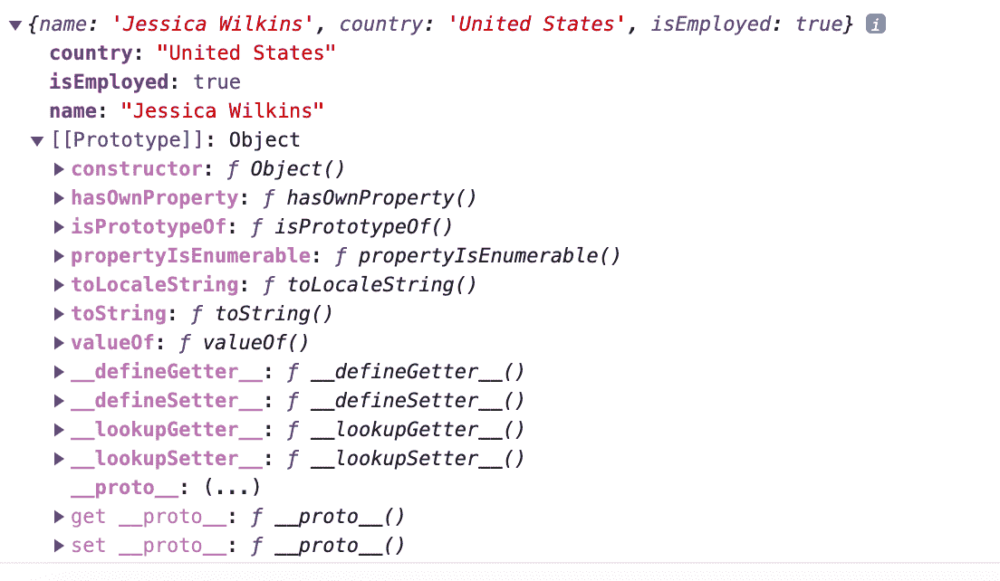

# 如何检查 JavaScript 对象中是否存在属性

> 原文：<https://www.freecodecamp.org/news/how-to-check-if-a-property-exists-in-a-javascript-object/>

当您在 JavaScript 中处理对象时，您可能需要检查特定的属性是否存在。

在本文中，我将向您展示三种检查 JavaScript 对象中是否存在属性的方法。

## 如何在 JavaScript 中使用`hasOwnProperty()`方法

`hasOwnProperty()`方法将检查一个对象是否包含一个直接属性，如果存在或不存在，将返回 true 或 false。

下面是基本语法:

```
obj.hasOwnProperty(prop)
```

在第一个例子中，我们有一个名为`developer`的对象，它有三个属性:

```
const developer = {
  name: "Jessica Wilkins",
  country: "United States",
  isEmployed: true
};
```

如果我们想检查`isEmployed`属性是否存在于`developer`对象中，那么我们可以使用`hasOwnProperty()`方法，如下所示:

```
developer.hasOwnProperty("isEmployed")
```

这将返回 true，因为名为`isEmployed`的属性是`developer`对象的直接属性。

但是如果我们尝试检查一个名为`isPrototypeOf`的属性呢？

```
developer.hasOwnProperty("isPrototypeOf")
```

这将返回 false，因为在`developer`对象上没有名为`isPrototypeOf`的直接属性。但是我说的直接财产是什么意思呢？

每当在 JavaScript 中创建一个对象时，都有一个称为原型的内置属性，其值是另一个对象。该对象将有自己的原型，这就是所谓的原型链。



我们的`developer`对象可以访问这些其他属性，比如`toString`，这就是所谓的继承属性。

`hasOwnProperty()`方法将只为直接属性返回 true，而不是从原型链继承的属性。

## 如何使用`in`运算符

与`hasOwnProperty()`方法不同，`in`操作符将为对象中存在的直接属性和继承属性返回 true。

下面是基本语法:

```
property in object
```

我们可以修改前面的例子，使用`in`操作符检查`country`属性是否存在于`developer`对象中。

```
"country" in developer
```

这将返回 true，因为`country`属性是`developer`对象中的直接属性。

我们还可以检查`toString`属性是否存在于`developer`对象或原型链中。

```
"toString" in developer
```

这将返回 true，因为`toString`属性确实存在于原型链中，因为它是从原型对象继承的。

## 如何使用`undefined`检查对象中是否存在属性

如果我试图在一个不存在的对象中访问一个属性名，那么我会得到 undefined。

例如，如果我尝试了`developer.age`，那么返回值将是未定义的，因为`developer`对象没有那个属性名。

我们可以通过检查`property !== undefined`来检查对象中是否存在属性。

在本例中，它将返回 true，因为`name`属性确实存在于`developer`对象中。

```
developer.name !== undefined
```

## 结论

如果您需要检查一个属性是否存在于一个 JavaScript 对象中，那么有三种常见的方法可以做到。

`hasOwnProperty()`方法将检查一个对象是否包含一个直接属性，如果存在或不存在，将返回 true 或 false。`hasOwnProperty()`方法将只为直接属性返回 true，而不是从原型链继承的属性。

与`hasOwnProperty()`方法不同，`in`操作符将为对象或其原型链中存在的直接和继承属性返回 true。

最后，我们可以通过检查`property !== undefined`来查看对象中是否存在属性。

我希望您喜欢这篇文章，并祝您的开发者之旅好运。