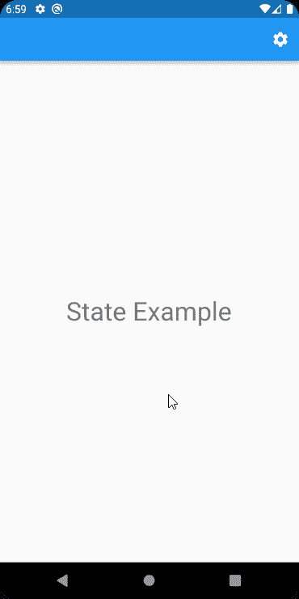
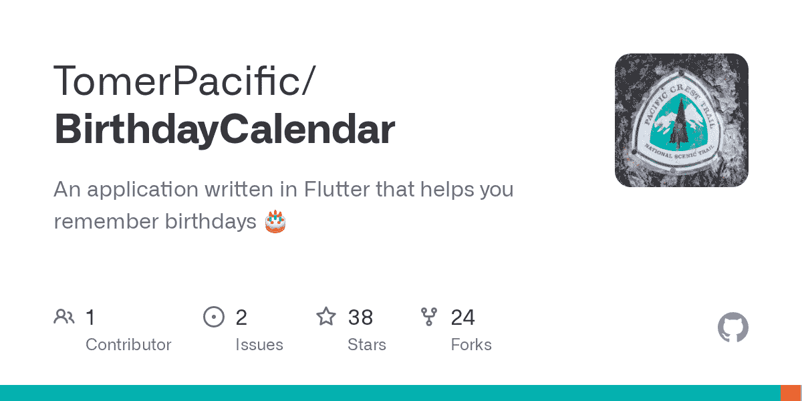

# 如何在 Flutter 应用中管理状态

> 原文：<https://www.freecodecamp.org/news/manage-state-in-flutter-apps/>

管理状态是大多数开发人员在处理应用程序时需要处理的事情。

您可能熟悉模型-视图-视图模型(MVVM)模式，其中视图模型负责视图的状态。但是在 Flutter 中，事情有点不同。

如果你正在读这篇文章，那么你可能知道在 Flutter 中管理状态的许多方法。有许多文章试图解释这一点，但它们通常涵盖一个特定的解决方案，并提供了一个非常简单的例子。

和你一样，我也看过它们，并试图在 Flutter 中抓住这个无形的概念。但是没有什么比亲自动手尝试更好的了。

在经历了许多磨难和公平的试错之后，我开始明白了在基于 Flutter 的应用程序中管理状态的重要性。

随着 Flutter 越来越受欢迎，随着您的应用程序变得越来越复杂，您将会发现创建有状态窗口小部件并不能解决问题。

当您达到这一点时，您可以尝试破解一个为您提供所需功能的解决方案，但是它可能不会遵循正确的范例。或者你可以面对面地与颤振状态管理的整体。

独自承担可能会感到力不从心，所以我希望这篇文章能在你需要的时候为你提供一个指南针。

我们将在 Flutter 中讨论状态管理的几个基本概念，我将用一个真实的用例来尽可能清楚地说明问题(不要胡说八道)😁).

准备好设置状态了吗？

## 颤振状态背景

下面是 Flutter 团队提供的所有国家解决方案的列表(截至 2022 年 4 月):

*   供应者
*   Riverpod
*   setState(设置状态)
*   InhertiedWidget 和 InheritedModel
*   Redux
*   鱼还原
*   阻塞/接收
*   得到它
*   MobX
*   颤动命令
*   粘合剂
*   GetX
*   状态重建器
*   三重模式

😱胡说八道。你能相信那个名单吗？

上面的列表直接取自状态管理的 [Flutter 文档](https://docs.flutter.dev/development/data-and-backend/state-mgmt/options)，我想向您展示它有两个原因:

1.  冲击值
2.  为了让你们更好地理解我之前所说的

现在，在您继续阅读之前，重要的是要理解，根据您的应用程序的逻辑和复杂性，您可能不需要上述解决方案之一。用有状态的小部件和 setState 来管理状态对您来说可能就足够了。

一旦你尝试开发一个组件并使用这两个选项，并且发现你需要其他的东西来工作，你就会知道这已经不够了。

你怎么知道？问得好。

在开发我的应用程序的某个时候，我决定要有一个设置屏幕。在该设置屏幕中，用户可以进行一些应用级配置。

应用程序本身并不复杂，我也不需要使用上面列出的任何解决方案。我使用了绑定到有状态小部件的状态，它不必在许多不同的组件之间共享。如果一个小部件需要通知另一个小部件中的用户操作，我会传递回调。

现在，当我创建设置页面时，用户在那里进行的操作必须在应用程序的另一个地方完全反映出来。例如，我在应用程序中添加了在明暗模式之间切换的功能。

这影响了应用程序的整个 UI，需要在用户切换该选项时立即反映出来。因此，在设置屏幕上使用另一个有状态的小部件对我没有帮助。

> 我如何将设置屏幕中发生的变化反映到应用程序的其余部分？

这听起来肯定是一个与州有关的问题。

## 基础-变更通知程序

Flutter 中的状态需要在使用它的组件之上(在小部件树中)声明。这是为了将状态传递给子部件。

为了让这种状态慢慢增加，您需要使用可以帮助您做到这一点的组件。

[****打招呼****](https://api.flutter.dev/flutter/foundation/ChangeNotifier-class.html) 。

这个类允许代码中的其他地方通过通知 API 监听变化。如果你曾经遇到过[可观察](https://en.wikipedia.org/wiki/Observer_pattern#:~:text=The%20observer%20pattern%20is%20a,calling%20one%20of%20their%20methods.)的概念，这可能听起来很熟悉。如果没有，不要担心。这个概念非常简单。

与 setState 让有状态小部件重建小部件的方式相同，ChangeNotifier 有一个名为 notifyListeners 的方法，它使代码中的位置能够对发生的更改做出反应。这个功能在 Flutter 中是现成的，因为 ChangeNotifier 是 flutter:foundation 包的一部分。

以我之前提到的设置屏幕为例。一旦用户更改了应用程序的主题，应用程序中的其他地方就可以监听这一更改，并相应地更新它们各自的 UI。

为了最大限度地减少这里所需的逻辑，让我们以您在创建一个 Flutter 项目(计数器项目)时得到的 vanilla starter 项目为例，并向它添加一个设置屏幕。

下面是 main.dart 文件的样子(没有所有的计数器逻辑):

```
import 'package:flutter/material.dart';
import 'settings_screen.dart';

void main() {
  runApp(const MyApp());
}

class MyApp extends StatelessWidget {
  const MyApp({Key? key}) : super(key: key);

  @override
  Widget build(BuildContext context) {
    return MaterialApp(
      title: 'State Example',
      theme: ThemeData(
        primarySwatch: Colors.blue,
      ),
      darkTheme: ThemeData.dark(),
      themeMode: ThemeMode.light,
      home: const MyHomePage(title: 'State Example'),
    );
  }
}

class MyHomePage extends StatefulWidget {
  const MyHomePage({Key? key, required this.title}) : super(key: key);
  final String title;

  @override
  State<MyHomePage> createState() => _MyHomePageState();
}

class _MyHomePageState extends State<MyHomePage> {

  @override
  Widget build(BuildContext context) {
    return Scaffold(
      appBar: AppBar(
        actions: [
          IconButton(
            icon: const Icon(
              Icons.settings,
              color: Colors.white,
            ),
            onPressed: () {
              Navigator.push(
                context,
                MaterialPageRoute(builder: (context) => const SettingsScreen()
                ),
              );
            },
          )
        ],
      ),
      body: Center(
        child: Column(
          mainAxisAlignment: MainAxisAlignment.center,
          children: <Widget>[
            Text(
              'State Example',
              style: Theme.of(context).textTheme.headline4,
            ),
          ],
        ),
      ),
    );
  }
}
```

main.dart

以下是 settings_screen 文件的外观:

```
import 'package:flutter/material.dart';

class SettingsScreen extends StatelessWidget {
  const SettingsScreen({Key? key}) : super(key: key);

  @override
  Widget build(BuildContext context) {
    return Scaffold(
        appBar: AppBar(
            title: const Text("Settings"),
        ),
      body:
         Column(
        mainAxisAlignment: MainAxisAlignment.start,
        children: [
            SwitchListTile(
              title: const Text('Dark Mode'),
              value: false,
              secondary:  const Icon(Icons.dark_mode,
                  color: Color(0xFF642ef3)
                ),
               onChanged: (bool value) {

              }
              )
            ]
          )
        );
      }
}
```

settings_screen.dart

现在，当用户按下 SwitchTile 时，那里没有太多东西，也没有任何逻辑可以更新。您还可以注意到，我们没有填写 onChanged 回调。

让我们创建我们的 ChangeNotifer 类，****settings screen notifier****。

```
import 'package:flutter/cupertino.dart';

class SettingsScreenNotifier extends ChangeNotifier { /// 1
  bool _isDarkModeEnabled = false;                    /// 2
  get isDarkModeEnabled => _isDarkModeEnabled;        /// 3
  void toggleApplicationTheme(bool darkModeEnabled) { /// 4
    _isDarkModeEnabled = darkModeEnabled;
    notifyListeners();
  }

}
```

settings_screen_notifier.dart

1.  我们的类扩展了 ChangeNotifier 类
2.  我们声明了一个名为 _ isDarkModeEnabled 的私有成员
3.  我们为这个成员公开了一个 getter
4.  注意在 toggleApplicationTheme 方法中，最后一行是对`notifyListeners()`的调用。这确保了无论何时调用该方法，任何侦听器都会被更新。

如前所述，我们需要一种方法向应用程序公开 SettingsScreenNotifier 中的状态。由于在这个特定的场景中，这个状态将被我们的主应用程序使用(因为它涉及到整个应用程序的主题)，我们需要把它放在应用程序的顶部。

我们可以使用****change notifier provider****来实现这一点。这是一个小部件，它向任何后代小部件提供我们的 ChangeNotifier 的实例，来自[提供者包](https://pub.dev/packages/provider)。这是一个围绕 [InheritedWidget](https://api.flutter.dev/flutter/widgets/InheritedWidget-class.html) 包装了许多功能的包。

☝️注意你放置 ChangeNotifierProvider 小部件的位置。如果你把它放在窗口小部件树中太高的位置，可能会导致你不想重新渲染的窗口小部件(并且还会污染范围)。

让我们将提供者包添加到 pubspec.yaml 文件中:

```
dependencies:
  flutter:
    sdk: flutter
  provider: ^6.0.2
```

pubspec.yaml

按 ****Pub 获取**** 下载包。

接下来，我们将使用 ChangeNotifierProvider 包装我们的应用程序(不要忘记导入提供者包)。

```
class MyApp extends StatelessWidget {
  const MyApp({Key? key}) : super(key: key);

  @override
  Widget build(BuildContext context) {
    return ChangeNotifierProvider(
      create: (context) => SettingsScreenNotifier(),  /// 1
      builder: (context, provider) {                  /// 2
        return MaterialApp(
          title: 'State Example',
          theme: ThemeData(
            primarySwatch: Colors.blue,
          ),
          darkTheme: ThemeData.dark(),
          themeMode: ThemeMode.light,
          home: const MyHomePage(title: 'State Example'),
        );
      }
    );
  }
}
```

main.dart

第一个参数是 create 方法，我们在其中创建 ChangeNotifier 的一个实例。

第二个参数是一个生成器函数，它接受上下文和创建的提供者。

太好了！现在，我们的应用程序将能够监听来自 ChangeNotifier 的更改。


Photo by [Zuzana Ruttkay](https://unsplash.com/@zuzi_ruttkay?utm_source=medium&utm_medium=referral) on [Unsplash](https://unsplash.com/?utm_source=medium&utm_medium=referral)

## 如何将它们连接在一起

我们已经为应用程序注入了一个提供者，但是我们如何将来自 ChangeNotifier 的数据连接到它呢？

为此我们使用一个[](https://pub.dev/documentation/provider/latest/provider/Consumer-class.html)****小部件。这个小部件公开了 ChangeNotifier 保存的数据。每当我们声明一个消费者小部件时，我们还必须向它提供它所提供的对象的类型。****

****在我们的例子中，这将是我们的 ****设置屏幕通知器**** 。Consumer 小部件有一个名为 builder 的参数(很像 ChangeNotifierProvider 和其他小部件)，只要您赋予它的 ChangeNotifier 对象发生变化(意味着 notifyListeners 已被调用)，它就会被调用。****

**builder 函数接受三个参数:**

1.  **背景**
2.  **ChangeNotifier 的实例**
3.  **子小部件(这可以用在消费者小部件下的小部件树部分没有改变并且您不想重新构建它的情况下)**

**我们需要用一个消费者小部件包装我们的 MaterialApp，以便当用户在设置屏幕中做出选择时，主题可以改变。**

```
`@override
  Widget build(BuildContext context) {
    return ChangeNotifierProvider(
      create: (context) => SettingsScreenNotifier(),
      builder: (context, provider) {
        return Consumer<SettingsScreenNotifier>(
          builder: (context, notifier, child) {
            return MaterialApp(
              title: 'State Example',
              theme: ThemeData(
                primarySwatch: Colors.blue,
              ),
              darkTheme: ThemeData.dark(),
              themeMode: notifier.isDarkModeEnabled ? ThemeMode.dark : ThemeMode.light,
              home: const MyHomePage(title: 'State Example'),
            );
          },
        );
      }
    );
  }
}`
```

**main.dart**

**在我们的设置屏幕中，我们需要:**

1.  **用一个消费者小部件包装我们的 ****SwitchTile**** ，这样当交互发生时，用户界面可以正确响应**
2.  **在 onChanged 回调中调用 toggleApplicationTheme**

```
`import 'package:flutter/material.dart';
import 'package:state_example/settings_screen_notifier.dart';
import 'package:provider/provider.dart';

class SettingsScreen extends StatelessWidget {
  const SettingsScreen({Key? key}) : super(key: key);

  @override
  Widget build(BuildContext context) {
          return Scaffold(
              appBar: AppBar(
                title: const Text("Settings"),
                ),
                body:
                  Column(
                      mainAxisAlignment: MainAxisAlignment.start,
                      children: [
                        Consumer<SettingsScreenNotifier> (                   /// 1
                         builder: (context, notifier, child) {
                           return SwitchListTile(
                               title: const Text('Dark Mode'),
                               value: notifier.isDarkModeEnabled,
                               secondary:  const Icon(Icons.dark_mode,
                                   color: Color(0xFF642ef3)
                               ),
                               onChanged: (bool value) {
                                 notifier.toggleApplicationTheme(value);    /// 2 
                               }
                           );
                         }
                        )
                      ]
                  )
                );
          }
}`
```

**settings_screen_notifier.dart**

**见证🕶 ☀️的伟大🌙**

****

**这篇文章只是关于 Flutter 和使用 provider 包的状态的冰山一角。还有很多东西要学，我真的鼓励你自己去尝试。**

**provider 包有很好的文档，当您在日志中看到错误时，它有一个非常健壮的解释，说明哪里出错了以及如何修复。**

**从这里去哪里？**

*   **[供应商文件](https://pub.dev/documentation/provider/latest/index.html)**
*   **[GetIt 包](https://pub.dev/packages/get_it)——另一个状态管理解决方案，可能更容易掌握**
*   **[value notifier](https://api.flutter.dev/flutter/foundation/ValueNotifier-class.html)–类似于 ChangeNotifier，但只有一个值**
*   **Suragch–一个狂热的 Flutter 开发者，他写了很多关于 Flutter 开发和管理状态的文章。他的文章对我帮助很大🙏**

**本文中展示的例子摘自我制作的一个名为 ****生日日历**** 的应用程序。你可以在这里查看:**

**[Birthday Calendar - Apps on Google PlayIn today’s world, it’s hard to keep track of the birthdays for all the people in your life. Who has time to remember all the dates? Enter Birthday Calendar.You will be able to save any birthday you want to and schedule a notification for it.tomerpacificApps on Google Play](https://play.google.com/store/apps/details?id=com.tomerpacific.birthday_calendar)**

**你可以在这里看到源代码:**

**[GitHub - TomerPacific/BirthdayCalendar: An application written in Flutter that helps you remember birthdays 🎂An application written in Flutter that helps you remember birthdays 🎂 - GitHub - TomerPacific/BirthdayCalendar: An application written in Flutter that helps you remember birthdays 🎂TomerPacificGitHub](https://github.com/TomerPacific/BirthdayCalendar)**