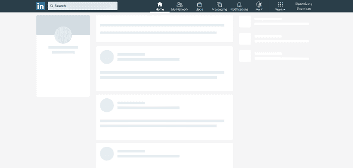
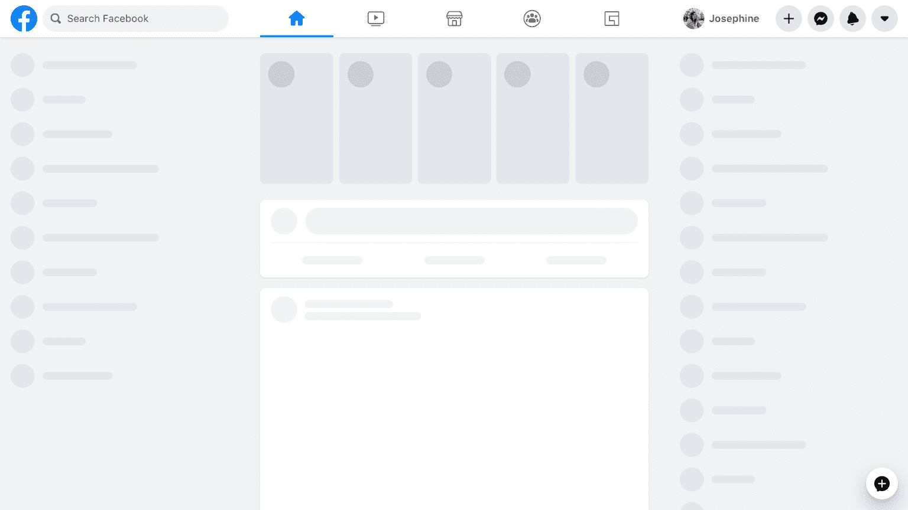
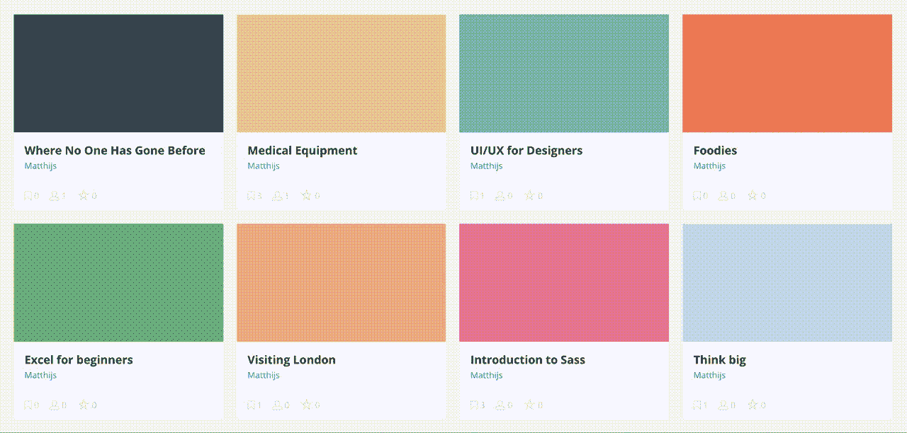
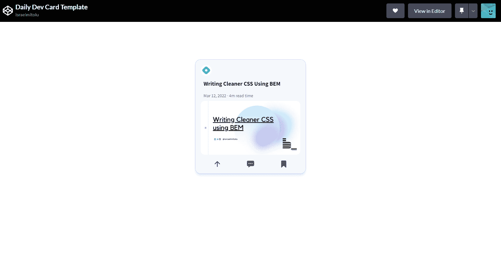
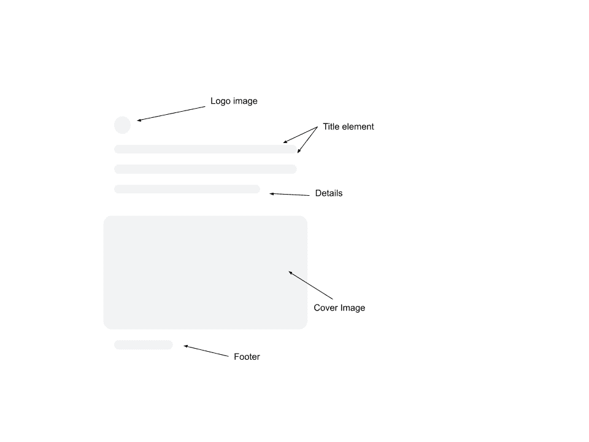
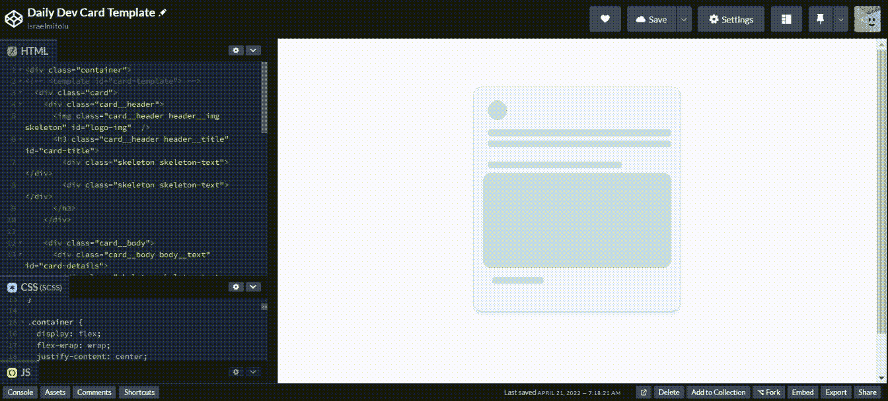
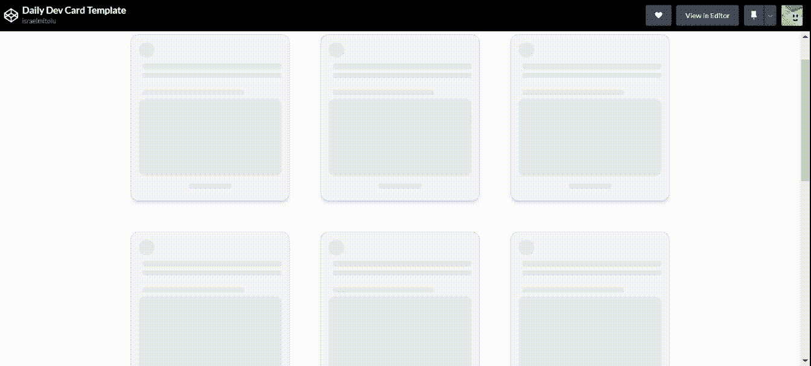
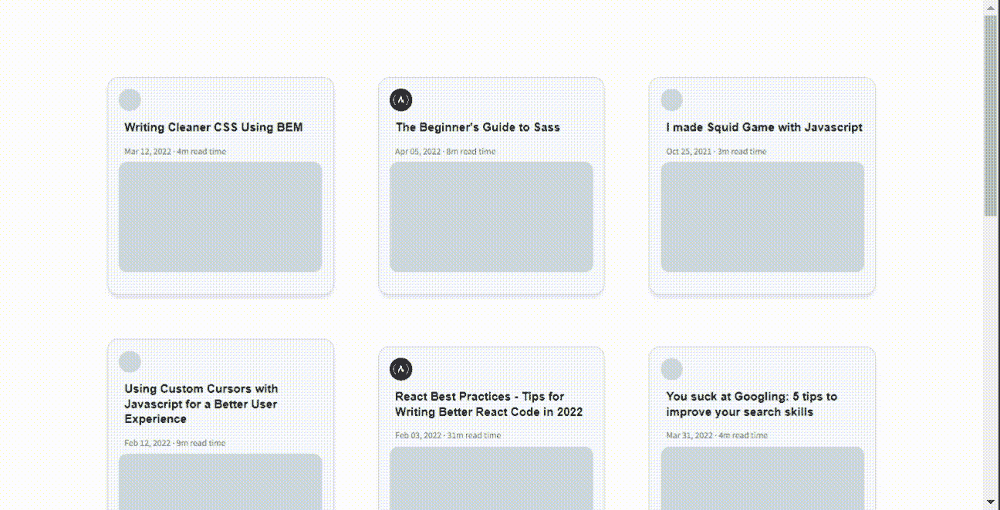
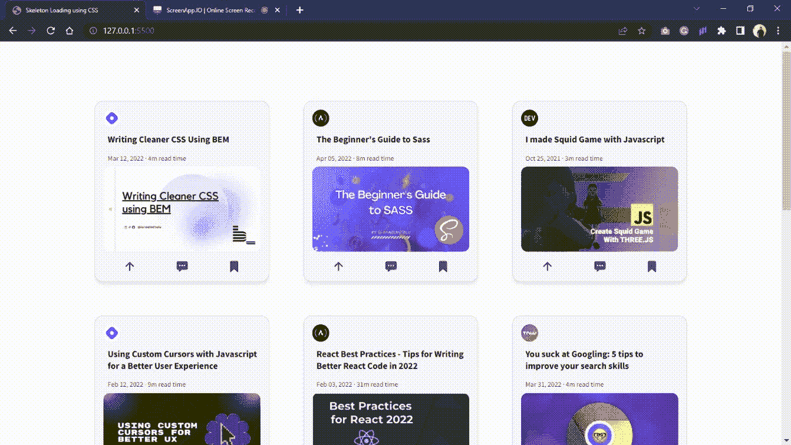

# 骨架加载器示例——如何用 CSS 构建骨架屏幕以获得更好的 UX

> 原文：<https://www.freecodecamp.org/news/how-to-build-skeleton-screens-using-css-for-better-user-experience/>

内容加载器、框架屏幕、幻像元素和内容占位符。这些就是我们今天要探讨的效果的名称。

你可能已经注意到，许多公司，如 Linkedin、脸书、Youtube 和 Slack，在其应用程序和网站中使用这种效果。

尽管我们开发人员希望我们的网站能够尽可能快地加载，但有时需要在页面上呈现大量数据，所以框架屏幕是一个很好的选择。

在本文中，我们将讨论:

*   [什么是骨架屏](#whatisaskeletonscreen)
*   [不同类型的骨架屏幕](#differenttypesofskeletonscreens)
*   [为什么使用骨架屏幕](#whyuseskeletonscreens)
*   [何时使用它们](#whentousethem)
*   [需要牢记的事情](#thingstokeepinmind)
*   [构建每日开发框架加载 UI](#buildingadailydevskeletonloadingui)
    *   [设置项目](#step1setuptheproject)
    *   [设计骨架元素](#step2designtheskeletonelements)
    *   [克隆卡片模板](#step3clonethecardtemplate)
    *   [创建 JSON 文件](#step4createjsonfile)
    *   [填充 HTML 元素](#step5populatehtmlelementswithappropriatecontent)

## 先决条件

本文假设您已经:

*   HTML 和 CSS (SASS)知识
*   JavaScript 知识(ES6)

我们将为这个项目使用 HTML 和 SASS。如果你想开始使用 SASS，看看这个[初学者指南。](https://freecodecamp.org/news/beginners-guide-to-sass)

## 什么是骨架屏？

骨架屏幕是一个动画占位符，在加载数据时模拟网站的布局。

它们让用户知道正在加载一些内容，更重要的是，提供了正在加载的内容的指示，无论是图像、文本、卡片等等。

这给用户的印象是网站更快，因为他们在网站出现之前就已经知道加载的是什么类型的内容。这被称为**感知绩效**。

以下是脸书和 LinkedIn 的一些骨架屏幕示例:



LinkedIn home feed loading state



Facebook home feed loading state

## 不同类型的骨架屏幕

骨架屏幕有两种主要类型:

*   内容占位符
*   颜色占位符

内容占位符通常是模拟页面外观的浅灰色方框和圆圈，如上面脸书和 LinkedIn 的图片所示。

颜色占位符更难创建，因为它们不仅模拟 UI 布局，还模拟主色。它最常见于以图片为主的网站，如 Pinterest 和 Unsplash。



Color Placeholder example from Pinterest

## 为什么要用骨架屏？

*   它们看起来更快，对用户更友好。感知性能的提高提供了良好的 UX，并有助于提高转化率。
*   spinners/loader 的问题是我们不知道加载什么或者要花多长时间。
*   由于加载时间未知，使用旋转器/加载器会给用户带来一段时间的不确定性。
*   框架屏幕将用户的注意力吸引到进度上，而不是等待时间上。
*   它创造了一个速度和短加载时间的假象

## 何时使用它们

*   当同时加载多个元素时，用于通知用户正在加载某些内容。
*   当加载数据的时间超过 3 秒时使用。
*   在流量大的网站上使用。
*   用于后台或长期运行的进程。

## 要记住的事情

在实现框架屏幕时，我们应该记住我们试图通过网站或应用程序实现的目标，并优先加载内容。

使用框架加载屏幕并不是跳过实际性能优化的借口，如果您可以缓存有意义的内容并显示出来，那就很好了。

## 构建每日开发框架加载 UI

在这一节中，我们将按照一步一步的过程深入骨架加载屏幕的实现，这样更容易理解。

我们将建立一个像 daily.dev 的 feed 部分。

### 步骤 1:设置项目

首先，为了和我一起编码，在这里克隆或下载布局[的起始代码。您可以使用](https://github.com/israelmitolu/Skeleton-Loading-using-CSS/tree/master/starter) [DownGit](https://minhaskamal.github.io/DownGit/#/home) 下载文件。

代码包含卡片布局，所以我们将从这里继续下一步。

首先，在 IDE 中启动开发服务器并打开浏览器。



Starter Card Layout

### 步骤 2:设计骨架元素

有 5 个元素，我们要建立的骨架加载:标志图像，标题，细节，封面图像和页脚部分。



Daily Dev's Skeleton Elements

现在，我们将向上述元素的位置添加`skeleton`类。

对于 logo，

```
 
```

对于标题，将有 2 个 div 来代表我们在上面的图片中的两条线。

```
<div class="skeleton skeleton-text"></div>
<div class="skeleton skeleton-text"></div> 
```

有关详细信息，请在类`body__text`的 div 中添加以下代码:

```
<div class="skeleton skeleton-text skeleton-text__body"></div> 
```

在`body__img` div 中，添加以下代码:

```
 
```

对于页脚，添加以下代码:

```
<div class="skeleton skeleton-text skeleton-footer"></div> 
```

现在，卡片的完整 HTML 代码:

```
<a class="card" id="card-link" target="_blank">
  <div class="card__header">
    <div>
      
    </div>
    <h3 class="card__header header__title" id="card-title">
      <div class="skeleton skeleton-text"></div>
      <div class="skeleton skeleton-text"></div>
    </h3>
  </div>

  <div class="card__body">
    <div class="card__body body__text" id="card-details">
      <div class="skeleton skeleton-text skeleton-text__body"></div>
    </div>

    <div class="card__body body__img">
      
    </div>
  </div>

  <div class="card__footer" id="card-footer">
    <div class="skeleton skeleton-text skeleton-footer"></div>
  </div>
</a> 
```

现在，让我们添加一些样式来制作骨架组件:

```
.skeleton {
  animation: skeleton-loading 1s linear infinite alternate;
}

@keyframes skeleton-loading {
  0% {
    background-color: hsl(200, 20%, 80%);
  }
  100% {
    background-color: hsl(200, 20%, 95%);
  }
}

.skeleton-text {
  width: 100%;
  height: 0.7rem;
  margin-bottom: 0.5rem;
  border-radius: 0.25rem;
}

.skeleton-text__body {
  width: 75%;
}

.skeleton-footer {
  width: 30%;
} 
```

这是生成的布局:



Card component loading

### 步骤 3:克隆卡片模板

在`index.html`文件中的`container`和`card`元素之间插入一个`template`标签。

上图中有一个我注释掉的`template`标签，是的，它是一个[有效的 HTML 元素](https://developer.mozilla.org/en-US/docs/Web/HTML/Element/template)；).它用于声明 HTML 的片段，这些片段可以由脚本克隆并插入到文档中。

```
<template id="card-template"> 
```

因此，请确保在`card` div 的结束标记之后添加结束标记`</template>`。

现在让我们看一下我们将用来克隆卡片模板的 JavasScript 代码。

在`body`标签的末尾之前创建一个`script`标签，并添加以下代码:

```
const container = document.querySelector(".container");
const cardTemplate = document.getElementById("card-template");
for (let i = 0; i < 10; i++) {
  container.append(cardTemplate.content.cloneNode(true));
} 
```

上面的代码获取页面容器和卡片模板，然后创建卡片的 9 个克隆/副本(总共 10 个)。然后，它将卡片附加/插入容器中。



Cloned card skeleton UI

### 步骤 4:创建 JSON 文件

在向页面添加内容之前，我们需要一些数据。通常，你需要从外部网站获取数据，但我们将使用我为这个项目专门设置的网站。

首先，在项目文件夹中创建一个名为`data.json`的文件。

将以下代码添加到 JSON 文件中。

```
[
  {
    "id": 1,
    "logoImage": "https://res.cloudinary.com/daily-now/image/upload/t_logo,f_auto/v1/logos/4a287b2e7cb5499bae863f8e7137cdb4",
    "title": "Writing Cleaner CSS Using BEM ",
    "details": "Mar 12, 2022 · 4m read time",
    "coverImage": "https://res.cloudinary.com/daily-now/image/upload/f_auto,q_auto/v1/posts/dd19e7a56475f39ab1c38167c02c7b58",
    "link": "https://israelmitolu.hashnode.dev/writing-cleaner-css-using-bem-methodology"
  },
  {
    "id": 2,
    "logoImage": "https://daily-now-res.cloudinary.com/image/upload/t_logo,f_auto/v1628412854/logos/freecodecamp",
    "title": "The Beginner's Guide to Sass",
    "details": "Apr 05, 2022 · 8m read time",
    "coverImage": "https://res.cloudinary.com/daily-now/image/upload/f_auto,q_auto/v1/posts/bec6719be210973098293a32dc732d1e",
    "link": "https://www.freecodecamp.org/news/the-beginners-guide-to-sass/"
  },
  {
    "id": 3,
    "logoImage": "https://res.cloudinary.com/daily-now/image/upload/t_logo,f_auto/v1/logos/devto",
    "title": "I made Squid Game with Javascript",
    "details": "Oct 25, 2021 · 3m read time",
    "coverImage": "https://res.cloudinary.com/daily-now/image/upload/f_auto,q_auto/v1/posts/1f947033365381cbe322ddf294ad7169",
    "link": "https://dev.to/0shuvo0/i-made-squid-game-with-javascript-10j9"
  },
  {
    "id": 4,
    "logoImage": "https://res.cloudinary.com/daily-now/image/upload/t_logo,f_auto/v1/logos/4a287b2e7cb5499bae863f8e7137cdb4",
    "title": "Using Custom Cursors with Javascript for a Better User Experience",
    "details": "Feb 12, 2022 · 9m read time",
    "coverImage": "https://res.cloudinary.com/daily-now/image/upload/f_auto,q_auto/v1/posts/3d056b99c95b37cd35ae5cfc6a8b38be",
    "link": "https://israelmitolu.hashnode.dev/using-custom-cursors-with-javascript-for-a-better-user-experience"
  },
  {
    "id": 5,
    "logoImage": "https://daily-now-res.cloudinary.com/image/upload/t_logo,f_auto/v1628412854/logos/freecodecamp",
    "title": "React Best Practices - Tips for Writing Better React Code in 2022",
    "details": "Feb 03, 2022 · 31m read time",
    "coverImage": "https://res.cloudinary.com/daily-now/image/upload/f_auto,q_auto/v1/posts/5a629fff5583f9ab5f0931d14736b299",
    "link": "https://www.freecodecamp.org/news/best-practices-for-react/"
  },
  {
    "id": 6,
    "logoImage": "https://res.cloudinary.com/daily-now/image/upload/t_logo,f_auto/v1/logos/tnw",
    "title": "You suck at Googling: 5 tips to improve your search skills",
    "details": "Mar 31, 2022 · 4m read time",
    "coverImage": "https://res.cloudinary.com/daily-now/image/upload/f_auto,q_auto/v1/posts/e318150ae67c2083ff3585a96f366f7b",
    "link": "https://thenextweb.com/news/5-tips-to-improve-your-google-search-skills"
  },
  {
    "id": 7,
    "logoImage": "https://res.cloudinary.com/daily-now/image/upload/t_logo,f_auto/v1/logos/logrocket",
    "title": "A better way of solving prop drilling in React apps",
    "details": "Jan 14, 2022 · 13m read time",
    "coverImage": "https://res.cloudinary.com/daily-now/image/upload/f_auto,q_auto/v1/posts/6fe4c4060bca638b419d8b2c63d8eaf7",
    "link": "https://blog.logrocket.com/solving-prop-drilling-react-apps/"
  },
  {
    "id": 8,
    "logoImage": "https://res.cloudinary.com/daily-now/image/upload/t_logo,f_auto/v1/logos/dz",
    "title": "Golang and Event-Driven Architecture",
    "details": "Apr 18, 2022 · 6m read time",
    "coverImage": "https://res.cloudinary.com/daily-now/image/upload/f_auto,q_auto/v1/posts/d06eddd82c62288df6e2600bcda61579",
    "link": "https://dzone.com/articles/golang-and-event-driven-architecture"
  },
  {
    "id": 9,
    "logoImage": "https://res.cloudinary.com/daily-now/image/upload/t_logo,f_auto/v1/logos/4a287b2e7cb5499bae863f8e7137cdb4",
    "title": "Introduction to Git In 16 Minutes",
    "details": "Mar 18, 2021 · 8m read time",
    "coverImage": "https://res.cloudinary.com/daily-now/image/upload/f_auto,q_auto/v1/posts/3c02111a8f242f607551500432e17a78",
    "link": "https://vickyikechukwu.hashnode.dev/introduction-to-git-in-16-minutes"
  },
  {
    "id": 10,
    "logoImage": "https://res.cloudinary.com/daily-now/image/upload/t_logo,f_auto/v1/logos/4a287b2e7cb5499bae863f8e7137cdb4",
    "title": "How to Create a Sleek Preloader Animation Using GSAP Timeline",
    "details": "Jan 25, 2022 · 7m read time",
    "coverImage": "https://res.cloudinary.com/daily-now/image/upload/f_auto,q_auto/v1/posts/e238c35cb9d41dd9a5475602aef00119",
    "link": "https://israelmitolu.hashnode.dev/how-to-create-a-sleek-preloader-animation-using-gsap-timeline"
  }
] 
```

为了复制 Daily Dev 的 feed 部分，我们创建了一些数据，这些数据包含一组具有 id、徽标图像、标题、详细信息和封面图像等属性的对象。

### 步骤 5:用适当的内容填充 HTML 元素

将以下代码添加到包含您的 JavaScript 的脚本标记中:

```
fetch("data.json")
  .then((response) => response.json())
  .then((posts) => {
    container.innerHTML = "";
    posts.forEach((post) => {
      const div = cardTemplate.content.cloneNode(true);
      div.getElementById("card-link").href = post.link;
      div.getElementById("logo-img").src = post.logoImage;
      div.getElementById("card-title").textContent = post.title;
      div.getElementById("card-details").textContent = post.details;
      div.getElementById("cover-img").src = post.coverImage;
      div.getElementById(
        "card-footer"
      ).innerHTML = ` <ion-icon name="arrow-up"></ion-icon>
          <ion-icon name="chatbox-ellipses"></ion-icon>
          <ion-icon name="bookmark"></ion-icon>`;
      container.append(div);
    });
  }); 
```

上面的代码是我们在卡片加载完成后用来添加内容的。

现在，让我一点一点地解释代码:

```
fetch("data.json")
  .then((response) => response.json()) 
```

这里，我们有一个基本的获取请求，在这里我们设置资源的路径。在这种情况下，`data.json`文件。如果是外部 API，您可以使用端点 URL 作为参数:

`fetch()`方法不直接返回 JSON 响应体，而是返回一个用响应对象解析的承诺。

要了解更多信息，请查看 [MDN 文档](https://developer.mozilla.org/en-US/docs/Web/API/Fetch_API/Using_Fetch)。

```
.then((posts) => {
    container.innerHTML = "";
    posts.forEach((post) => {
      const div = cardTemplate.content.cloneNode(true);
      div.getElementById("logo-img").src = post.logoImage;
      div.getElementById("card-title").textContent = post.title;
      div.getElementById("card-details").textContent = post.details;
      div.getElementById("cover-img").src = post.coverImage;
      div.getElementById(
        "card-footer"
      ).innerHTML = `<ion-icon name="arrow-up"></ion-icon>
          <ion-icon name="chatbox-ellipses"></ion-icon>
          <ion-icon name="bookmark"></ion-icon>`;
      container.append(div);
    });
  }); 
```

这里，我们定义了获取数据后应该发生什么。

代码首先清空页面，然后运行一个`forEach()`方法，该方法从 JSON 文件中提取属性，然后将其输入到卡片元素(徽标图像，卡片标题，...)使用`.textContent`属性。

最后，对于页脚，我们使用`.innerHTML`将图标作为 HTML 内容插入。

如果你正确地添加了所有的东西，就不会有任何错误，这就是我们功能齐全的加载 UI 框架。



Our finished Daily Dev skeleton UI

在 Github 上查看[现场演示](https://daily-dev-ui.netlify.app/)和[源代码库](https://github.com/israelmitolu/Skeleton-Loading-using-CSS)。

### Chrome DevTools 中的网络节流

需要注意的是，我们没有设置超时，因为这个主屏幕依赖于用户的网络速度。

如果你想在不同的网速下模拟它，进入你的浏览器 Devtools 中的 network 标签。

下面是如何在 Chrome v100 中做到这一点:



Throttle Network in Chrome DevTools

1.  打开 DevTools (Ctrl+Shift+i)。
2.  导航到“网络”选项卡。
3.  选择您想要的连接类型
4.  重新加载页面以查看以指定连接速度下载的资产。

如果默认选项不适合您，您可以通过选择下拉菜单最顶部的选项来创建自定义网络节流配置文件。

## 结论

你一路走到了最后！您已经了解了框架加载，以及它如何通过在加载数据时创造速度的假象来改善用户体验，并且您已经实现了自己的框架。

我希望你发现这个教程是有用的，并且它是创建各种骨骼加载屏幕的一个好的起点。

如果你觉得这篇文章很有见地，请与你的朋友和网络分享。此外，请随时在 [Twitter](https://twitter.com/israelmitolu) 和我的[博客](https://israelmitolu.hashnode.dev)上与我联系，我在那里分享资源和文章，让你成为更好的开发者。

感谢您的阅读，祝您编码愉快！

走之前，这里有一些 [React](https://blog.openreplay.com/3-ways-to-implement-skeleton-components-in-react#heading-what-is-a-skeleton-component) 、 [Angular](https://openbase.com/categories/js/best-angular-loading-skeleton-libraries) 和 [Vue](https://openbase.com/categories/js/best-vue-loading-skeleton-libraries) 的骨骼装载包。