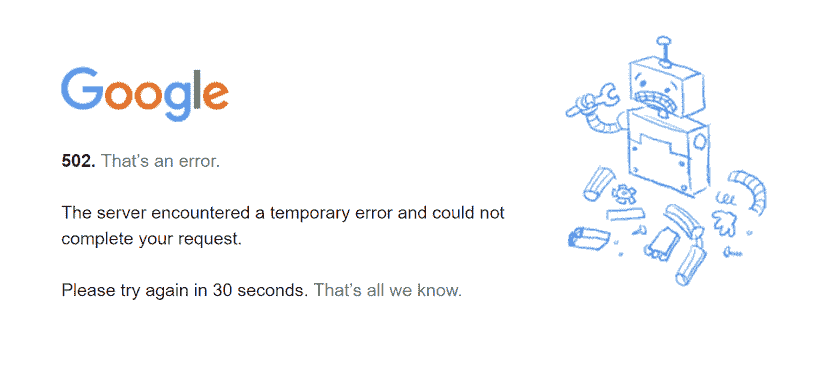
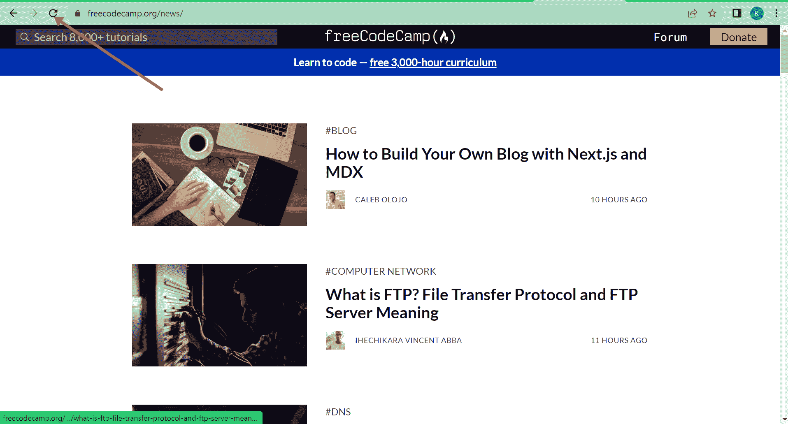
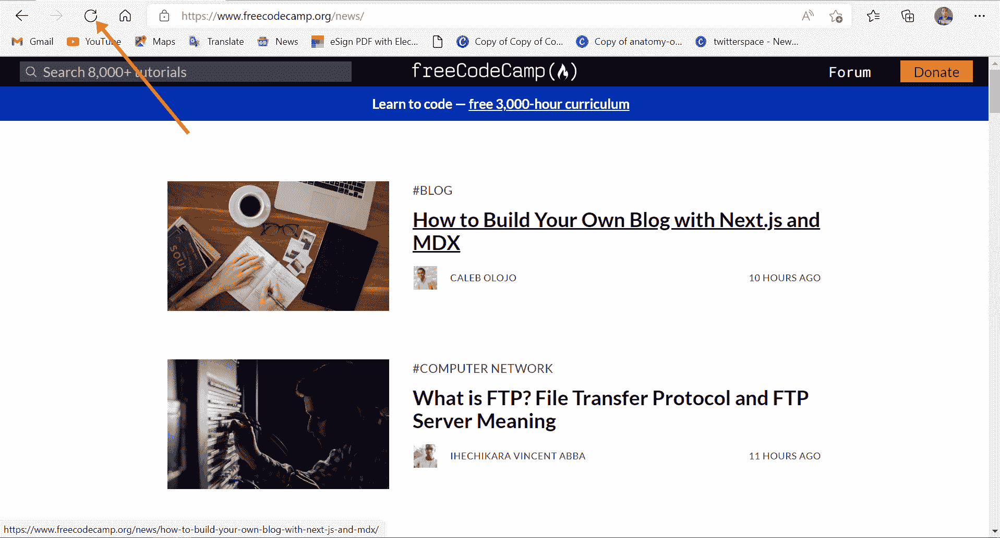
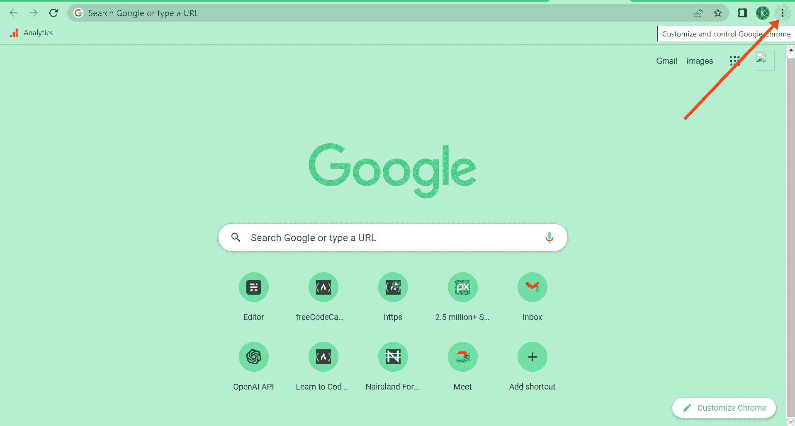
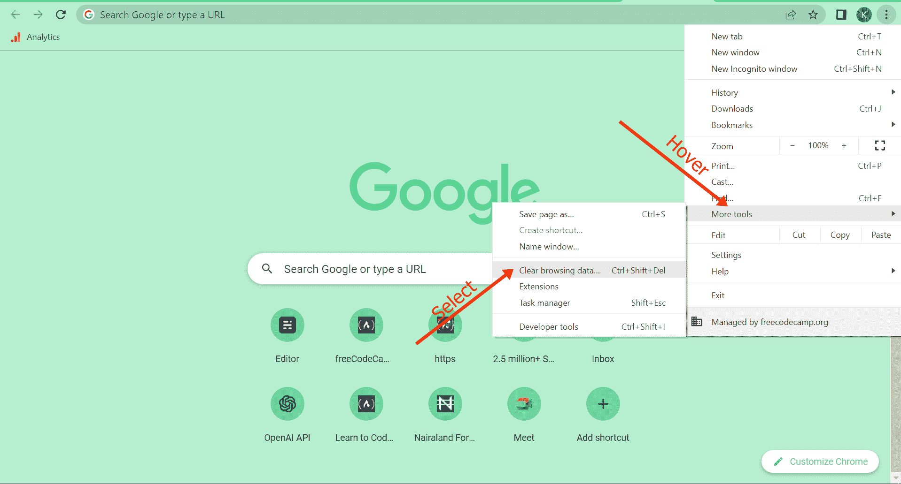
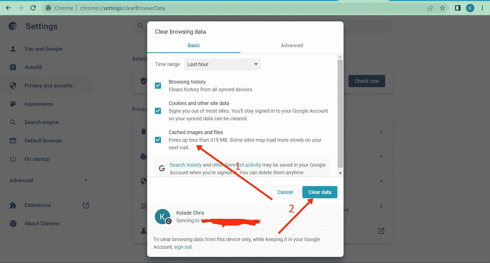
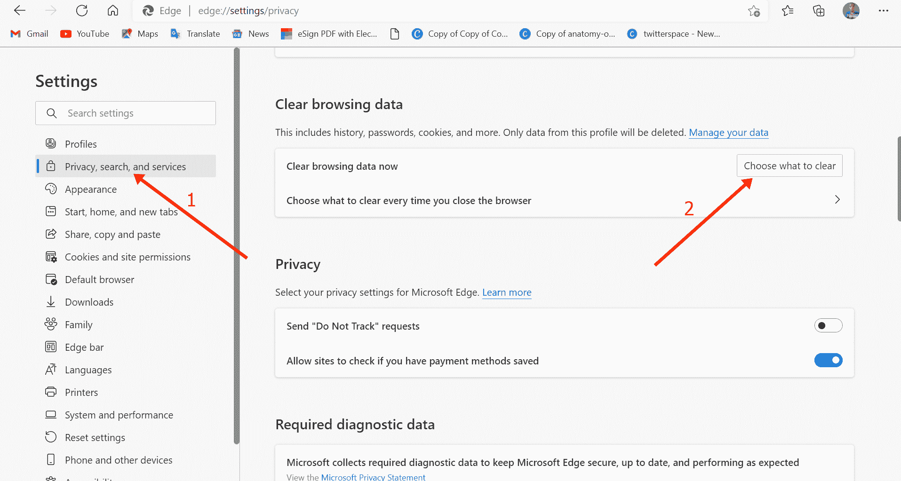
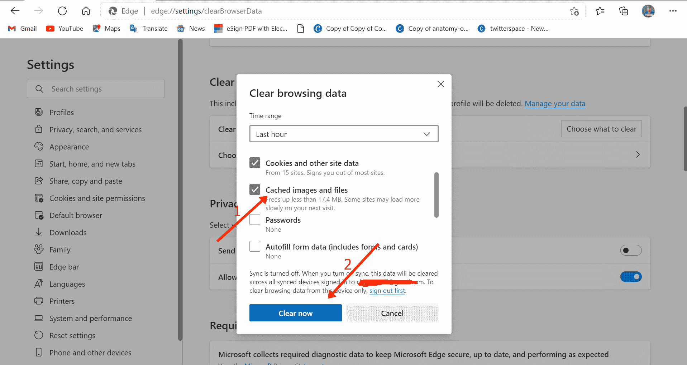
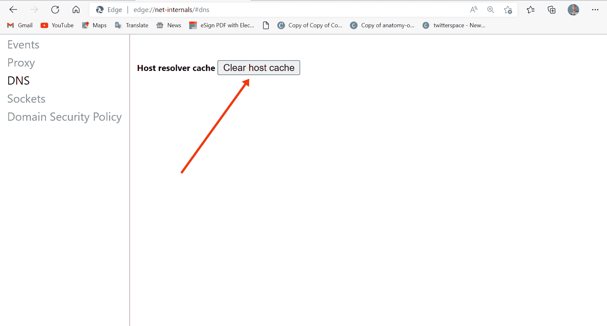

# 502 网关错误[已解决]

> 原文：<https://www.freecodecamp.org/news/502-bad-gateway-error-solved/>

当您尝试连接的网站的服务器出现问题时，您可能会收到 502 错误网关错误。

用更专业的术语来说，错误中的“502”是一个 HTTP 状态代码，表示一台服务器从另一台服务器收到了无效响应。

还有其他种类的 500 错误，包括:

*   501–未实施，
*   503–服务不可用
*   504–网关超时
*   505–不支持 HTTP 版本
    等等。

502 坏网关错误的原因包括服务器过载、代码中的错误以及尚未传播的域名。所以错误往往是网站的服务器造成的，而不是作为用户的你。

但有时，由于过期更新、广告拦截器、浏览器扩展和插件，甚至 DNS 服务器问题，浏览器可能会显示此错误。

在这篇文章中，我将向您展示 5 种方法，您可以修复 502 坏网关错误，这样您就可以再次访问互联网。

## 修复 1:刷新页面

很多服务器错误只是暂时的，不是永久的，502 坏网关也不例外。

如果你得到这个错误，你应该做的第一件事是几分钟后刷新页面，看看网站是否再次加载。

要刷新 Google Chrome，点击左上角的刷新按钮:

Edge 也在相同的位置提供了相同的刷新按钮:

如果刷新失败，请等待几分钟，然后重试。如果错误仍然存在，那么继续本文中的其他修复。

## 修复 2:尝试在另一台设备上访问网站

您自己的设备——无论是电脑还是手机——都可能是您遇到 502 坏网关错误的原因。此外，您的互联网连接来源——路由器或调制解调器——可能是罪魁祸首。

由于这可能是原因，请尝试在另一台设备上访问该网站或切换您的互联网连接源。

您还可以重新启动您的设备-计算机、手机、路由器和调制解调器。

## 修复 3:切换到另一个浏览器

由于 502 坏网关错误的原因可能是由于过时的浏览器或广告拦截器，您应该考虑更换为不同的浏览器，看看错误是否仍然存在。

例如，如果你使用 Windows 操作系统，并且你试图用 Chrome 访问网站，并且你得到 502 坏网关错误，切换到 Edge，反之亦然。如果你在 Mac 上运行，而在 Chrome 上出现错误，那么考虑切换到 Safari，反之亦然。

如果你的电脑上安装了 Mozilla Firefox，你也可以切换到它。你可能会得到不同的体验，因为它不是建立在与谷歌 Chrome 相同的 Chromium 引擎 Edge 上。

如果网站在另一个浏览器中加载，那么您可能需要更新最初的浏览器，重新安装它，或者检查您的扩展和广告拦截器。

## 修复 4:清除浏览器缓存

您可能会收到 502 错误网关错误，因为您的浏览器存储了您试图访问的网站的过期信息。因此，清除浏览器缓存可以修复错误。

### 要清除 Chrome 浏览器缓存，请遵循以下步骤

**第一步**:点击右上角的 3 个竖点:

**第二步**:悬停在更多工具上，选择清除浏览数据:

**第三步**:确保您选择了“缓存图像和文件”作为要清除的部分数据，然后点击“清除数据”按钮:

### 要清除您的 Microsoft Edge 缓存，请按照以下步骤操作

**第一步**:点击右上角的 3 个横点:

**第二步**:选择设置:

**第三步**:点击“隐私、搜索和服务”。

**第四步**:在“清除浏览数据”下，点击“选择清除什么”按钮:

**第五步**:确保选中缓存的图片和文件，然后选择“立即清除”:

## 修复 5:刷新您的 DNS 缓存

DNS 问题可能是您在尝试访问网站时不断收到 502 坏网关错误的原因。因此，刷新您的 DNS 缓存可能是一个解决方案。

### 要刷新 Windows 10 上的 DNS 缓存，请按照以下步骤操作:

**第一步**:点击开始，输入“cmd”，然后在右边选择“以管理员身份运行:

**第二步**:输入“ipconfig /flushdns”，点击`ENTER`。
您应该会得到一个响应，表明 DNS 缓存已经刷新，如下所示:

这意味着所有的缓存将被清除，网站将为你加载新鲜。

### 如果你使用 Chrome，它有自己的 DNS 缓存

要刷新 Chrome 的 DNS，在地址栏输入`chrome://net-internals/#dns`并点击`ENTER`，然后点击“清除主机缓存”:

### 如果你使用 Edge，它也有自己的 DNS 缓存

要刷新 Edge 的 DNS，在地址栏中键入`edge://net-internals/#dns`并点击`ENTER`，然后点击“清除主机缓存”:

## 结论

虽然 502 错误不太可能来自用户端(因为它是一个与服务器相关的错误)，但是您仍然可以作为用户在您的端尝试一些修复。这就是为什么我写了这篇文章，向您展示如何从您的角度修复错误。

感谢您的阅读。