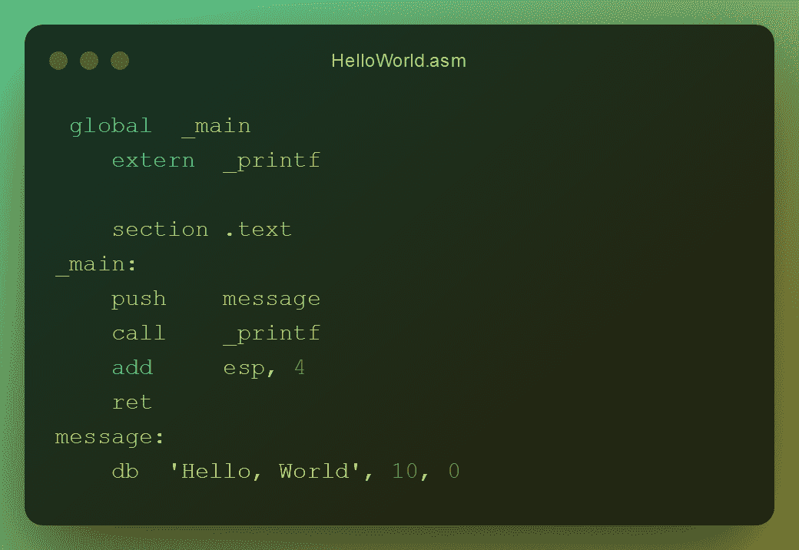
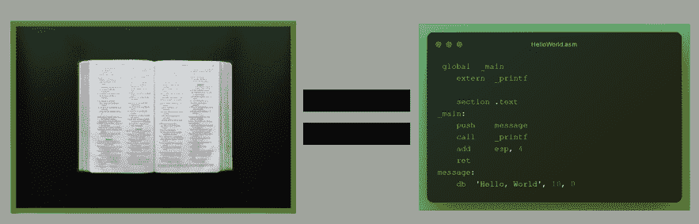
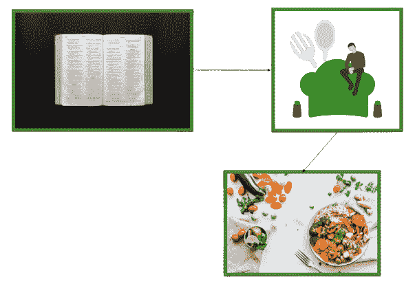
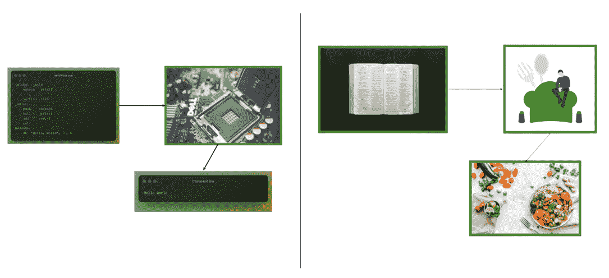

# 什么是固件？定义和示例

> 原文：<https://www.freecodecamp.org/news/what-is-firmware/>

您知道固件几乎无处不在吗？想想可能很奇怪，但它就像硬件和软件一样普遍。

事实上，正是由于固件:

*   打印机工作
*   除颤器工作
*   汽车收音机厂
*   还有更多…

基于上面的例子，你可能已经对固件有了一些概念。但是你对它没有一个明确的定义。

要想真正理解固件是什么，首先要理解软件，然后是硬件，最后才能跳入固件。

在本教程中，我将用一个类比来解释每个主题。这样做，大家都能理解。

如果你只是刚进入技术领域也没关系！

至此，我想确保每个人都了解什么是软件、硬件和固件。我将不详细阐述技术术语。

### 在本文中，我们将探索:

*   软件到底是什么？
*   硬件到底是什么？
*   固件到底是什么？

## 什么是软件？


Photo by [**Kübra Doğu**](https://www.pexels.com/@kubra-dogu-80605500?utm_content=attributionCopyText&utm_medium=referral&utm_source=pexels) from [**Pexels**](https://www.pexels.com/photo/food-wood-dawn-coffee-9222655/?utm_content=attributionCopyText&utm_medium=referral&utm_source=pexels)

想象一下，如果你愿意，你不知道今天晚餐做什么。

幸运的是，你找到了一本旧食谱，并决定按照其中的一个食谱来烹饪。

这本食谱有许多食谱。每种食谱都有自己的说明。

在**食谱**中，一份**食谱**可以被看作是一套**步骤**(或指令)，它们一起构成一份**餐**。


Photo by [Luis Quintero on Pexels](https://www.pexels.com/photo/open-bible-2294878/)

你也可以根据你烹饪许多不同食谱的经验来创造你自己的食物，对吗？

软件也不例外。

**软件程序**可以看作是一组**指令**，它们一起工作形成一个**程序**。

```
 global  _main
    extern  _printf

    section .text
_main:
    push    message
    call    _printf
    add     esp, 4
    ret
message:
    db  'Hello, World', 10, 0
```

Print hello world in machine code (Assembly)



然后，应用程序是执行特定任务的一大组指令。

操作系统是协调软件和硬件资源的大型指令集。

*   菜谱=软件
*   晚餐食谱=软件类型(应用程序或操作系统)
*   配方=程序

你需要一份食谱来做晚餐。你必须按照食谱中的每一步来制作食谱。

一旦你完成了所有的步骤，你的晚餐就准备好了。

你需要软件来完成特定的任务。计算机必须遵循所有指令，软件才能运行。

因此，软件要么在执行指令时运行，要么在指令完成后运行。



## 什么是硬件？


Photo by [**ELEVATE**](https://www.pexels.com/@elevate?utm_content=attributionCopyText&utm_medium=referral&utm_source=pexels) from [**Pexels**](https://www.pexels.com/photo/chef-preparing-vegetable-dish-on-tree-slab-1267320/?utm_content=attributionCopyText&utm_medium=referral&utm_source=pexels)

为了做晚餐，你需要一本食谱上的一系列步骤来告诉你如何做一顿特别的饭。

你还需要各种烹饪工具，比如锅碗瓢盆、刀子和食物本身。这就像硬件。

所以烹饪书会给你烹饪的指导。



要让硬件工作，它需要软件(一组指令)来告诉它做什么。


然后，软件向硬件发出指令，让它工作。

*   膳食准备工具=硬件
*   配方=软件

没有软件，你无法让硬件工作。

没有食谱，你就不知道如何使用各种工具和原料来做一顿饭。

就像没有软件的硬件一样，你也可以只吃一顿没有煮熟的食物。恶心。

同样，有各种类型的饭菜，也有各种类型的计算机硬件。

例如:

*   中央处理器
*   随机存取存储
*   国家政治保卫局。参见 OGPU
*   还有更多……



Comparison of processes

## 什么是固件？


Photo by [**Ella Olsson**](https://www.pexels.com/@ella-olsson-572949?utm_content=attributionCopyText&utm_medium=referral&utm_source=pexels) from [**Pexels**](https://www.pexels.com/photo/close-up-photo-of-chocolate-mousse-3026810/?utm_content=attributionCopyText&utm_medium=referral&utm_source=pexels)

程序是由计算机读取的一组指令。

假设你只想做一份点心或甜点。你可能不需要像为你的家人做晚餐时那么多的配料，对吗？

假设你想要一个在微波炉上运行的软件。你不需要计算机所有的硬件来让微波炉工作，对吗？你只需要具体到让微波炉工作。

或者说你想让软件在打印机上运行。你不需要计算机所有的硬件来使打印机正常工作？只有打印机的软件。

*   微波软件=固件
*   打印机软件=固件

所以这意味着固件只不过是软件，而是在一个硬件设备中。不是在电脑里。

固件让非常特定的硬件完成非常特定的任务。

## 包扎

感谢阅读！现在，您对以下内容有了更多了解:

*   软件
*   五金器具
*   固件

微处理器拍照由 **[博瑞](https://www.pexels.com/@pok-rie-33563?utm_content=attributionCopyText&utm_medium=referral&utm_source=pexels)** 发自 **[像素](https://www.pexels.com/photo/dell-motherboard-and-central-processing-unit-1432675/?utm_content=attributionCopyText&utm_medium=referral&utm_source=pexels)**