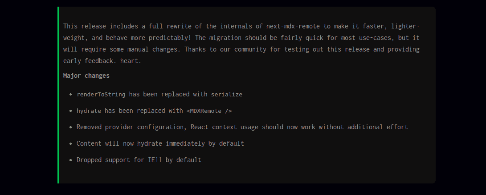

# 如何用 Next.js 和 MDX 建立自己的博客

> 原文：<https://www.freecodecamp.org/news/how-to-build-your-own-blog-with-next-js-and-mdx/>

当我决定建立我的博客时，我发现有许多现成的工具。我查看了 [Gastby](https://www.gatsbyjs.com/) 以及内容管理系统，如 [Ghost](https://ghost.org/) 、 [Contentful](https://www.contentful.com/) 、 [Sanity dot io](https://www.sanity.io/) 和 [HUGO](https://gohugo.io/) 。

但是我需要一些我能完全控制的东西。我也一直喜欢编写自己的定制代码的灵活性。当我这样做时，当问题出现时，我可以方便地回到任何问题可能出现的地方。

Gatsby 提供了这种灵活性，我可以很容易地熟悉它，因为它是建立在我每天使用的库(React.js)上的。但是，我发现我可以通过集成 [MDX](https://mdxjs.com/) 用 [Next.js](https://nextjs.org) 做完全相同的事情。

*“什么是 MDX？”你可能会问我。*

良好的...MDX 或多或少类似于我们在 GitHub 存储库中经常看到的 markdown 文件。MDX 将这种灵活性引入了 markdown 文件，允许您在文章中编写或导入 JavaScript (React)组件。这反过来又使您免于编写重复的代码。

在这篇文章中，我将向你展示我是如何用这些工具建立我的博客的，所以你也可以尝试建立一些类似的东西。如果您喜欢这种方法带来的灵活性，您会喜欢这个简单的堆栈。

所以，坐好，让我们开始吧。

## 如何开始构建——我的试错法

要用 Next.js 和 MDX 构建博客，有四个流行的选项可供选择。

它们是:

*   [@next/mdx](https://www.npmjs.com/package/@next/mdx) ，这是 Next.js 团队打造的官方工具
*   肯特·c·多兹 [mdx-bundler](https://github.com/kentcdodds/mdx-bundler)
*   [next-mdx-remote](https://github.com/hashicorp/next-mdx-remote) ，这是 Hashicorp 团队打造的工具
*   [next-mdx-enhanced](https://github.com/hashicorp/next-mdx-enhanced) ，这是一个同样由 Hashicorp 开发的工具(老实说，我不知道他们为什么决定开发两个)

起初，我开始使用 Kent 的 mdx-bundler，但后来我在使用该工具时遇到了很多问题。这是一个基于新 ECMAScript 标准的库，允许我们在浏览器中创建 ESModules，我使用的是一个非常旧的 Next.js 版本(V10.1.3，老实说，我不知道还有更好的版本)。

为了修复这个问题，我对 Next.js 做了很多降级和升级，但都无济于事。有一个错误一直困扰着我，好几天都不肯离开。是的，好几天了！那段时间感觉想哭。看看下面的错误:

> 找不到模块:无法解析“内置模块”

显然，为了让 mdx-bundler 工作，它需要另一个名为 esbuild 的 npm 包来完成必要的编译过程。

```
npm i mdx-bundler esbuild 
```

对我来说幸运的是——至少我认为我是幸运的——[科迪·布鲁纳提交了一个关于这个特殊错误的问题](https://github.com/kentcdodds/mdx-bundler/issues/18)。通过对这个问题的讨论，提出了很多可能的解决方案，其中一些涉及到 Webpack，修改你的`next.config.js`文件等等。

```
module.exports = {
  future: {
    // Opt-in to webpack@5
    webpack5: true,
  },
  reactStrictMode: true,
  webpack: (config, { buildId, dev, isServer, defaultLoaders, webpack }) => {
    if (!isServer) {
      // https://github.com/vercel/next.js/issues/7755
      config.resolve = {
        ...config.resolve,
        fallback: {
          ...config.resolve.fallback,
          child_process: false,
          fs: false,
          'builtin-modules': false,
          worker_threads: false,
        },
      }
    }

    return config
  },
} 
```

在上面的代码片段中，它显示了 Webpack5 仍然是 Next.js 正在开发的一个特性——因此出现了下面的配置代码片段:

```
future: {
  webpack5: true
} 
```

但是，现在 Next.js 的最新版本默认支持 Webpack5，所以没有必要在配置中添加那个对象——如果它对您有用的话。

在讨论之后，我发现了一个评论(来自 Kent ),说运行`npm update`可以解决这个问题，而且对 Cody Brunner 来说确实有效。但对我来说显然不是。

当我找不到修复这个错误的可能方法时，我决定使用 next-mdx-remote，我面临的唯一问题是添加到工具中的重大更改。在 next-mdx-remote 的版本 3 之前，您通常通过执行以下操作来呈现已解析的降价内容:

```
import renderToString from 'next-mdx-remote/render-to-string'
import hydrate from 'next-mdx-remote/hydrate'
import Test from '../components/test'

export default function TestPage({ source }) {
  const content = hydrate(source, { components })

  return <div className="content">{content}</div>
}

export async function getStaticProps() {
  // MDX text - can be from a local file, database, anywhere
  const source = 'Some **mdx** text, with a component <Test />'
  const mdxSource = await renderToString(source, { components })

  return {
    props: {
      source: mdxSource,
    },
  }
} 
```

软件包版本 3 中添加的突破性变化剥离了大量内部代码，这些代码被认为会给当时使用它的人带来糟糕的体验。

该团队接着宣布了这一变化背后的原因和主要变化。看看下面的这些。

> 这个版本包含了对 next-mdx-remote 内部的完全重写，使它更快、更轻、行为更可预测！对于大多数用例来说，迁移应该相当快，但是需要一些手动更改。感谢我们的社区测试了这个版本并提供了早期反馈。心。

#### next-mdx-remote 的主要变化:

*   `renderToString`已被替换为`serialize`
*   `hydrate`已被替换为`<MDXRemote />`
*   已删除提供程序配置。React 上下文使用现在应该可以
    工作了，不需要额外的努力。
*   默认情况下，内容会立即水合
*   默认情况下，不再支持 IE11

有了这一新的变化，以前的实现现在将变成:

```
import { serialize } from 'next-mdx-remote/serialize'
import { MDXRemote } from 'next-mdx-remote'

import { Test, Image, CodeBlock } from '../components/'

const components = { Test }

export default function TestPage({ source }) {
  return (
    <div className="content">
      <MDXRemote {...source} components={{ Test, Image, CodeBlock }} />
    </div>
  )
}

export async function getStaticProps() {
  // MDX text - can be from a local file, database, anywhere
  const source = 'Some **mdx** text, with a component <Test />'
  const mdxSource = await serialize(source)

  return {
    props: {
      source: mdxSource,
    },
  }
} 
```

## 如何建立博客

在上一节中，我向您介绍了我在选择合适的工具时遇到的一些问题。

在这一节中，我们将介绍如何建立一个类似我的博客。

我们将使用下面的命令创建一个 Next.js 应用程序:

```
npx create-next-app blog 
```

上面的命令会给你一个典型的 Next.js 应用程序的样板。为了简洁起见，我将更多地关注这个应用程序的`pages`和`src/utils`文件夹。

```
|--pages
|   |-- blog
|   |   |-- index.js
|   |   |-- [slug].js
|   |-- _app.js
|   |-- index.js
|--src
|   |-- utils
|        |-- mdx.js
|--data
|   |-- articles
|        |-- example-post.mdx
|        |-- example-post2.mdx 
```

在一个典型的博客中，我们需要写博文或文章。在这个博客中，我们使用 markdown (MDX)来写我们的文章，这就是为什么你可以看到我们在`data/articles`目录中有两个`.mdx`文件。你可以有更多，只要你想写的文章的数量去。

## 如何读取降价(MDX)文件

在这一节中，我们将从在`src/utils/mdx.js`中编写一些可重用的函数开始。

我们在这里编写的函数将使用 Node.js 的文件系统 API。我们将在服务器端的 pages 文件夹中调用这些函数，因为 Next.js 有一些在服务器上运行的[数据获取方法](https://nextjs.org/docs/basic-features/data-fetching/overview)。

让我们从安装我们现在需要的依赖项开始。随着我们的进展，我们将添加其他依赖项:

```
npm install gray-matter reading-time next-mdx-remote glob dayjs 
```

上面的命令将获得上面列出的所有包，作为我们博客项目中的依赖项。

`gray-matter`将把`.mdx`文件中的内容解析成可读的 HTML 内容。

`reading-time`根据字数分配阅读博文或文章的大致时间。

`next-mdx-remote`通过允许 MDX 文件在 Next.js' `getStaticProps`或`getServerSideProps`数据获取方法中加载，并在客户端上正确地进行水合，来进行 MDX 文件的后台编译。

`glob`让我们能够匹配`data/articles`中的文件模式，我们将把它作为文章的一部分。

`dayjs`是一个 JavaScript 库，帮助解析、操作、验证和显示我们将添加到每篇文章的元数据中的日期。

我们已经看到了我们安装的软件包的基本功能。现在让我们开始编写读取文章目录中的文件的函数。

```
import path from 'path'
import fs from 'fs'
import matter from 'gray-matter'
import readingTime from 'reading-time'
import { sync } from 'glob'

const articlesPath = path.join(process.cwd(), 'data/articles')

export async function getSlug() {
  const paths = sync(`${articlesPath}/*.mdx`)

  return paths.map((path) => {
    // holds the paths to the directory of the article
    const pathContent = path.split('/')
    const fileName = pathContent[pathContent.length - 1]
    const [slug, _extension] = fileName.split('.')

    return slug
  })
} 
```

在上面的代码片段中，我们从 Node.js 的模块和其他包中导入了 node . js 文件系统。第一个变量声明`articlesPath`，保存所有文章的路径。

```
const articlesPath = path.join(process.cwd(), 'data/articles') 
```

我们使用`path`模块通过接入 Node.js 的`process` API 来访问文章所在的位置，这使我们可以直接访问`cwd()`(当前工作目录)对象。

当用户在博客页面上点击
时，`getSlug`函数将获得一篇独特的文章。你会看到我们引用了之前声明的`articlesPath`变量，并把它传递给`glob`包的`sync`函数。这将依次匹配任何具有`.mdx`扩展名的文件，并给我们一个包含这些文件列表的数组。

```
const paths = sync(`${articlesPath}/*.mdx`) 
```

也就是说，我们将返回一个修改过的文件名数组。`pathContent`变量保存了 articles 目录中所有文章的路径，所以我们使用 JavaScript 通过 JavaScript 的`split()`方法删除了所有的“正斜杠”。

```
const fileName = pathContent[pathContent.length - 1]
const [slug, _extension] = fileName.split('.') 
```

`fileName`变量声明获取路径的最后一部分，比如说`"/data/articles/example-post.mdx"`，因为它是一个数组，并返回最后一部分`/example-post.mdx`。下一个变量继续从文件名中删除句号`(.)`，所以我们将剩下`example-post`作为鼻涕虫。

## 如何从 Slug 中解析文章内容

下一个函数从 slugs 中获取并解析 MDX 文件中的内容。它返回一个元数据对象，我们将在学习过程中用到它。

```
export async function getArticleFromSlug(slug) {
  const articleDir = path.join(articlesPath, `${slug}.mdx`)
  const source = fs.readFileSync(articleDir)
  const { content, data } = matter(source)

  return {
    content,
    frontmatter: {
      slug,
      excerpt: data.excerpt,
      title: data.title,
      publishedAt: data.publishedAt,
      readingTime: readingTime(source).text,
      ...data,
    },
  }
} 
```

在上面的代码片段中，我们使用文件系统 API 中的 Node.js' `readFileSync`函数以同步方式读取`articleDir`中的文件。

我们用这个函数`readFileSync`所做的是告诉 Node 停止当前正在进行的其他进程，并为我们执行这个操作。

如果你愿意，你可以在这里了解更多。

如果您继续在终端中输入`console.log(source)`，您将在控制台中获得一个`<Buffer>`——不可读——数据类型。

这就是`gray-matter`计划拯救世界的地方。它有助于将源代码中的降价内容解析成你我都能理解的可读 HTML。

在这里，我们正在析构`content`和`data`变量，将其分配给`matter`包(它解析源代码)并返回一个包含我们的`content`和`frontmatter: data`变量的对象:

```
const { content, data } = matter(source)

return {
  content,
  frontmatter: {
    slug,
    excerpt: data.excerpt,
    title: data.title,
    publishedAt: data.publishedAt,
    readingTime: readingTime(source).text,
    ...data,
  },
} 
```

我们需要一种方法来显示博客页面上的所有文章。下面的函数通过使用 JavaScript 的`reduce()`方法来返回文章目录中所有文章的数组，为我们完成了这项工作。

```
export async function getAllArticles() {
  const articles = fs.readdirSync(path.join(process.cwd(), 'data/articles'))

  return articles.reduce((allArticles, articleSlug) => {
    // get parsed data from mdx files in the "articles" dir
    const source = fs.readFileSync(
      path.join(process.cwd(), 'data/articles', articleSlug),
      'utf-8'
    )
    const { data } = matter(source)

    return [
      {
        ...data,
        slug: articleSlug.replace('.mdx', ''),
        readingTime: readingTime(source).text,
      },
      ...allArticles,
    ]
  }, [])
} 
```

你可以看到我们如何使用`readdirSync()`来同步读取`data/articles`中的所有文件。通过用各自的 slugs 读取所有文件，并用`gray-matter`包解析它们的内容，可以访问`source`变量。

```
const source = fs.readFileSync(
  path.join(process.cwd(), 'data/articles', articleSlug),
  'utf-8'
)
const { data } = matter(source) 
```

如果你看一下下面的片段，你会看到我们如何使用`reading-time`包来获得阅读这篇文章所需的大概时间。我们通过剥离文章的最后一部分——`blog/example-post.mdx`——并用一个空字符串替换它，得到将附加到这篇文章的 slug。这使得它可以通过“博客/示例-帖子”访问。

```
{
  slug: articleSlug.replace('.mdx', ''),
  readingTime: readingTime(source).text,
} 
```

`readingTime`有一些你可以分配给它的方法，其中之一是`text`方法。您可以尝试删除这个值，保存您的代码，并允许 Next.js 抛出一个错误，这样您就可以看到您可以使用的值。

## 如何显示文章列表

在前面几节中，我们已经看到了如何使用 Node.js 文件系统 API 和一些其他工具来访问所有文章所在的位置。

在这一部分，我们将在网页上展示文章。

我们将从博客文件夹中的`index`文件开始。在这个文件中，我们将使用数据获取方法— `getStaticProps` —来呈现页面上的文章。

```
import { getAllArticles } from '../../src/utils/mdx'

export async function getStaticProps() {
  const articles = await getAllArticles()

  articles
    .map((article) => article.data)
    .sort((a, b) => {
      if (a.data.publishedAt > b.data.publishedAt) return 1
      if (a.data.publishedAt < b.data.publishedAt) return -1

      return 0
    })

  return {
    props: {
      posts: articles.reverse(),
    },
  }
} 
```

在上面的代码片段中，我们导入了`getAllArticles`函数，并在 Next.js 的数据获取方法中使用了它。

你会注意到我们是如何根据文章发表的日期对它们进行排序的。我们最终将把作为道具返回的文章列表映射到索引(博客)页面。

```
articles
  .map((article) => article.data)
  .sort((a, b) => {
    if (a.data.publishedAt > b.data.publishedAt) return 1
    if (a.data.publishedAt < b.data.publishedAt) return -1

    return 0
  }) 
```

以免我忘记，这是你的典型文章文件的内容在下面的 markdown 语法中的样子:

```
---
title: 'Next.js Image optimization error on Netlify'
publishedAt: '2022-04-16'
excerpt: 'Next.js has a built-in Image component that comes with a lot of performance optimization features when you are using it.'
cover_image: 'path/to/where/image/is/stored'
---

rest of the content falls here 
```

你可能会问我，*“如果我们可以使用`reverse()`方法对文章数组进行重新排序，为什么我们需要按日期对文章进行排序？”*。

我认为对我们来说，通过与文章发表的日期进行比较来对文章列表进行排序，并且仍然对数组应用`reverse`方法是合适的。

比方说，我们忘记在文章中添加发表日期。如果缺少排序函数，那么`reverse()`方法将只对数组执行操作，而不会以后进先出的方式比较日期。所以最好对文章进行排序，并且仍然反转数组的内容。

现在我们已经返回了作为道具的文章列表，我们可以继续将它们映射到页面上。

```
import React from 'react'
import Head from 'next/head'
import Link from "next/link"
import { getAllArticles } from '../../src/utils/mdx'

export default function BlogPage({ posts }) {
  return (
    <React.Fragment>
      <Head>
        <title>My Blog</title>
      </Head>
      <div>
        {posts.map((frontMatter) => {
          return (
            <Link href={`/blog/${frontMatter.slug}`} passHref>
              <div>
                <h1 className="title">{frontMatter.title}</h1>
                <p className="summary">{frontMatter.excerpt}</p>
                <p className="date">
                  {dayjs(frontMatter.publishedAt).format('MMMM D, YYYY')} &mdash;{' '}
                  {frontMatter.readingTime}
                </p>
              </div>
            </Link>
          )
        })}
      </div>
    </React.Fragment>
  )
}

export async function getStaticProps() {
  ...
} 
```

在上面的代码片段中，我们使用`Link`组件将用户路由到一个包含独特文章的动态页面。如果您还记得的话，这就是我们创建一个名为`[slug].js`的文件的原因。这是一条动态路线，你可以在这里了解更多[。](https://nextjs.org/docs/routing/dynamic-routes)

## 如何展示一篇独特的文章

在上一节中，我们能够将文章列表呈现到网页上。在这一节中，我们将呈现一篇独特的文章，用户可以在新的路径中点击它。

我们还将使用一个名为 rehype 的工具来定制我们的博客帖子的外观。Rehype 是一个由插件驱动的 HTML 预处理程序。我们将在本节中使用其中一些插件，所以让我们现在安装它们。

```
npm i rehype-highlight rehype-autolink-headings rehype-code-titles rehype-slug 
```

允许我们在代码块中添加语法高亮。

`rehype-autolink-headings`是一个添加 h1 到 h6 标题链接的插件。

将语言/文件标题添加到代码中。

`rehype-slug`是一个给标题增加一个`id`属性的插件。

现在我们已经看到了每个插件执行的角色，让我们开始处理`[slug].js`文件。在这个文件中，我们将使用 Next.js 的两个数据获取方法— `getStaticProps`和`getStaticPaths`。

我们使用这两种方法是因为我们将获取用户被重定向到的路径(slugs)所特有的数据(文章)。

```
// dynamically generate the slugs for each article(s)
export async function getStaticPaths() {
  // getting all paths of each article as an array of
  // objects with their unique slugs
  const paths = (await getSlug()).map((slug) => ({ params: { slug } }))

  return {
    paths,
    // in situations where you try to access a path
    // that does not exist. it'll return a 404 page
    fallback: false,
  }
} 
```

当您查看上面的代码片段时，您会看到我们正在从文章中获取列表`paths`,并将条目列表(路径)映射到一个数组。这可以通过`getStaticProps`数据获取方法中的`params`变量来访问。

```
import { getArticleFromSlug } from "../../src/utils/mdx"

export async function getStaticProps({ params }) {
  //fetch the particular file based on the slug
  const { slug } = params
  const { content, frontmatter } = await getArticleFromSlug(slug)

  const mdxSource = await serialize(content, {
    mdxOptions: {
      rehypePlugins: [
        rehypeSlug,
        [
          rehypeAutolinkHeadings,
          {
            properties: { className: ['anchor'] },
          },
          { behaviour: 'wrap' },
        ],
        rehypeHighlight,
        rehypeCodeTitles,
      ],
    },
  })

  return {
    props: {
      post: {
        source: mdxSource,
        frontmatter,
      },
    },
  }
}` 
```

在上面的代码片段中，我们析构了`content`和`frontmatter`——这是文章的元数据——并将其分配给了`getArticleFromSlug`函数，该函数接收文章的段落作为参数。

我们继续用 next-mdx-remote 的`serialize()`函数序列化文章的内容，并在`mdxOptions`对象中传递必要的重新类型插件:

```
const mdxSource = await serialize(content, {
  mdxOptions: {
    rehypePlugins: [
      rehypeSlug,
      [
        rehypeAutolinkHeadings,
        {
          properties: { className: ['anchor'] },
        },
        { behaviour: 'wrap' },
      ],
      rehypeHighlight,
      rehypeCodeTitles,
    ],
  },
}) 
```

总结一下，我们返回文章的`content`和`frontmatter`作为道具，它们将被 slug 组件访问。

```
return {
  props: {
    post: {
      source: mdxSource,
      frontmatter,
    },
  },
} 
```

我们在前面的片段中返回的道具可以通过下面的组件访问。

您会注意到,`<MDXRemote />`组件接收到了我们可以在 MDX 文件中使用的`{...source}`和自定义 React 组件属性。这消除了必须一遍又一遍地编写重复代码的过程。

```
import dayjs from 'dayjs'
import React from 'react'
import Head from 'next/head'
import Image from 'next/image'
import rehypeSlug from 'rehype-slug'
import { MDXRemote } from 'next-mdx-remote'
import rehypeHighlight from 'rehype-highlight'
import rehypeCodeTitles from 'rehype-code-titles'
import { serialize } from 'next-mdx-remote/serialize'
import 'highlight.js/styles/atom-one-dark-reasonable.css'
import rehypeAutolinkHeadings from 'rehype-autolink-headings'
import { getSlug, getArticleFromSlug } from '../../src/utils/mdx'
import { SectionTitle, Text } from '../../data/components/mdx-components'

export default function Blog({ post: { source, frontmatter } }) {
  return (
    <React.Fragment>
      <Head>
        <title>{frontmatter.title} | My blog</title>
      </Head>
      <div className="article-container">
        <h1 className="article-title">{frontmatter.title}</h1>
        <p className="publish-date">
          {dayjs(frontmatter.publishedAt).format('MMMM D, YYYY')} &mdash;{' '}
          {frontmatter.readingTime}
        </p>
        <div className="content">
          <MDXRemote {...source} components={{ Image, SectionTitle, Text }} />
        </div>
      </div>
    </React.Fragment>
  )
} 
```

在上面的代码片段中，您会注意到我们是如何将 post props 析构为`{ source, frontmatter }`的。因此，在下面的`<MDXRemote>`组件中，我们可以直接将源变量作为道具传播，而不是这样做。

```
<MDXRemote {...post.source} /> 
```

注意我们是如何用文章的标题而不是普通标题来动态呈现页面标题的？这是从前线得到的。

```
<Head>
  <title>{frontmatter.title} | My blog</title>
</Head> 
```

## 最后的想法

每个开发人员都喜欢将他们的奇特主题应用到他们的编辑器中。所以我们不会在博客中遗漏这一点。

我目前使用`"atom-one-dark-reasonable"`主题来突出我的语法。你可以从`"highlight.js"`库导入它——因为`rehype-highlight`插件在幕后使用它——就像这样:

```
import 'highlight.js/styles/atom-one-dark-reasonable.css' 
```

这里有很多其他的主题，所以你可以选择你喜欢的。

在阅读本文时，您可能已经注意到，有一些组件类似于下图中的组件——您可能想知道它是如何创建的。



您可以决定在文章中使用许多自定义的 MDX 组件。但是，我决定将本文中我想要设计样式的任何元素作为目标，给它分配一个通用类名。所以每当我想使用它时，我只需在元素中引用该样式。

SEO 是构建博客的重要因素之一，幸运的是，Next.js 已经为我们做好了准备。你可以看看这篇文章，它将带你了解[如何在你的 Next.js 应用中添加 SEO 元标签](https://seven.hashnode.dev/seo-in-nextjs-apps)和[我如何修复 Next.js 中的元标签预渲染错误](https://meje.dev/blog/meta-tags-error-in-nextjs)

有一个重要的东西你一定不要忘记，那就是`next.config.js`文件。您需要确保它的设置正确，这样就可以避免 React 最新版本(v18.0.0)与 next-mdx-remote 的版本兼容性错误之一。

尽管 Hashicorp 团队说他们已经在最新版本中修复了这个问题，但它对我不起作用。绕过此错误的一种方法是将 next-mdx-remote 安装为传统的对等依赖项，如下所示:

```
npm i next-mdx-remote --legacy-peer-deps 
```

确保有一个`next.config`文件，看起来像你在下面看到的。

```
module.exports = {
  reactStrictMode: true,

  images: {
    loader: 'akamai',
    path: '',
  },

  webpack: (config) => {
    config.resolve.alias = {
      ...config.resolve.alias,
      'react/jsx-runtime.js': require.resolve('react/jsx-runtime'),
    }

    config.resolve = {
      ...config.resolve,

      fallback: {
        ...config.resolve.fallback,
        child_process: false,
        fs: false,
        // 'builtin-modules': false,
        // worker_threads: false,
      },
    }

    return config
  },
} 
```

上面配置中的`resolve.alias`对象有助于解决下面的错误

#### 如果出现服务器错误，该怎么办

错误:包子路径。/jsx-runtime.js "不是由" path-to-node _ modules/react/package . JSON "中的" exports "定义的

在部署项目时，有时您可能还会遇到与 Node.js 的“内置”模块有关的错误。带有`fallback`键的`config.resolve`对象有助于消除该错误。

您会注意到在配置中有一个`image`对象。

```
 images: {
    loader: 'akamai',
    path: '',
  }, 
```

它的作用是确保在构建过程中使用正确的映像优化过程。你可以看看我写的一篇关于如何修复 Netlify 上的 [Next.js 图像优化错误的文章](https://meje.dev/blog/image-optimization-error-in-nextjs)

非常感谢您阅读这篇文章。希望对你有帮助。