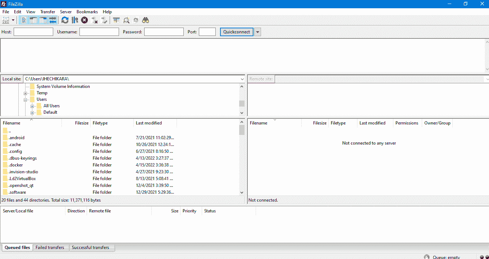

# 什么是 FTP？文件传输协议和 FTP 服务器的含义

> 原文：<https://www.freecodecamp.org/news/what-is-ftp-file-transfer-protocol-and-ftp-server-meaning/>

FTP 代表文件传输协议。这是一种网络/通信协议，用于通过 TCP/IP(传输控制协议/互联网协议)网络在计算机之间传输文件。

TCP/IP 网络的例子有:

*   超文本传输协议。
*   HTTPS(超文本传输协议安全)。
*   FTP(文件传输协议)。

## 文件传输协议是如何工作的？

要使用 FTP 在计算机之间传输文件，您必须访问 FTP 服务器(我将在下面解释什么是 FTP 服务器)。

根据您访问的服务器类型，您可能需要输入用户名和密码才能访问服务器中的文件。在访问文件之前不需要任何身份验证的服务器连接被称为匿名 FTP。

当用户成功访问/登录到 FTP 服务器时，他们可以在服务器上下载或上传文件。

有两种获取 FTP 服务器访问权限的一般方法:

*   通过网络浏览器。您可以通过在浏览器中键入服务器的地址来做到这一点。这个地址可能是这样的:ftp.myftpfiles.com 或 https://www.myftpfiles.com。一旦进入服务器，您就可以与所有者上传到服务器的文件进行交互。
*   通过 FTP 客户端。我们将在下一节讨论 FTP 客户端。

## 什么是 FTP 客户端？

FTP 客户端是在请求访问的计算机和存储文件的服务器之间创建连接的软件。

有许多 FTP 客户端软件可供使用。它们提供了一个我们可以与之交互的图形用户界面(GUI)。

下面，我们将看到 FTP 客户端是什么样子，以及我们如何使用它。我们将使用 [FileZilla](https://filezilla-project.org/) 。

在上图中，有不同的文本字段。`Host`文本字段是输入服务器地址的地方。

`Username`和`Password`文本字段用于在授权访问前需要验证的服务器。

`Port`文本字段通常是 21。这是 FTPs 的专用端口。

填写完必要的文本字段后，您可以点击`Quickconnect`连接到服务器。

在软件的左边是`local site`，它是我的电脑，有一个现有目录的列表。

右边是`Remote site`，这里将显示服务器中的所有信息和文件。

## 什么是 FTP 服务器？

FTP 服务器基本上就是最初上传所有文件的计算机。每个服务器都有一个 FTP 地址，用户可以通过浏览器或 FTP 客户端在 TCP/IP 上访问该地址。

服务器允许访问者下载和上传文件。

## FTP 服务器安全吗？

尽管许多 FTP 服务器需要认证，但由于协议缺乏加密，它们并不安全。这使得存储在 FTP 服务器上的文件更有可能被不需要的第三方访问。

FTP 的首选和更安全的协议是 SFTP，它代表安全文件传输协议。就像 HTTP 和 HTTPS 一样。

SFTP 更安全，因为存储在服务器上的数据是加密的。

其他替代方案包括:

*   FTPS(文件传输协议安全)。
*   HTTPS(超文本传输协议安全)。
*   AS2(适用性说明 2)。

## 使用 FTP 的优势

以下是使用 FTP 的一些优点:

*   更快的文件传输。
*   受到众多主机的支持。
*   支持传输大文件。
*   能够安排转移。
*   传输中断时可以恢复。

## 使用 FTP 的缺点

以下是使用 FTP 的一些缺点:

*   FTP 服务器缺乏安全性。
*   Chrome 和 Firefox 等主流浏览器不再支持 FTP。
*   用户凭据和文件不加密。
*   一些服务器可能包含有害文件。

## 结论

在本文中，我们讨论了文件传输协议，它使我们能够通过网络在计算机之间传输文件。

我们看到了什么是 FTP 客户端和 FTP 服务器。我们还讨论了为什么 FTP 服务器是不安全的，以及我们可以利用的其他安全替代方案。

最后，我们看到了使用 FTP 的优点和缺点。

感谢您的阅读！