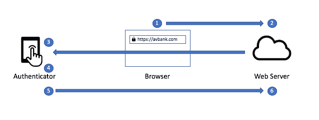
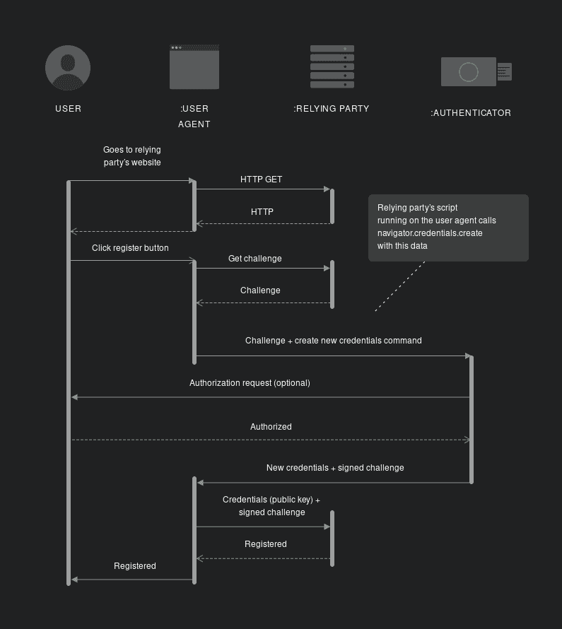
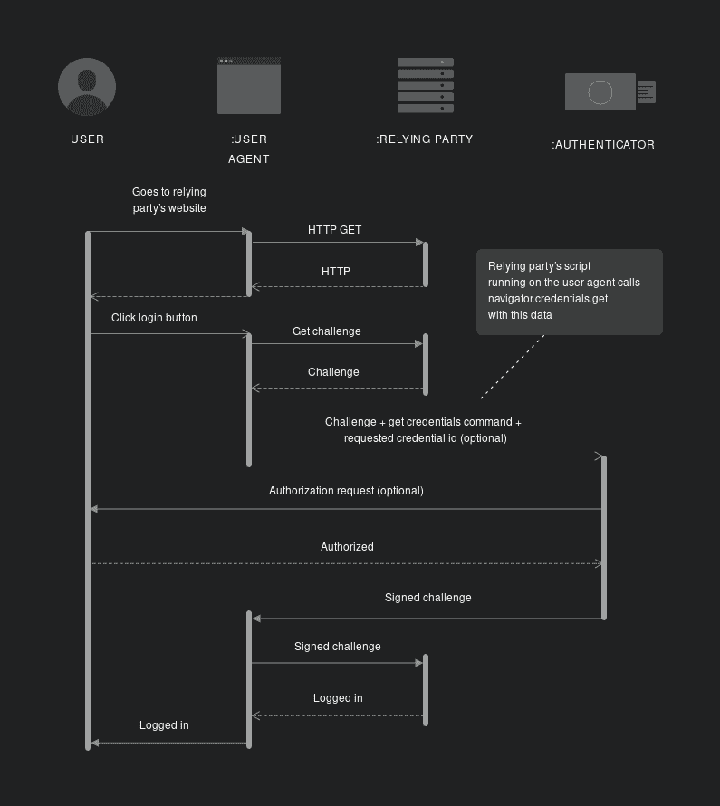

# 什么是 WebAuthn？如何认证没有密码的用户

> 原文：<https://www.freecodecamp.org/news/intro-to-webauthn/>

我们大多数人都习惯于使用密码登录不同的账户。多年来，这一直是常态。但是密码面临许多安全问题:

*   当我们不记得它们的时候，它们非常令人讨厌，甚至更难重新设置
*   他们可能很不安全，因为最常见的密码是`password`或`123456`
*   在当今的互联网时代，网络钓鱼攻击司空见惯，利用这种技术，黑客可以窃取您的密码

转向无密码登录不是更简单吗？一个我们不需要记住或者输入密码就能进入账户的地方？一个这样的无密码解决方案是 WebAuthn。

## 什么是 WebAuthn？😅

Web 身份验证 API(也称为 WebAuthn)是一种支持使用公钥加密进行强身份验证的 API。它让您无需 SMS 文本即可实现无密码身份验证和/或安全的第二因素身份验证。

让我们分解一下，以便快速理解各个部分:

*   **公钥加密** —所以我们使用基于密钥的认证(公钥和私钥)登录，而不是密码。如果你不确定它是如何工作的，我建议你看看这个[视频](https://youtu.be/6-JjHa-qLPk?t=277)。
*   **无密码认证** —在这种认证中，我们不会使用密码登录，而是使用某种形式的用户交互来验证和登录。它使用硬件认证器，比如你设备上的指纹传感器或 YubiKey。
*   **无需 SMS 文本的安全二元身份验证** —如今，二元身份验证主要由基于 SMS 的 OTP 驱动，但也容易受到 SIM 交换的影响。SIM 卡互换本质上是控制某人的电话号码，并欺骗运营商将其转移到新手机上。对于上述问题，通过使用 WebAuthn 的硬件认证器驱动的双因素认证场景将是更安全的解决方案。

WebAuthn 是由 W3C(T0)和 T2 FIDO(T3)编写的规范，谷歌、Mozilla、微软、Yubico 和其他公司也参与其中。

Web 身份验证与其他行业标准携手工作，如[凭证管理级别 1](https://www.w3.org/TR/credential-management-1/) 和 [FIDO 2.0 客户端到身份验证者协议 2](https://fidoalliance.org/specs/fido-v2.0-rd-20170927/fido-client-to-authenticator-protocol-v2.0-rd-20170927.html) 。

## WebAuthn 是如何工作的？🤔

因此，与其他所有登录情况一样:

*   系统会提示用户输入用户名来识别他们。
*   然后，浏览器会提示用户使用他们的硬件验证器并验证他们自己。
*   身份验证成功后，他们将登录到系统中。

现在我们不常看到的是，在后台发生了什么来促进这一过程。我再解释一下。

Generic WebAuthn Flow

### 注册流程

在此过程中，将根据用户输入的用户名创建一组新的密钥凭证。这个密钥凭证是这个过程的关键，它使我们能够确保这个身份验证是以无密码的方式进行的。

有一个简单的 8 步流程:

1.  用户在其浏览器(用户代理)上点击站点上的注册按钮。
2.  身份验证服务器(依赖方)向用户的浏览器发出一个质询(以数组形式发送的一组随机数据),以便能够启用 WebAuthn 登录。
3.  浏览器将该质询发送给认证者设备。
4.  认证者设备然后提示用户认证他们自己。这将因设备而异，例如 Macbook 上的触控 ID 或触摸 YubiKey。
5.  一旦用户授权认证者设备，认证者将创建新的密钥对(公钥和私钥),然后使用私钥对质询进行签名。
6.  认证者设备然后将签名的挑战、公共密钥以及关于该过程的细节返回给认证服务器。
7.  认证服务器随后将通过使用公钥来确认私钥的真实性，以确保质询由私钥签名。
8.  然后，它将根据用户名存储收到的详细信息，以备将来使用，并响应用户已注册。

Registration Flow

### WebAuthn 认证流程

身份验证是一个类似的过程，上面生成的凭证用于通过再次经历签名的质询过程来验证用户的身份。

有一个简单的 8 步流程:

1.  用户在其浏览器(用户代理)上点击站点上的登录按钮，并输入他们的用户名。
2.  认证服务器(依赖方)向用户的浏览器发出一个质询(作为数组发送的随机数据集)以及保存的用用户名注册的私钥 ID。
3.  浏览器将这个挑战和私有密钥 ID 发送给认证者设备。
4.  认证者设备然后提示用户认证他们自己。这将因设备而异(同样，触控 ID 在 Macbook 上或触摸 YubiKey)。
5.  一旦用户授权了认证器设备，认证器就将检索保存在其上的生成的密钥对和提供的私钥 ID。然后，它将使用私钥对挑战进行签名。
6.  认证者设备然后将签名的询问以及关于该过程的细节返回给认证服务器。
7.  然后，认证服务器将通过使用其保存的公钥来确认私钥的真实性，以确保质询由私钥签名。
8.  然后它会让用户登录。

Authentication Flow

## WebAuthn 的优势

听起来很棒，对吧？😮绝对的。让我们快速了解一些优势:

*   **基于私钥/公钥的身份验证** —与当前基于密码的身份验证相比，这是一种更安全的用户身份验证方式，因为它默认使用非对称加密技术。
*   **防网络钓鱼** —由于域名存储在身份验证器上，WebAuthn 可以抵御网络钓鱼攻击。这使得黑客更难欺骗网站并获取凭据。
*   **在数据库中存储公共数据** —只有公共数据存储在数据库中。在这个流中不需要存储诸如密码之类的敏感数据。
*   **精细控制** —你可以控制你想要什么样的用户交互作为流程的一部分，例如一个特定的硬件设备。
*   **更好的 UX** —用户不需要记住任何密码等，只需要使用硬件认证器就可以登录设备。
*   W3C 推荐标准 —这意味着它应该得到所有主流浏览器的支持。

最后**没有密码了。**

### WebAuthn 的缺点

尽管如此，它确实有一些问题仍有待解决:

*   **用户凭证管理** —关于凭证管理的用户体验仍处于非常原始的状态。
*   **跨设备凭证** —能够将凭证从一个设备传递到另一个设备并不容易，除非你使用像 YubiKey 这样的漫游硬件认证器。
*   **丢失/被盗验证器设备恢复** —如果您没有访问权限或丢失了漫游硬件验证器，一般情况下，回退方案是获得帐户访问权限的密码，但需要明确设置。
*   **WebAuthn 可能取代密码** — WebAuthn 仍处于非常早期的阶段，正在慢慢被采用和支持。它可能会在未来取代基于密码的登录，但我们可能还需要一段时间才能看到这一点。

注意——这并不能取代 OAuth 或 OIDC 等基于令牌的身份认证流程，也不能取代 Auth0、Okta、Google 等身份认证提供商。

## 结论

WebAuthn 是一个比简单使用密码更安全的认证流程。它可以防止网络钓鱼，并且只将公共数据存储在数据库中，而大多数私有数据通常只存储在硬件认证器中。

与现有的登录流程相比，它利用非对称加密技术进行用户检查，并提供更好的 UX。

目前，WebAuthn 主要作为双因素身份认证或通用第二因素工作流来驱动。但将来它可能会取代基于密码的登录。

希望本文能帮助您理解什么是 WebAuthn 以及它是如何工作的。

感谢阅读！我真的希望这篇文章对你有用。我总是有兴趣知道你的想法，并乐意回答你脑海中的任何问题。如果你认为这篇文章有用，请分享给其他人看。

另外，请随时通过 LinkedIn 或 T2 Twitter 与我联系。