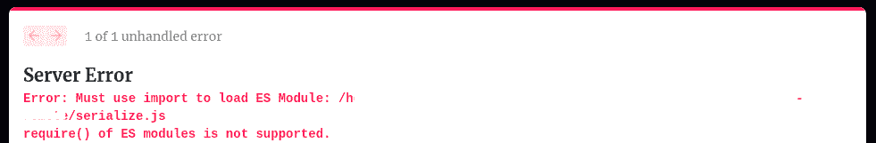

# 如何通过动态导入绕过 Next.js 中的 ES 模块错误

> 原文：<https://www.freecodecamp.org/news/how-to-bypass-es-modules-error-in-next-js/>

当您构建一个可以在 web 上访问的应用程序时，您将需要大量的依赖项或包来使您的应用程序运行良好。

当您使用 React、Vuejs、Next.js 或 Angular 等框架或库构建 JAMStack 应用程序时，您将需要这些包中的大部分。

在本文中，我将带您了解在使用 Next.js 构建 JavaScript 应用程序时可能会遇到的错误，以及如何绕过它。

## 什么是 ESModules？

ESModules 是在浏览器中使用 JavaScript 模块的 ECMAScript 标准。

“这和我过去几天看到的这些恼人的令人沮丧的错误有什么关系？”你可能会问我。

良好的...Node.js 已经使用 **CommonJS** 标准很长时间了，以便在这个场景中正确地构建 JavaScript 代码或模块，并且我们编写的大部分代码驻留/工作在浏览器中。

至少在 web 浏览器中，没有标准来正确指导如何使用或解释 JavaScript 模块。这个挑战带来了 ESModules 标准，它指导 JavaScript 模块如何在浏览器中工作。

该标准在 ES6 (ECMAScript 6)于 2015 年推出时获得批准，并在 Chrome、Safari、Firefox 和微软的 Edge 等各种 web 浏览器中实现了该标准。

我们在构建前端 ui 时使用的大多数包都是用 JavaScript 编写的。它们有输出特定函数(可能是 JavaScript 组件)、对象、字符串、数组等的模块。

这些函数、数组或字符串可以作为库公开给其他 JavaScript 文件。比方说，我们有一个打印控制台中任何人的名字的函数。语法应该是这样的:

```
// name.js
export default (name) => console.log(name) 
```

上面的代码片段描述了一个默认的导出，没有具体的名称。这意味着如果我们想在这个模块中使用这个函数，我们可以用任何名字来称呼它，因为在声明时没有明确地给它指定名字

```
import printName from "./name.js"

printName("Dodo") 
```

## 好吧，为什么我还是会得到这个错误？

是的。现在来看看这个错误。当我们开始与应用程序中的大量依赖项或包进行交互时，如果我们不对代码库给予适当的关注，一些事情可能会开始出错。

我们开始处理这些包的版本控制，突破性的改变，有时发布，我们不能保持跟踪。然后，我们可能会在任何东西开始工作之前，就开始匆忙地降级或升级某个特定的 npm 包。

这些错误中的大部分可能来自这些包的维护者。以我们在本文中讨论的相对较新的 ESModules 标准为例。它可能需要一段时间才能被一些框架或前端 JavaScript 库采用，例如 Next.js。

下图中的错误表明我们不能使用 CommonJS 方法来导入模块。



这个新标准和我们使用的这些工具有点不熟悉的事实是这个错误的原因。Nirmalya Ghosh 写了这篇关于如何维护大型 Next.js 应用程序的文章，你应该看看。

## 如何使用 Next.js 动态导入

现在我们已经了解了 ESModules 的基本知识，让我们看看如何修复与上图中类似的错误。我们将在 Next.js 中看看如何用动态导入来修复它。

我将假设您已经运行了一个 Next.js 应用程序，所以我将在下面的代码块中分享我从我的终端得到的相应的 ESModule 错误:

```
Error [ERR_REQUIRE_ESM]: Must use import to load ES Module: /path/to/package

require() of ES modules is not supported. 

ES module file as it is a .js file whose nearest parent package.json contains "type": "module" which defines all .js files in that package scope as ES modules.

Instead rename index.js to end in .cjs, change the requiring code to use import(), or remove "type": "module" from /path/to/package 
```

看看上面的错误，这样你就对它很熟悉了。一旦你完成了，让我们继续。

### 什么是动态导入？

动态导入是 Next.js 的一个特性，它允许您在浏览器中方便地使用 JavaScript 模块。

它提供了一种使用 SSR(服务器端呈现)来预呈现这些模块的方法，这样当用户需要使用 JavaScript 模块的页面时，就不需要不断地向服务器发送请求。使用动态导入，模块已经预先呈现在浏览器中。

最近，我在做一个与降价内容有关的项目。我需要使用重新类型的插件，但是我一直在前面的代码块中得到错误。

```
const rehypeSlug = dynamic(() => import('rehype-slug'), { ssr: false })
const rehypeCodeTitles = dynamic(() => import('rehype-code-titles'), {
  ssr: false,
})
const rehypeAutolinkHeadings = dynamic(
  () => import('rehype-autolink-headings'),
  { ssr: false }
)
const rehypePrism = dynamic(() => import('rehype-prism-plus'), { ssr: false }) 
```

上面的代码片段展示了如何使用动态导入来导入一个模块，并将`ssr`对象作为参数传递给它。

通过这种使用动态导入的方法，消除了不断出现的 ESModule 错误。

## 包扎

所以我希望你能利用这个特性，我希望它能把你从那个错误中解放出来。

当您构建 JavaScript 应用程序时，有很多事情需要考虑，所以这可以少一件事。感谢您阅读本文，希望您喜欢。