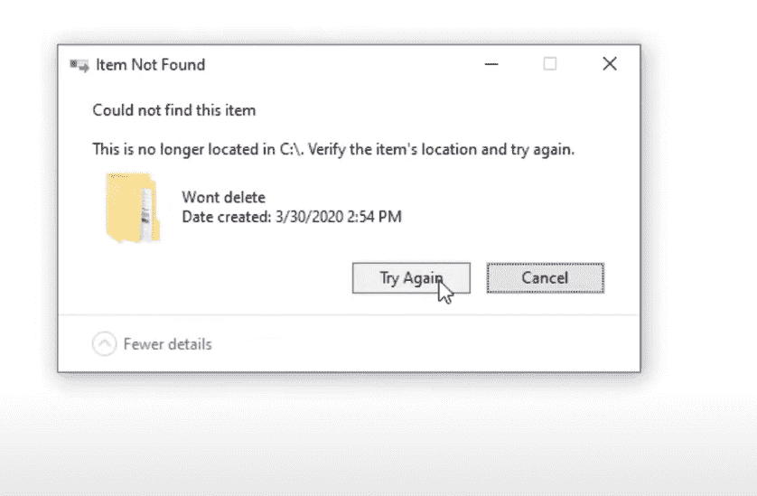
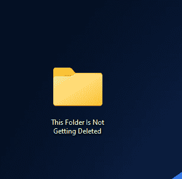
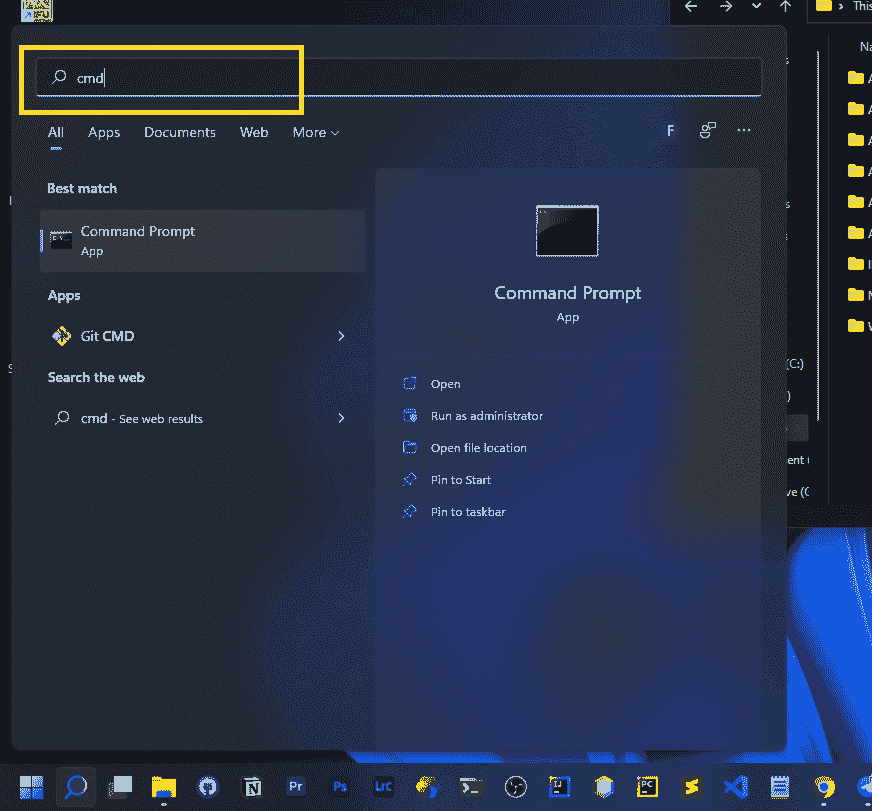
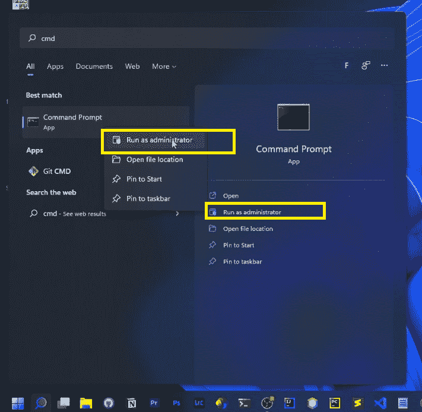
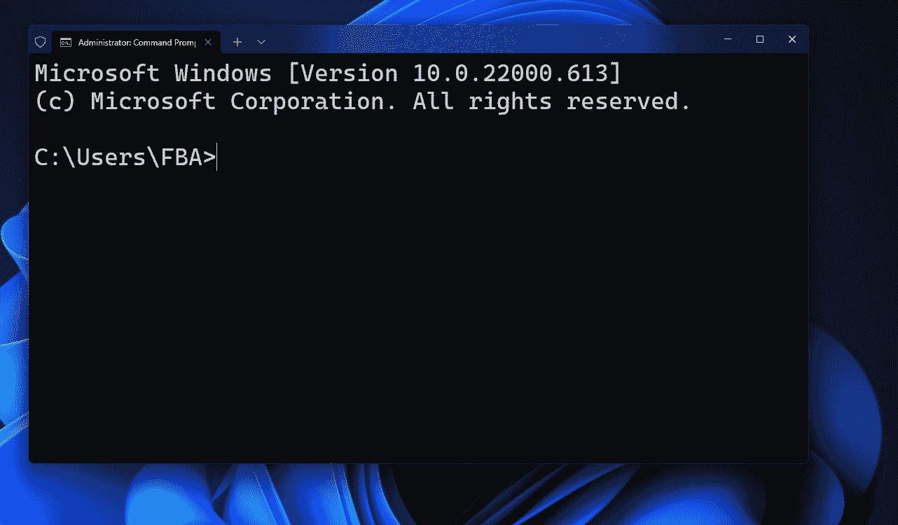
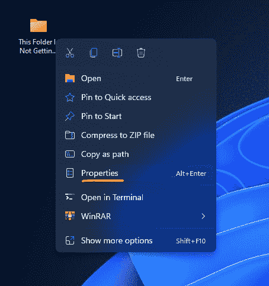
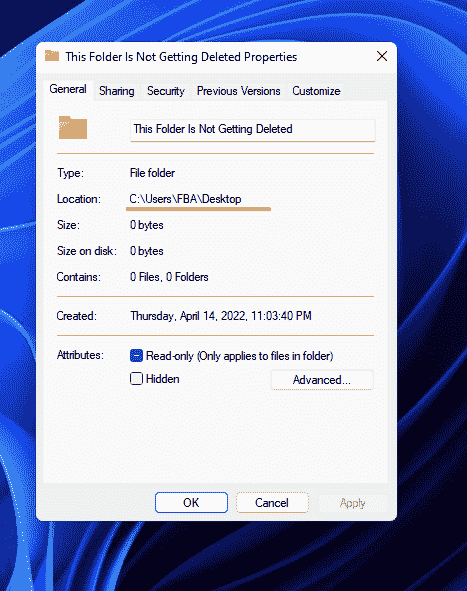
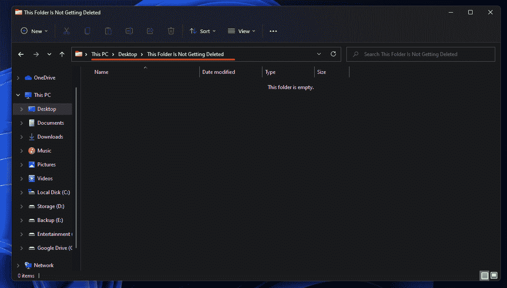
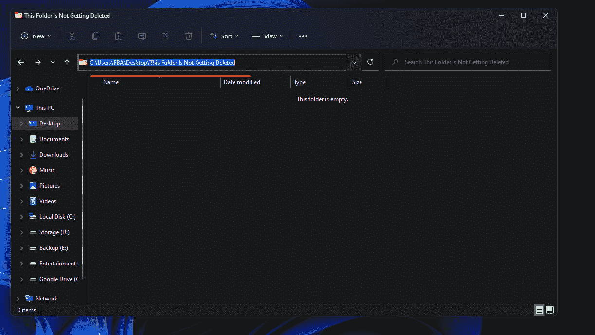
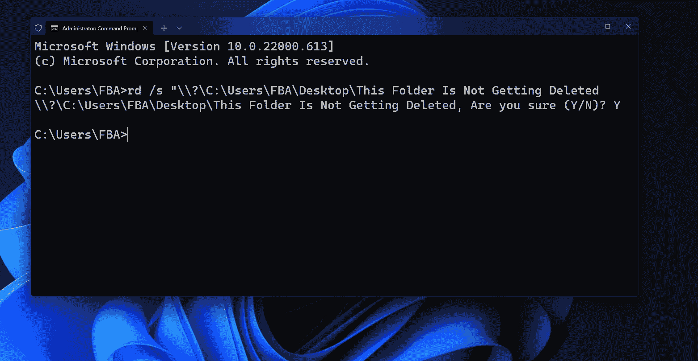

# 如何修复删除文件或文件夹时出现的“找不到项目”错误

> 原文：<https://www.freecodecamp.org/news/how-to-solve-item-not-found-windows-error-deleting-file-folder/>

如果您使用的是 Windows 操作系统，那么您可能在尝试删除文件或文件夹时遇到过此错误。

即使文件或文件夹在那里，Windows 也会说它无法删除它，因为它在该目录中找不到该文件/文件夹。

这也发生在我身上。事实上，我经常面对这个问题。今晚也不例外。

我试图删除一个文件夹，但做不到。每次我试图删除该文件夹时，Windows 都会提示我“**该文件夹已不在[location]中。请验证该项目的位置，然后重试。**

我尝试了所有我能找到的方法来解决这个问题，但是没有一个有效。

最后，我成功地解决了这个问题。所以，我想为什么不与他人分享我发现的诀窍呢？所以，给你！

[Image source: D Studios Media](https://www.youtube.com/watch?v=u4IQCZ5dKMw)

如果你读过我在 freeCodeCamp 上的其他文章，那么你应该知道我总是使用自己电脑上的图片。所以，如果你想知道为什么我要分享另一个来源的图片，不要担心——你马上就会得到答案！

当我试图解决这个问题，以便我可以安全地删除我想删除的文件夹时，我尝试了各种方法。最后，我解决了这个问题，我想你可能会猜到我的意思:文件夹被成功删除！

由于该文件夹已被删除，我不能采取任何截图。所以在删除文件夹之前我没能收集到截图。

这就是为什么我使用了上面另一个来源的图片。😅

## 如何修复“找不到项目”的 Windows 错误

现在，让我向您展示如何在您的 Windows 操作系统上解决这个问题。不要担心，我会从我自己的电脑上向你展示每一步。

假设，我有一个像下面这样的文件夹，无论我如何尝试删除它，它都不会被删除。

因此，我将使用一个特殊的技巧，我将使用终端安全地删除这个文件夹。

以管理员身份打开 CMD。为此，只需点击 Windows 按钮，并搜索 **CMD** 。

现在右击**命令提示符**，点击**以管理员身份运行**。

CMD 将以管理员权限打开。

现在，我们需要使用命令`rd /s "\\?\path`。在路径中，您需要输入文件夹地址。

您可以通过各种方式获得文件夹地址或目录。下面我将向你展示两种方法。

**第一种方式:**右键点击文件夹/文件，点击属性。

在这里，您将获得目录地址。

你必须在那之后添加文件夹名称。比如这里我的目录是:`C:\Users\FBA\Desktop`而我要删除的文件夹的名字是`This Folder Is Not Getting Deleted`。因此，我需要在终端中使用的完整目录地址将是:`C:\Users\FBA\Desktop\This Folder Is Not Getting Deleted`。

**第二种方式:**进入你要删除文件夹/文件的文件夹，你会得到那里的目录地址。

只需点击地址，并复制整个地址。也可以使用`Ctrl` + `C`作为快捷键。

无论如何，在这之后，我有了目录地址。现在我需要在终端上使用完整的命令,`**rd /s "\?\C:\Users\FBA\Desktop\This Folder Is Not Getting Deleted**`,之后我需要按回车键。

现在我需要键入 Y 并按回车键。

瞧啊。文件夹现在不见了。😎

你可以从微软官方文档了解更多关于这个 rd 命令的信息。

这样，你可以安全地删除任何用常规方法无法删除的文件夹/文件。

## 结论

感谢您阅读整篇文章。如果对你有帮助，那么你也可以在 [freeCodeCamp](https://www.freecodecamp.org/news/author/fahimbinamin/) 查看我的其他文章。

如果你想和我联系，那么你可以使用 [Twitter](https://twitter.com/Fahim_FBA) ， [LinkedIn](https://www.linkedin.com/in/fahimfba/) ， [GitHub](https://github.com/FahimFBA) ，[英语 YouTube 频道](https://www.youtube.com/channel/UCG97GCUifMS2Vm28tgXQi0Q)，或者[孟加拉语 YouTube 频道](https://www.youtube.com/channel/UCEF4lxmpBKV2oYCSFH6ExIQ)。

💫如果你想查看我的精彩部分，那么你可以在我的 [Polywork 时间轴](https://www.polywork.com/fahimbinamin)上查看。

非常感谢！😊