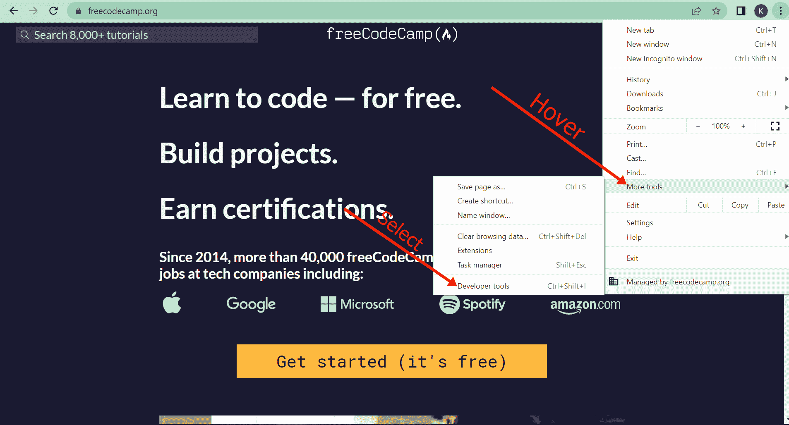
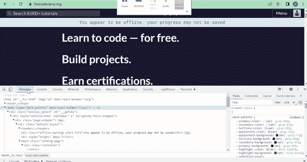
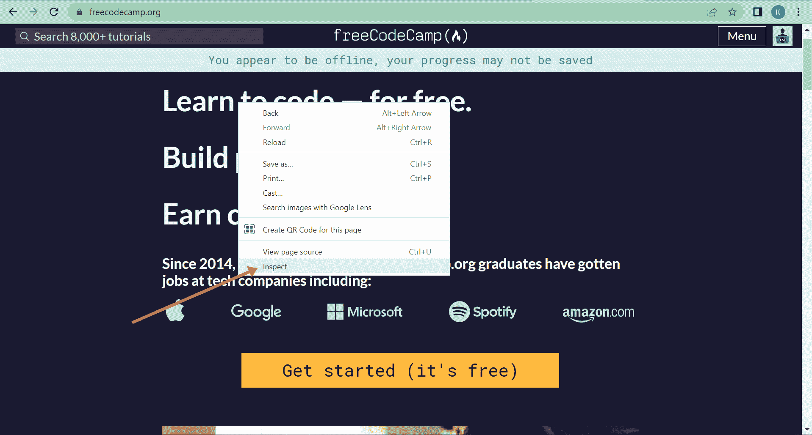
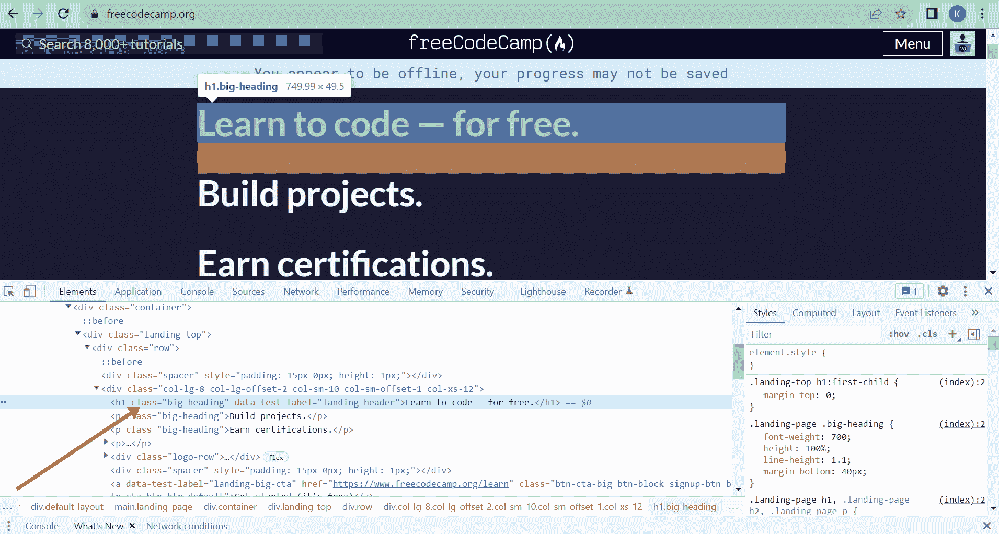
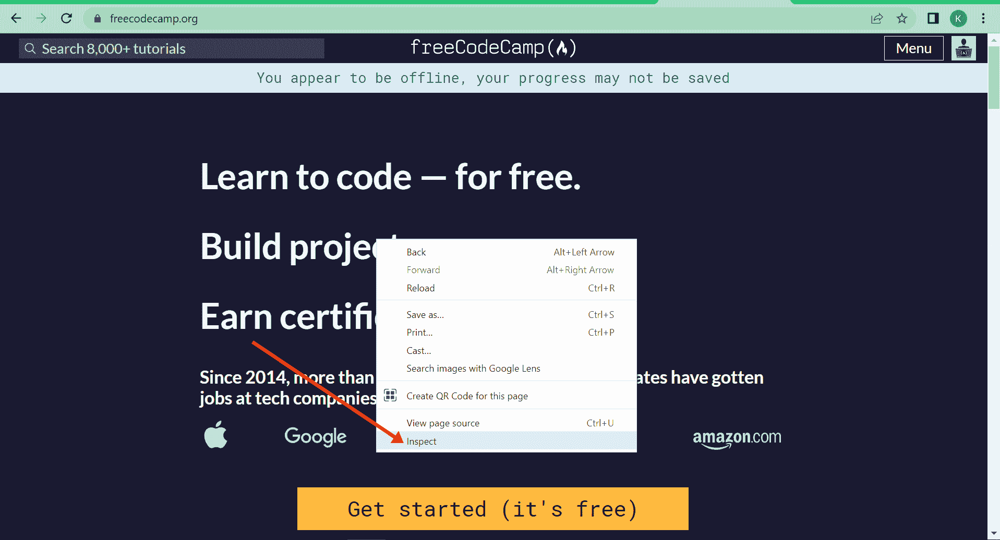
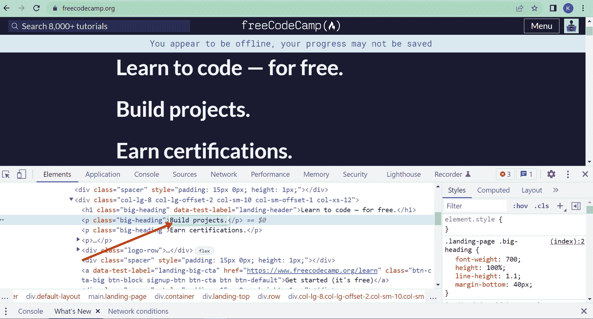
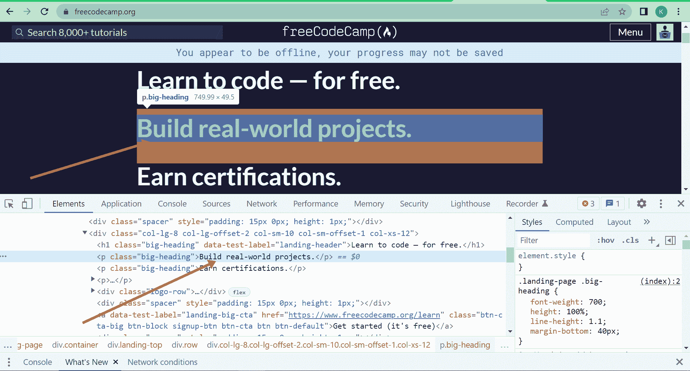
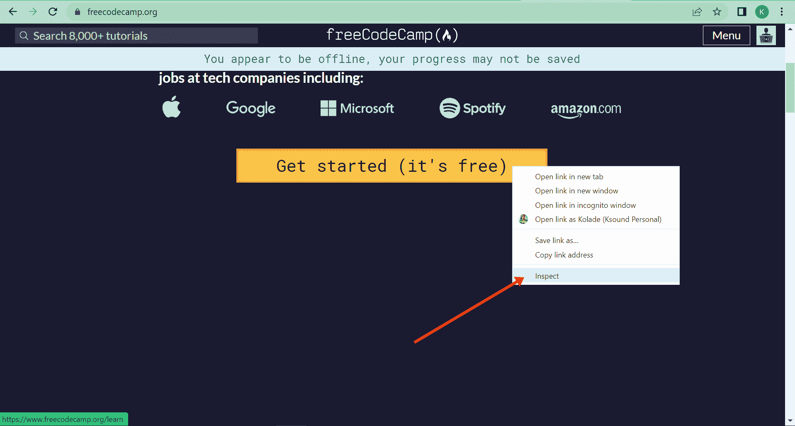
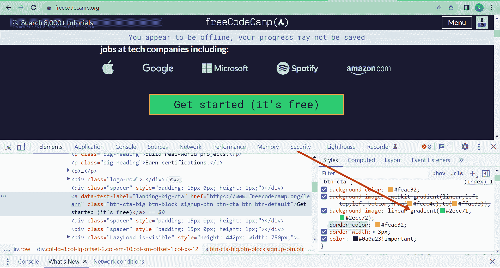

# 如何检查元素 Chrome 快捷方式

> 原文：<https://www.freecodecamp.org/news/how-to-inspect-an-element-chrome-shortcut/>

谷歌 Chrome 浏览器的 Inspect Element 功能是一个强大而易用的工具。

它是 Chrome 开发者工具的重要组成部分，你可以用它来检查任何网站的源代码。

但这并没有结束。你可以通过改变组成网站的元素和风格来做进一步的事情——也就是说，网站的 HTML、CSS 和 JavaScript 代码。这就是为什么许多开发人员使用 Inspect 工具进行调试的原因。

如果你是一个 web 开发的初学者，Inspect 工具是一个有用的特性，你可以利用它来了解网站是如何构建的，使用的字体、图标和插件，甚至是网站的制作者。

好消息是，你不需要成为网站的开发者就可以使用这个强大的工具，因为用户也可以使用它。你甚至不需要成为一个开发者来使用它。

在这篇文章中，你将学习如何打开 Chrome 开发者工具，以便访问 Inspect 功能，以及如何检查网站上的特定元素。我还将向你展示如何通过改变文本和样式来操纵网站的元素。

我将使用 freeCodeCamp.org 向您展示如何使用 Inspect 工具。

## 如何打开 Chrome 开发者工具

要打开 Chrome 开发者工具，点击浏览器右上角的垂直圆点:

然后将鼠标悬停在“更多工具”上，选择“开发者工具”:

然后，您将可以访问开发人员工具的选项卡，例如 Elements(构成网站的 HTML 和 CSS)、Console(您可以使用它运行 JavaScript)、Sources 等等。

你可以拖动这些标签，把它们放在你想放的任何地方:

## 如何用键盘打开 Chrome 中的 Inspect Element？

在 Linux 上可以通过按`CTRL` + `SHIFT` + `C`或者在 Windows 上按`F12`打开 Inspect element tool。

如果你在 Mac 上，按下`Command` + `SHIFT` + `C`。

## 如何检查网站上的特定元素

要检查您在网站上看到的任何元素，无论是文本、按钮、视频还是图像，请右键单击该元素，然后单击“检查”。

在这种情况下，我将右键单击 freeCodeCamp.org 登录页面上的“免费学习编码”文本。

源代码会打开，元素会高亮显示，就像这样:

您可以看到文本是一个`h1`元素。

## 如何使用 Inspect 工具操作网站的元素

您可以使用检查工具更改网站的文本内容。

例如，我将把 freeCodeCamp.org 登录页面上的“构建项目”文本改为“构建真实项目”。

为此，右键单击要更改的元素，然后单击“检查”。在本例中，它是“构建项目”文本:

双击【构建项目】文本:

输入“构建真实世界的项目”，然后点击`ENTER` :

可以看到文字已经改成了“构建真实世界的项目”。

## 如何使用检查工具更改样式

让我们把“开始(它是免费的)”按钮的背景改成我最喜欢的颜色-# 2ecc 71。

右键点击按钮，选择【检查】:

双击右边“背景-图像”属性值，即`linear-gradient(#fecc4c,#ffac33)`。

改变颜色为`#2ecc71,#2ecc72`并点击`ENTER` :

你可以看到按钮的背景已经改变。

我们现在在 freeCodeCamp.org 登录页面上做了两处更改——我们将“构建项目”文本更改为“构建真实世界的项目”,并更改了“开始(免费)”按钮的背景:

## 您使用检查工具所做的更改是永久性的吗？

不会。您使用检查工具所做的任何更改都不是永久的。一旦重新加载页面，更改就消失了。

这是因为网站已经部署到服务器上。因此，当您通过重新加载页面向该服务器发出另一个请求时，来自服务器的内容将由您的浏览器加载。

所以不要担心——你用 Inspect 工具这样玩不会永久改变一个网站。它只是帮助你更多地了解它并练习你的编码:)

## 结论

本文向您展示了如何访问 Google Chrome 的开发工具，如何使用其 Inspect 功能查看网站的源代码，以及如何使用它来更改网站的元素和样式。

如果你刚刚开始学习用 HTML、CSS 和 JavaScript 编写代码，Chrome Dev tools 的 Inspect 功能是一个强大的工具，你可以用它来查看任何网站的源代码，以便了解它们是如何构建的。

感谢您的阅读。