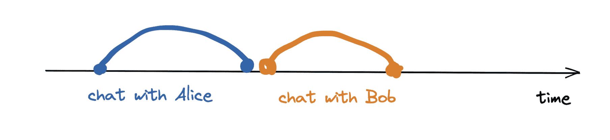
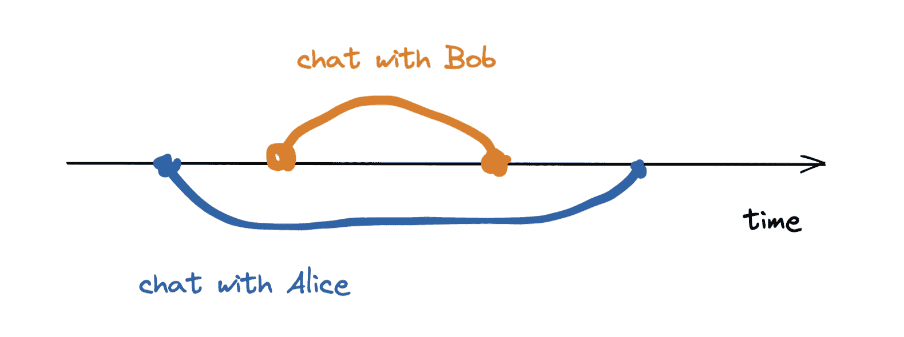
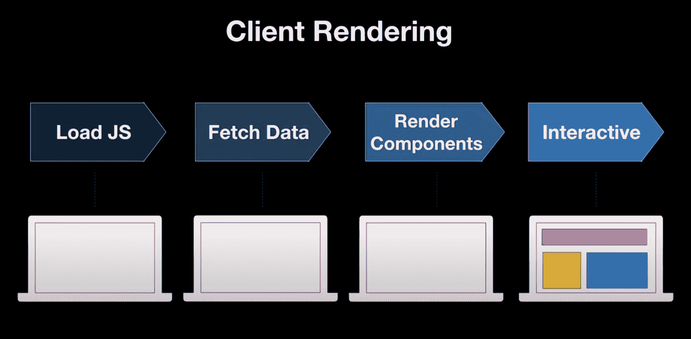
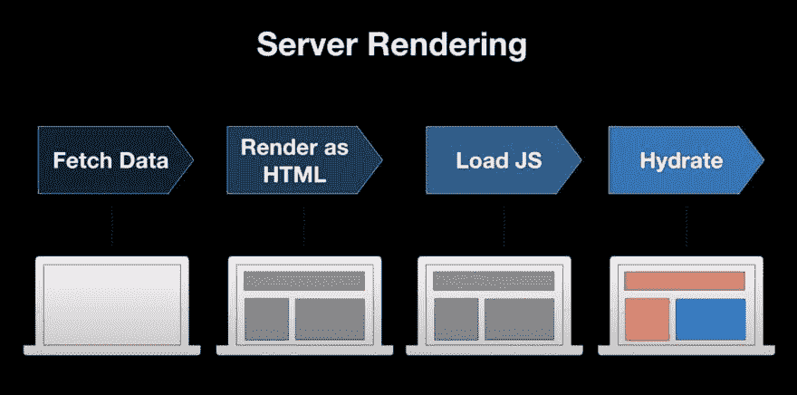
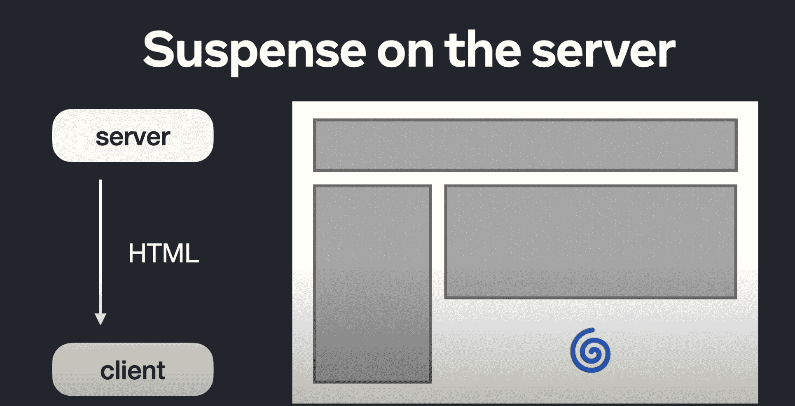

# React 18 项新功能–并发渲染、自动批处理等

> 原文：<https://www.freecodecamp.org/news/react-18-new-features/>

React 18 于 2022 年 3 月发布。此版本侧重于性能改进和更新渲染引擎。

React 18 为并发渲染 API 奠定了基础，未来的 React 特性将建立在这些 API 之上。

在本教程中，我将快速介绍 React 18 中发布的功能，并解释几个主要概念，如并发渲染、自动批处理和过渡。

### React 18 功能快速指南

| 种类 | 特征 |
| --- | --- |
| 概念 | 并发反应 |
| 特征 | 服务器上的自动批处理、转换和暂停 |
| 蜜蜂 | createRoot，hydrateRoot，renderToPipeableStream，renderToReadableStream |
| 钩住 | useId，useTransition，useDeferredValue，useSyncExternalStore，useInsertionEffect |
| 更新 | 严格模式 |
| 不赞成/不鼓励 | ReactDOM.render，renderToString |

现在，让我们更详细地看一下这些更新。但是首先，如果你还没有，让我们学习如何更新 React。

## 如何升级到 React 18

从 npm 或 yarn 安装 React 18 和 React DOM，像这样:

`npm install react react-dom`

然后，你会想要使用`createRoot`而不是`render`。

在您的 index.js 中，将`ReactDOM.render`更新为`ReactDOM.createRoot`以创建一个根，并使用根呈现您的应用程序。

下面是 React 17 中的样子:

```
import ReactDOM from 'react-dom';
import App from 'App';

const container = document.getElementById('app');

ReactDOM.render(<App />, container); 
```

这是它在 React 18 中的样子:

```
import ReactDOM from 'react-dom';
import App from 'App';

const container = document.getElementById('app');

// create a root
const root = ReactDOM.createRoot(container);

//render app to root
root.render(<App />); 
```

## React 18 中的并发性

为了理解并发性，让我们考虑一下来自 React 18 工作组讨论的 Dan Abramov 的这个例子。

假设我们需要给两个人打电话——爱丽丝和鲍勃。在非并发设置中，我们一次只能有一个调用。我们会先给爱丽丝打电话，结束通话，然后给鲍勃打电话。

当通话时间很短时，这没有问题，但是如果与 Alice 的通话有很长的等待时间(例如等待)，这可能是一个时间接收器。



Image showing that in a typical non-concurrent phone conversation, you have to wait for a call to be over before starting a new call.

在并发设置中，我们可以呼叫 Alice，一旦我们被挂起，我们就可以呼叫 Bob。

这并不意味着我们同时在和两个人说话。这只是意味着我们可以同时有两个或更多的并发调用，并决定哪个调用更重要。



Image showing phone conversation between Alice and Bob can be concurrent, by placing a call on hold and answering a more urgent call with Bob first.

类似地，在具有并发渲染的 React 18 中，React 可以中断、暂停、恢复或放弃渲染。这允许 React 快速响应用户交互，即使它正在执行繁重的渲染任务。

在 React 18 之前，渲染是一个单一的、不间断的同步事务，一旦渲染开始，就不能被中断。

并发是 React 渲染机制的一个基础更新。并发允许对中断渲染做出反应。

React 18 引入了并发渲染的基础和新功能，如悬念、流服务器渲染和过渡由并发渲染支持。

## React 18 的新特性

### 自动配料

React 18 具有自动配料功能。为了理解批处理，让我们考虑一下来自 [same React 工作组讨论](https://github.com/reactwg/react-18/discussions/46#discussioncomment-846694)的杂货店购物的例子。

假设你正在为晚餐做意大利面。如果你要优化你的购物之旅，你应该创建一个你需要购买的所有原料的清单，去一趟杂货店，在一次旅行中得到你所有的原料。

这是批处理。没有配料，你会开始烹饪，发现你需要一种配料，去杂货店买配料，回来继续烹饪，却发现你需要另一种配料，去杂货店...把自己逼疯。

在 React 中，当您调用`setState`时，批处理有助于减少状态改变时发生的重新渲染次数。以前，在事件处理程序中对批处理状态更新作出反应，例如:

```
const handleClick = () => {
setCounter();
setActive();
setValue();
}

//re-rendered once at the end. 
```

但是，在事件处理程序之外发生的状态更新不会被批处理。例如，如果您有一个承诺或正在进行网络呼叫，状态更新将不会被批量处理。像这样:

```
fetch('/network').then( () => {
setCounter(); //re-rendered 1 times
setActive();  //re-rendered 2 times
setValue();   //re-rendered 3 times
});

//Total 3 re-renders 
```

如你所见，这不是表演。React 18 引入了自动批处理，允许所有状态更新——即使在承诺、超时和事件回调中——被批处理。这大大减少了 React 必须在后台完成的工作。React 将在重新渲染之前等待微任务完成。

React 中的自动批处理是现成的，但是如果你想退出，你可以使用`flushSync`。

### 过渡

转换可用于标记不需要紧急资源进行更新的 UI 更新。

例如，当在 typeahead 字段中键入时，会发生两种情况:闪烁的光标显示正在键入的内容的视觉反馈，以及在后台搜索键入的数据的搜索功能。

向用户展示视觉反馈很重要，因此也很紧迫。搜索并不紧急，因此可以标记为非紧急。

这些非紧急更新称为转换。通过将非紧急 UI 更新标记为“过渡”，React 将知道哪些更新应该优先。这使得优化渲染和摆脱陈旧的渲染变得更加容易。

您可以使用`startTransition`将更新标记为非紧急。下面是一个示例，说明当用过渡标记时，typeahead 组件会是什么样子:

```
import { startTransition } from 'react';

// Urgent: Show what was typed
setInputValue(input);

// Mark any non-urgent state updates inside as transitions
startTransition(() => {
  // Transition: Show the results
  setSearchQuery(input);
}); 
```

#### 转场与去抖动或 setTimeout 有何不同？

1.  与 setTimeout 不同，startTransition 会立即执行。
2.  setTimeout 有保证的延迟，而 startTransition 的延迟取决于设备的速度和其他紧急渲染。
3.  与 setTimeout 不同，startTransition 更新可以被中断，并且不会冻结页面。
4.  当用 startTransition 标记时，React 可以为您跟踪挂起状态。

### 服务器上的悬念

React 18 介绍了:

1.  暂停服务器上的代码分割
2.  服务器上的流式渲染

#### 客户端渲染与服务器渲染

在客户端呈现的应用程序中，您从服务器加载页面的 HTML 以及运行页面所需的所有 JavaScript，并使其具有交互性。

然而，如果您的 JavaScript 包很大，或者您的连接速度很慢，这个过程可能需要很长时间，用户将等待页面变得可交互，或者看到有意义的内容。



In a client rendering flow, a user has to wait a long time before the page becomes interactive. [Source](https://www.youtube.com/watch?v=pj5N-Khihgc): React Conf 2021 **Streaming Server Rendering with Suspense** by Shaundai Person

为了优化用户体验，避免用户坐在空白屏幕上，我们可以使用服务器渲染。

服务器呈现是一种在服务器上呈现 React 组件的 HTML 输出并从服务器发送 HTML 的技术。这允许用户在 JS 包加载时和应用变得可交互之前查看一些 UI。

关于客户端与服务器渲染的详细概述，[查看 Shaundai Person 的 React Conf 2021 talk](https://www.youtube.com/watch?v=pj5N-Khihgc) 。



In a server rendering flow, we can display meaningful data to the user much faster by sending HTML from the server. [Source](https://www.youtube.com/watch?v=pj5N-Khihgc): React Conf 2021 **Streaming Server Rendering with Suspense** by Shaundai Person

服务器渲染进一步增强了用户加载页面的体验，并减少了交互时间。

现在，如果你的应用程序除了一部分之外，大部分都很快，该怎么办？可能这部分加载数据比较慢，也可能需要下载很多 JS 才能进行交互。

在 React 18 之前，这部分往往是应用的瓶颈，会增加渲染组件的时间。

一个缓慢的组件会降低整个页面的速度。这是因为服务器渲染是全有或全无——你不能告诉 React 延迟加载一个缓慢的组件，也不能告诉 React 发送其他组件的 HTML。

React 18 增加了对服务器悬念的支持。在悬念的帮助下，你可以在悬念组件中包装应用程序的缓慢部分，告诉 React 延迟缓慢组件的加载。这也可以用来指定在加载时可以显示的加载状态。

在 React 18 中，一个缓慢的组件不一定会降低整个应用程序的渲染速度。有了悬念，您可以告诉 React 首先发送其他组件的 HTML 以及占位符的 HTML，就像加载微调器一样。然后，当慢速组件准备好并获取其数据时，服务器呈现器将在同一个流中弹出其 HTML。



Image showing that suspense on the server can allow a slow component to show a loading state while others are fully rendered. 

通过这种方式，用户可以尽早看到页面的框架，并随着更多 HTML 片段的到来，看到它逐渐显示更多的内容。

所有这些都发生在页面上加载任何 JS 或 React 之前，这显著改善了用户体验和用户感知的延迟。

### 严格模式

React 18 中的严格模式将模拟安装、卸载和重新安装具有先前状态的组件。这为将来的可重用状态奠定了基础，React 可以通过在卸载之前使用相同的组件状态重新安装树来立即安装上一个屏幕。

严格模式将确保组件对多次安装和卸载的影响具有弹性。

## 结论

总之，React 18 为未来的版本奠定了基础，并专注于改善用户体验。

升级到 React 18 应该很简单，现有代码在升级后应该不会中断。升级过程不会超过一个下午。

试一试，让我知道你的想法！

来源:

1.  [反应 RFC](https://github.com/reactjs/rfcs/blob/react-18/text/0000-react-18.md)
2.  [我之前的 React 18 帖子](https://dev.to/shrutikapoor08/what-s-new-in-react-18-1713)
3.  [React V18 博客](https://reactjs.org/blog/2022/03/29/react-v18.html)
4.  [React Conf 2021 -面向应用开发者的 React](https://www.youtube.com/watch?v=ytudH8je5ko)
5.  [React Conf 2021 -带悬念的流媒体服务器渲染](https://www.youtube.com/watch?v=pj5N-Khihgc)

如果你喜欢这篇文章，给它一个❤️，这样其他人也可以找到它。

*   更多提示，[在 Twitter 上保持联系](http://twitter.com/shrutikapoor08)
*   想让这样的文章直接出现在你的收件箱里吗？