# 什么是玻璃态？如何在 Figma 中创建玻璃卡片

> 原文：<https://www.freecodecamp.org/news/glassmorphism-how-to-create-a-glass-card-in-figma/>

Glassmorphism 是用户界面设计的一个发展趋势。它让你的设计看起来既现代又优雅。

‌‌‌‌In:在这篇文章中，我们将学习玻璃态是什么意思，它有多容易理解，以及如何设计一个简单的玻璃卡片。‌‌

## 什么是玻璃态？

玻璃形态是一种风格，顾名思义，使用玻璃的属性来增强你的设计。它为其元素提供了半透明或透明的外观和感觉。

玻璃形态的元素和形状在充满活力、色彩丰富的背景上表现得非常好，突出了玻璃效果。Glassmorphism 帮助你在设计中增加视觉层次，并把焦点放在你想要突出的内容上。

## 玻璃态的‌‌Accessibility

如果你是为视力有问题的人设计，眼镜设计不是最好的。在选择颜色和字体时，你必须非常小心，以确保屏幕阅读器和其他设备可以正确地解释设计。

‌‌Also，使用 glassmorphism 会导致你的网站变慢，还会增加电池的使用。

然而，如果你能解决这些问题，玻璃设计确实看起来非常非常酷——所以我们将在这里学习如何制作它们。

以下是一些有助于提高眼镜设计可访问性的提示:

1.  谨慎/适度地使用透明或模糊效果。不要过度使用。仅在设计中的两三个元素上使用时，效果看起来最好。
2.  建立清晰的层级感。在设计布局中，卡片之间的适当间距以及确保正确的元素突出将有助于解决可访问性问题。记住，强烈的视觉层次有助于给用户正确的视觉线索。
3.  设置合适的背景。确保背景不平淡无奇。使用鲜艳的颜色作为背景将有助于突出效果。当然，这样也会达到非常美观的效果。
4.  使用更大的字体可以让你的眼镜设计更容易理解。此外，选择与玻璃背景形成对比的字体。

## 玻璃形态设计示例

为了让你更好地了解玻璃形态的设计，这里有几个应用这种技术的网站示例:

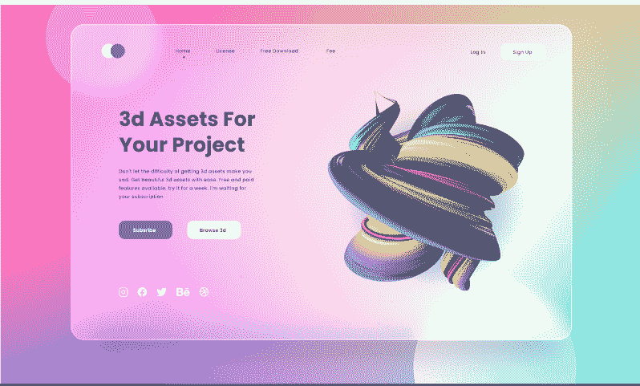

Glassmorphic Website by Sahid Aldi Susilo

[Glassmorphism Web UI Design
<strong>Product Description</strong>

&nbsp;

This is onboarding for course or learning applications. I made it in Adobe XD. I could use Figma, too. You can download it <strong>for personal use</strong>. If you want to use it <strong>for business or need another screen part</strong>, yo…UpLabs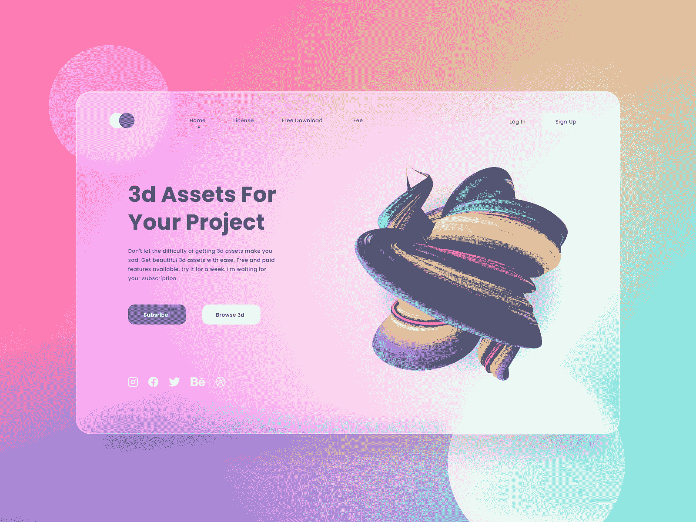](https://www.uplabs.com/posts/glassmorphism-web-ui-design#)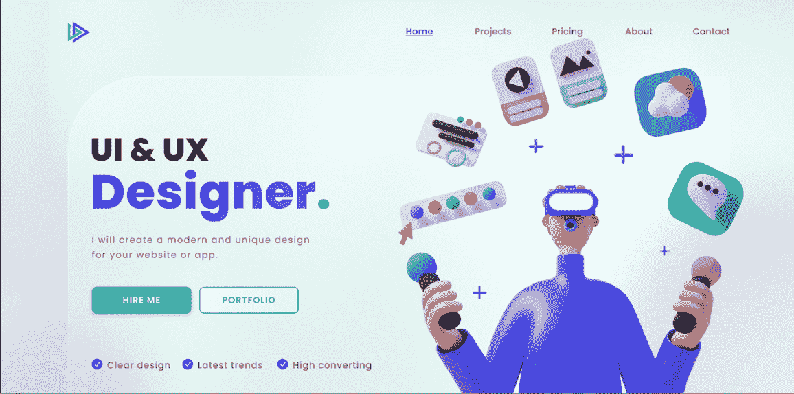

Glassmorphic design by Stefan Brown‌

这里可以看到这个设计[。](https://dribbble.com/shots/15314731-UI-UX-Designer-Landing-Page)

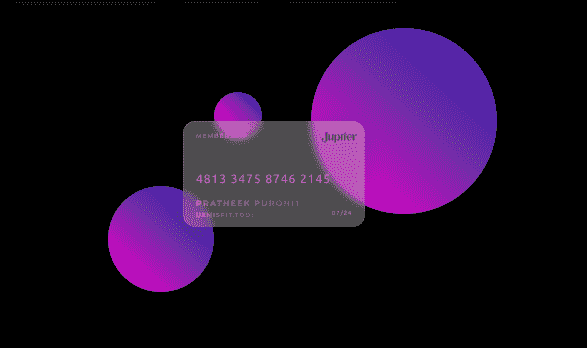

Glass card by Pratheek Purohit

这里可以看到这个设计[。](https://www.freecodecamp.org/news/glassmorphism-how-to-create-a-glass-card-in-figma/%E2%80%8Chttps://dribbble.com/shots/15644676-Glass-card-effect-Glassmorphism)

让我们看看如何重新创建类似于上一个例子的东西。

## 如何在 Figma 中创建玻璃卡片

玻璃卡片是用玻璃形态创造的简单卡片。卡片可以是信用卡、个人资料卡、发票卡等的图像。

按照以下步骤在 Figma 中创建一个玻璃信用卡。

### 步骤 1-设置一个彩色背景

丰富多彩的背景是必不可少的，因为它有助于突出你的玻璃设计，让它脱颖而出。你可以使用 [uiGradients 插件](https://www.figma.com/community/plugin/744909029427810418/uiGradients)来选择你喜欢的渐变，就像我下面做的那样。

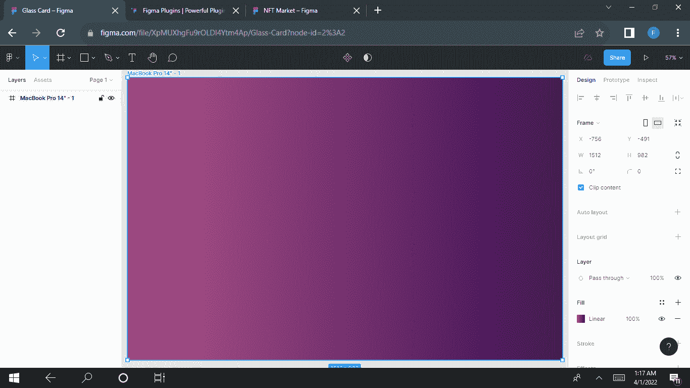

### 第二步——画一个形状

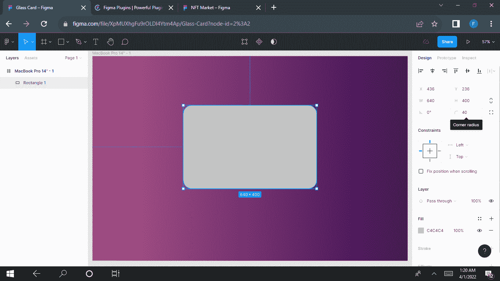

在这里，我们将模仿物理信用卡的形状，它看起来像一个长方形。

绘制一个尺寸为 640×400 的矩形，并将拐角半径设置为 40 磅。

### 步骤 3–使用渐变应用填充

接下来，你需要用半透明的颜色填充形状，比如白色。渐变的两种颜色都应该是白色，但它们应该设置为不同的不透明度。

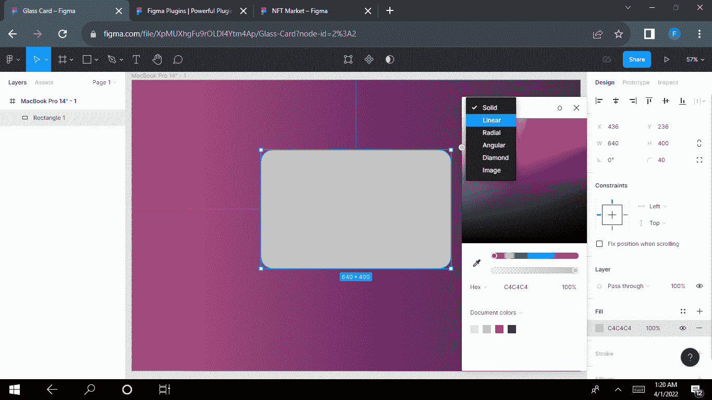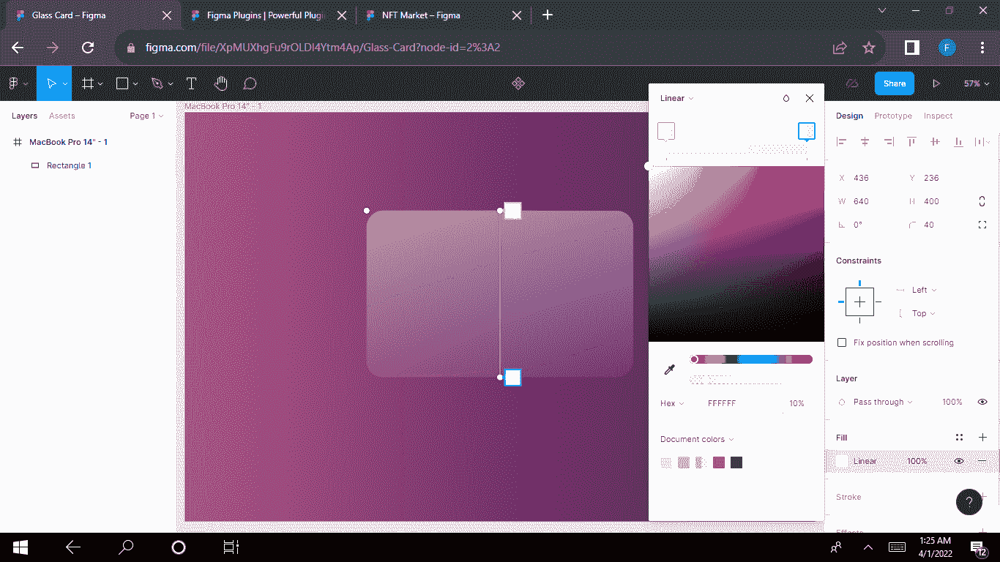

### 步骤 4-应用背景模糊

将模糊值设置为 40，或者根据您想要的模糊程度选择任何值。

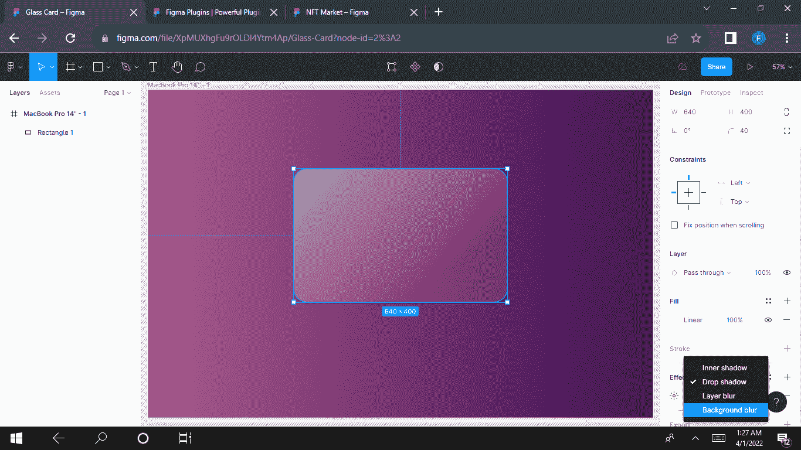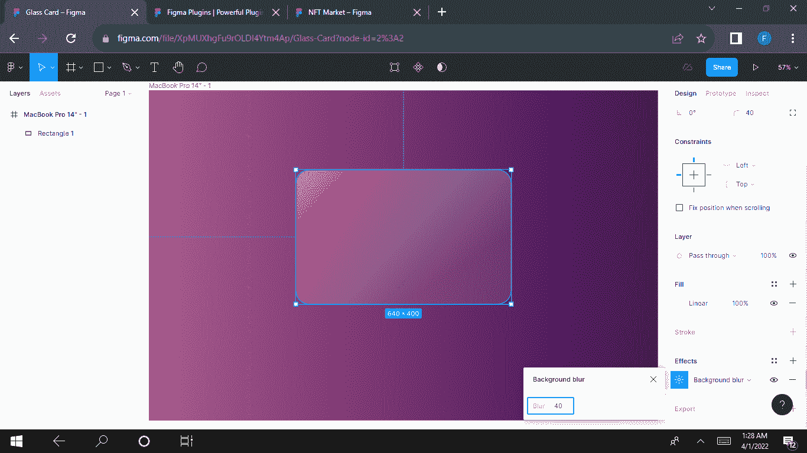

### ‌‌step 5–添加笔画以创建边框

添加边框会使您的卡片看起来更加精致优雅。它有助于通过更厚和更可区分的边界形成更鲜明的对比。

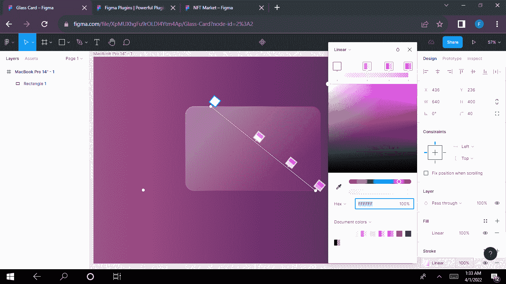

### ‌step 6-应用阴影

使用投影效果有助于加强视觉层次。

将模糊值设置为 24，扩散值设置为-1。

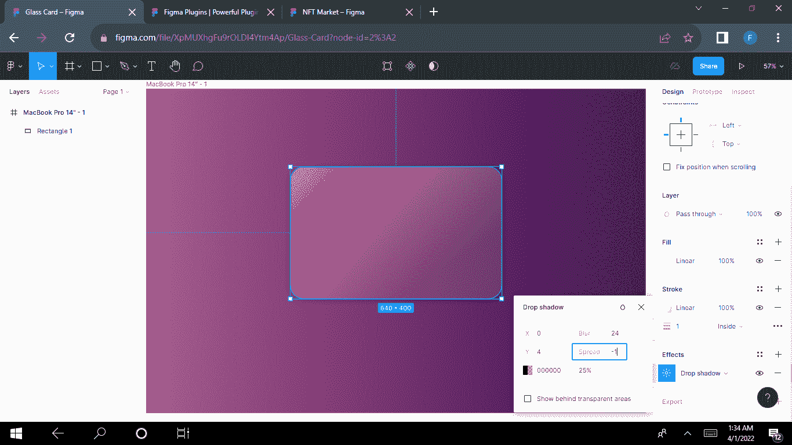

### ‌step 7–添加您的内容

现在，您可以向卡片添加内容，如文本、徽标等。像我一样使用图标化插件来获得你的 Visa 标志和 EMV 芯片将会节省你很多时间。

用白色填充你的内容，降低不透明度，设置图层的混合模式为**叠加**。

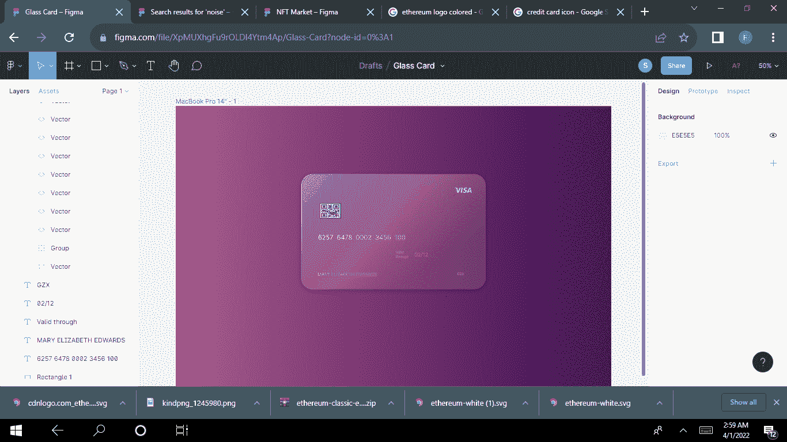

霜冻效果为您的设计增添了光彩。要应用这个效果，[只需使用噪声插件](https://www.figma.com/community/plugin/752558325552095625/Noise)给图像填充噪声。

如果你已经安装了插件，直接进入**插件**，点击 noise。如果没有，就去 https://www.figma.com/community/plugins[的](https://www.figma.com/community/plugins)安装插件。

一旦你安装并选择了插件，设置图层的混合模式为**叠加**并降低不透明度。

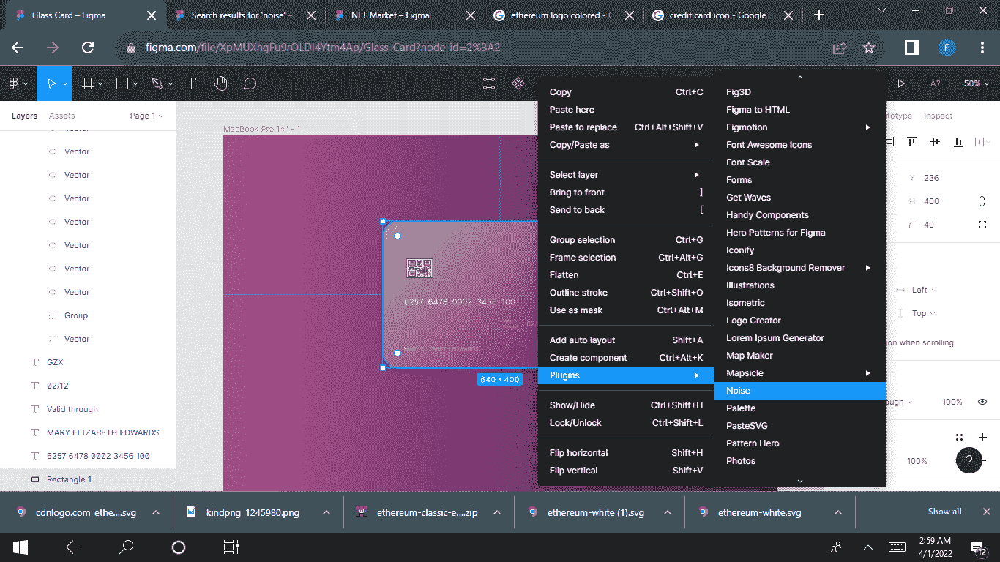

当您应用噪声插件时，该卡将如下所示:

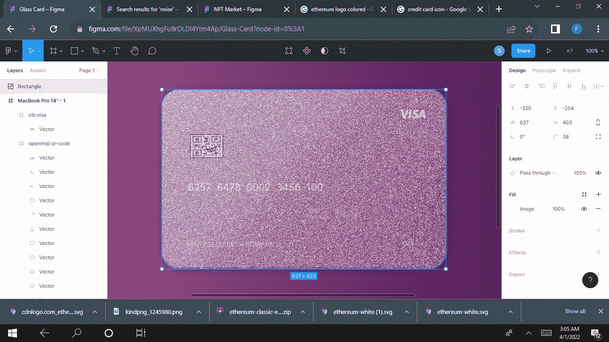

接下来，你改变混合模式为**叠加**。

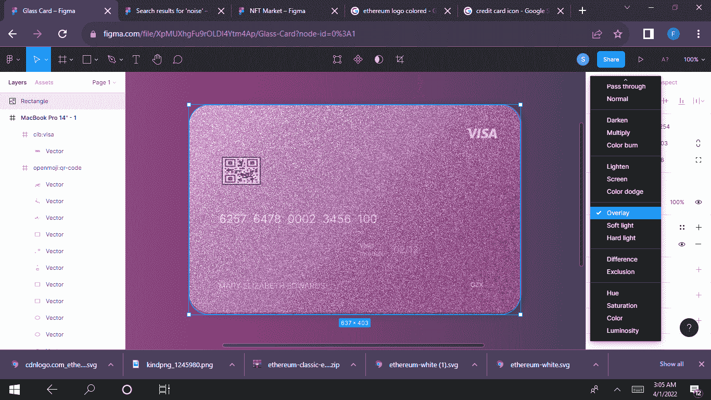

降低卡片的不透明度。摆弄不透明度，直到它适合你的口味。

你可以通过点击键盘上的任意数字来降低不透明度——2 代表 20%, 3 代表 30%, 4 代表 40%,依此类推。

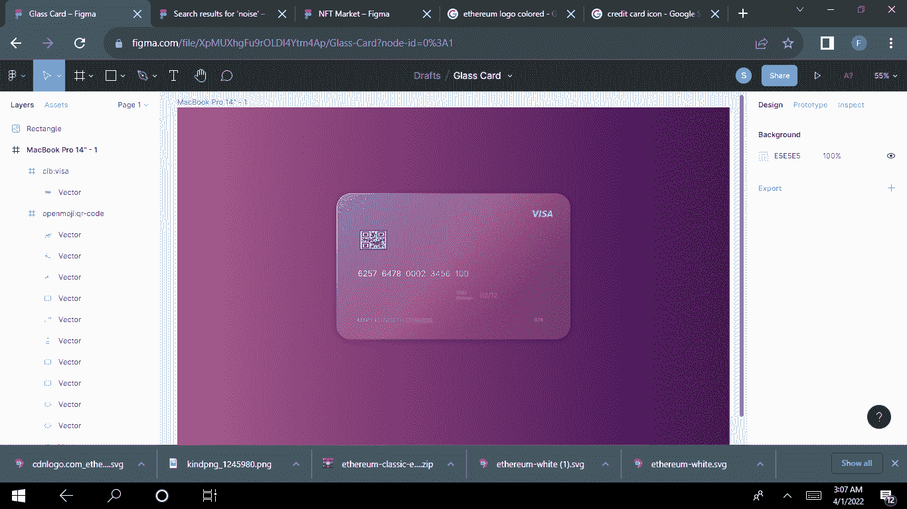

这就是你要的——一张漂亮的、看起来像玻璃一样的卡片。

## 结论

给你的设计添加玻璃效果非常简单。随着玻璃形态的趋势越来越受欢迎，知道如何创造玻璃设计可能真的会在未来派上用场。