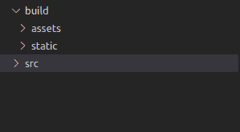
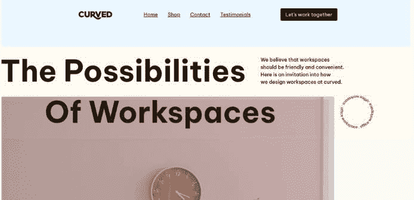
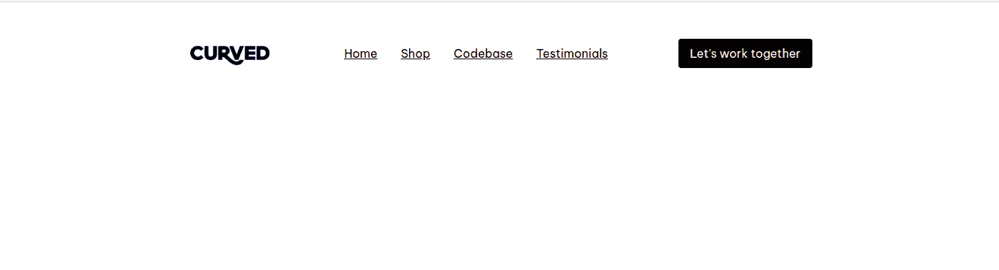
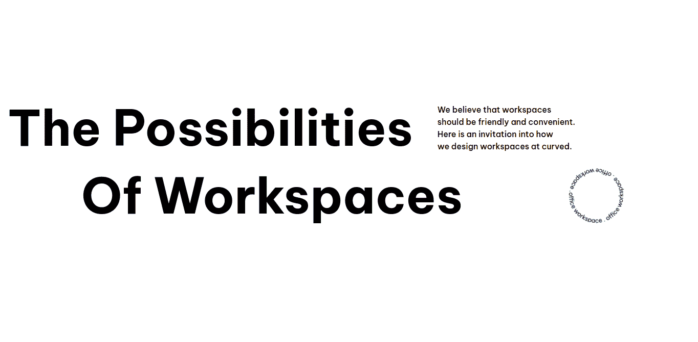
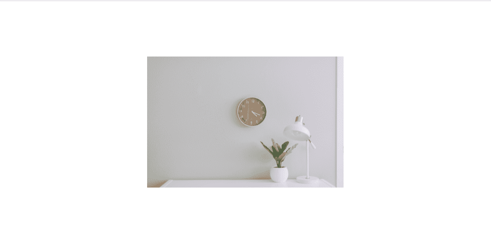

# 如何用 GSAP 和 TailwindCSS 构建动画登陆页面

> 原文：<https://www.freecodecamp.org/news/how-to-build-an-animated-landing-page-with-gsap-and-tailwindcss/>

动画是任何伟大网站的重要组成部分。为什么？做得好的话，动画可以极大地改善任何网站的用户体验，因为它们有助于使网站变得有趣和直观。

本文将向您展示如何借助名为 [GSAP](https://greensock.com/docs/v3) 的 JavaScript 库构建一个动画登陆页面。

GSAP 是一个非常棒的制作动画的工具包。到目前为止，它已经在大约 11，000，000 个网站上使用过，具有出色的性能，并为你处理浏览器的不一致性，以及其他[的伟大特性](https://greensock.com/why-gsap)。

你将要建立的登陆页面的灵感来自于这篇推特文章。这是你完成后的样子:

[https://player.vimeo.com/video/697946646?h=869caf3d56&app_id=122963](https://player.vimeo.com/video/697946646?h=869caf3d56&app_id=122963)

你可以点击这里查看现场演示。

## 目标受众

本文假设您是一名 web 开发人员，对 HTML、CSS 和 JavaScript 有基本的了解，并对 [TailwindCSS](https://tailwindcss.com/docs/installation) 、NPM 和终端的使用有所熟悉。

本文还假设您将使用 Linux 终端。如果您使用的是 Windows，请查看这篇文章,看看这篇文章使用的终端命令的 Windows cmd 等价物。

了解 GSAP 不是先决条件，因为本文提供了教程中使用的库的特性的介绍。请记住，这并不打算成为图书馆的完整指南。

## 文章概述

本文由以下几部分组成:

*   如何设置项目
*   编写标记
*   GSAP 简介
*   向页面添加动画
*   结论

## 如何设置项目

在您开始构建登录页面之前，您需要做一些准备工作。

在本节中，您将:

*   设置项目所在的目录。
*   设置 GSAP 和 TailwindCSS。
*   导入字体。
*   设置一个简单的开发服务器。

### 如何设置项目目录

首先在终端中运行以下命令:

```
mkdir gsap-landing
cd gsap-landing
mkdir build src
mkdir build/assets build/static
```

该代码应该创建一个如下所示的文件夹树:



directory structure for the project

### 如何设置 GSAP

要安装 GSAP，在 build 中创建一个名为`index.html`的文件，然后将以下代码放入其中:

```
<!DOCTYPE html>
<html lang="en">
<head>
    <meta charset="UTF-8">
    <meta http-equiv="X-UA-Compatible" content="IE=edge">
    <meta name="viewport" content="width=device-width, initial-scale=1.0">
	<script src="https://cdnjs.cloudflare.com/ajax/libs/gsap/3.10.2/gsap.min.js"></script>
    <title>Orfice</title>
</head>
<body>

</body>
</html>
```

这将创建一个基本的 HTML 文档，并通过头部的 script 标签导入 GSAP。

### 如何设置 TailwindCSS

要安装 TailwindCSS，请确保您位于项目的根目录中，然后在终端中运行以下命令:

```
npm install tailwindcss
npx tailwind init
```

这将在您的项目根目录下创建三个新文件:`package.json`、`package-lock.json`和`tailwind.config.js`。

接下来，在`src`文件夹中创建一个名为`input.css`的文件，并将以下代码放入其中:

```
@tailwind base;
@tailwind components;
@tailwind utilities;
```

回到项目根目录，用以下内容替换`tailwind.config.js`的内容:

```
module.exports = {
  content: [
  "./build/**/*.{html,js}"
  ],
  theme: {
    extend: {},
  },
  plugins: [],
} 
```

之后，打开您的`package.json`文件，并用以下内容替换其内容:

```
{
  "scripts": {
    "build-css": "npx tailwindcss -i ./src/input.css -o ./build/static/output.css --watch"
  },
  "dependencies": {
    "tailwindcss": "^3.0.23"
  }
} 
```

现在，打开您的终端并运行以下命令:

```
npm run build-css
```

该命令负责创建和更新文件:`build/static/output.css`，这是您的登录页面的样式所在的位置，因此您应该让它在自己的终端窗口中运行，直到您完成教程。

接下来，通过将以下代码添加到`build/index.html`，将 CSS 链接到您的登录页面，就在导入 GSAP 的脚本标签上方:

```
<link rel="stylesheet" href="static/output.css">
```

TailwindCSS 的设置到此结束。

### 如何导入字体

用以下内容替换`build/index.html`的头部:

```
<head>
	<meta charset="UTF-8">
	<meta http-equiv="X-UA-Compatible" content="IE=edge">
	<meta name="viewport" content="width=device-width, initial-scale=1.0">
	<link rel="preconnect" href="https://fonts.googleapis.com">
	<link rel="preconnect" href="https://fonts.gstatic.com" crossorigin>
	<link href="https://fonts.googleapis.com/css2?family=Be+Vietnam+Pro:wght@400;500;600;700&display=swap" rel="stylesheet">
	<link rel="stylesheet" href="static/output.css">
	<script src="https://cdnjs.cloudflare.com/ajax/libs/gsap/3.10.2/gsap.min.js"></script>
	<title>Orfice</title>
</head>
```

现在，将字体应用到你的 CSS 中。

打开`src/input.css`，在它的末尾添加以下代码:

```
 @layer base {
    body {
        @apply overflow-hidden h-screen;
        font-family: 'Be Vietnam Pro', sans-serif;
    }
}
```

### 如何设置服务器

要设置开发服务器，请打开一个新的终端窗口，导航到您的项目根目录，然后运行以下代码:

```
npm install --save-dev live-server
```

这就是你需要做的！要启动服务器，请在终端中运行以下命令:

```
live-server build
```

只要`live-server`命令还在运行，它就会在 [localhost:8080](localhost:8080) 为`build/index.html`服务，并且当你对项目进行修改时会自动刷新页面。

## 如何编写标记

看看动画结束时你的页面应该是什么样子:



structural outline of landing page

让我们称蓝色部分为导航栏，黄色部分为标题，图片为预加载器。

下一步是按照页面上显示的顺序构建每个部分。

### 如何构建导航栏

你的导航栏中需要一张图片，所以去[这个链接](https://raw.githubusercontent.com/Morgenstern2573/gsap-landing/master/build/assets/logo.jpg)下载吧。保存在`build/assets`中，名称为`logo.jpg`。

你的导航栏将分为三个部分:

*   左边的标志
*   一个`div`在中间
*   右边的一个按钮

打开`build/index.html`，将以下代码添加到 body 标签的顶部:

```
<nav>
    
    <div class="nav-links">
        <a href="#">Home</a>
        <a href="#">Shop</a>
        <a href="#">Contact</a>
        <a href="#">Testimonials</a>
    </div>
    <button class="cta">Let's work together</button>
</nav>
```

接下来，您将使用一些 CSS 在导航栏中添加间距和对齐方式。

打开`src/input.css`，在`@layer base`部分的末尾添加以下内容:

```
nav {
        @apply flex p-4 md:py-8 md:px-4 lg:p-12;
        @apply justify-center items-center gap-4;
    }
```

然后把这个加到文件的末尾，*在*之外，`@layer base`:

```
@layer components {
	nav > img {
        width: 120px;
    }

    nav a {
        @apply underline;
    }

    .cta {
        @apply rounded bg-black text-white py-2 px-4;
    }

    nav .cta {
        @apply hidden md:inline-block;
    }

    .nav-links {
        @apply hidden md:flex gap-4 lg:gap-8 lg:mx-16 xl:mx-20;
    }
}
```

完成后，您的页面应该如下所示:



navbar screenshot

现在你已经建立了导航条，现在隐藏它，这样你就可以在以后动画显示它。

回到`index.html`，给`nav`增加一个`opacity-0`类:

```
<body>
    <nav class="opacity-0">
		<!-- leave the rest of the code as it is -->
    </nav>
</body>
```

### 如何构建标题

您将通过构建三行来实现标题。

第一行由一些粗体、放大的文本和一段普通文本组成，当屏幕小于 768px(在移动设备上)时，您将隐藏这些文本。

第二行与第一行相似:一些粗体、放大的文本，向右移动，一个旋转的 SVG 代替了段落。SVG 也将隐藏在移动设备上。

第三行仅在移动设备上可见，包含一段文本和一个按钮。

将以下代码放在`build/index.html`中，在导航标签之后:

```
<header>
		<div class="row first-row">
            <p class="bold-text">
                The Possibilities
            </p>

            <p class="copy">
                <span>
                    We believe that workspaces
                </span>
                <span>
                    should be friendly and convenient.
                </span>
                <span>
                    Here is an invitation into our how
                </span>
                <span>
                    we design workspaces at curved.
                </span>
            </p>
		</div>

		<div class="row second-row">
			<p class="bold-text">
				Of Workspaces
			</p>

			<p class="round-text" >
				<svg  width="106" height="106" viewBox="0 0 106 106" fill="none">
					<path d="M0,53a53,53 0 1,0 106,0a53,53 0 1,0 -106,0" id="curve"></path>
					<text width="314.1593">
							<textPath alignment-baseline="top" xlink:href="#curve">
									office workspace . office workspace . office workspace .
							</textPath>
					</text>
					<defs>
					</defs>
				</svg>
			</p>
		</div>

		<div class="row mobile-row">
			<p class="copy">
				<span>
					We believe that workspaces
				</span>
				<span>
					should be friendly and convenient.
				</span>
				<span>
					Here is an invitation into our how
				</span>
				<span>
					we design workspaces at curved.
				</span>
			</p>

			<button class="cta">Let's work together</button>
		</div>
	</header>
```

现在结构已经就位，视觉效果的时间到了。

您将定义一个名为`animate-spin-slow`的自定义实用程序类，它将一个缓慢旋转的动画应用到它所使用的元素上。

用以下内容替换`tailwind.config.js`的内容:

```
module.exports = {
  content: [
    "./build/**/*.{html,js}"
  ],
  theme: {
    extend: {
      animation: {
        'spin-slow': 'spin 10s linear infinite',
      }
    },
  },
  plugins: [],
} 
```

接下来，您将为标题本身编写样式。

将以下代码放入`@layer components`内的`src/input.css`:

```
 .row {
        @apply flex p-4 justify-center md:justify-start;
        @apply items-center gap-4 md:gap-8;
        @apply lg:gap-12 text-center md:text-left;
    }

    .first-row {
        @apply md:pt-8 lg:pt-16;
    }

    .bold-text {
        @apply font-bold text-5xl lg:text-6xl xl:text-8xl;
    }

    .copy {
        @apply font-medium;
    }

    .second-row .bold-text {
        @apply lg:pl-16 xl:pl-36
    }

    .first-row .copy {
        @apply hidden md:flex md:flex-col;
    }

    .round-text {
        @apply hidden md:block pl-20 lg:pl-40;
    }

    .round-text svg{
        @apply animate-spin-slow;
    }

    .round-text textPath {
        @apply text-xs fill-black;
    }

    .mobile-row {
        @apply flex md:hidden flex-col py-4;
    } 
```

此时，您的页面应该如下所示:



header screenshot

你的导航条应该出现在页面上，但是看不见，这就是顶部空白的原因。

现在，隐藏每行中的所有块，给它们一个类`opacity-0`。编辑`index.html`如下所示:

```
<header>
		<div class="row first-row">
				<p class="bold-text opacity-0">
					<!-- leave as is -->
				</p>

				<p class="copy opacity-0">
					<!-- leave as is -->
				</p>
		</div>

		<div class="row second-row">
			<p class="bold-text opacity-0">
				<!-- leave as is -->
			</p>

			<p class="round-text opacity-0" >
				<!-- leave as is -->
			</p>
		</div>

		<div class="row mobile-row">
			<p class="copy opacity-0">
				<!-- leave as is -->
			</p>

			<button class="cta opacity-0"><!-- leave as is --></button>
		</div>
	</header>
```

你就完成了头球！

### 如何构建预加载程序

首先，从[这个链接](https://raw.githubusercontent.com/Morgenstern2573/gsap-landing/master/build/assets/office.jpg)下载图片。在`build/assets`中保存为`office.jpg`。

现在您已经有了图像，您将编写实际的标记。

预加载器将由一个包含图像的 div 和一个作为覆盖层的内部 div 组成。

将以下代码放入`index.html`中，在 header 标签之外:

```
<div class="pre-loader">
    
    <div class="overlay"></div>
</div>
```

现在，您要将预加载器放置在页面中间，并为覆盖图添加样式。

将以下代码放入`@layer components`内的`src/input.css`:

```
.pre-loader {
        @apply absolute z-10;
        width: 40vw;
        top: calc(50% - (0.668 * 20vw));
        left: calc(50% - 20vw);
    }

    .pre-loader > .overlay {
        @apply absolute inset-x-0 bottom-0;
        @apply top-full bg-black bg-opacity-10 -z-0;
    }
```

之后，你的网页应该是这样的:



preloader screenshot

## GSAP 简介

在这一部分，我们将快速浏览一下 GSAP 的一些特征。如果你已经有一些 GSAP 的经验，可以跳过这一步。

根据 GSAP 的文件:

> GSAP 是一个属性操纵器
> 
> 动画最终归结为每秒多次改变属性值，使一些东西看起来移动，褪色，旋转等。GSAP 捕捉到一个起始值和一个结束值，然后在它们之间每秒钟插值 60 次。
> 
> 例如，在 1 秒钟内将一个物体的`x`坐标从 0 改变到 1000，使其快速向右移动。从 1 到 0 逐渐改变`opacity`使得一个元素淡出。作为一名动画师，你的工作是决定改变哪些属性、改变的速度以及动作的风格。(来源:[什么是 GSAP](https://greensock.com/get-started/#what-is-gsap) ？)

解释一下:在其核心，GSAP 是一个库，允许你在一段时间内在两个设定点之间平滑地改变一个对象的任何属性。

GSAP 有很多功能，但我们将把重点放在你需要建立你的登陆页面。您将使用:

*   `gsap.to()`
*   `gsap.set()`
*   `gsap.fromTo()`
*   时间表

### gsap.to()方法

该方法告诉 GSAP 将目标从其当前状态动画化到指定的结束状态。

该方法有两个参数:

*   动画目标。它可以是原始对象、对象数组或包含 CSS 查询选择器(以 DOM 元素为目标)的字符串。
*   一个对象，列出了:你正在制作动画的属性，它们的最终值，以及影响动画本身的特殊属性(如设置持续时间或延迟)。

这里有一个例子:

```
gsap.to('#object', {top: '75%', duration: 2})
```

这段代码告诉 GSAP 将 id 为 object 的 DOM 元素的 top 属性的值更改为 75%，并使更改持续两秒钟。

### gsap.set()方法

这个方法的工作原理和`gsap.to()`几乎完全一样。它还将目标设置为给定的结束状态。

不同的是，`gsap.set()`创建一个持续时间为零秒的动画，立即将目标的属性设置为它们的给定值。

这里有一个例子:

```
gsap.set('#object', {top: '75%'})
```

这段代码一旦运行，`#object`的 top 属性就变成了 75%。

### gsap.fromTo()方法

`fromTo()`方法告诉 GSAP 从我们提供的开始状态到我们也提供的结束状态动画化目标对象。当该方法执行时，目标将立即设置为开始状态，然后动画显示为结束状态。

`fromTo()`方法接受三个参数:

*   目标参数。
*   一个对象，包含您希望目标在动画开始时具有的属性。
*   一个对象，包含您希望目标在动画结束时具有的属性。

所有控制动画本身的特殊属性只能放在最后一个参数中，即包含结束状态的对象。

这里有一个例子:

```
gsap.fromTo('#object', {top: '75%'}, {top: '33%', delay: 3})
```

### 时间表

GSAP 时间轴是一个特殊的对象，充当多个动画的容器。它的工作是使相关动画的排序更加容易。

时间线是这样工作的:你用`gsap.timeline()`创建一个时间线，然后用我们之前讨论过的方法给它添加动画。

时间线还允许你为时间线中的每个动画指定默认的特殊属性，通过将它们作为对象的属性传递给`gsap.timeline()`。

示例:

```
let timeLine = gsap.timeline({defaults: {duration: 1}})

timeLine.set('#object', {top: '75%'})
timeLine.to('#object', {top: '50%', delay: 0.5})
timeLine.fromTo('#object', {top: '60%'}, {top: '25%', delay: 0.5})
```

这就是你需要知道的关于 GSAP 的一切，以便理解本教程的其余部分。

## 如何添加动画

现在所有的标记都已就绪，终于到了添加动画的时候了。

首先在`build/static`中创建一个名为`script.js`的新文件。

这将包含你所有的动画 JavaScript。接下来，通过在结束 body 标签上方添加一个脚本标签到`index.html`来链接`script.js`到你的 HTML，就像这样:

```
<body>
	<!-- leave as is -->
    <script src="static/script.js"></script>
</body> 
```

首先你要激活的是你的预加载器。您将编写代码来慢慢增加覆盖图的高度，然后在向左下方移动时增加其宽度。

将以下内容添加到`static/script.js`:

```
const timeLine = gsap.timeline({defaults: {duration: 1}})

timeLine.to('.pre-loader > .overlay', {top: '75%'})
timeLine.to('.pre-loader > .overlay', {top: '50%', delay: 0.5})
timeLine.to('.pre-loader > .overlay', {top: '25%', delay: 0.5})
timeLine.to('.pre-loader > .overlay', {top: '0', delay: 0.5})
timeLine.to('.pre-loader', {width: '80vw', left:0, top: '50%'})
timeLine.set('.pre-loader', {'z-index': -20}) 
```

让我们花一点时间来破解这段代码。它做了几件事:

*   它为我们的动画创建了一个时间线，设置默认持续时间为 1 秒。
*   它使用`gsap.to()`通过调整`top`属性来增加覆盖图的高度。
*   它使用`gsap.to()`来增加预加载器的宽度，将其与屏幕的左边缘对齐，并增加宽度。
*   它使用`gsap.set()`立即将`z-index`设置为-20，所以它不会覆盖我们的任何文本。

接下来是导航条。你想要创造一种效果，看起来像导航条从屏幕上方滑入，同时逐渐变得可见。

通过将以下代码添加到`script.js`的末尾来实现:

```
timeLine.fromTo('nav', {y:-100}, {y:0, opacity:1})
```

该代码使用`gsap.fromTo()`在元素上设置一个`transalateY(-100px)`，然后将它动画到正常位置和完全不透明。

现在，您将一部分一部分地制作标题动画。

首先要做的是将第一行中的粗体文本动画化。你将在它上面实现完全相同的动画，但是它将从底部滑入，而不是顶部。

将此添加到`script.js`的末尾:

```
timeLine.fromTo('.first-row .bold-text', {y:100}, {y:0, opacity:1}, "<")
```

最后一个参数`<`，告诉 GSAP 在时间轴上的前一个动画开始的同时开始这个动画。由于两个动画具有相同的持续时间，这具有同时执行它们的效果。

接下来，以同样的方式激活第二行中的粗体文本，但是省略掉`<`参数，如下所示:

```
timeLine.fromTo('.second-row .bold-text', {y:100}, {y:0, opacity:1, delay:0.5})
```

标题的其余部分很有意思，因为接下来要动画显示哪些元素取决于该站点是否在移动设备上被查看。

如果站点在移动设备上，你想要激活的是第三行的元素。但如果不是这样，您可以激活第一行和第二行的剩余部分。

您将通过使用 [window.matchMedia()方法](https://developer.mozilla.org/en-US/docs/web/api/window/matchmedia)来解决这个问题。

它将媒体查询作为其参数，并允许您检查浏览器是否匹配该媒体查询。

将此代码添加到`script.js`的末尾:

```
const isMobile = !(window.matchMedia('(min-width: 768px)').matches)

if (isMobile) {
    timeLine.fromTo('.mobile-row .copy', {y:100}, {y:0, opacity:1, delay:0.5})
    timeLine.fromTo('.mobile-row .cta', {y:100}, {y:0, opacity:1, delay:0.5})
} else {
    timeLine.fromTo('.first-row .copy', {y:100}, {y:0, opacity:1, delay:0.5})
    timeLine.set('.round-text', {opacity:1, delay:0.5})
}
```

让我们走一遍。您刚刚添加的代码:

*   确定视口的宽度是否小于 768 像素。
*   如果是，代码会使移动行中的段落向上滑动，然后是按钮。
*   如果不是，它将使第一行中的段落向上滑动，然后使 SVG 可见。

这就完成了你的登陆页面！

## 结论

在这篇文章中，你学习了如何使用 GSAP 的基础知识来创建一些很酷的动画。如果你想了解更多关于 GSAP 的事情，以及你可以用它做的令人敬畏的事情，请访问[此链接](https://greensock.com/learning)。

你可以在这里找到完整的代码库。

如果你喜欢这篇文章，请在 Twitter 上关注我，当我写了一些新的东西时，你会知道的！