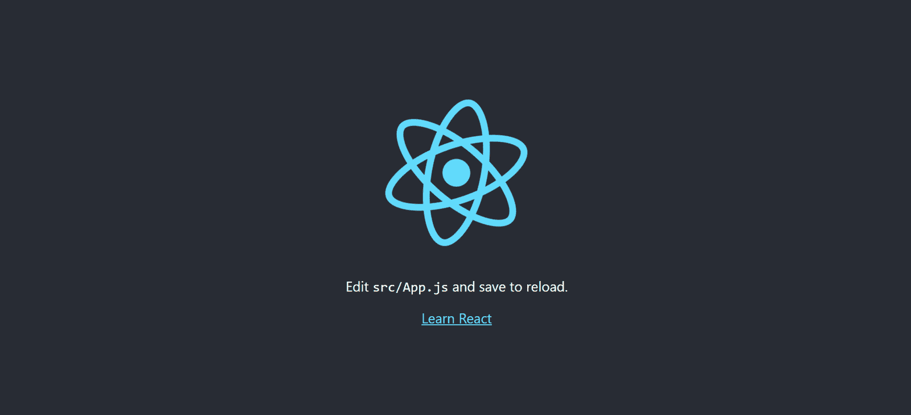
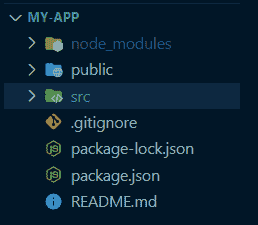
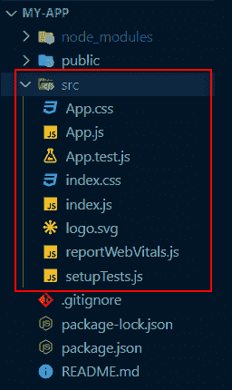
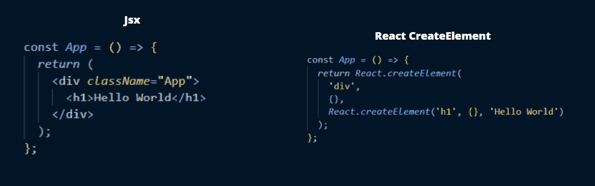

# React 入门指南

> 原文：<https://www.freecodecamp.org/news/get-started-with-react-for-beginners/>

React(也称为 React.js 或 ReactJS)是一个免费的开源前端 JavaScript 库，用于创建基于 UI 组件的用户界面。

React 由 Meta(以前的脸书)和一个由个人开发者和组织组成的社区共同维护。

根据 [2021 Stack Overflow 开发者调查](https://insights.stackoverflow.com/survey/2021#section-most-popular-technologies-web-frameworks)，React 以约 40.14%的市场份额超越 jQuery 成为最常用的 web 框架。它也是最受欢迎的，有四分之一的开发者使用它。React 还被 8000 多家行业领导者使用。

在本文中，我们将看到为什么您应该学习 React 以及如何开始使用它的原因。

## 为什么要学习 React？

您应该学习 React 的原因有很多，但这里是许多 React 专家强调的一些最常提到的要点:

### React 很容易使用

包括我自己在内的许多人都喜欢 React 的简单性、灵活性、性能、可用性、虚拟 DOM、组件和许多其他特性。

使用 React 简化了我们作为开发人员的生活，因为它的简单和模块化的基础设施允许我们更快地构建和维护我们的应用程序。

### 对 React 开发人员有很高的需求

在美国，React 开发人员的平均年薪是 12 万美元。许多企业和公司使用 React，这迫使他们每天都在寻找新的人才。

如果您对学习或成为 React 开发人员有任何保留，请重新考虑。没有必要担心——作为一名 React 开发人员，可能总会有一份工作适合你，因为现在有成千上万的空缺职位(甚至是远程的)。

### 学习 React 的基础知识并不难

这可以有不同的解释，因为作为一个完全的初学者学习 React 无疑比作为一个专家学习 JavaScript 需要更长的时间。但我的意思是，一旦你彻底理解了 JavaScript 的基础，React 并不难掌握。

React 还允许您在 React web 应用程序中重用简单的功能。

总的来说，React 学习起来相对简单，在 Github 上有一个支持许多开源项目的大型社区，并提供了许多工作机会。

学习 React 还将帮助你更好地理解 JavaScript，这将在你的职业生涯中派上用场。

因为 React 是一个 JavaScript 框架，所以理解某些 JavaScript 基础知识对于理解 React 非常重要。这里有一篇关于所有这些基本 JavaScript 概念和方法的详细文章，比如 map、filter 等等。这将有助于你学习反应更快。

## 如何安装 React

安装 React 或者创建 React 项目最好的方法就是用 [`create-react-app`](https://reactjs.org/docs/create-a-new-react-app.html#create-react-app) 安装。这是大多数初学者都很难完成的步骤之一，但是在本指南中，我们将讨论如何正确并成功地开始。

为此，我们将使用我们的终端(您可以使用内置终端或下载任何您喜欢的终端)。一个先决条件是在你的 PC 上安装 [Node.js](https://nodejs.org/en/download/) ，充分了解 NPM(或者 Yarn)是必需的。本指南将使用 NPM。

要确认您的 PC 上安装了 Node，只需启动您的终端/命令提示符并键入`node -v`和`npm -v`即可查看您安装的版本。

因为`create-react-app`要求你已经安装了 [NPX](https://github.com/npm/npm/releases/tag/v5.2.0) ，你需要确保你的节点版本不低于 v14.0.0，你的 NPM 版本不低于 v5.6

假设您有一个旧版本的 NPM，您可以使用以下命令来更新它:

```
npm update -g
```

一旦你理解了 NPM，你现在就可以用`create-react-app`安装 React 了。

如果你觉得使用终端很困难，你可以看看这篇关于如何为初学者使用命令行的文章。

### 什么是 Create-react-app？

虽然这个名字解释了它的作用，但你可能会开始想知道`create-react-app`到底是什么意思。

手动创建一个 React 应用程序既复杂又耗时，但是`create-react-app`通过自动完成所有的配置和软件包安装使之变得更加容易。

`create-react-app`是在 React 中开始构建新的[单页面应用程序](https://reactjs.org/docs/glossary.html#single-page-application)的最佳方式。

如果你有兴趣学习如何在没有`create-react-app`的情况下手动创建一个 React app，你可以查看[这个指南](https://dev.to/underscorecode/creating-your-react-project-from-scratch-without-create-react-app-the-complete-guide-4kbc)。

### 如何创建 React 应用程序

第一步是启动终端/命令提示符，导航到要保存 React 应用程序的文件夹，然后执行以下命令:

```
npx create-react-app my-app
```

**注意:** `my-app`是我们正在创建的应用程序的名称，但是您可以将其更改为您选择的任何名称。

安装过程可能需要几分钟时间。完成后，您应该会看到一个文件夹出现在您的工作空间中，其名称与您为应用程序指定的名称相同。恭喜你！

### 如何运行 React 应用程序

现在，回到终端，您需要做的第一件事是使用`cd my-app`导航到安装应用程序的目录。然后最后运行`npm start`在 localhost:3000 上看你的 app 直播。

您应该会看到类似这样的内容:



## 目录结构

我们刚刚完成了这篇文章的第一部分。现在让我们弄清楚 React 应用程序中每个文件和文件夹的含义和作用。无论是初学者还是有经验的 React 开发人员，这都是至关重要的。

打开新创建的 React 应用程序时，其目录结构如下所示:



现在，让我们从解释这些文件夹及其含义开始:

### 节点模块文件夹

文件夹`node_modules`包含了我们所有的依赖项，当我们设置源代码控制时，这个文件夹被忽略。但是需要注意的是，`package.json`文件与`node_modules`文件夹协同工作，因为它包含所有依赖关系的信息以及一些脚本命令。

如果您删除了`node_modules`文件夹，应用程序将会中断，因为您将不再拥有依赖关系。

要重新安装这些依赖项，您可以使用`npm install`–这将检查`pakage.json`文件中的依赖项列表，然后安装所有依赖项。这将使你可以很容易地在线发布你的代码或者与他人分享你的代码，而不必分享沉重的`node_modules`文件夹。

**注:**这不仅仅是针对`create-react-app`。

### 公共文件夹

虽然大部分工作将在`src`文件夹中完成，但是公共文件夹包含一些静态文件，比如 HTML 文件。例如，你可以改变你的网络应用程序的标题，添加 cdn，比如谷歌字体，等等。

**注意:**不要害怕这个文件，因为它只是一个普通的 HTML 文件。唯一需要记住的代码是带有`id` `root`的`div`，整个 React 应用程序将被放置在这里。

```
<div id="root"></div>
```

### 。gitignore 文件

顾名思义，它是一个指定我们的源代码控制将忽略哪些文件和文件夹的文件。

当您打开文件时，您将看到被忽略的文件列表，包括`node_modules`和构建文件夹。您可以决定添加一些特定的文件或文件夹。

### 构建文件夹

build 文件夹是另一个您现在看不到的文件夹，但是在您构建项目时会看到。

这将创建一个静态资产的生产就绪文件夹，可以在 Netlify 这样的平台上使用拖放选项来托管或部署这些资产。

### src 文件夹

到目前为止，我们已经讨论了一些基本的文件夹，但是我们主要关注的是`src`文件夹，这是开发发生的地方。下面是`src`文件夹的样子:



让我们从基本文件开始:`App.js`、`index.js`、`index.css`和`App.css`(现在可以删除所有其他文件)。

### App.js

这是所有组件最终相遇的地方。文件名并不重要，但是保持这个名称是一个好习惯，这样其他开发人员就可以理解您的代码。

### 索引. js

这是您的应用程序的起点。更具体地说，这是您从`index.html`文件中定位`root` `id`并呈现`App.js`文件的地方，这是您的整个文件(组件和页面)相遇的地方。

```
import React from 'react';
import ReactDOM from 'react-dom';
import App from './App';

ReactDOM.render(
  <React.StrictMode>
    <App />
  </React.StrictMode>,
  document.getElementById('root')
);
```

### App.css 和 index.css

这两者都包含应用程序的样式。`index.css`文件包含全局样式,`App.css`文件几乎和`App.js`文件一样工作——但是我们是否使用 CSS 文件完全取决于我们自己。在开始的时候，我们可以选择删除一个，只使用一个 CSS 文件。

## 了解 JSX

JSX 是 React 中使用的 JavaScript 扩展语法，可以轻松地将 HTML 和 JavaScript 编写在一起。

在 React 中编写代码需要很长时间，因为您每次都必须使用`React.createElement`函数，即使您只是添加一个简单的`div`。



上图描绘了用 JSX 和`React.createElement`写的完全相同的代码。通过比较两者，您可以知道哪一个更容易编写、理解和管理。

[`create-react-app`](https://github.com/facebook/create-react-app) 内部使用 babel 进行 JSX 到 JavaScript 的转换，不用担心用 Webpack 配置自己的 Babel 配置。

### JSX 的一些禁忌

确保您了解这些重要的细节，这样一些错误就不会妨碍您:

*   您的标记通常放在 return 语句之后，或者作为单行代码，或者作为块代码。
*   所有的代码都应该包装在一个标签中。这可能是一个`div`，一个没有内容的标签(< >，或者任何其他标签。

```
const App = () => {
  return (
      <h1>JSX Title</h1>
      <p>This is first JSX Element!</p>
      <p>This is another JSX Element</p>
  );
};
```

这对于普通的标记来说很好，但是会导致严重的错误，因为 React 要求相邻的元素被包装在父标记中。这仅仅意味着，要运行这段代码，它必须包装在父标记中，比如 div、section、article 等等。

```
const App = () => {
  return (
    <div>
      <h1>JSX Title</h1>
      <p>This is first JSX Element!</p>
      <p>This is another JSX Element</p>
    </div>
  );
};
```

您也可以利用`React.Fragment`组件。

### 如何给 JSX 代码添加注释

作为一名开发人员，总是在代码中添加注释已经成为标准做法，JSX 也不例外。您可以使用快捷命令(Cmd + / (Mac)或 Ctrl + /快捷键来添加或删除特定注释)。

注意:我们可以对 JSX 做任何事情。你可以阅读[这篇文章](https://reactjs.org/docs/jsx-in-depth.html)来了解更多关于 JSX 是如何运作的。

总之，JSX 只是为`React.createElement (component, props, ...children)`函数提供了语法上的好处。

## 接下来呢？

既然您已经知道如何开始使用 React，下一步就是正确地学习它，理解它的功能，等等。

现在，有很多很好的资源可以用来学习 React，数量如此之多，以至于很难确定哪些是最新的、有用的。

不要试图一次上几门课，最好的办法是找到一个有用的教程并完成它。查看 freeCodeCamp 的[**2022 年免费 React 课程**](https://www.freecodecamp.org/news/free-react-course-2022/) 或[**Learn React -初学者完整课程**](https://www.freecodecamp.org/news/learn-react-course/) **。**

## 结论

到目前为止，在本文中，您已经学习了 React 是什么，为什么您应该学习 React，如何在您的机器上安装它。您还了解了目录结构中每个文件的作用。

从这一点来说，关于 React 还有很多东西要学，我祝你好运，继续你的学业。如果你喜欢这篇文章，你可以通过[给我买杯咖啡](https://www.buymeacoffee.com/tobestjoel)或者[在 Twitter 上关注我](https://twitter.com/olawanle_joel)来支持我。

感谢阅读！