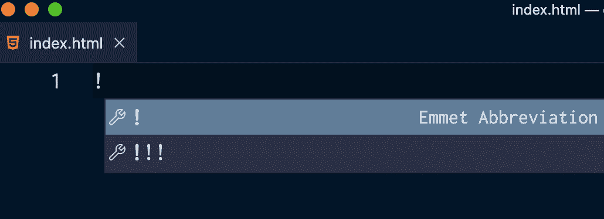

# 什么是 HTML？HTML 代表什么？[已解决]

> 原文：<https://www.freecodecamp.org/news/what-is-html-what-does-html-stand-for-solved/>

HTML 是你开始 web 开发时可以学习的基本技术之一。HTML 代码存在于每一个在线网页中。

一旦你很好地掌握了这门语言的基本概念，你就能很好地继续学习几乎所有网站都有的另外两种技术——CSS 和 JavaScript。

在本文中，您将学习 HTML 的基础知识。

你将从学习缩写代表什么开始。然后，你会明白它的目的，通过回顾这种语言多年来的发展简史。

您还将了解一些最常用的标签和一些可遵循的最佳现代实践。

以下是我们将在本文中涉及的内容:

1.  [HTML 初学者入门](#intro)
    1.  [HTML 简史](#history)
2.  [HTML 语法概述](#syntax)
    1.  [如何创建 HTML5 样板文件](#boilerplate)
3.  [HTML 元素概述](#elements)
    *   [创建代码注释](#comments)
    *   [创建标题](#headings)
    *   [创建列表](#lists)
    *   [创建段落](#paragraphs)
    *   [创建链接](#links)
    *   [创建容器](#container)
    *   [创建图像](#images)
4.  [什么是语义 HTML，为什么它很重要](#semantic)

## HTML 代表什么，有什么用途？HTML 简介

任何类型的文档，无论是印刷的还是数字的，都需要结构化。

这种结构允许用户以一种不混乱的方式轻松地浏览文档。

在大多数文档的顶部，通常有一个大标题。

这个顶级标题传达了页面的总体信息，解释了内容的全部内容，并为接下来的内容定下了基调。

接下来，是一些介绍性的文字和更小的标题。

不同级别的标题为信息创建了一个层次结构。

每个标题后面通常会有几段文字。

就 web 文档而言，图像、视频和超链接(或链接)伴随着文本内容。这些链接帮助用户导航到页面中的不同部分或完全不同的网页。这些因素给文件带来了更多的活力。

还可以有供用户输入数据的表单、打勾的复选框，甚至是从一组项目中选择一个选项的单选按钮。

要创建结构、格式化内容并在 web 浏览器中显示，您需要使用 HTML。

HTML 是**超文本标记语言**的简称，是万维网的语言。

自创建以来，它经历了许多修订、变更和发展。

在下一节中，您将看到 HTML 是如何出现的，以及它经历的变化，直到它发展成为最新的标准化版本 HTML5，也就是我们今天使用的版本。

### HTML 简史

1989 年，一位名叫蒂姆·伯纳斯·李爵士的英国科学家在瑞士日内瓦的欧洲核子研究中心(欧洲核子研究委员会)工作。

作为一名研究人员，他想创造一个互联的分布式系统。有了这样一个系统，共享和组织信息就能以更快的速度、更轻松和更方便的方式实现。

来自世界各地的科学家和学者将能够相互交流资源和研究成果。

目标是从一个参考文档点击到另一个参考文档，并允许用户通过提供这些链接轻松地从一个页面导航到另一个页面。

从这个想法，万维网诞生了。

1990 年，他开发了 HTTP(超文本传输协议的首字母缩写)，这是一种定义资源如何交换和传输的通信协议。

他还开发了 HTML、服务器和浏览器。


[Image from CERN PhotoLab](http://cds.cern.ch/record/39437#31)

SGML(标准通用标记语言的缩写)已经存在，并且是 HTML 的基础。但这要简单得多。

Berners-Lee 没有从零开始创建 HTML，而是采用了 SGML 中某些预先建立的概念。

合并到 HTML 中的 SGML 的一个这样的特性是结构元素——也称为**标签**。

SGML 中的标签是成对的(有一个开始标签和一个结束标签)。

另一个被采用的特性是标签的尖括号符号。

Tim Berners Lee 爵士包含了 SGML 中已经存在的一些标签对。例如，他加入了标题标签(`<h1>`、`</h1>`)和段落标签(`<p>`、`</p>`)，并加入了自己的超文本参考标签(`<a>`、`</a>`)。

1991 年，他发布了 HTML 的第一个提案。

然而，HTML 的第一个官方版本是 HTML 2.0，由 IETF(互联网工程任务组的缩写)开发，并加入了许多附加功能。

其中一个特别之处是使用``标签在文档中嵌入图像的能力。

当时领先的浏览器 Mosaic 最初就包含了这种能力，IETF 将其作为标准。

那段时间，所谓的浏览器大战如火如荼。

浏览器公司，如网景通信公司，其浏览器名称为网景导航器，操纵 HTML 并创建了特定于浏览器的 HTML 标记的专有版本。

其他浏览器试图复制它们，但没有成功——网页在一个浏览器上看起来不错，但在另一个浏览器上不可用。

W3C(万维网联盟的缩写)成立，负责创建急需的标准。

W3C 接手了进一步开发 HTML 的任务。

在 90 年代剩下的时间里，HTML 的不同版本相继发布，如 HTML 3.0 和 HTML 3.2。

W3C 推荐的后续标准是 HTML 4，它专注于国际化。

文件现在可以用世界上任何一种语言书写，而不仅仅是英语。

1999 年，随着 HTML 4.01 的发布，HTML 有了更多的更新。

随着 HTML 4.01 的发布，HTML 的发展发生了转折，朝着不同的方向发展。

W3C 创建了 XHTML 1.0，它是 HTML 的一个分支，结合了 XML(可扩展标记语言的缩写)。这一次，有了更严格的编码规则，代码可以在浏览器中工作的自由度也更小了。

XHTML 1.0 的下一个版本 XHTML 1.1 更像 XML，以至于当时最流行的浏览器 Internet Explorer 不支持文档。

W3C 的重点是 XML，所以他们开始着手创建 XHTML 2.0。但毫无进展，他们意识到自己走的路不对。W3C 放弃了这个项目。

当 W3C 致力于开发 XHTML 2.0 时，另一个名为 WHATWG(Web 超文本应用技术工作组的缩写)的工作组成立了。

WHATWG 由来自不同公司的代表组成，如 Mozilla 和苹果，他们正在开发一个新的面向网络应用的 HTML 版本。

2006 年，Tim Berners Lee 爵士宣布了 W3C 和 WHATWG 这两个组织的合作，共同开发新版本的 HTML - HTML5。

HTML5 是至今仍在使用的 HTML 的标准推荐版本。

## HTML 语法概述

让我们仔细看看 HTML，特别是 HTML 标签，并发现基本语法。

正如您在上一节中看到的，标记是从 SGML 继承的语法结构。

以下面的 HTML 代码为例:

```
<a> freeCodeCamp </a> 
```

让我们来分解一下:

*   有*两种*标记。一个**开始**标签(`<a>`)和一个**结束**标签(`</a>`)
*   标签由一个左尖括号、一个右尖括号和它们之间的一个字符组成。
*   结束标签在左尖括号后和字符前有一个正斜杠(`/`)。
*   标签中的字符让我们知道更多关于标签之间的内容。在这种情况下，代表`anchor`的字符`a`表示这是一个到网络上一个名为`freeCodeCamp`的地方的链接。
*   在开始和结束标记之间，有一些内容——在本例中是文本`freeCodeCamp`。
*   总之，**开始标签、内容和结束标签**组成了一个 HTML **元素**。

值得一提的是，在上面的例子中，您看到了一个由开始和结束标记组成的元素。

也就是说，有些元素只包含一个**自结束**标签，比如``标签。在这种情况下，正斜杠(如``)完全是可选的。

在上面的例子中，HTML 元素有问题。

它应该指向一个资源，因此有了字符`a`，但是没有任何链接资源可用的迹象。

为此，您需要使用 HTML **属性**。属性提供了关于元素的附加信息。

因此，让我们更正代码:

```
<a href="https://www.freecodecamp.org/"> freeCodeCamp </a> 
```

现在，让我们来分解一下:

*   `href="https://www.freecodecamp.org/"`是伴随元素的属性。大多数时候，特定元素接受并与某些属性配对。
*   属性只放在右尖括号前的开始标签上的*。注意字符后面的空格。*
*   属性由**名称**和**值对**组成。有了`href="https://www.freecodecamp.org/"`，`name`就是`href`，`value`就是`https://www.freecodecamp.org/`。
*   名称和值对由赋值操作符`=`分隔。
*   该值总是用双引号`""`括起来。

现在你已经学习了 HTML 元素的基础知识，你如何为你的项目建立一个 HTML 文档呢？

在下一节中，您将学习如何创建 HTML5 样板文件。样板文件是所有 HTML 项目的一种公式。

### 如何创建 HTML5 样板文件

当建立新的 HTML 项目时，你会发现每次都必须包含相同的几个元素。

这些元素是必不可少的，您将需要它们来使您的 HTML 站点按照最佳实践和标准正常运行。

一些代码编辑器提供快捷方式来自动填充和输入每个新 HTML 项目中使用的元素，这可以节省您大量的时间。

这也称为 HTML 样板文件。

样板文件是每个新 HTML 文档都需要的基本框架和基本结构。

要创建样板文件，请执行以下步骤:

*   首先，确保安装了 [Visual Studio 代码](https://code.visualstudio.com/download)编辑器。
*   创建一个扩展名为`.html`的文件。包含 HTML 代码的文件应以此扩展名结尾。
*   在空文件中，键入感叹号`!`。



点击回车键，或点击感叹号，表示下面是一个 Emmet 缩写。Emmet 是一个默认内置于 Visual Studio 代码中的代码编辑器插件，它可以帮助您优化 HTML 工作流。

然后，您将看到以下代码:

```
<!DOCTYPE html>
<html lang="en">
	<head>
	    <meta charset="UTF-8">
	    <meta http-equiv="X-UA-Compatible" content="IE=edge">
	    <meta name="viewport" content="width=device-width, initial-scale=1.0">
	    <title>Document</title>
	</head>

	<body>

	</body>
</html> 
```

让我们来分解一下:

*   `<!DOCTYPE html>`是需要出现在所有现代 HTML 文档顶部的第一行代码。您可能会注意到，它的颜色与代码的其余部分不同。这是因为它不是 HTML 元素，而是一个*文档类型声明*。它让浏览器知道预期的文档。它还指导他们正在使用的 HTML 版本。在这种情况下，该声明通知浏览器文档包含 HTML5 代码。
*   元素是每个 HTML 文档中的第一个元素，被认为是根元素。开始的`<html>`表示所有 HTML 代码的开始，结束的`</html>`表示所有 HTML 代码的结束。`lang`属性表示文档的语言。在`html`内部总是有两个元素嵌套在*中:元素`head`和`body`。*
*   `<head>`元素包含元数据和配置。元数据是关于页面的信息。这些信息对用户隐藏，在浏览器中不可见。唯一可见的信息是`title`元素中的内容，也就是页面的标题。标题出现在浏览器窗口顶部的浏览器选项卡上。
*   元素包含了浏览器窗口中所有可见的内容。这里是您为项目添加 HTML 代码的地方。

## 基本 HTML 元素概述

### 如何创建代码注释

注释有助于阐明代码及其背后的逻辑。把它们当成你未来自己或同事的笔记。

这是创建注释的语法:

```
<!-- I am a comment --> 
```

在`<!--`和`-->`之间的任何内容都不会出现在您的网页上，因为它会被浏览器忽略。

### 如何创建标题

HTML 中有六个级别的标题:

```
<h1>Level 1</h1>
<h2>Level 2</h2>
<h3>Level 3</h3>
<h4>Level 4</h4>
<h5>Level 5</h5>
<h6>Level 6</h6> 
```

随着标签中包含的数字增加，显著性水平降低。一个`<h1>`标题比一个`<h6>`标题更有意义。

### 如何创建列表

HTML 中有两种类型的列表:

```
<!-- unordered (or bulleted) list -->
<ul>
    <li> An item </li>
    <li> Another item </li>
</ul>

<!-- ordered (or numbered) list -->
<ol>
    <li> Item 1 </li>
    <li> Item 2 </li>
</ol> 
```

注意，在无序列表和有序列表中，创建列表项的方法是使用`<li>`元素。

### 如何创建段落

要创建一个文本块，使用`<p>`元素:

```
<p> I am a paragraph </p> 
```

### 如何创建链接

您在上一节中看到了`<a>`元素。

```
<a href="https://www.freecodecamp.org/"> freeCodeCamp </a> 
```

通常在开始和结束标签之间的文本下面会有一条下划线。当您悬停在光标上时，光标也会发生变化。此文本表示链接的页面和/或资源。

属性是目的地，因为它包含链接的地址。

另一件要记住的事情是，你可以将某些元素嵌套在其他元素中。

例如，你可以在一个段落中添加创建一个链接，就像这样:

```
<p>Learn to code for free with <a href="https://www.freecodecamp.org/"> freeCodeCamp </a>!</p> 
```

确保首先关闭嵌套标签。例如，注意不要犯这种初学者常见的错误:

```
<!-- don't do this! -->

<p>Learn to code for free with <a href="https://www.freecodecamp.org/"> freeCodeCamp </p>!</a> 
```

您还可以链接到同一页面中的不同部分。

首先，您需要将`id`属性包含到您想要链接的部分中，并为其赋值。

假设您想要链接到一个段落:

```
<p id="resource"> I have some content worth reading and linking to. I am in another part of the page! </p> 
```

当您创建一个链接时(与您之前看到的方式相同)，在分配给`id`属性的值前面包括井号(`#`):

```
<a href="#resource">Read more about the topic on this different part of the same page</a> 
```

### 如何创建容器

元素创建一个通用容器来保存一些内容。

它通常与 CSS 一起使用，以实现页面上的不同布局。

```
<div></div> 
```

### 如何创建图像

要创建图像，请使用``元素。您在前面的章节中已经看到了这个元素。提醒一下，这是一个自结束元素。

使用`src`属性和`alt`属性，前者指定图像源(可以是 URL，也可以是图像的路径)。`alt`属性是当图像由于某种原因无法加载时显示的文本。

出于可访问性的目的，始终包含一个`alt`属性也很重要，因为屏幕阅读器会向有视觉障碍的用户大声朗读内容。

```
 
```

### 如何创建表单

几乎每个网页都需要表单。这是用户提交信息的方式，也是你收集数据的方式。

使用`<form>`元素创建一个表单:

```
<form></form> 
```

也就是说，在创建表单时会涉及到很多属性。

阅读以下资源，开始使用 HTML 表单:

*   [您的第一张表单- MDN 文档](https://developer.mozilla.org/en-US/docs/Learn/Forms/Your_first_form)
*   【HTML 表单入门分步指南
*   [HTML 中的文本框–输入字段 HTML 标签](https://www.freecodecamp.org/news/text-box-in-html-the-input-field-html-tag/)

## 什么是语义 HTML，为什么它很重要

语义 HTML 是 HTML5 最重要的特性之一。

单词 *semantic* 指的是描述其内容的 HTML 元素，而不仅仅是没有意义的通用容器。

您可以使用语义 HTML5 元素，而不是使用一般的、没有语义意义的空容器来存储内容。

语义 HTML 也是为网站创建一个更好的结构。

例如，您可以将`<header>`元素用于位于页面顶部的信息。在这里，您可以为页面添加一个徽标和一个顶级标题。在`<header>`中，您可以嵌套另一个语义元素`<nav>`，创建一个链接到不同页面的导航栏。

对于页面的主要内容，可以使用`<main>`元素。

您可以在页面底部的`<footer>`元素中存储信息。这通常包括网站地图、社交媒体链接、用户常见问题的答案或联系信息。

语义 HTML 不关注内容*看起来如何*。

例如，有两个 HTML 元素，`<b>`和`i`，分别用于制作文本`bold`和`italic`。

然而，这些元素关注的是表示和内容如何显示——这应该是 CSS(层叠样式表)的作用，而不是 HTML。

使用`<strong>`表示一段文字非常重要。浏览器会将文本显示为粗体。

并使用`<em>`表示文本需要强调。浏览器会将文本显示为斜体。

这些元素并不关注文本的外观，而是提供关于它们所包含的文本类型的更多信息。

到目前为止，您已经看到，所有提到的元素都提供了关于标记和它们包含的内容类型的信息，从而创建了更有意义的页面和更好的结构。

为什么要写语义 HTML？有几个原因:

*   它提高了可访问性。在设计和开发网站时，你需要记住你是在为所有人创建网站。有视觉障碍的人依靠辅助技术(如屏幕阅读器)大声朗读内容。患有其他残疾的人可能会依赖纯键盘导航。因此，学习编写可访问的 HTML 将引导你创建更多用户友好的网页。
*   它改善了 SEO(搜索引擎优化)。使用正确描述内容的元素将有助于您的网站在谷歌搜索中排名更高，因为您网站的目的将更加清晰。搜索引擎将帮助您的网站接触到正在搜索特定内容的目标受众。

要了解关于语义 HTML 的更多信息，请查阅以下资源:

*   [语义 HTML 指南——使用 div 的 10 种选择](https://www.freecodecamp.org/news/semantic-html-alternatives-to-using-divs/)
*   [语义 HTML5 元素解释](https://www.freecodecamp.org/news/semantic-html5-elements/)

## 结论

这标志着我们对 HTML 的介绍到此结束。我希望这个概述对您有所帮助。

开始学习 HTML(和 CSS！)是拥有 freeCodeCamp 的[响应式网页设计认证](https://www.freecodecamp.org/learn/2022/responsive-web-design/)。

这是一个免费的、结构化的、经过深思熟虑的互动课程。你通过 20 个建筑项目以实用的方式学习。您将学习 HTML 和现代 CSS 技术以及最佳可访问性实践。

感谢您的阅读！