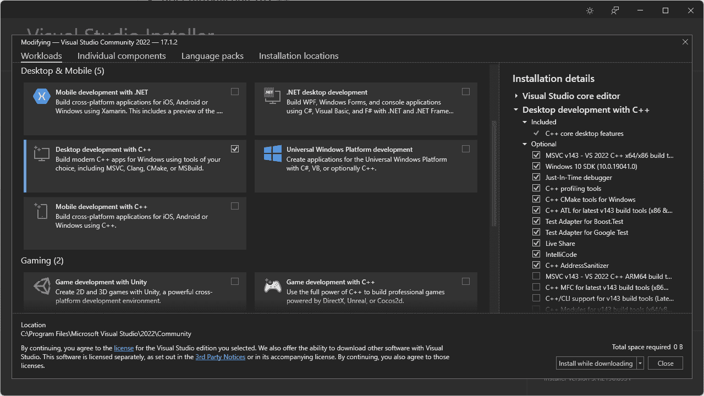
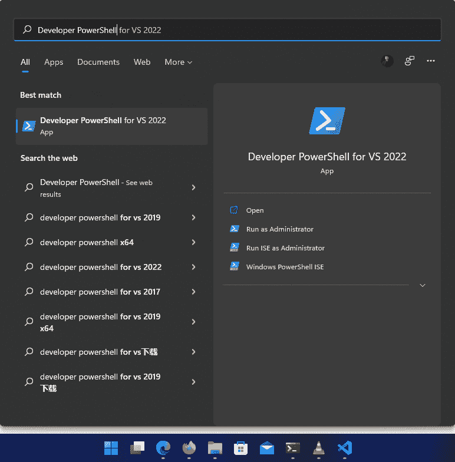

# 如何学习 C++编程语言

> 原文：<https://www.freecodecamp.org/news/how-to-learn-the-c-programming-language/>

在计算机编程的早期，程序员必须用汇编语言一个接一个地编写单独的指令。

后来，像 FORTRAN 和 COBOL 这样的编程语言被创造出来。这些语言的问题在于它们是针对特定人群的——FORTRAN 是针对工程师和科学家的，COBOL 是针对商务人士的。

然后在 60 年代，一种叫做 Simula 的新语言出现了，它引入了类的概念，这让任何人都可以为他们的特殊领域制作软件。

之后，在 80 年代，比雅尼·斯特劳斯特鲁普想出了将 Simula 的一般抽象与 C 语言的低级功能相结合的想法，C 语言在当时是最适合这项工作的语言。

因此，“带类的 C”诞生了，后来被称为 C++编程语言。

C++编程语言是一种静态类型、编译、多范例、通用编程语言，以其陡峭的学习曲线而闻名。它广泛应用于视频游戏、桌面软件和嵌入式系统开发。

C++有点复杂，而且非常强大——老实说，如果你正确规划了学习路线图，C++并不像许多人希望你相信的那样糟糕。

在本文中，我将首先向您展示 C++编程语言的基础知识。

如果你以前编程过，这个介绍对你来说应该很简单。但是如果你正在学习 C++作为你的第一门编程语言，你可能会发现它很有挑战性，因为你必须理解大量的概念。

一旦我完成了介绍，我会给你一个高质量学习资源的列表，以及如何充分利用它们的建议。

所以事不宜迟，让我们开始吧。

## 目录

*   [c++的高级概述](#high-level-overview-of-c-)
    *   [你好世界](#hello-world)
    *   [理解一个 C++程序](#understanding-a-c-program)
    *   [常见数据类型和数组](#common-data-types-and-arrays)
    *   [流量控制](#flow-control)
    *   [功能](#functions)
*   [C++学习资源](#c-learning-resources)
    *   [31 小时学会 c++](#learn-c-in-31-hours)
    *   [4 小时学会 c++](#learn-c-in-4-hours)
    *   [c++中的面向对象编程](#object-oriented-programming-oop-in-c-)
    *   [OpenGL 速成班](#opengl-crash-course)
    *   [虚幻引擎 5 小时后](#unreal-engine-in-5-hours)
*   [结论](#conclusion)

## C++的高级概述

在进入学习路线图和资源部分之前，我想向您介绍一下 C++编程语言本身。这样，一旦你开始钻研下面提到的资源，你就不会感到不知所措。

请记住，本节假设您有使用 Python 或 JavaScript 等其他编程语言的经验。

### 你好世界

正如我已经提到的，C++是一种静态类型的、编译的编程语言，并且有许多编译器可供使用。

GCC 或 GNU 编译器集合是最流行的 C++编译器之一，我的 freeCodeCamp 作者同事 [Md. Fahim Bin Amin](https://www.freecodecamp.org/news/author/fahimbinamin/) 写了一篇关于[如何在 Windows](https://www.freecodecamp.org/news/how-to-install-c-and-cpp-compiler-on-windows/) 上安装 C 和 C++编译器的优秀指南。

根据您的 Linux 发行版，以下命令之一应该会为您安装 GCC:

```
# Debian/Ubuntu
sudo apt install build-essential

# Fedora
sudo dnf install make automake gcc gcc-c++

# Arch Linux
sudo pacman -S base-devel
```

在 mac 上，你可以使用[自制软件](https://brew.sh/)安装 GCC，或者按照另一位 freeCodeCamp 作者 [Daniel Kehoe](https://www.freecodecamp.org/news/author/danielkehoe/) 写的指南[如何在 Mac 上安装 Xcode 命令行工具](https://www.freecodecamp.org/news/install-xcode-command-line-tools/)。

除了 GCC 之外，Windows 上还有 MSVC 或微软的 Visual C++编译器。要安装 MSVC，请前往[https://visualstudio.com/](https://visualstudio.com/)，下载最新的安装程序，并安装“用 C++进行桌面开发”工作负载:



一旦你做到了这一点，你应该能够在你的电脑上编写和编译 C++程序。为此，在计算机中的任意位置创建一个文件`hello-world.cpp`,并将以下代码放入其中:

```
#include <iostream>

int main() {
	std::cout << "Hello World!" << std::endl;

    return 0;
}
```

现在，如果您正在使用 GCC，在`hello-world.cpp`文件所在的同一个目录中打开一个终端窗口，并执行以下命令:

```
g++ -o hello-world hello-world.cpp
```

该命令将把`hello-world.cpp`编译成`-o`选项中指示的文件。您应该会在同一个文件夹中看到一个名为`hello-world`的新二进制文件。从终端执行文件，如下所示:

```
./hello-world

# Hello World!
```

如果您使用的是 MSVC，请打开“开始”菜单，搜索“Developer PowerShell ”,然后根据您的 Visual Studio 版本打开相应的程序:



现在，进入保存`hello-world.cpp`文件的目录，执行以下命令:

```
cl -o hello-world hello-world.cpp
```

像`g++`命令一样，这将把你的`hello-world.cpp`文件编译成一个`hello-world.exe`二进制可执行文件。使用以下命令执行该文件:

```
.\hello-world.exe

# Hello World!
```

### 理解 C++程序

现在你已经写了你的第一个 C++程序，是时候理解你刚刚做了什么。让我们再看一下源代码:

```
#include <iostream>

int main() {
	std::cout << "Hello World!" << std::endl;

    return 0;
}
```

源文件总共有四行代码。第一行是`#include <iostream>`,它确实像它听起来的那样。它包含了`hello-world.cpp`文件中`iostream`头文件的内容。

头文件包含类似于`std::cout`和`std::endl`对象的声明。`iostream`头文件处理输入和输出流。

在`#include`语句之后，`int main(){}`行声明并定义了一个新函数。这个`main()`函数将在你执行程序时被操作系统调用，每个可执行的 C++程序都必须有一个`main()`函数。

你在花括号里写的所有东西都是这个函数的一部分。在上面提到的代码中，`std::cout`对象打印任何跟在`<<`符号后面的字符串。对象的作用是:在行尾添加一个换行符。您可以在一个`std::cout`调用中链接多个输出，如下所示:

```
#include <iostream>

int main() {
	std::cout << "Hello World!" << " " << "C++ is awesome!" << std::endl;

    return 0;
}
```

如果您编译并运行这个程序，您将得到以下输出:

```
Hello World! C++ is awesome!
```

函数声明中的单词`int`仅仅意味着这个函数返回一个整数。在程序结束时返回`0`意味着它运行成功。非零返回值通常表示某种失败，但是这个主题超出了本文的范围。

### 常见数据类型和数组

C++有七种基本的数据类型。它们如下:

| 数据类型 | 意义 |
| --- | --- |
| `int` | 整数 |
| `float` | 浮点 |
| `double` | 双浮点 |
| `char` | 性格；角色；字母 |
| `w_char` | 宽字符 |
| `bool` | 布尔代数学体系的 |
| `void` | 空的 |

有一些修饰语，如`short`、`long`、`signed`和`unsigned`，但我不会在这个高层次的概述中涉及它们。

要声明某种数据类型的变量，您可以这样做:

```
#include<iostream>

int main() {
	int number = 25;

	std::cout << "The number is " << number << std::endl;

    return 0;
}
```

如果您编译并运行这个程序，输出将是:

```
The number is 25
```

也有能够存储同一类型的多个值的数组。所以如果你想声明一个类型为`int`的数组，你可以这样做:

```
#include<iostream>

int main() {
	int numbers[] = { 1, 2, 3, 4, 5 };

	std::cout << "The number is " << numbers[0] << std::endl;

	return 0;
}
```

您可以按照`array_name[element_index]`语法访问数组中的任何元素。数组索引是从零开始的，所以要访问第一个元素，您必须编写`numbers[0]`，上面代码的输出将是:

```
The number is 1
```

您也可以使用`char`类型的数组创建字符串，如下所示:

```
#include<iostream>

int main() {
	char name[] = "Farhan";

	std::cout << "My name is " << name << std::endl;

	return 0;
}
```

该程序的输出将是:

```
My name is Farhan
```

还有`std::string`但我不会触及那个。你可以在这里了解更多信息。

### 流控制

在 C++中，有一些控制程序流程的常用方法，比如 if-else 语句、switch 语句、循环、中断等等。

在这一节中，我将展示一个 if-else、for 循环和 break 语句的例子。

看看下面的程序:

```
#include<iostream>

int main() {
	int numbers[] = { 1, 2, 3, 4, 5, 6, 7, 8, 9, 10 };

	for (int i = 0; i < 10; i++) {
		if (numbers[i] == 5) {
			std::cout << numbers[i] << std::endl;

			break;
		}
	}

	return 0;
}
```

这是一个简单的程序，它循环遍历一个整数数组，并检查当前元素是否为 5。如果是，程序将打印出该数字并退出循环。这也可以使用基于范围的 for 循环来完成，如下所示:

```
#include<iostream>

int main() {
	int numbers[] = { 1, 2, 3, 4, 5, 6, 7, 8, 9, 10 };

	for (auto number : numbers) {
		if (number == 5) {
			std::cout << number << std::endl;

			break;
		}
	}

	return 0;
}
```

`auto`关键字将自动推断变量的类型。这种语法也超出了本文的范围，但我只想向您展示在 C++中可以做些什么。

### 功能

和其他编程语言一样，C++也有函数。您可以创建一个，如下所示:

```
#include<iostream>

int add(int a, int b) {
	return a + b;
}

int main() {
	std::cout << "The sum is " << add(8, 2) << std::endl;

	return 0;
}
```

在这个例子中，我创建了一个名为`add()`的函数，它返回一个`int`，并把`int a`和`int b`作为参数。

当您调用该函数并向其传递两个整数时，该函数将简单地将这两个数字相加并返回总和。这可能是 C++中最简单的函数形式。实际上，函数可以比这复杂得多。

现在你已经对 C++编程语言的工作原理有了一个非常简单的概念，我将向你介绍 YouTube 上一些非常高质量的学习资源，你可以用它们来学习 C++。

## C++学习资源

在这一节中，我会给你一个免费的、很棒的 C++视频列表。让我们从第一个开始。

### 31 小时学会 C++

[https://www.youtube.com/embed/8jLOx1hD3_o?feature=oembed](https://www.youtube.com/embed/8jLOx1hD3_o?feature=oembed)

这是 freeCodeCamp 的 YouTube 频道上最新的 C++视频。它长达 31 个小时，涉及到每一个重要的 C++概念。这也是名单上最新的视频。

讲师丹尼尔·加夸亚是一位经验丰富的软件开发人员，他知道自己在做什么。如果你打算在 2022 年开始学习 C++，这是一个值得关注的视频。

但是当你看这个的时候，有一些事情要记住。我自己看了这个视频来温习我生疏的 C++技能，从经验来看，你可能会在视频进行到一半时感到不知所措。

别担心，完全没问题。我建议你不要试图一口气看完整个视频。那样你什么都不会记得。

从**第 1 章**开始看视频，直到**第 7 章**。确保在每一章之后休息一下，练习你所学到的东西。

一旦你读到第 7 章，你应该能够用 C++解决任何基本的编程问题。所以找一个适合自己的编程解题平台，开始用 C++解题吧。

一旦你对你已经学到的东西有了信心，回到视频中继续观看。

那么我建议你从第八章开始，每天看一章。因为这些都是中级到高级的主题，需要时间来正确理解。不要急，慢慢来。

### 4 小时学会 C++

[https://www.youtube.com/embed/vLnPwxZdW4Y?feature=oembed](https://www.youtube.com/embed/vLnPwxZdW4Y?feature=oembed)

如果你认为 31 个小时对你来说有点太多了，那么我会推荐这个。这是频道上较早的视频之一，非常好地教授了大多数 C++的基本概念。

来自**长颈鹿学院**的导师**迈克**在 freeCodeCamp 频道上创建了多个课程，并以制作令人愉快的长教程而闻名。

讲师将在视频中构建一些简单的项目，如计算器和 mad libs 游戏。确保了解他在做什么，并尝试自己实施那些项目。这样你会学到比仅仅复制他在录像上做的更好的方法。

### C++中的面向对象编程(OOP)

[https://www.youtube.com/embed/wN0x9eZLix4?feature=oembed](https://www.youtube.com/embed/wN0x9eZLix4?feature=oembed)

这个视频和之前的有点不一样。让我们假设你懂 C++，但是你对自己对面向对象编程的理解没有信心。在这种情况下，这个视频将极大地帮助你。这是一个 1.5 小时的视频，完全致力于面向对象的 C++编程。

讲师**萨尔迪娜·努拉克**又名 **CodeBeauty** 是一名软件开发人员，负责[整个 C++](https://www.youtube.com/c/CodeBeauty/) 的频道。请随意查看她的内容。

### OpenGL 速成班

[https://www.youtube.com/embed/45MIykWJ-C4?feature=oembed](https://www.youtube.com/embed/45MIykWJ-C4?feature=oembed)

假设您已经掌握了 C++，现在想做一些有趣的事情。嗯，你可以用 C++做的最常见的事情之一就是处理图形。

在这个由维克多·戈丹教授的近两个小时的视频课程中，你不仅会学到如何运用 C++技巧在屏幕上绘制漂亮的图形，还会对计算机图形的一般工作原理有一个很好的理解。

视频要求理解 C++中的 OOP 和一些数学技巧。即使你对自己的数学不自信，也可以试试这个视频。你可能会觉得很有趣。

如果你喜欢这一个并且想要学习更多，相同的指导者有另外一个关于 OpenGL 的高级部分的视频

[https://www.youtube.com/embed/GJFHqK_-ARA?feature=oembed](https://www.youtube.com/embed/GJFHqK_-ARA?feature=oembed)

在这个视频中，你会学到很多关于 OpenGL 的高级知识，并且你需要理解前面视频中的主题。

还有一位讲师 **Etay Meiri** 在 freeCodeCamp YouTube 频道上创建了一个非常酷的 OpenGL 课程。

[https://www.youtube.com/embed/GZQkwx10p-8?feature=oembed](https://www.youtube.com/embed/GZQkwx10p-8?feature=oembed)

在这一集里，老师教你如何使用 OpenGL 实现骨骼动画。

但是这个视频涉及了一些非常高级的概念，所以请确保你已经很好地掌握了 C++并且身边有一杯咖啡。

### 虚幻引擎 5 小时后

[https://www.youtube.com/embed/LsNW4FPHuZE?feature=oembed](https://www.youtube.com/embed/LsNW4FPHuZE?feature=oembed)

如果你认为在屏幕上手动渲染图形不是你的事，你想用另一种方式使用你的新 C++技能，那么这个视频肯定会让你感兴趣。

在这个来自 Awesome Tuts 的 5 小时长的视频课程中，您将使用虚幻引擎和 C++从头开始创建三个完整的游戏。虽然视频使用虚幻引擎 4 而不是 5，你应该可以毫不费力地把你从这个视频中学到的知识带到 UE5。

如果你喜欢这个，想要更多关于 UE 和 C++的视频，还有两个来自同一个导师。

[https://www.youtube.com/embed/SOjZTmOMGcY?feature=oembed](https://www.youtube.com/embed/SOjZTmOMGcY?feature=oembed)

在这个游戏中，你将学习使用 unrol Engine 4 和 C++制作一个像 Subway Surfer 或 temple run 这样的无止境跑步游戏。

[https://www.youtube.com/embed/4HoJIgyclZ4?feature=oembed](https://www.youtube.com/embed/4HoJIgyclZ4?feature=oembed)

如果你不喜欢无止境的跑步者，并想创建一个第一人称射击游戏，教练也有一个视频。

## 结论

我衷心感谢您花时间阅读这篇文章。我希望你能从这篇文章中学到一些有价值的东西，并永远记住:

> "学习一门新编程语言的唯一方法是用它来写程序."丹尼斯·里奇

所以，继续应用你正在学习的 C++知识，做一些异想天开的项目，在 GitHub 上分享它们，你很快就会成为一名 C++向导。

我也有一个个人博客，在那里我写一些随机的技术东西，所以如果你对类似的东西感兴趣，请查看 https://farhan.dev 。如果你有任何问题或对任何事情感到困惑——或者只是想联系——我可以在 [Twitter](https://twitter.com/frhnhsin) 和 [LinkedIn](https://www.linkedin.com/in/farhanhasin/) 上找到我。