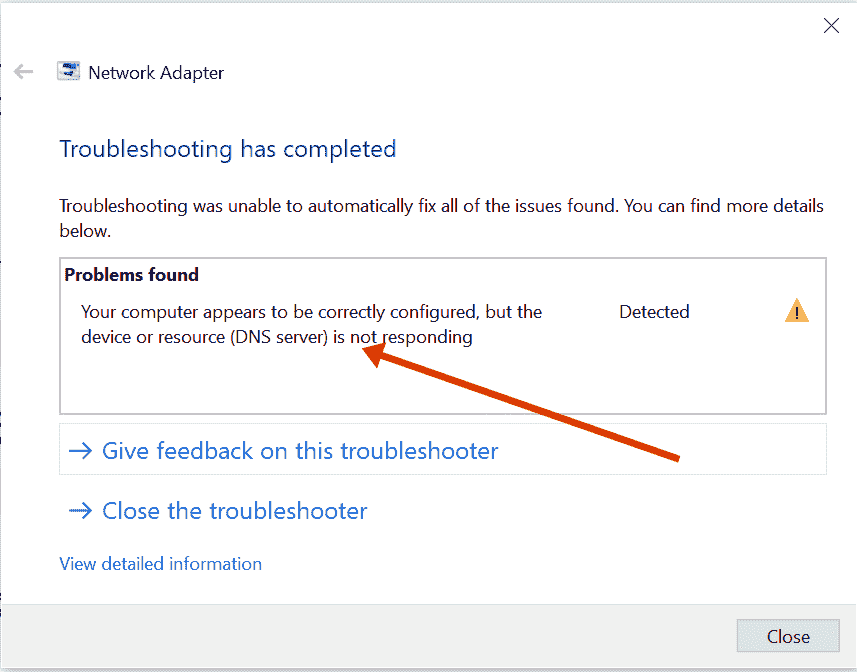
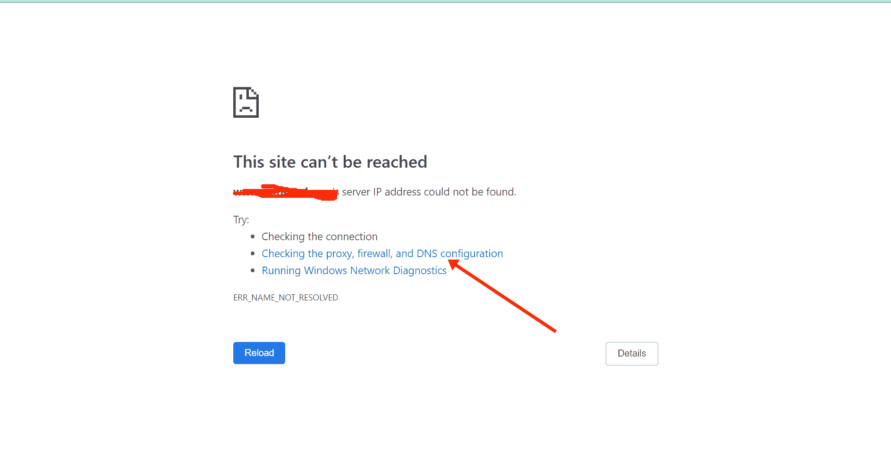
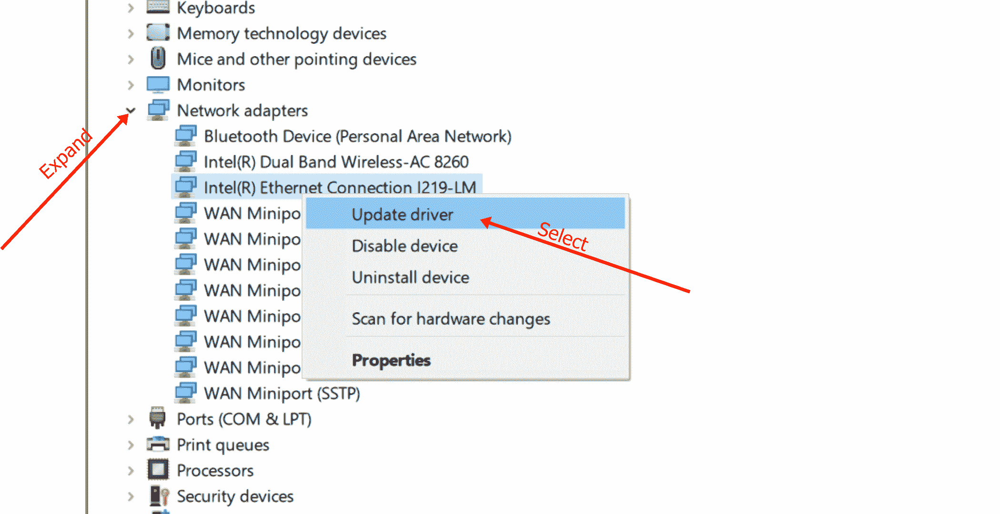
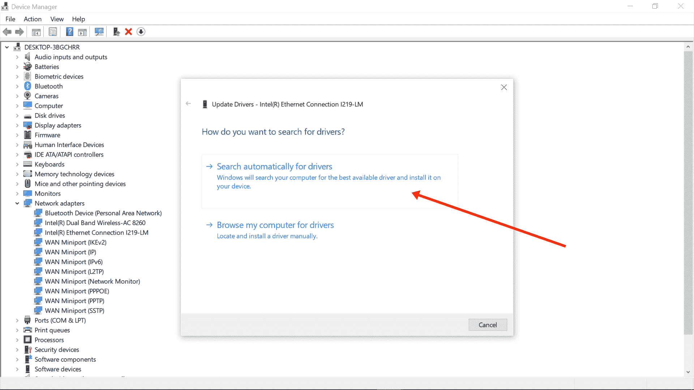

# DNS 服务器没有响应–服务不可用 DNS 故障[已解决]

> 原文：<https://www.freecodecamp.org/news/dns-server-not-responding-service-unavailable-dns-failure-solved/>

有时，您可能会突然发现，由于“DNS 服务器没有响应”这一错误，您的计算机无法访问互联网。

如果您为该问题运行故障诊断程序，您将收到如下消息:

在你的 Chrome 浏览器中，你也可能会得到如下错误:

这是因为域名系统(DNS)服务器对于您的计算机获得互联网连接至关重要。

就网站而言，“DNS 服务器没有响应”错误可能是由 DNS 漏洞和 DDoS(分布式拒绝服务)攻击引起的。如果这是问题所在，您可能需要等待 72 小时，以便域名漏洞得到修复，或者网站管理员修复网站的安全问题。

在用户端,“DNS 服务器没有响应”错误可能是由多种原因造成的，例如错误配置的 DNS 设置和过时的浏览器。

如果这是原因，我会告诉你 7 种方法来修复错误，这样你就可以恢复你的互联网连接。

## 目录

*   [DNS 系统是如何工作的？](#howdoesthednssystemwork)
*   [修复 DNS 服务器不响应错误的 7 种方法](#7waystofixthednsservernotrespondingerror)
    *   [解决方案 1:切换浏览器](#solution1switchbrowsers)
    *   [解决方案 2:暂时禁用您的杀毒软件](#solution2temporarilydisableyourantivirus)
    *   [解决方案 3:重启路由器或调制解调器](#solution3restartyourrouterormodem)
    *   [解决方案 4:刷新您的 DNS 缓存](#solution4flushyourdnscache)
    *   [解决方案 5:手动更改您的 DNS 服务器](#solution5manuallychangeyourdnsserver)
    *   [解决方案 6:更新您的网络适配器驱动程序](#solution6updateyournetworkadapterdriver)
    *   [解决方案 7:禁用 IPv6](#solution7disableipv6)
*   [最终想法](#finalthoughts)

## DNS 系统是如何工作的？

每当你试图访问一个网站，比如 freecodecamp.org，你就在地址栏中输入“freecodecamp . org”这样的网址，然后点击`ENTER`。

在幕后，DNS 服务器查找 freeCodeCamp.org 的数字地址。这个数字地址称为互联网协议(IP)地址。

一旦浏览器获得这个 IP 地址，网站(freeCodeCamp.org 或任何其他)将显示给你。如果浏览器找不到这个地址，那么您可能会得到“DNS 服务器没有响应”的错误。

## 修复 DNS 服务器不响应错误的 7 种方法

现在，让我们来看看七种方法，你可以用来摆脱“DNS 服务器不响应”的错误，让您的互联网连接可以恢复。

### 解决方案 1:切换浏览器

“DNS 服务器没有响应”错误可能是由于您当前使用的浏览器而出现的。一些浏览器有自己的 DNS 缓存，如果缓存有问题，你在那个浏览器上的互联网体验可能会受到负面影响。

因此，一个简单的解决方法是换一个不同的浏览器，看看错误是否仍然存在。

例如，如果你使用 Chrome，如果你使用 Windows，请切换到 Edge 如果你使用 Mac，请切换到 Safari。

如果网站在另一个浏览器中加载，那么您可能需要更新或重新安装另一个浏览器。

### 解决方案 2:暂时禁用您的防病毒软件

反病毒程序因干扰应用程序并阻止它们正常工作而臭名昭著。

如果出现“DNS 服务器没有响应”错误，请考虑禁用防病毒程序，看看您的互联网连接是否正常。

如果您能够访问互联网后，禁用防病毒，那么这是你得到的错误的原因。

在这种情况下，您可能要考虑获得另一个防病毒程序。

如果你在 Windows 10 上，你可以通过以下步骤禁用 Windows 安全(又名 Windows Defender):
**第一步**:按键盘上的`ALT` + `SHIFT` + `ESC`打开任务管理器

**第二步**:切换到启动页签

**第三步**:在列表中找到你的杀毒程序，点击右键，选择“禁用”。

### 解决方案 3:重启路由器或调制解调器

如果您的互联网连接依赖于路由器或调制解调器，重新启动它可以帮助您摆脱“DNS 服务器没有响应”的错误。

这是因为关闭然后再打开路由器或调制解调器会清除 IP 地址的缓存。从长远来看，这可能会修复错误。

要重新启动路由器或调制解调器，请找到电源按钮并长按将其关闭，然后再次打开。

### 解决方案 4:刷新您的 DNS 缓存

如果“DNS 服务器没有响应”错误是由于您的设备配置错误，刷新您的 DNS 是最可靠的解决方法之一。这是因为该过程将删除 DNS 缓存中的无效 IP 配置和过时信息。

要在 Windows 上刷新电脑的 DNS，请按照下面突出显示的步骤操作:

**第一步**:点击键盘上的`WIN`按钮，搜索“cmd”。然后选择右边的“以管理员身份运行”。

**步骤 2** :依次输入并执行以下命令:

*   `ipconfig /flushdns`
*   `ipconfig /release`
*   `ipconfig /renew`
    

第三步:重启电脑

### 解决方案 5:手动更改您的 DNS 服务器

使用互联网服务提供商的默认 DNS 服务器可能是您出现“DNS 服务器没有响应”错误的原因。

你可以把你的 DNS 服务器换成 Google 和 Cloudflare 等公司提供的免费服务器。

以下步骤向您展示了如何将您的 DNS 服务器更改为 Google 的:

**步骤 1** :右键点击开始，选择“网络连接”:

**步骤 2** :向下滚动选择“更改适配器选项”:

**第三步**:在弹出的界面中，右键点击你所连接的网络，选择“属性”:

**步骤 4** :在出现的下一个弹出窗口中，双击“互联网协议版本 4(TCP/IP v4)”:

**步骤 5** :在出现的以下弹出窗口中，点击“使用以下 DNS 服务器地址”单选按钮:

**第六步**:输入 8.8.8.8 作为“首选 DNS 服务器”，输入 8.8.4.4 作为“备用 DNS 服务器”:

这是谷歌提供的免费 DNS 服务器。

**第七步**:点击“确定”，再次点击“确定”。

注意:如果您的计算机配置为使用 IPv6 而不是 IPv4，那么在步骤 4 中，您应该选择“互联网协议版本 6 (TCP/IPv6)”而不是“互联网协议版本 4 (TCP/IPv4)”。

### 解决方案 6:更新您的网络适配器驱动程序

更新您的网络适配器驱动程序可以修复许多技术问题，包括“DNS 服务器没有响应”错误，因为新的驱动程序可能包含错误修复。

要更新您的网络适配器驱动程序，您可以按照以下步骤进行:

**步骤 1** :点击开始，选择设备管理器。

**第二步**:扩展网卡。

**第三步**:右键点击受影响的驱动，选择更新驱动:

**步骤 4** :选择自动搜索更新的驱动软件:

**第五步**:让你的电脑在网上搜索一个驱动，帮你安装。安装完成后，重新启动计算机。

### 解决方案 7:禁用 IPv6

如果您当前的网络配置为使用 IPv4，并且您的计算机上启用了 IPv6，这可能会导致负面干扰，使您得到“DNS 服务器没有响应”错误。

要禁用 IPv6，以下步骤可以帮助您:

**步骤 1** :右键点击开始，选择“网络连接”:

**步骤 2** :向下滚动选择“更改适配器选项”:

**第三步**:在弹出的界面中，右键点击你所连接的网络，选择“属性”:

**步骤 4** :在出现的下一个弹出窗口中，取消勾选“互联网协议版本 6(TCP/IPv6)”:

**第六步**:点击“确定”，再次点击“确定”。

## 最后的想法

“DNS 服务器没有响应”错误可能会令人沮丧，并扰乱您的互联网体验。但是在本文中，您已经了解了如果错误是由用户端的 DNS 配置错误引起的，该如何修复。

我希望本文中解释的错误解决方案之一能够帮助您修复错误。