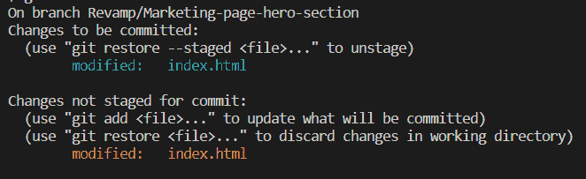
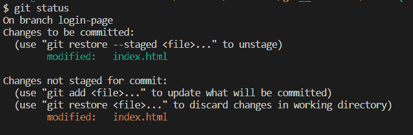
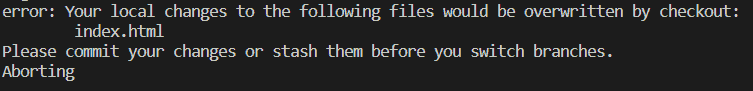
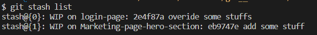
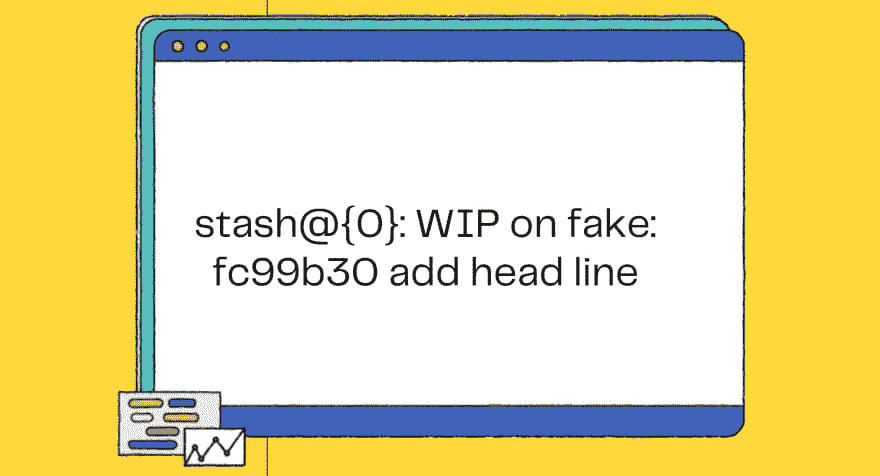

# 如何使用 Git Stash 命令

> 原文：<https://www.freecodecamp.org/news/git-stash-commands/>

假设你正在开发 Git 中一个分支的重要特性——比如修改你的营销页面的英雄部分。你会想在你的`Revamp/Marketing-page-hero-section`分支开始做实验，而不搞砸`master`或`main`分支。

突然，你的同事打电话给你，让你去修复`login-page`分支上的一些 bug。这是一个严肃的问题。因此，您尝试使用`git switch login-page`或`git checkout login-page`切换到`login-page`分支。

如果您正在切换具有已暂存和未暂存更改的分支，您可能会遇到以下任何一种情况:

首先，在切换到`login-page`分支的同时，`Revamp/Marketing-page-hero-section`分支的阶段性和非阶段性变化将会随您一起到`login-page`分支。

`Revamp/Marketing-page-hero-section`分支包含一些`index.html`上的阶段化和未阶段化的变更。



如果我们切换到`login-page`分支，那么`Revamp/Marketing-page-hero-section`分支上的分阶段和未分阶段的变更也会到达`login-page`。



这混淆了`login-page`分支。

接下来，有时 Git 不允许您在没有提交这些更改的情况下切换分支。这是因为您可能会丢失在当前分支中所做的更改，或者它们可能会与目标分支(`login-page`)冲突。不管是什么原因，我们不能在不提交或隐藏变更的情况下切换分支。



同时，不能提交做了一半的特性分支。

为此，您可以使用 **Git stashing** 。Stash 的意思是把(零钱)安全地存放在一个隐蔽的地方(stash stack)。

将当前工作目录的暂存或未暂存的更改或未跟踪的文件存储在 stash stack 中，然后将它们存储在 stash stack 中，会将当前工作目录恢复到上次提交时的状态。

很高兴听到这个消息，对吧？让我们用 stash 命令来弄脏我们的手。

## **目录**

*   如何藏起你的零钱🤐
*   [如何藏匿未被追踪的 files❗](#how-to-stash-untracked-files-)
*   如何列出库存📃
*   [了解存储格式](#understanding-the-format-of-stash)
*   如何展示最新的存货📺
*   如何展示个人收藏📺
*   [如何应用隐藏🖊️](#how-to-apply-the-stash-)
*   [如何删除一个隐藏的☠️](#how-to-delete-a-stash-)
*   [如何从存储创建分支](#how-to-create-a-branch-from-stash)

## 如何藏起你的零钱🤐

您可以使用以下任何一个命令**在 stash stack** 中存储您的暂存和未暂存的变更。它将事情撤销到最近一次提交，并且不删除存储在 stash stack 中的更改。

```
git stash
```

或者

```
git stash save
```

## 如何隐藏未跟踪的 files❗

想把你的未被追踪的文件藏在堆栈里吗？只需在命令末尾使用`--include-untracked`标志。

```
git stash --include-untracked
```

或者在命令末尾使用`-u`:

```
git stash -u
```

## 如何列出库存📃

使用下面的命令列出存储在 stash stack 中的所有毒品:

```
git stash list
```

列出如下的藏匿地点，



*   最新的 stash(stash @ { 0 })将位于堆栈的顶部。
*   较旧的 stash(stash @ { 1 })将位于堆栈的底部。

## 了解存储的格式

stash 命令按以下格式列出了存储库:



A single stash format

如果你不清楚这是什么意思😅，完全没问题。让我们探索一下藏毒清单上的一些术语:

*   **`Stash@{0}`**——这只是一个隐藏的参考。它指的是特定的藏匿点。默认情况下，`Stash@{0}`总是最新的存储。

*注意:像 stash@{3}这样编号较高的仓库是较旧的仓库。最新的存货总是有最低的数量。*

*   **`WIP On fake`–***假*和其他分支一样，只是一个分支名称，WIP 代表正在进行的工作。" *WIP on fake"* 表示`stash@{0}`是在分支" fake "上创建的。
*   **`fc99b30 add head line`**–*fc99b 30*是一个提交散列和*添加标题行*是一个提交消息。在创建隐藏时， *fc99b30 添加标题行*是最近提交。

## 如何显示最新的库存📺

也许你的 stash stack 中有多个 stash，但是你不知道哪个 stash 引用保存了哪个变更。

因此，在您将存储应用到当前工作分支之前，您可以使用下面的命令来确认和显示存储中记录的更改:

```
git stash show
```

默认情况下，`git stash show`以`--stat`格式显示记录在**最新** stash (stash@{0})中的变更。

`--stat`格式只显示您在每个修改的文件上添加和删除了多少行。

```
readme.md | 2 +-
 1 file changed, 1 insertion(+), 1 deletion(-)
```

如果你想在**补丁视图**上显示最新存储的变更记录，在命令末尾使用`-p`标志，如下所示:

```
git stash show -p
```

如果你也想显示**未被跟踪的文件**，使用`-u`标志。

```
git stash show -u 
```

或者您可以像这样使用`--include-untracked`标志:

```
git stash show --include-untracked
```

您可以使用**补丁格式**显示未跟踪的文件:

```
git stash show -p -u
```

您也可以仅显示**个未跟踪的文件，补丁格式如下:**

```
git stash show -p --only-untracked
```

哇，你已经学会了 10 多个隐藏命令🎉🎉

让我们再来看看，这样你就能最大限度地利用储藏。

## 如何展示个人收藏📺

您可以通过使用**存储参考**显示单个存储的记录变化。

```
git stash show stash@{1} 
```

对于补丁格式，您猜对了👏🏻👏🏻–使用`-p` 标志。

```
git stash show stash@{1} -p 
```

想要显示一个隐藏的未被跟踪的文件吗？使用此命令:

```
git stash show stash@{1} -u 
```

或者这个:

```
git stash show stash@{1} --include-untracked 
```

然而，您可以这样做，只显示未跟踪的文件:

```
git stash show stash@{1} --only-untracked
```

## 如何应用🖊️

要在当前工作分支上应用最新存储的记录更改，并从存储堆栈中删除该存储，请运行以下命令:

```
git stash pop 
```

注意:我们可以在任何分行应用 stashes。这不是特定的分支机构在那里藏了起来。

您也可以应用最新的存储，而不从存储堆栈中移除存储，如下所示:

```
git stash apply 
```

您可以通过使用存储参考来应用更早的存储:

```
git stash apply stash@{3}
```

## 如何删除一个隐藏☠️

想要清除 stash stack 中的所有库存吗？使用此命令:

```
git stash clear 
```

想要删除特定的存储吗？是啊！你说得对——你用了 stash 参考:

```
git stash drop stash@{2}
```

## 如何从 stash 创建分支


是的，你可以从你最近的收藏中创建一个新的分支。只需使用以下命令:

```
git stash branch <branch_name> 
```

举个例子，

```
git stash branch demo 
```

如果您想从以前的存储创建一个分支，也可以使用存储引用:

```
git stash branch <branch_name> stash@{revision}
```

举个例子，

```
git stash branch purple stash@{3}
```

## 包扎

如此漫长的旅程——但要涵盖的内容太多了。如果你不能记住每个命令，那也没关系。你越频繁地使用这些命令，你就越容易记住它们。可以参考我的 [**git stash 命令备忘单**](https://gist.github.com/Preethi-Dev/fa8ae46a75761356dc1fa711376c8345) 快速参考。

我希望今天你掌握了许多关于 git stash 的新知识。是时候放松一下，喝杯咖啡或茶了🍵。如果有任何问题，请告诉我！