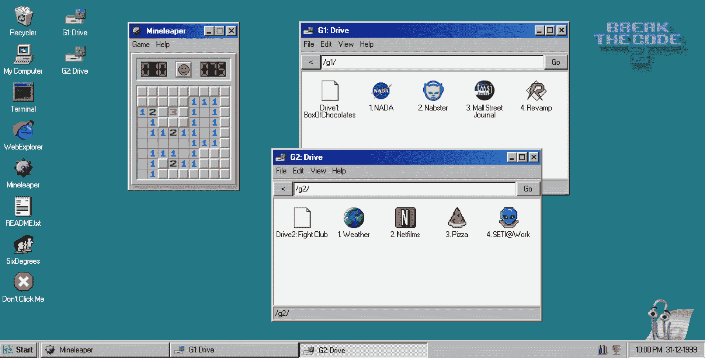
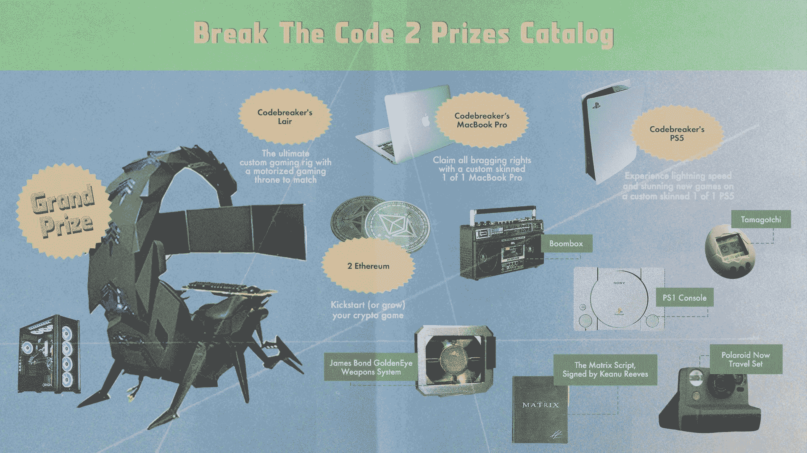

# 打破代码 2.0:一个浏览器游戏，你解决使用编码技能的任务

> 原文：<https://www.freecodecamp.org/news/break-the-code-2-game/>

《破解密码 2.0》是一款新的浏览器游戏，将你带回到 1999 年。

你用你的编程知识和解谜直觉来完成破译密码的任务。

游戏分布在 4 个任务中:

*   /G1/drive-" BoxOfChocolates "
*   /G2/drive—“搏击俱乐部”
*   和/g3/和/g4/驱动器，您可以通过解决前两个驱动器来解锁

The Windows 98-inspired interface of Break The Code 2.0\. (And yes, in case you're wondering, Minesweeper is fully playable.)

《破解代码 2.0》是免费的，你可以[直接在你的浏览器](https://go.tech/fcc)里玩，不需要安装任何东西。

破解代码 2.0 是由一个开发团队在。技术领域。这是他们去年密码破解挑战的续篇。

。科技领域也给了 freeCodeCamp.org 一笔拨款，让我们创建一个“让我们玩吧”风格的游戏漫游。

在本演练中，freeCodeCamp 软件工程师 Tom 和 Shaun 一起处理一些任务并破解一些密码。(1 小时观察):

[https://www.youtube.com/embed/sWMAsRqcoWc?feature=oembed](https://www.youtube.com/embed/sWMAsRqcoWc?feature=oembed)

如果您在 4 月 15 日之前解决这些难题，您可能有资格赢得价值高达 30，000 美元的奖金。

The prize catalogue. The scorpion-shaped gaming throne may clash with the other furniture in your room. But it sure looks comfy.

这是一种有趣的方式来测试您的代码破解技能，同时与来自世界各地的其他开发人员竞争。时光倒流到 1999 年，[开始破解代码 2.0](https://go.tech/fcc)。