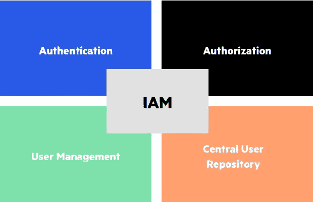

# AWS IAM–政策、访问角色、解释的资源以及它们为什么有用

> 原文：<https://www.freecodecamp.org/news/the-introduction-to-iam-i-wish-i-had/>

IAM，即身份和访问管理，是您在云环境中最常听到的术语之一。

但是它有什么用呢？如果你已经熟悉了 IAM，你花了多长时间才完全理解它？

我将解释这个庞大的软件家族背后的主要概念，记住你这个忙碌的工程师。

这里描述的基本原理是与供应商无关的，尽管我的大部分经验是关于 AWS 的实现。

## 我是什么？

IAM 是一个由请求访问系统的实体(人、应用程序等等)组成的复杂系统。它也是授予或拒绝所请求的访问权限的一组分层规则。

在我们继续深入之前，这里是您将会遇到的主要术语:

*   **资源**:任何值得保护的东西。存储服务、虚拟机等。
*   策略(Policy):一组规则，规定谁能做什么，谁不能做某个资源或一组资源。
*   **动作**:某人在云环境中可以做的任何事情。例如，创建虚拟机。
*   **用户**:嗯...一个用户:)
*   **Group** :应用了相同权限的一组用户。
*   **主体**:请求访问的用户或应用。
*   **角色**:分配给委托人的一组权力，通常在有限的时间内。

## 为什么我有用

IAM 主要用于身份验证、授权、粒度访问和治理。

让我们看看这些都意味着什么:

*   **认证**:验证你是谁的行为。
*   授权(Authorization):确认某人是否可以执行他们所请求的动作的行为。这通常与身份验证相结合，但并不总是如此。
*   **粒度访问**:控制资源上可能发生的每个动作的权限。例如，用户可能有权查看防火墙规则，但无权更改它们。这是通过[基于角色的访问控制](https://en.wikipedia.org/wiki/Role-based_access_control)实现的。
*   **治理**:您为了解环境中发生的事情而采取的行动，主要是出于预算、合规性和适当访问范围的原因。

如果你是一个只有 1-3 个人的公司，那么建立一个成熟的 IAM 解决方案可能是多余的。但是如果你的团队超过了这个数目，或者你打算扩大规模，那么你应该开始考虑了。

## 不使用 IAM 的常见问题

我相信您可以看到 IAM 解决方案的好处。

现在，让我们来看看组织在没有 it 的情况下面临的一些常见问题。

### 很难审计和管理访问

你听说过员工拥有比他们应该拥有的更多权限的情况吗？另外，没人知道？

这可以通过正确设置 IAM 解决方案来避免。

### 为新员工建立账户是一件痛苦的事情

有了 IAM 解决方案，只需点击几下鼠标。也就是说，设置用户并将他们添加到他们的团队使用的 IAM 组中。就是这样。

但是没有 IAM 解决方案呢？您需要手动设置每个帐户的所有权限。

您可能有一个可以从中复制的参考用户，但是每个新帐户都需要参考用户拥有的所有权限吗？你对不到 6 个月的用户帐户有特殊处理吗？参考用户是否拥有不应意外分配给新员工帐户的超级用户权限？

### 离开人群很费时间

在这里，你会遇到与上述新员工案例类似的问题。但是当一个同事离开时，你需要修改他们可能使用的所有账户的密码。

这可能会很快变得很糟糕，更不用说这对其他团队成员的副作用了。

每当有新版本时，您都必须为每个脚本、应用程序和其他资源执行此操作。如果你每个月换 2-3 次团队会怎样？你和你的团队将很难有所作为。

### 简单的事情需要人工干预

如果没有 IAM 解决方案，重置密码或重新启用被锁定的帐户等任务需要手动完成。

顶级 IAM 解决方案有一种快速解决此类问题的方法，没有太多麻烦。

## 最佳实践

如果您已经决定设置 IAM，这里有一些最佳实践。这远不是一个完整的列表，并且是基于我的个人经验。但是我在不止一个团队中看到过这些实践，所以它们应该对你也有用。

### 从不授予完全访问权限...曾经

在现实世界中，您不希望每个用户都可以无限制地访问一个帐户。理想情况下，任何人都不应该完全访问任何东西(除了帐户所有者)。

例如，如果一个员工的职责是监控日志，那么他们应该只对该工具拥有读取权限。他们应该不能重新启动服务或查看计费信息。

### 优先选择组而不是多个用户

在有选择的情况下，最好使用组，而不是多个用户。组大大简化了管理。

例如，如果一个新人作为开发人员加入您的组织，他们可以被添加到 IAM 开发人员组。这个新人将继承 IAM 组的所有权力。

另外，为每个组(reader_susan，admin_susan)创建一个用户被认为是过时的。

### 优先选择现有用户的角色，而不是创建新用户

如果可以选择，最好将角色分配给现有用户，而不是创建新用户。

例如，不要创建一个管理员用户并在 10 个人之间共享密码。创建一个管理员角色，并在有限的时间内将其分配给任何需要它的人。

### 经常审核权限

很容易出错或执行恶意操作。至少，公司应该定期审核权限，并确保只有合适的人拥有其角色所需的最低级别的访问权限。

当可疑行为发生时，你也可以给某个团队发一封电子邮件。例如，给新员工分配一个管理员角色。

### 预先设定界限

如果 IAM 解决方案允许的话，给你的生态系统添加边界。

根据亚马逊的文档:

> 权限边界是一项高级功能，用于使用托管策略来设置基于身份的策略可以授予 IAM 实体的最大权限。实体的权限边界允许它只执行基于身份的策略和权限边界都允许的操作。

(我知道，我知道——我承诺过不依赖供应商🙂)

通俗地说，你可以定义可以分配给任何人的“最大”权限。

例如，用户最多只能从相关工具查看日志并重启服务。如果有人试图获得创建新虚拟机的角色，他们将被禁止。

## 结论

谢谢你读到这里。我希望你喜欢我的介绍。

如果您有任何问题，请在 Twitter 上联系我。