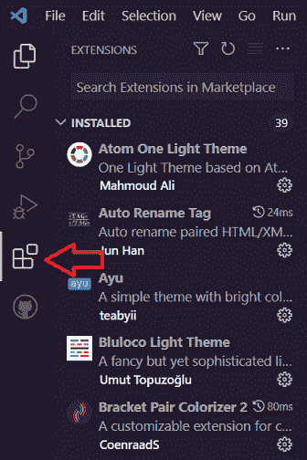
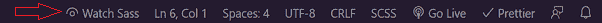

# 萨斯入门指南

> 原文：<https://www.freecodecamp.org/news/the-beginners-guide-to-sass/>

你有没有想过 SASS 代表什么？或者也许你已经知道它是什么，但是没有花时间去研究和使用它。

无论你是第一次学习它，还是想重温你的知识，这篇文章都适合你。

在这篇文章中，您将学习 Sass 的基础知识，它是什么，以及如何使用 Sass 的强大功能来加速编写风格的过程。

## 先决条件

本文假设您已经:

*   对 HTML 和 CSS 有基本的了解
*   代码编辑器(推荐使用 VS 代码)。如果你还没有安装，在这里下载[。](http://code.visualstudio.com/)
*   和浏览器(推荐 Chrome 或 Firefox)

## 萨斯到底是什么？

Sass(语法上令人敬畏的样式表)是一个 CSS 预处理器，给你的 CSS 超能力。

让我们面对现实:编写 CSS 有时会很困难，尤其是在当今这个用户界面日益复杂的世界。

很多时候，你会发现你经常在重复自己。

在这种情况下，萨斯来帮忙了。它有助于你在写 CSS 的时候坚持 DRY(不要重复自己)哲学。

Sass 提供了一个编译器，允许我们用两种不同的语法编写样式表，缩进和 SCSS。现在让我们来看看每一个。

### 缩进语法

这是缩进的旧语法，去掉了花括号和分号。它的文件扩展名为`.sass`。

```
nav
  ul
    margin: 0
    padding: 0
    list-style: none

  li
    display: inline-block

  a
    display: block
    text-decoration: none 
```

### SCSS 语法

这是更新更流行的语法。它本质上是 CSS3 语法的一个子集。这意味着您可以编写带有一些附加功能的常规 CSS。

由于其先进的功能，它经常被称为*时髦的 CSS* 。它的文件扩展名为`.scss`。

```
nav {
  ul {
    margin: 0;
    padding: 0;
    list-style: none;
  }
  li {
    display: inline-block;
  }

  a {
    display: block;
    text-decoration: none;
  }
} 
```

> 快速声明:本文使用 SCSS 语法，因为它的应用更广泛。

## Sass 是如何工作的？

Sass 的工作方式是，当你在一个`.scss`文件中编写你的样式时，它会被编译成一个普通的 CSS 文件。然后 CSS 代码被加载到浏览器中。

这就是为什么它被称为预处理器。

## 为什么要用 Sass？

*   **易学**:如果你已经熟悉 CSS，那么你会很高兴知道 Sass 实际上有一个相似的语法，所以你可以开始使用它，甚至在本教程之后；)
*   **兼容性**:兼容所有版本的 CSS。因此，您可以使用任何可用的 CSS 库。
*   **节省时间**:由于其强大的功能，有助于减少 CSS 的重复。
*   可重用代码 : Sass 允许变量和代码块(mixins)可以一次又一次地重用。这有助于您节省时间，并使您能够更快地编码。
*   有组织的代码 : Sass 通过使用片段来帮助你组织代码。
*   **跨浏览器兼容性** : Sass 被编译成 CSS，并添加了所有必要的厂商前缀，因此您不必担心手动写出它们。

## Sass 的特点

以下是一些使 Sass 真正成为拥有超能力的 CSS 的特性:

### Sass 中的变量

您可以在 Sass 中声明变量。这是 Sass 的优势之一，因为我们可以为各种属性定义变量，并在任何文件中使用它们。

这里的好处是，如果该值发生变化，您只需更新一行代码。

这是通过用美元符号`$`命名一个变量，然后在代码的其他地方引用它来实现的。

```
$primary-color: #24a0ed;

.text {
  color: $primary-color;
}
button {
  color: $primary-color;
  border: 2px solid $primary-color;
} 
```

### 在萨斯筑巢

很多时候，在写 CSS 的时候，类经常是重复的。我们可以通过在父元素中嵌套样式来避免这种重复。

在 CSS 中，

```
nav {
  height: 10vh;
  width: 100%;
  display: flex;
}

nav ul {
  list-style: none;
  display: flex;
}

nav li {
  margin-right: 2.5rem;
}

nav li a {
  text-decoration: none;
  color: #707070;
}

nav li a:hover {
  color: #069c54;
} 
```

有了 Sass，上面的代码可以写成这样:

```
nav {
  height: 10vh;
  width: 100%;
  display: flex;

  ul {
    list-style: none;
    display: flex;
  }

  li {
    margin-right: 2.5rem;

    a {
      text-decoration: none;
      color: #707070;

      &:hover {
        color: #069c54;
      }
    }
  }
} 
```

### 父选择器

在上面的 Sass 代码中，您可能会注意到与 hover 伪类一起使用的&符号`&`。这被称为父选择器。

> 父选择器`&`是 Sass 发明的一种特殊选择器，在嵌套选择器中用来引用外部选择器。来源-[Sass 文档](https://sass-lang.com/documentation/style-rules/parent-selector)

因此，在上面的代码中，`&`将引用锚标签`a`的父标签。

> 您可以查看我的文章中关于如何使用 BEM 方法实现 Sass 的内容。

### 萨斯语中的偏音

这是 Sass 带给您优势的众多令人敬畏的特性之一。

随着时间的推移，样式表变得越来越大，维护它们变得越来越困难。因此，将样式表分成更小的块是有意义的。换句话说，分部帮助你组织和构建你的代码。

为了声明一个分部，我们将以下划线`_`开始文件名，并使用`@import`指令将它添加到另一个 Sass 文件中。

例如，如果我们有一个`_globals.scss`、`_variables.scss`和`_buttons.scss`，我们可以将它们导入主 SCSS 文件`main.scss`。

```
@import "globals";
@import "variables";
@import "buttons"; 
```

您会注意到下划线和`.scss`没有被添加。这是因为 Sass 会自动假定您引用的是`.sass`或`.scss`文件。

### 萨斯的混血儿

CSS 的另一个主要问题是你会经常使用一组相似的样式。Mixins 允许您封装一组样式，并使用`@include`关键字在代码中的任何地方应用这些样式。

使用 mixins 的一个例子是使用 Flexbox。

```
@mixin flex-container {
  display: flex;
  justify-content: space-around;
  align-items: center;
  flex-direction: column;
  background: #ccc;
}

.card {
  @include flex-container;
}

.aside {
  @include flex-container;
} 
```

### Sass 函数和运算符

Sass 提供了一套工具来帮助编写更多的编程代码。

Sass 提供了内置函数，使我们能够进行计算和操作，返回一个特定的值。

它们的范围从颜色计算到数学运算，比如获取随机数和计算大小，甚至还有条件运算。

它还提供了对数学运算符的支持，如`+`、`-`、`\`、`*`、`/`和`%`，我们可以在`calc`函数中使用它们。

下面是一个使用像素到 rem 转换函数的示例:

```
@function pxToRem($pxValue) {
  $remValue: ($pxValue / 16) + rem;
  @return $remValue;
}

div {
  width: pxToRem(480);
} 
```

> 但是，需要注意的是，除法运算符`/`已被弃用，在 Dart Sass 2.0.0 中将被删除。你可以在[文件](https://sass-lang.com/documentation/breaking-changes/slash-div)中读到。

所以，应该这样写:

```
@use "sass:math";

@function pxToRem($pxValue) {
  @return math.div($pxValue, 16px) * 1rem;
}

div {
  width: pxToRem(480px); // gives 30rem
} 
```

下面是 mixin 中条件逻辑的一个例子:

```
@mixin body-theme($theme) {
  @if $theme == "light" {
    background-color: $light-bg;
  } @else {
    background-color: $dark-bg;
  }
} 
```

Sass 还提供了`lighten`和`darken`函数来按一定的百分比调整颜色。

例如:

```
$red: #ff0000;

a:visited {
  color: darken($red, 25%);
} 
```

## 如何为地方发展建立 Sass

太好了！现在我们已经了解了 Sass 的“理论”方面，让我们进入代码以更好地理解它是如何工作的。

在本节中，您将学习如何设置本地开发环境，并浏览我准备的一个简单的登录页面。

查看 [Codesandbox](https://codesandbox.io/s/currying-river-44d7zr?file=/index.html) 上的演示和 [GitHub](https://github.com/israelmitolu/Getting-Started-with-SASS) 上的代码库。

### 编译 Sass 的方法

编译 Sass 文件有不同的方法，它们是:

*   VS 代码扩展
*   使用 NPM 全球安装
*   使用 Compass.app、Live Reload 和 Koala 等开源应用程序进行安装。
*   使用自制软件安装(适用于 MacOS)

在本教程中，我们将使用 VS 代码扩展选项，因为它最容易上手。

### 如何为 VS 代码设置 Sass

#### 步骤 1:安装实时 Sass 编译器

首先，启动 Visual Studio 代码。加载后，转到左侧面板，选择 extensions 选项卡。



Extensions tab in VS Code

在搜索栏中，搜索“Live Sass 编译器”并安装。这个扩展帮助我们将 Sass 文件— `.scss`(或`.sass`)—编译成`.css`文件。

#### 步骤 2:设置保存位置

现在更改文件路径，以便将 Sass 编译到`styles`文件夹中。

为此，您将对`settings.json`文件进行更改。

在 VS 代码中，转到文件>首选项>设置。现在搜索`live sass compile`更改全局设置。

点击`Edit settings.json`。

现在，在前几行，你可以看到这段代码:

```
{
  "liveSassCompile.settings.formats": [
    {
      "format": "expanded",
      "extensionName": ".css",
      "savePath": "/"
    }
  ], 
```

将`"savePath": "/"`改为`"savePath": "/styles"`，所以现在看起来是这样的:

```
{
  "liveSassCompile.settings.formats":[
    {
      "format": "expanded",
      "extensionName":".css",
      "savePath":"/styles",
    },

    // You can also use this minified extension for production, as it reduces the file size

    {
      "format": "compressed",
      "extensionName":".min.css",
      "savePath":"/styles",
    }
  ], 
```

#### 步骤 3:编译 Sass

现在，保存设置后，回到 Sass 文件，点击窗口底部的“观看 Sass”按钮。



Click on "Watch Sass"

点击按钮后，在`styles`文件夹中创建了两个文件:`.css`和一个`.css.map`。

但是，您不应该更改它们中的任何一个。因为它已经帮助您在每次保存新样式时将 Sass 编译成 CSS。

#### 步骤 4:链接 CSS 文件

然后，链接您的`index.html`中的 CSS 文件。在我们的案例中:

```
 <link rel="stylesheet" href="/styles/main.css" /> 
```

现在在浏览器中运行该文件。这应该是下面 CodeSandbox 中的结果布局:

[https://codesandbox.io/embed/currying-river-44d7zr?autoresize=1&fontsize=14&hidenavigation=1&moduleview=1&theme=dark&view=preview](https://codesandbox.io/embed/currying-river-44d7zr?autoresize=1&fontsize=14&hidenavigation=1&moduleview=1&theme=dark&view=preview)

## 遍历代码

下面是对上一节代码的解释:

*   我们在`index.html`文件中有一个基本的标记，它包含一个标题和 home/hero 部分。

    *   它包含一个到 CSS 文件的链接，这个 CSS 文件是 extension 为我们编译的。
    *   和一些用于响应菜单切换的 JavaScript。
*   `main.scss`被编译，产生的 CSS 文件`main.css`就是导入到`index.html`中的文件:

    ```
    <link rel="stylesheet" href="/styles/main.css" /> 
    ```

*   主 Scss 文件`main.scss`导入所有分支:`_base.scss`、`_components.scss`、`_home.scss`、`_layout.scss`、`_responsive.scss`、`_variables.scss`。

    ```
    @import "variables";
    @import "base";
    @import "layout";
    @import "components";
    @import "home";
    @import "responsive"; 
    ```

*   基础部分包含了`flex`和`grid`的混合，它们包含在我们需要它们的地方。

## 结论

恭喜你。如果您坚持到了最后，这意味着您已经了解了 Sass 是如何工作的，它有哪些很酷的特性，希望您能很快开始使用它。

如果你想了解更多关于 Sass 的知识，我推荐你去看看 [freeCodeCamp 的课程](https://www.youtube.com/watch?v=aoQ6S1a32j8&t=3323s)。

如果您觉得这篇文章有用(我相信您是这样认为的😉)，一定要与你的朋友和网络分享它，并随时与我在 [Twitter](https://twitter.com/israelmitolu) 和我的[博客](https://israelmitolu.hashnode.dev)上联系，我在那里分享资源和文章，让你成为更好的开发者。

感谢您的阅读，祝您编码愉快！