# thunder Client——测试 Restful APIs 的替代方法

> 原文：<https://www.freecodecamp.org/news/thunder-client-for-vscode/>

本文将教你一种使用 Thunder Client 测试客户端 API 的替代方法，Thunder Client 是一个开源扩展，可在 [VS Code marketplace](https://marketplace.visualstudio.com/items?itemName=rangav.vscode-thunder-client) 上获得。

您不需要下载任何工具来完成这项工作，因为您可以在 VS 代码中完成这项工作。

本文涵盖以下内容:

1.  VS 代码集成开发环境和市场简介
2.  为什么要用迅雷客户端？
3.  迅雷客户端的优势
4.  迅雷客户端如何工作
5.  如何下载安装迅雷客户端
6.  如何启动迅雷客户端
7.  集合和环境变量
8.  如何提出客户请求
9.  示例请求和响应的预览

## VS 代码集成开发环境和市场简介

对于许多开发人员来说，VS 代码不仅仅是一个代码编辑器或 IDE。它不仅仅让你用你喜欢的语言写代码——它还让你快速跟踪整个开发过程。

VS Code 提供了一个扩展市场，让您可以轻松地从众多开源选项中搜索和下载您最喜欢的扩展。

## 为什么选择迅雷客户端？

Thunder Client 是著名的 Postman 工具的替代品，用于测试客户端 API。Thunder Client VS Code extension 是轻量级的，允许您在编辑器中动态测试 API。

您可能不想下载另一个工具来测试您正在构建的 API。相反，不如下载一个 VSCode 扩展，它提供了广泛的功能，如:

*   收藏，
*   环境变量，
*   对标准 HTTP 动词的支持，
*   导航选项卡(查询、标题、验证、正文、测试)和
*   支持 JSON 响应

### 迅雷客户端 vs 邮递员

迅雷客户端是轻量级的，适合想要一个简单的用户界面和梦幻般的用户体验而不需要任何复杂性的用户。它还可以完美地脱机运行，并提供支持降价的文档🤯。

请记住，Postman 更强大，并且具有更广泛的符合行业标准的功能。它允许开发人员社区探索全世界最大的 API、工作空间和集合网络。它还具有创建团队、报告、监视器(定期检查 API 性能和响应)和模拟服务器(利用模拟服务器帮助模拟端点及其相应的响应，而无需后端)等特性。

创建 API 很容易，因为它提供了对版本控制、模式类型(OpenAPI 3.0- 1.0、RAML、GraphQL)和模式格式(JSON、YAML)的支持。

像每一个伟大的工具一样，Postman 有一个最新的学习中心，在那里你可以找到开始使用这个工具的文档。听起来也很有趣，对吧？嗯是的😁两者都是独一无二的，对于它们的用例来说都是完美的。

## 迅雷客户端的优势

首先，它是一个超快的 API 客户端扩展。它创建了快速无缝地检索响应的请求。在本地机器上测试 API 时，也不需要访问互联网。

它也有一个直观和易于使用的用户界面。界面很友好，也更容易使用，因为与 Postman 这样的工具相比，该扩展的功能相对较少。

迅雷客户端有丰富的 API 请求处理。它一次处理大量请求的效率很高，并且不会降低 VS 代码应用程序的速度。

它还支持 Visual Studio 代码主题，并采用您当前配置的 VS 代码主题。

最后，迅雷客户端支持集合、环境变量、GraphQL 和测试脚本。它还具有像 Postman 这样健壮的工具所具有的流行特性。

总的来说，对于只需要访问集合、环境变量和测试等基本功能的小团队来说，Thunder Client 是一个很好的选择。

## 迅雷客户端如何工作

如果你想使用迅雷客户端，你需要去 VS 代码市场下载扩展，然后启动它。一旦你做到了这一点，这里有一些基本的事情你可以使用扩展来做:

**跟踪活动:**迅雷客户端跟踪用户最近发出的 API 请求。您还可以过滤活动，将范围缩小到首选活动搜索。也叫历史。

**使用集合:**你可以组织 API，这样更容易访问它们。集合是一组 API，因此您可以创建一个用户集合来包含诸如创建用户、编辑用户、删除用户等 API。

**环境变量:**使用 Envs，您可以存储凭证，如令牌、基本 URL、公钥和私钥，然后在请求体中使用这些变量。

**发出请求:**您可以指定自己喜欢的 HTTP 动词来响应请求，比如 POST，然后是端点。对于 request Thunder 客户端，还支持查询参数、HTTP 头(原始或非原始)、身份验证(无、基本、承载、OAuth 2、AWS 和 NTLM 身份验证)、主体(附加到单个请求的有效负载)和测试(您可以选择可以是响应代码的测试类型并设置要断言的值)。

**响应:** Thunder Client 提供了一个精心制作的响应部分，包含响应主体、响应状态、大小以及请求所用的时间。它还允许用户添加支持 markdown 的文档，使之更加有趣。

## 如何下载安装迅雷客户端

要下载迅雷客户端，可以在 VS 代码市场上找到。有提示时搜索“迅雷客户端”然后安装即可。

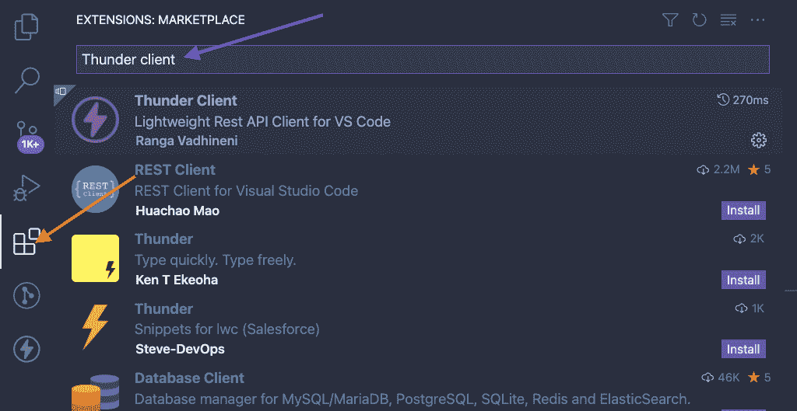

Search Thunder Client On Marketplace

**注意**:我已经安装了我的，所以卸载选项显示在图像中。

点击“安装”按钮，安装 Thunder 客户端扩展。

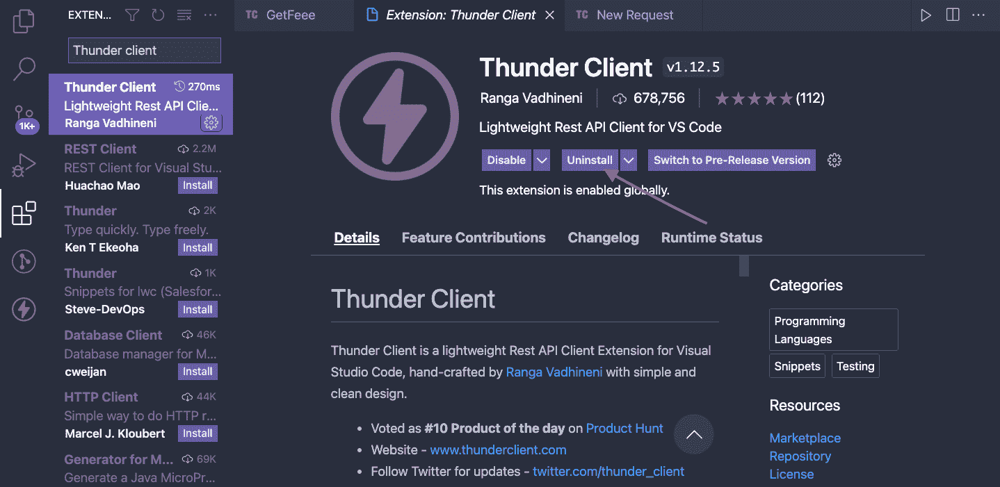

Install Thunder Client

## 如何启动迅雷客户端

点击 VS 代码中添加的新图标，启动 Thunder 客户端。

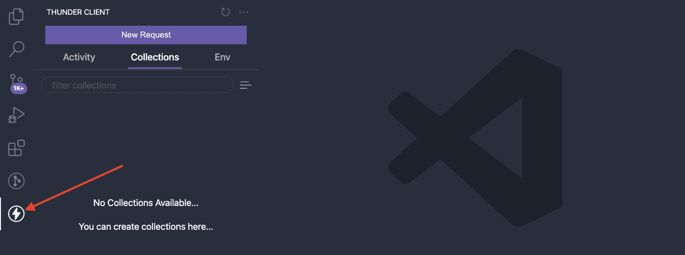

Launch Thunder Client

然后就可以开始使用迅雷客户端了。

## 如何使用“活动”选项卡

activity 选项卡显示了最近一段时间内 API 请求的历史记录。您还可以自由执行操作，如保存到收藏、重命名、复制等，如图所示。

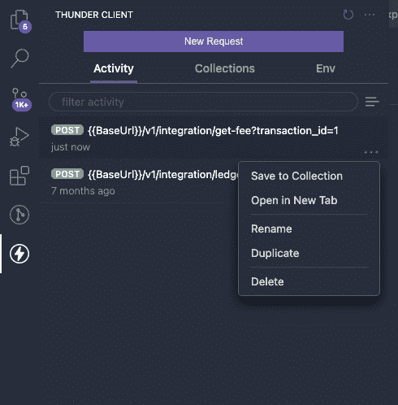

## 如何使用集合和环境变量

集合是一组 API 请求。Thunder Client 允许您处理集合或创建一个单独的请求，如“新建请求”按钮。

要使用收藏，请单击“收藏选项卡”，然后单击下图中箭头所指的图标。这将显示一个下拉列表，您可以从中选择是要“新收藏”还是要导入现有收藏。

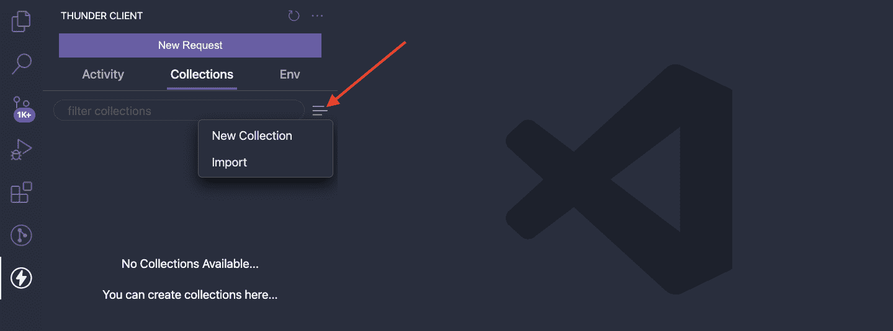

Create & Import collection

您可以通过单击“Env”选项卡来添加环境变量，然后单击下图中箭头所指的图标。这显示了一个为请求设置 env 变量的下拉菜单。您还可以导入现有的变量。

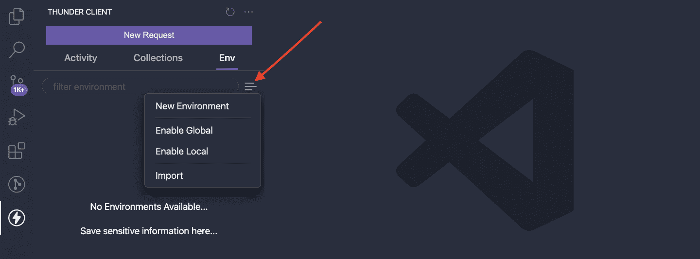

## 如何提出客户请求

根据请求的类型，Thunder Client 为请求提供了一个 HTTP 动词列表，比如 **GET、POST、PUT、DELETE、**和 **PATCH** 。

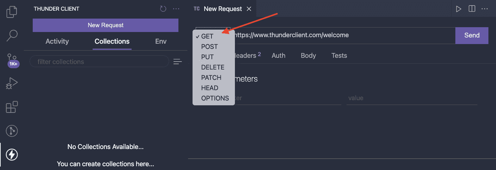

HTTP Verbs in Thunder Client

还支持查询参数、标题、授权、主体和测试。在撰写本文时，还不支持请求的文件附件。你可以点击查看即将发布的发行说明[。](https://github.com/rangav/thunder-client-support/issues/282)

**查询参数**允许您将查询参数追加到请求中。

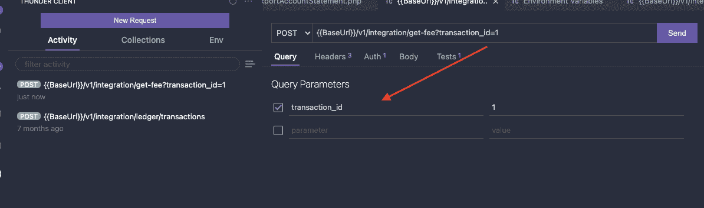

Query Params

**Headers** 允许您设置 HTTP 头，如授权、内容类型、来源、用户代理、接受语言、引用等。

如果您希望任何头是可选的，只要确保在请求中不选中它们。还为您喜欢的标题类型启用了自动完成建议。

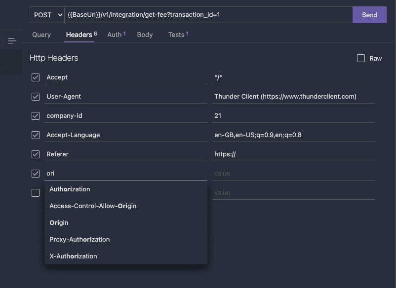

Http Headers

要访问资源，您需要有令牌来验证它们。使用 Thunder Client,“身份验证”选项卡允许您选择首选的身份验证类型并添加凭据。

在我的情况下，我选择不记名；然后，我将一个令牌粘贴到文本区域，并为请求自动生成一个令牌前缀。

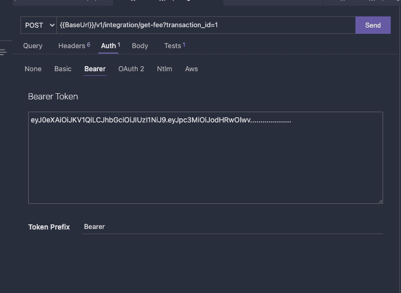

Authentication

您可以在发出请求时包含一个有效载荷。要添加有效负载，请选择 Body 选项卡，您将看到扩展支持的不同数据格式。

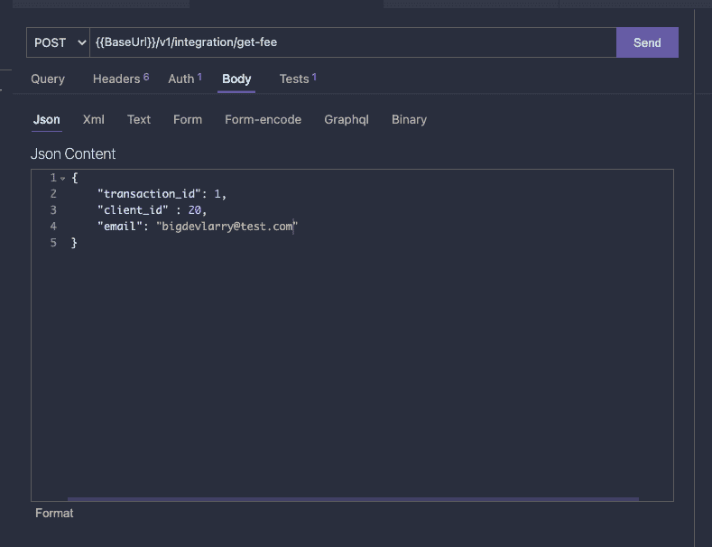

Request Payload

## 请求和响应示例

下图显示了一个带有查询参数的示例请求和一个示例 JSON 响应。

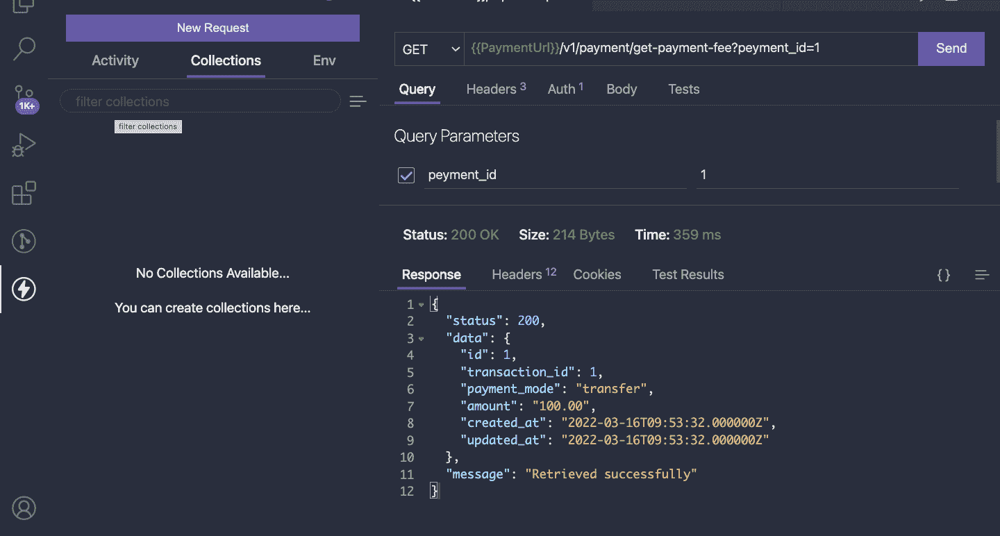

Sample Request & Response

## 结论

啊呀，很高兴你能坚持到最后。我希望你已经学会了如何在 VS 代码市场中搜索扩展，并且可以开始用 Thunder Client 发出 API 请求。

在推特上大声呼喊创造者 [@Rangav](https://www.freecodecamp.org/news/p/7b47d7f1-beed-41b6-a792-6cbf0c8abf52/twitter.com/ranga_vadhineni) 的高超扩展。

在 [twitter](https://twitter.com/bigdevlarry) 上关注我，如果你觉得有用，也可以分享。