# freeCodeCamp 2022 年世界翻译峰会——参与翻译工作

> 原文：<https://www.freecodecamp.org/news/the-freecodecamp-world-translation-summit-2022-join-the-translation-effort/>

翻译是改变生活的强大工具。每个人都应该有机会获得母语的免费学习资源。

为了实现这一目标，freeCodeCamp 已经开始在全球数千名志愿者的帮助下，将我们的课程翻译成数十种世界语言。

为了表彰我们的翻译和校对人员，我们将举办一次世界翻译峰会。我们将分享我们翻译工作的最新进展，并回答您的问题。如果你愿意加入我们的翻译工作，我们还会招募新的志愿者。

📌如果你能加入我们，那就太好了。我们将有两次会议:美国东部时间 4 月 8 日星期五晚上 9 点和美国东部时间 4 月 9 日星期六上午 9 点。

在本文中，您将看到我们翻译工作进展的概述:

*   [欢迎来到免费代码营](#-welcome-to-freecodecamp)
*   [我们的翻译工作](#-our-translation-effort)
*   [社区领导](#-community-leaders)
*   [学生证明](#-student-testimonials)
*   【2022 年世界翻译峰会

## 🔹欢迎来到免费代码营

freeCodeCamp 是一个由捐助者支持的 501(c)(3)非营利组织，其使命是帮助人们免费学习编码。我们为任何想学习的人创建和分享数以千计的交互式编码课程、文章和视频。

有了我们的课程，你可以免费学习编码，获得认证，并建立项目来开始或扩展你的投资组合。

自 2014 年 freeCodeCamp 启动以来，社区稳步增长，世界各地都有营员在学习 freeCodeCamp 的资源。

2019 年，我们问了自己这个问题:我们能否扩展我们的使命，帮助人们学会用他们的母语编码？

答案是“是的！”因此，我们决定通过翻译和创建其他世界语言的学习资源来进一步完成我们的使命。

从那时起，这一直是我们的主要目标之一，因为我们相信，在世界各地，每个人都应该没有任何语言障碍地获得免费的编码教育。

## 🔸我们的翻译工作

到目前为止，我们出色的志愿者团队和工作人员已经取得了一些令人印象深刻的里程碑，并继续在我们的翻译工作中取得进展。让我们更详细地看看这个。

### 课程

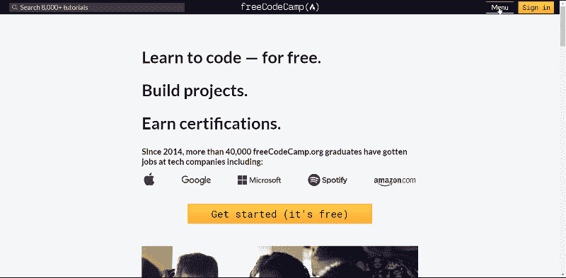

How to select a language from the dropdown menu.

社区已经将我们的课程翻译成西班牙语、中文、意大利语、葡萄牙语、乌克兰语和日语。这些语言已经上线，您可以在主页中选择它们。

世界上许多主要语言也取得了显著进步，包括:

*   阿非利堪斯语
*   阿拉伯语
*   孟加拉语
*   加泰罗尼亚语
*   捷克人
*   丹麦的
*   荷兰人
*   芬兰人的
*   法语
*   德国人
*   希腊的
*   哈提安克里奥尔
*   希伯来人
*   印地语
*   匈牙利的
*   韩国的
*   挪威的
*   波斯语(波斯语)
*   抛光剂
*   罗马尼亚的
*   俄语
*   塞尔维亚的
*   斯瓦希里语。亦称 KISWAHILI
*   瑞典的
*   泰国的
*   土耳其的
*   乌尔都语
*   和越南人

**💡提示:**你可以在这篇由昆西·拉森[撰写的文章中了解更多关于我们翻译工作的信息——学习用西班牙语、汉语和 30 种其他语言编码——freeCodeCamp 的翻译工作](https://www.freecodecamp.org/news/world-language-translation-effort/)

### 出版物

我们有以下语言的本地化出版物，并且正在积极开发其他语言:

**[葡萄牙语](https://www.freecodecamp.org/portuguese/news)**
我们的葡萄牙语出版物有超过 190 篇翻译文章，我们每周都会发布新文章。

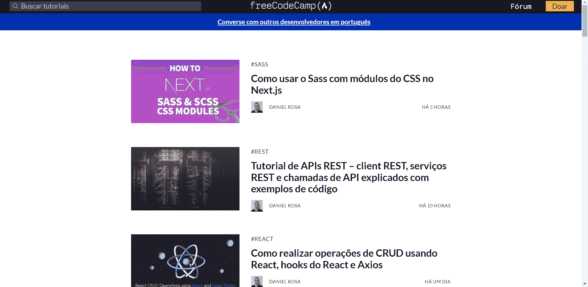

Portuguese Publication

**[意大利语](https://www.freecodecamp.org/italian/news)**
我们的意大利语出版物有超过 85 篇翻译文章，并且每周都在持续增长。

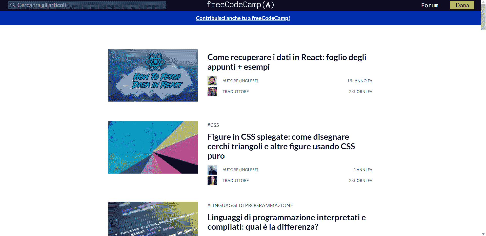

Italian Publication

**[日文](https://www.freecodecamp.org/japanese/news)**
我们的日文出版物有 30 多篇翻译文章，我们还在不断地将新文章翻译成日文。

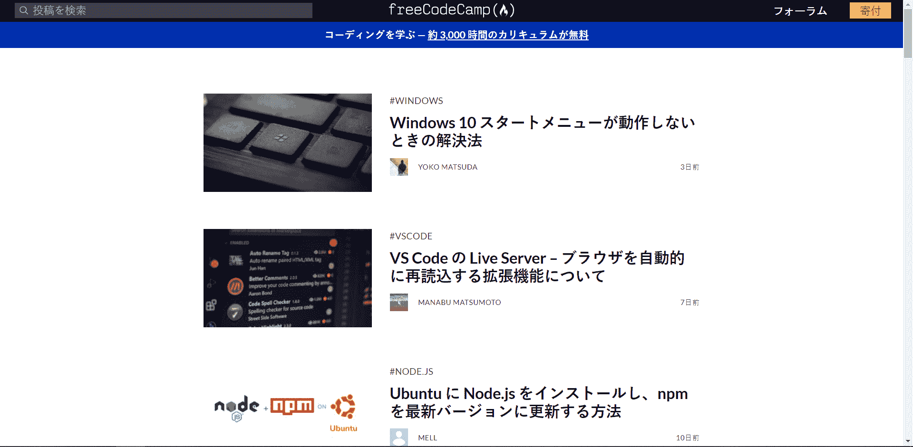

Japanese Publication

[**中文**](https://chinese.freecodecamp.org/news)
我们的中文刊物有超过 720 篇翻译的文章，我们每周都会发布新的文章。

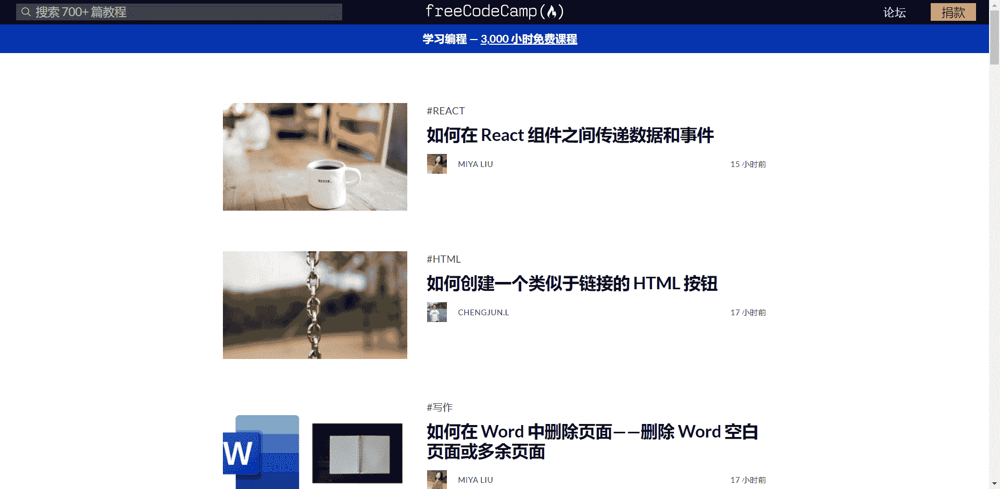

Chinese Publication

[**西班牙语**](https://www.freecodecamp.org/espanol/news)
我们的西班牙语出版物有超过 370 篇翻译文章，我们每周都会发布新文章。

Spanish Publication

**[阿拉伯语](https://www.freecodecamp.org/arabic/news)**
我们的阿拉伯语出版物有超过 75 篇翻译文章，我们每周都在翻译新文章。

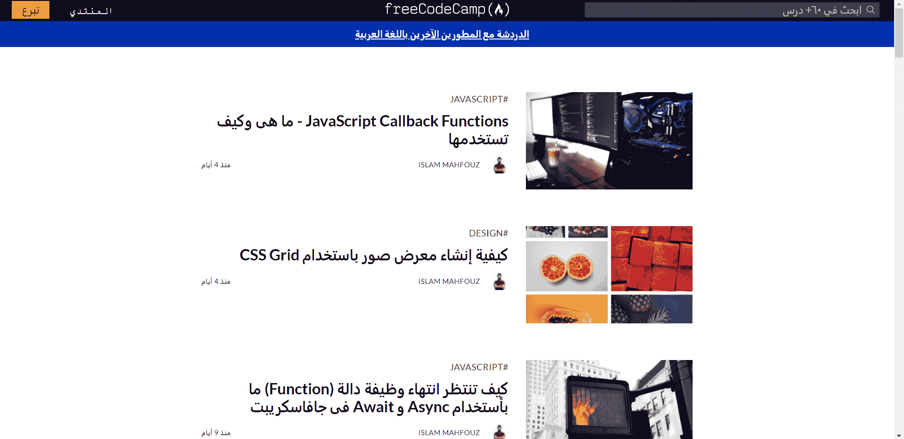

Arabic Publication

[**孟加拉语**](https://www.freecodecamp.org/bengali/news)
我们的孟加拉语刊物已经发表了 30 多篇文章，我们每周都会翻译新的文章。

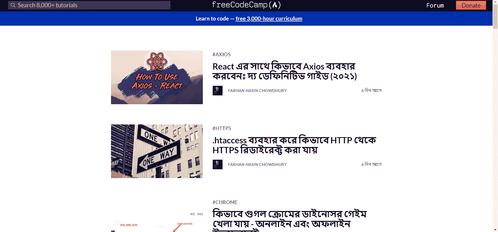

Bengali Publication

乌尔都语
我们也在积极努力创办一份乌尔都语出版物。我们已经有 29 篇文章被翻译成乌尔都语，这份出版物将很快上线。

### 翻译项目和新认证

我们还将新项目和认证翻译成多种世界语言。

**[学习编码 RPG](https://github.com/freeCodeCamp/LearnToCodeRPG)**
去年，freeCodeCamp 推出了一部由 [Lynn Zheng](https://lynnzheng.netlify.app/) 创作的视觉游戏小说，在这部小说中，你可以“自学编码，结交科技行业的朋友，追逐自己成为开发者的梦想。”

该游戏有超过 600 个计算机科学测验问题来帮助你练习编码。

[https://www.youtube.com/embed/b_IDdQzPRR4?feature=oembed](https://www.youtube.com/embed/b_IDdQzPRR4?feature=oembed)

Game Trailer

你可以在 Crowdin 中帮助我们[将游戏](https://translate.freecodecamp.org/learntocoderpg)翻译成你的母语:

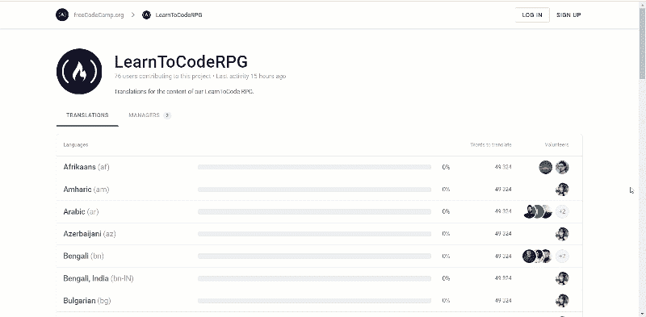

Learn to Code RPG in Crowdin.

**[Rust Course](https://www.freecodecamp.org/news/rust-in-replit/)**
我们还有一个由 [Shaun Hamilton](https://www.freecodecamp.org/news/author/shaun/) 创建的 Rust Course，你可以在 YouTube 上一步一步地学习，也可以在 Replit 上互动学习。这门课程正被翻译成多种世界语言。

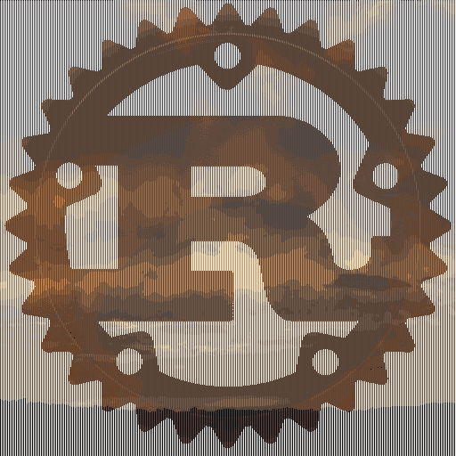

你可以在 Crowdin 帮我们[翻译这个课程](https://translate.freecodecamp.org/other-courses)。

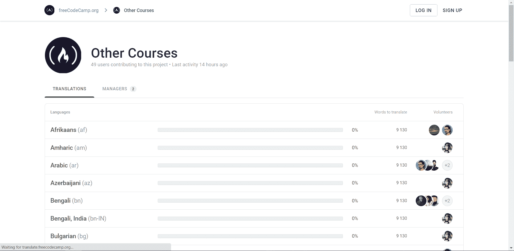

Rust course in Crowdin.

**[【测试版】响应式网页设计认证](https://www.freecodecamp.org/learn/2022/responsive-web-design/)**
我们最近发布了新的响应式网页设计课程的测试版，该课程侧重于通过交互式构建项目来学习。这个新的认证在 Crowdin 有翻译版本。

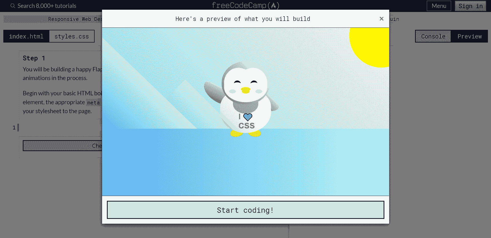

Screenshot of the "Learn CSS Transforms by Building a Penguin" lesson.

**[【Beta】](https://www.freecodecamp.org/learn/relational-database/)**
关系数据库认证今年我们还推出了这个由 [Tom Mondloch](https://www.freecodecamp.org/news/author/tom-m/) 创建的认证，在这个认证中你可以一步一步地学习如何使用关系数据库。我们还计划将该证书翻译成其他世界语言。

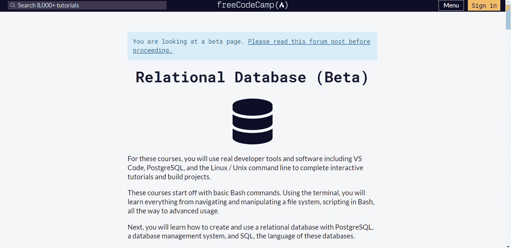

Relational Database Certification (Beta)

如你所见，我们有令人兴奋的新项目，你可以帮助我们翻译。通过翻译，你可以一边学习，一边参与改变世界各地生活的行动。

### 论坛

当你学习如何编码时，能够提问是无价的。这就是为什么我们目前有 5 种世界语言的[论坛](https://forum.freecodecamp.org/):西班牙语、意大利语、葡萄牙语、日语和中文。在这些论坛上，您可以发布编码问题，并从社区成员那里获得帮助和建议。

**💡提示:**你也可以分享你的项目，并寻求反馈。总会有社区成员乐意与您分享他们的想法和建议。

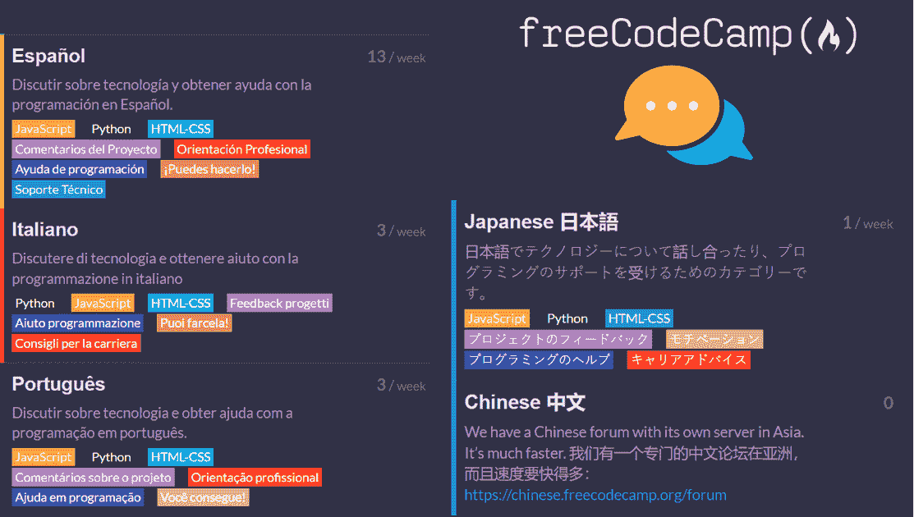

freeCodeCamp's forums in Spanish, Italian, Portuguese, Japanese, and Chinese.

### 本地化的 Twitter 帐户

我们拥有以下语言的活跃 Twitter 账户:

*   **西班牙语** : [@freecodecampES](https://twitter.com/freecodecampES)
*   **意大利语** : [@freeCodeCampIT](https://twitter.com/freeCodeCampIT)
*   **中文:** [@freeCodeCampZH](https://twitter.com/freeCodeCampZH)
*   **孟加拉语:** [@freeCodeCampBN](https://twitter.com/freeCodeCampBN)
*   **葡萄牙语** : [@freecodecampPT](https://twitter.com/freecodecampPT)
*   **日语** : [@freecodecampJA](https://twitter.com/freecodecampJA)
*   **阿拉伯语** : [@freeCodeCampAR](https://twitter.com/freeCodeCampAR)

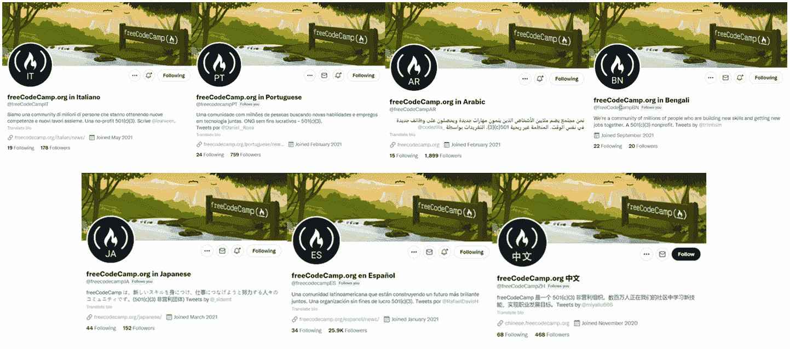

Localized Twitter Accounts

### YouTube 频道

我们认为每个人都应该有机会选择适合自己学习风格的学习资源。这也是我们在 YouTube 上创建和发布完整视频课程的原因。

目前，我们有四个本地化的 YouTube 频道:

*   [西班牙语](https://www.youtube.com/freecodecampespanol)
*   [中文](https://www.youtube.com/channel/UCjJ2wNr0beoxQN5_q3CaR1w)
*   [印地语](https://www.youtube.com/channel/UClHVZQqHLfbcbwFDwPfdB-A)
*   [孟加拉语](https://www.youtube.com/channel/UCYl5XjGuTM1gbXUuxH1e0jA)

我们在 2021 年初开始了我们的西班牙语 YouTube 频道。现在它拥有超过 76，000 名订户，超过 160 万次观看，超过 214，000 小时的观看时间。到目前为止，我们已经发布了关于 HTML、CSS、JavaScript、Python 和 React 的五门课程，并且我们正在为社区创建新的课程。

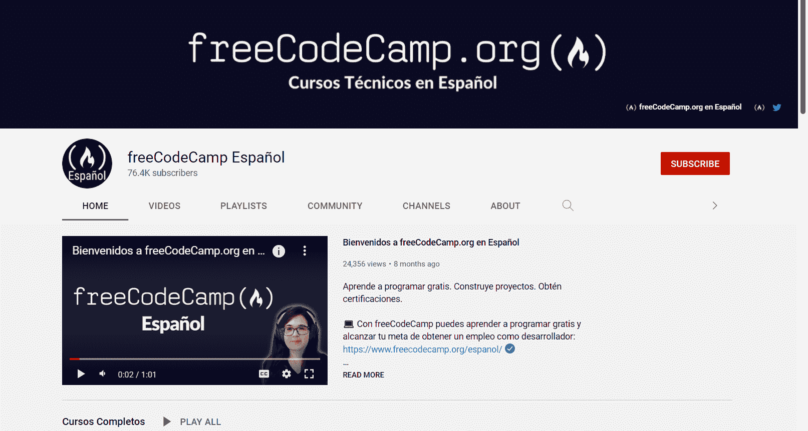

freeCodeCamp's Spanish YouTube Channel

我们的中文 YouTube 频道有超过 2960 名订户，并开设了关于 JavaScript 和 Git 的两门课程。

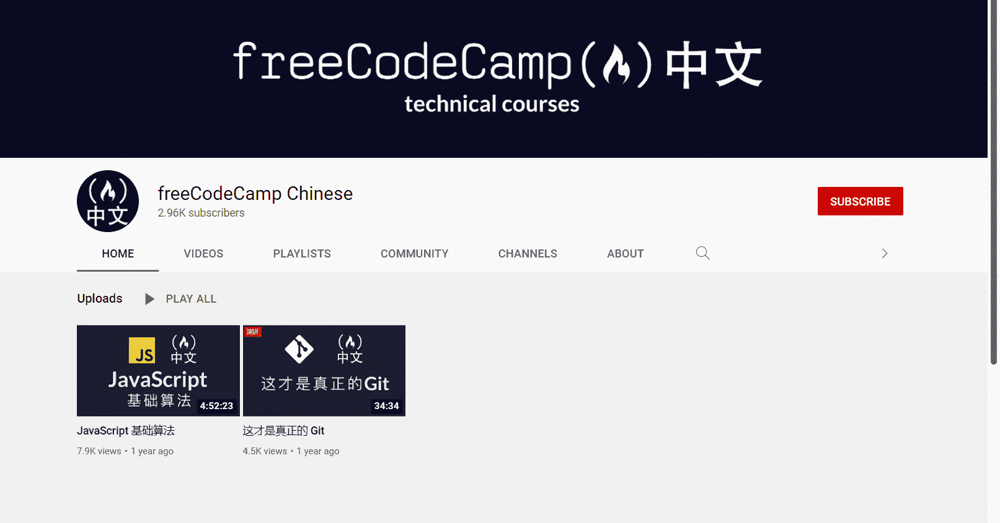

freeCodeCamp's Chinese YouTube Channel

我们的**印地语** YouTube 频道拥有超过 22，900 名订户和 22 个关于 Python、Flutter、HTML 和 CSS、Android 开发、C#和 TensorFlow 的视频和课程。

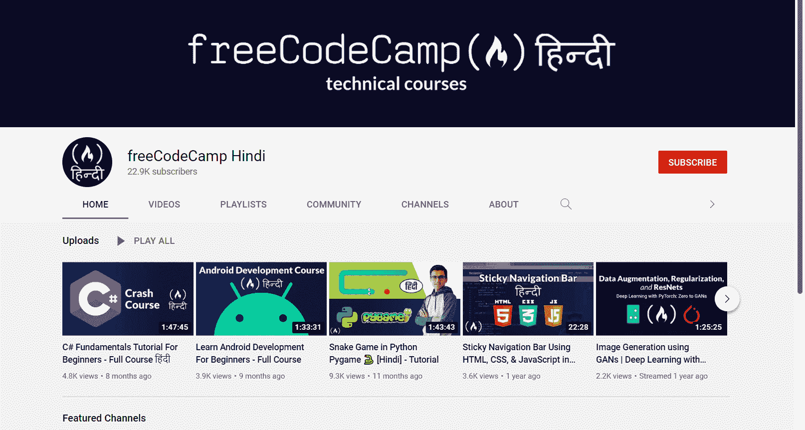

freeCodeCamp's Hindi YouTube Channel

我们的孟加拉语 YouTube 频道有 460 多名用户，还有一门关于响应式网页设计的课程。我们正积极努力用孟加拉语开设新课程。

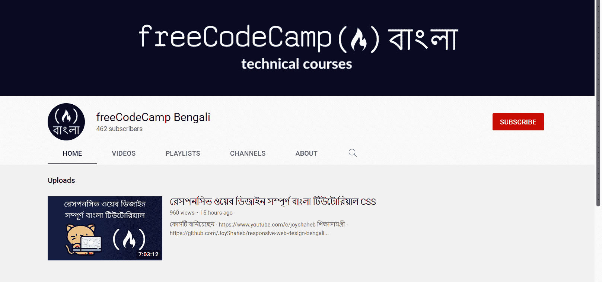

freeCodeCamp's Bengali YouTube Channel

我们正在积极努力开设一个葡萄牙语 YouTube 频道。

我们也有一个中文社区的[自由代码营哔哩哔哩](https://space.bilibili.com/335505768?spm_id_from=333.1007.0.0)账户，贡献者可以在那里分享视频教程和组织现场活动。

### 不调和

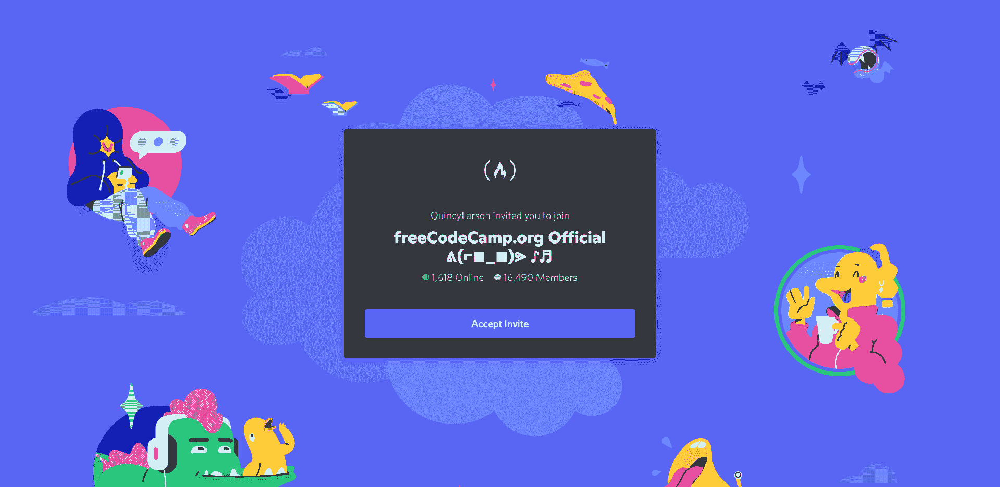

我们还有 [Discord](https://discord.com/invite/KVUmVXA) 在这里你可以加入 freeCodeCamp 社区，提出问题，学习如何做出贡献，并与社区的其他成员互动。

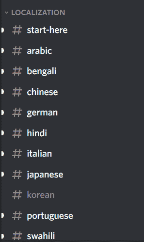

Some of our Discord chatrooms for the localization effort.

## 🔸社区领袖

现在让我把你介绍给社区领导。他们以各自的语言为母语，他们的任务包括志愿者入职、创建资源、翻译文章、准备活动以及确保志愿者一切顺利。

*   伊斯拉姆·马赫福兹 ( [@codezilla_](https://twitter.com/codezilla_) )领导着阿拉伯社区。
*   法尔汉·哈辛·乔杜里 ( [@frhnhsin](https://twitter.com/frhnhsin) )领导着孟加拉社区。
*   [Joy Shaheb](https://www.freecodecamp.org/news/author/joy/)([@ Joy Shaheb](https://twitter.com/joyshaheb))在孟加拉语 YouTube 频道领先。
*   刘 ( [@miyaliu666](https://twitter.com/miyaliu666) )是华人社区的领军人物。
*   Ilenia Magoni([@ ieahleen](https://twitter.com/ieahleen))领导着意大利社区。
*   松田隼洋子 ( [@_sidemt](https://twitter.com/_sidemt) )领导着日本社区。
*   丹尼尔·罗莎([@丹尼尔 _ _ 罗莎](https://twitter.com/Daniel__Rosa))正在领导葡萄牙人社区。
*   尼尔达·卡拉·贡萨尔维斯·德·梅洛([@尼尔达·卡拉](https://twitter.com/NieldaKarla))是葡萄牙语 YouTube 频道的负责人。
*   Rafael Hernandez([@ Rafael davish](https://twitter.com/rafaeldavish))正在领导西班牙社区。
*   estefan ia Cassingena Navone([@ estefan ia cassn](https://twitter.com/EstefaniaCassN))在西班牙语 YouTube 频道领先。
*   扎伊拉·希拉([@希拉 _ 扎伊拉](https://twitter.com/hira_zaira))正在领导乌尔都语社区。
*   希拉里·尼亚昆迪领导着斯瓦希里语社区。

## 🔹学生推荐信

我们的学习者每天都在激励我们。展示我们的翻译工作在世界各地的影响的最佳方式是阅读学生们关于 freeCodeCamp 如何改变他们的生活和影响他们的职业生涯的感言。

### 西班牙推荐书:

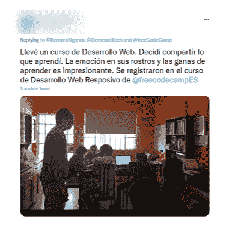

Spanish Testimonial

> **英文翻译:**
> “我带来了一门 web 开发课程。我决定分享我学到的东西。他们脸上的兴奋和学习的动力是惊人的。他们在@freeCodeCampES 注册了响应式网页设计课程。
> 
> ——译自埃斯特法尼亚·卡辛格纳·纳沃恩。

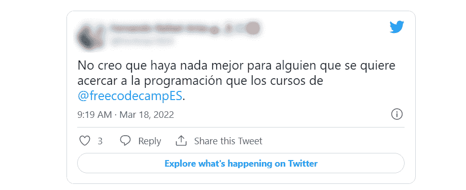

Spanish Testimonial

> **英文翻译:**
> “我觉得对于一个想开始编程的人来说，没有比@freeCodeCampES 课程更好的了。”
> 
> ——译自 Estefania Cassingena Navone。

### 中文推荐书:

[的证明陈志成陈志成](https://chinese.freecodecamp.org/news/author/zhichengchen/):

> What attracts me most about freeCodeCamp is not only his excellent online courses, but also the excellent international open source team behind him. Here, you can participate in the open source world through collaborative translation, publishing articles, sharing videos and contributing projects. You can have the opportunity to communicate with contributors from all over the world, and even receive online greetings from Quincy. Participating in open source is one of the ways to improve technology rapidly. Open source is also a spirit and a life attitude. There are many manual articles in freeCodeCamp. Unlike other manuals, the manuals in freeCodeCamp are more practical and a great way to learn. Generally, I will practice every operation step, and then deepen my understanding through translation. When I use the corresponding knowledge in my work, I will go back to the manual. From familiarity to mastery to slow mastery, I have not only participated in the open source contribution, but also improved my technical level.

> **英文翻译:**
> “我最喜欢 freeCodeCamp 的不仅仅是伟大的在线课程，还有背后伟大的国际开源团队。在这里，您可以通过合作翻译、发布文章、共享视频、参与项目等方式参与开源世界。你可以有机会与来自世界各地的贡献者交流，甚至可以收到昆西的“你好”。freeCodeCamp 有很多手册，但与其他手册不同的是，freeCodeCamp 的手册更注重实践，这是一个很好的学习方式。每个操作步骤我一般都练习一遍，然后通过翻译加深理解。当我把相应的知识用在工作中再回到手册上，从熟悉到精通再到慢慢精通，再到参与开源贡献，提高技术水平。”
> 
> ——刘译。

**见证人[罗基印骆基音](https://chinese.freecodecamp.org/news/author/luojiyin/) :**

> I am an operation and maintenance development engineer, and I learned about the front-end through freeCodeCamp. By translating English resources, you can get in touch with the latest knowledge and ideas and improve your English reading ability and Chinese writing ability. It can also speed up the spread of knowledge and facilitate others to get started.

> **英文翻译:**
> “我是一名 DevOps 工程师，通过 freeCodeCamp 了解了前端。通过翻译英语资源，我可以获得最新的知识和想法，并提高我的英语阅读和中文写作技能。它还加快了知识的传播，让其他人更容易上手。”
> 
> ——刘译。

### 阿拉伯感言:

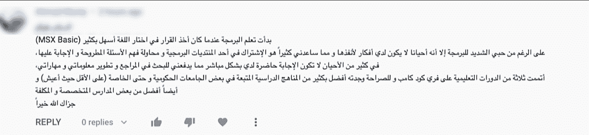

Arabic Testimonial

> **英语翻译:**
> “我已经在 freeCodeCamp 的网站上完成了 3 个认证，老实说，我发现它比公立大学甚至昂贵的私立大学教授的许多不同课程都好得多，至少在我住的地方是这样。免费代码营也比昂贵的专业学校要好。”
> 
> ——译自伊斯拉姆·马赫福兹。

## 🔹2022 年世界翻译峰会

现在，您对我们的翻译工作以及我们在世界各地社区中的影响有了更多的了解，我们为您准备了一些特别的内容。

🌐我们想邀请您参加世界翻译峰会。我们将针对不同时区举行两场会议:

*   美国东部时间 4 月 8 日星期五晚上 9 点。
*   美国东部时间 4 月 9 日星期六上午 9 点。

📌如果你能参加我们的峰会，那就太棒了。如果您有兴趣参加，请[注册](https://calendly.com/freecodecamp-org/world-translation-summit-details?month=2022-04)以收到邀请。

在峰会期间，您将见到我们的国际员工，并了解更多有关我们新项目和翻译工作进展的信息。我们将回答您的问题，并欢迎有兴趣加入我们计划的新志愿者。

通过加入我们的翻译工作和我们的国际社区，您将帮助世界各地的人们。你也将使这个世界变得更容易接近，语言不再是任何想通过奉献、教育和热情来学习和发展的人的障碍。

### 如何投稿

加入我们的翻译工作:

第一步: [填写这张谷歌表单](https://docs.google.com/forms/d/e/1FAIpQLSdWC609yj1_2afEX0G8AGQyrkGj7bhj1J4XWgCt4BJGuzQk5g/viewform)。

**第二步:** [加入 freeCodeCamp 官方 Discord](https://discord.gg/PRyKn3Vbay) 并参观“start-here”房间。然后你可以加入一个特定语言的房间，说你的母语。

Some of our Discord chatrooms for the global localization effort

请注意，Discord 有几个您需要完成的验证步骤。

If you see this message at the bottom of Discord, click the “complete” button to finish the onboarding process (where you will agree to our community rules).

或者，如果您刚刚创建了 Discord 帐户，您可能需要等待 5 分钟才能发送消息。(这是反垃圾邮件的反制措施)。

你会在几天内收到一封来自语言主管的电子邮件，了解更多关于你和你的目标的信息。他们可能会给你免费的 CodeCamp 出版物，在那里你可以开始翻译文章。

### 谢谢你

最后，我们要感谢我们出色的志愿者团队，他们为我们的翻译工作奉献了时间、知识和精力，因为没有你们，我们迄今取得的一切都是不可能的。

自由代码营的创始人昆西·拉森(Quincy Larson)想和大家分享这个信息:

> “让我们让世界上的数学、编程和计算机科学知识为每个人所用。带着爱和关怀，我们可以帮助世界各地的人们学习他们自己的母语。这是 freeCodeCamp 社区的团队努力。”

你是我们在这里的原因。我们将继续为你们工作，与你们一起确保教育对全世界的每个人都是免费的。

freeCodeCamp 有许多令人兴奋的新项目和想法，我们欢迎你加入我们的使命。这只是开始，我们可以一起做到这一点。

## 🔸峰会期间提出的问题

非常感谢您参加此次峰会。很高兴在那里见到你。我们希望与您分享您在活动中提出的问题的答案。

**我们可以用什么工具来翻译 freeCodeCamp？你有专门的术语表供投稿人参考吗？**

我们用来翻译 freeCodeCamp 的工具是本地化管理平台 [Crowdin](https://crowdin.com/) 。您可以在我们的[投稿指南](https://contribute.freecodecamp.org/#/how-to-translate-files?id=getting-started)中了解更多关于 Crowdin 以及如何为翻译工作做出贡献的信息。

**以后有没有意向/打算做 WEB 3 和区块链的课程？**

一位校友给了我们一笔捐款来开发这门课程。它不会被列在主课程中，但我们正在创建它，因为有许多相关的工作职位，我们可以教你申请这些工作所需的技能。

**离 freeCodeCamp 开始学士学位课程还有多久？**

freeCodeCamp 本身可能需要几年甚至十年才能实现这一点。但是，我们也许能够与现有的组织合作，加速这一进程。

****freeCodeCamp 会被翻译成本国语言吗？****

如果我们能找到愿意将资源翻译成这些语言的志愿者，我们肯定会的。作为一个小型非营利组织，我们需要志愿者的贡献来做到这一点。如果该课程被翻译成这些语言，我们将投入必要的资源，让该课程投入使用。

为什么 freeCodeCamp 不使用 GitHub 和 Markdown 进行翻译？

这是一个很好的建议。我们过去尝试过使用 GitHub，当我们开始使用 Crowdin 时，事情才真正开始发展，因为即使没有技术背景，每个人都可以使用它。Crowdin 提供了一个基本的机器翻译，译者可以对其进行改进。我们可以创建一个在不同文件中重复出现的重要术语的词汇表。根据我们的经验，我们的结论是 Crowdin 是一个更专业的翻译核心课程的工具。

我们使用 GitHub 为出版物翻译文章。每种语言都在尝试最适合社区的工具。

****freeCodeCamp 如何在 Crowdin 上创建词汇表？****

我们有一个存储库，在那里我们为术语表编写术语列表，并将它上传到 Crowdin。校对团队负责确保使用最准确的单词翻译。

****不去 Crowdin 上的主页面怎么开始翻译另一个文件？****

您可以从正在翻译的文件中打开另一个文件。 [Ilenia Magoni](https://www.freecodecamp.org/news/author/ilenia/) 在事件过程中一步步解释了这一点。

如果到达文件末尾，将会出现一个提示，询问您是要转到下一个文件还是选择打开哪个文件:

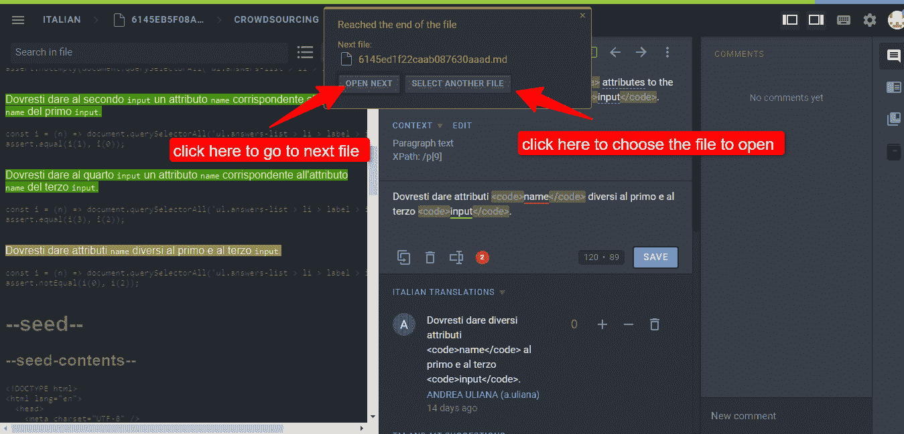

您也可以从面包屑路径打开不同的文件:

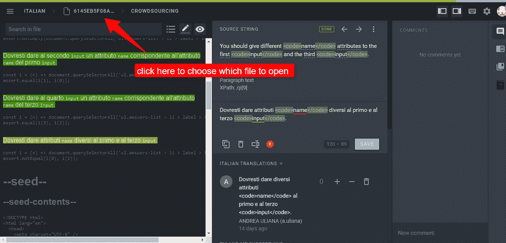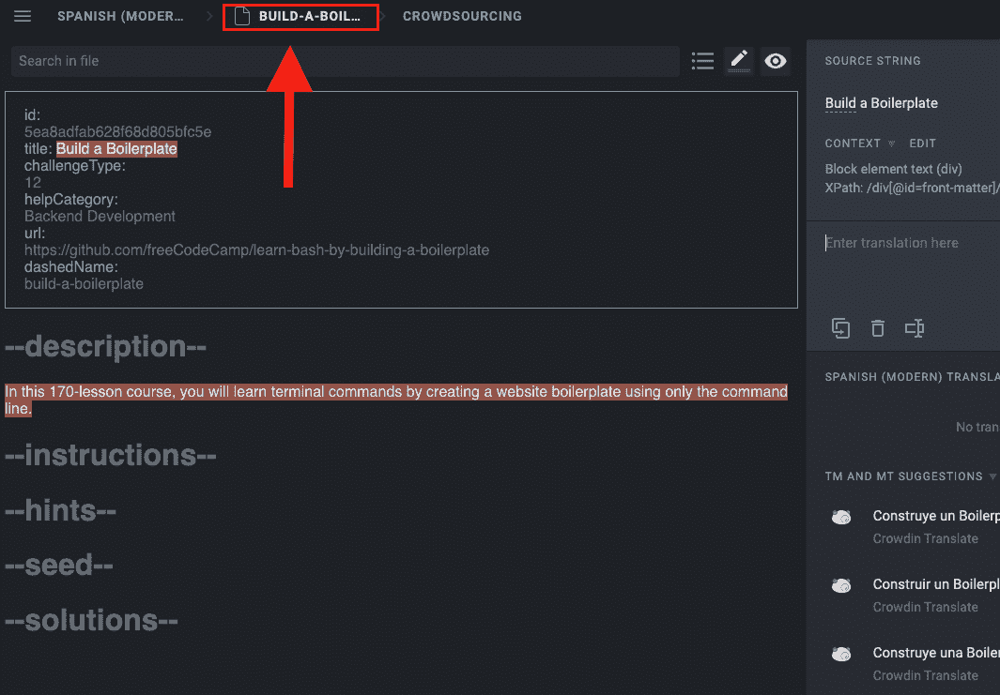

在模态中打开一个新文件，你可以看到哪些文件夹和文件还有单词要翻译。这可以帮助您选择下一步要转到哪个文件。

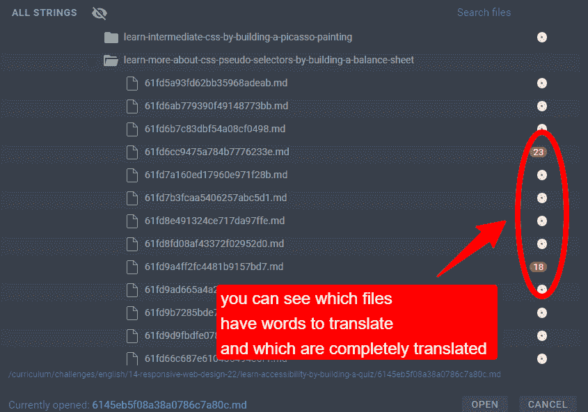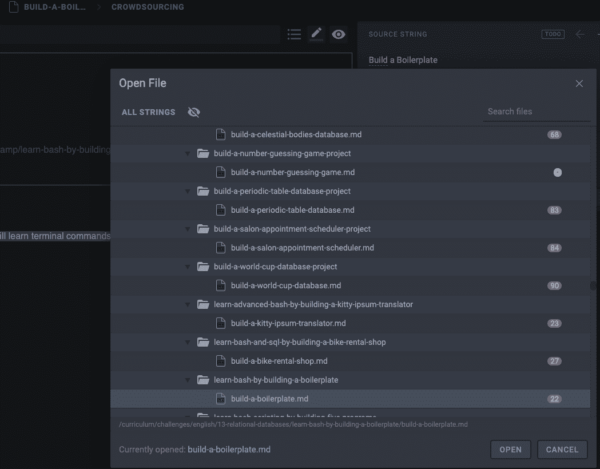