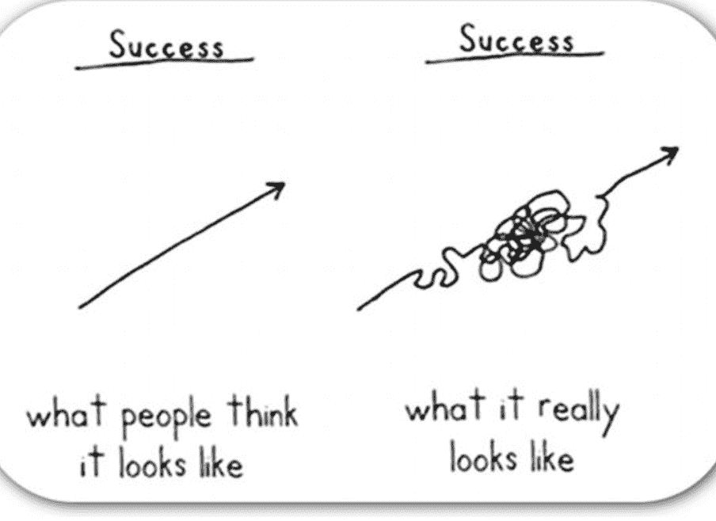

# 什么是全栈开发者？2022 全栈工程师指南

> 原文：<https://www.freecodecamp.org/news/what-is-a-full-stack-developer-full-stack-engineer-guide/>

全栈开发人员角色是当前就业市场中最受欢迎的职位之一。

但是到底什么是全栈 web 开发，如何成为全栈开发者？

在本文中，您将首先了解术语全栈的含义。

然后，您将看到一些建议学习的技术以及学习资源，以开始您的全栈 web 开发之旅。

## 什么是全栈开发？

您日常使用的 web 应用程序包括:

*   应用程序的**前端**，也称为**客户端**，
*   以及**后端**，也称为应用程序的**服务器端**部分。

### 什么是前端开发？

前端是应用的**用户界面**。

它是内容的表示，用户查看和交互的部分，以及网页的外观和感觉。这是信息在网络浏览器和移动设备上显示的方式。

它包括不同的组件，如导航栏、下拉菜单、按钮和链接。

前端由所有负责用户体验的*可见*部分组成。

### 什么是后端开发？

后端由接收和处理请求的**服务器**和用于存储数据的**数据库**组成。

后端是 web 应用程序中发生的所有幕后过程。

它是业务逻辑、数据的处理和操作以及算法。

本质上，它是用户在浏览网页和与网页交互时没有直接意识到的所有隐藏的部分。这些部分是在后台运行的进程。

后端被认为是 web 应用程序的逻辑部分或“大脑”。

前端和后端一起构成了一个全栈的 web 应用程序。

所以，全栈式 web 开发指的是负责 web 应用前端*和后端*的所有部分的知识。

## 全栈工程师指南

当你是一个刚刚开始学习之旅的初学者时，你可能会花更多的时间去寻找*要学什么*，而不是*实际上*要学什么。当谈到全栈 web 开发时，有很多东西要学——这可能是压倒性的和令人生畏的。

在接下来的部分中，我们将讨论许多您需要学习的不同技术，还有许多没有列出来。

不可能一下子学会所有的东西，就像不可能成为所有方面的专家一样。

本指南是一个建议，也是一个起点。它提供了以后可以扩展的基础。

请记住，成为全栈开发人员需要时间。这可能需要一些尝试和错误来找到一个适合你和为你工作的学习时间表和例程，因为你可能有一些承诺，如照顾家庭，全职工作，或任何其他生活义务。

成功不是线性的。

Sketch from author and comedian Demetri Martin 

成功的关键是保持一致，战胜拖延症。

制定计划，每天留出一些时间——不管是半小时还是一小时。每天一小时总比什么都不做要好。

记得休息，花点时间远离屏幕，不要在这个过程中累坏了自己。

现在，让我们来看看 2022 年成为全栈 web 开发者应该学习的一些技术。

### 对互联网和网络如何工作有基本的了解

你将会花很多时间在互联网上，设计和开发网页。

除了学习如何创建 web 应用程序、产品和服务之外，明智的做法是全面了解和很好地理解您用来实现自己目标的这些工具是如何在幕后工作并相互交互的。

例如，这是一个很好的利用你的时间来学习:

*   什么是 HTTP？
*   有哪些不同的 HTTP 方法，每种方法的含义和作用是什么？
*   HTTP 和 HTTPS 有什么区别？
*   什么是 IP 地址、域名和 DNS？
*   了解客户端和服务器，以及它们如何使用所谓的请求-响应周期进行交互。
*   互联网作为一个整体是如何运作的。

以下是一些建议的阅读材料，可以帮助你开始阅读:

*   【HTTP 如何工作及其重要性——用简单的英语解释
*   [HTTP 请求方法–Get vs Put vs Post 用代码示例解释](https://www.freecodecamp.org/news/http-request-methods-explained/)
*   什么是 HTTPS？HTTP vs HTTPS 的含义及其工作原理
*   [什么是 DNS？解释域名系统、DNS 服务器和 IP 地址概念](https://www.freecodecamp.org/news/what-is-dns/)
*   [网络如何工作:网络开发新手入门(或者任何人，真的)](https://www.preethikasireddy.com/post/how-the-web-works-a-primer-for-newcomers-to-web-development-or-anyone-really)
*   Web 如何工作第二部分:客户机-服务器模型&Web 应用程序的结构
*   网络如何工作第三部分:HTTP & REST

### 前端 Web 开发基础

通过练习 HTML 和 CSS 开始学习编码。

HTML 和 CSS 是两种服务于不同目的的语言，但是它们一起创建静态网页。因此，通常情况下你会同时学习这两种语言。

首先，学习 HTML 基础知识，特别是 HTML5，它是最新的 HTML 版本，支持更多的功能。

#### 什么是 HTML？

HTML(代表超文本标记语言)用于定义网页上的**结构**和**内容**。所以，你在页面上看到的段落、标题、列表、图像、表单和链接，以及它们的层次结构，都是 HTML 代码。

要学习的关键 HTML 概念是:

*   有许多 HTML 标签(事实上，有一百多个)，但是你只需要学习最常用的那些你最终会用得最多的。
*   学会写*语义* HTML。语义 HTML 描述了标签和它将包含的内容，而不是使用没有意义的标签。例如，如果您想在网页上创建一个包含特定内容的部分，您可以使用指定和描述标签的`<section>`标签，而不是背后没有任何意义的`
`标签。总而言之，避免使用太多的`
`标签和[学习你可以使用的替代](https://www.freecodecamp.org/news/semantic-html-alternatives-to-using-divs/)。
*   以上观点与学习写 HTML 时考虑可访问性有很好的联系。在设计和开发时考虑到可访问性意味着为每个人创建网站。有视觉障碍的人依靠辅助技术(如屏幕阅读器)大声朗读内容。患有其他残疾的人可能会依赖纯键盘导航。因此，学习编写可访问的 HTML 将引导你创建更多用户友好的网页。
*   了解如何创建 HTML 表单。几乎所有网站上都有表单。这是你登录或注册网站的方式。这也是网站从用户那里收集信息和数据的方式。

#### 什么是 CSS？

接下来，是时候学习 CSS 了。

CSS(级联样式表的缩写)样式 HTML 元素。它负责**以视觉上吸引人的方式呈现内容**。

CSS 代码支持所有不同的颜色和字体。元素的大小以及这些元素在页面上的显示方式。页面布局以及项目如何排列在一起。

开始学习 CSS 基础知识，将样式应用到纯文本 HTML 内容，包括以下主题:

*   CSS 选择器。了解选择 HTML 元素的不同方式，每种方式的工作原理，以及如何选择使用哪种方式。例如，您可以使用简单的选择器，通过标签名、类名或 id 名来选择 HTML 元素。此外，选择 HTML 元素的一种方法是使用伪元素选择器和伪类选择器。
*   学习 CSS 特异性。当两个或更多的选择器具有相同的匹配 CSS 规则时，浏览器如何决定将哪些样式应用于 HTML 元素？每个选择器都有不同的特异性值，因此了解特异性将有助于您避免不应用样式的困惑。
*   学习盒子模型。HTML 元素被认为是盒子，每个盒子由内容、填充、边框和边距组成。
*   了解在页面上定位元素的不同方式。了解相对、绝对、固定和粘性位置属性之间的区别。
*   了解展示以及`block`元素与`inline`和`inline-block`元素有何不同。
*   学习布局技术，例如创建一维布局的 Flexbox 或创建二维布局的 CSS Grid。
*   学习媒体查询和响应网页设计。如今，人们可以在许多设备上浏览网站，如笔记本电脑、手机和平板电脑，每种设备都有不同的大小和分辨率。最重要的是，网站看起来很好，并且无论在什么设备上都是可用的。

#### 如何学习 HTML 和 CSS

学习 HTML 和 CSS 的最佳起点是 freeCodeCamp 的[响应式网页设计认证](https://www.freecodecamp.org/learn/2022/responsive-web-design/)。

这是一个免费的、结构化的、经过深思熟虑的互动课程。你通过构建项目以一种实用的方式学习。

通过建立 15 个练习项目和 5 个认证项目，你将学习上面列出的所有概念(以及更多)。

完成认证项目后，您可以申请认证并将其添加到您的 LinkedIn 个人资料中。这是向你的人际网络和未来雇主展示你成就的一种方式。

### 熟悉命令行

至少了解命令行的基本知识将使您在执行重复且耗时的任务时节省大量时间，从而提高工作效率。

你可以实现同样的事情(甚至更多！)就像使用 GUI(图形用户界面)时一样。但是通过命令行，你将使用键盘导航和输入文本命令，而不是点击和拖动图标。

您可以创建文件和文件夹，查看文件和文件夹的内容，将一个文件的内容复制或移动到另一个文件，以及完全删除文件和文件夹，等等。

您可以在窗口或 CLI(命令行界面的缩写)中键入并输入命令。

根据您的操作系统，这将是一个不同的应用程序。在 Mac 上，它被称为 Terminal.app。在 Windows 上，它被称为命令提示符。

应用程序运行一个 shell，比如 Bash 或 Zsh，它充当您和计算机操作系统之间的中介。你输入命令，实质上是给你的计算机下命令。在 CLI 中运行的 shell 读取命令并指示操作系统。操作系统执行指令。

不管你用的是什么操作系统，是 MacOS 还是微软 Windows，作为一个全栈开发者，如果学习 Linux 的话会有帮助。Linux 驱动着互联网上的大多数服务器。

开始使用 Linux 的一个方法是在您的操作系统上安装它。

您可以通过设置虚拟机来实现这一点。虚拟机在您的计算机中充当独立的计算机。

一旦你设置了一个虚拟机，你就可以安装一个 Linux 发行版，比如 Ubuntu，它是 Linux 的一个版本。

以下是一些帮助您入门的资源:

*   [学习 Linux 操作系统的基础知识](https://www.freecodecamp.org/news/learn-the-basics-of-the-linux-operating-system/)
*   [学习 50 个最常用的 Linux &终端命令](https://www.freecodecamp.org/news/learn-the-50-most-used-linux-terminal-commands/)
*   [什么是虚拟机，如何在 Windows、Linux 和 Mac 上设置虚拟机](https://www.freecodecamp.org/news/what-is-a-virtual-machine-and-how-to-setup-a-vm-on-windows-linux-and-mac/)

### 学习使用代码编辑器

要开始在本地开发项目，您需要一个指定的地方来编写代码。

不建议使用像 Google Docs 或 Microsoft Word 这样的文字处理器来编写代码，而是设置一个代码编辑器来编写源代码。

有很多可供选择，其中一些最流行的是 Atom、Sublime Text 和 Visual Studio Code。许多开发人员也使用名为 VIM 的命令行文本编辑器。不建议初学者使用，因为学习曲线很陡。

Visual Studio 代码是许多开发人员的首选编辑器，您也将看到它被称为 VS 代码。

它是免费的、开源的，并且有许多可用的特性。

VS 代码拥有强大的工具和类似于 IDE(代表集成开发环境)的特性。

使用 Visual Studio 代码时，您可以编写和编辑源代码，通过代码自动完成节省时间，并使用内置调试器和终端。您可以在同一个屋檐下编译和运行源代码。

此外，使用 [Visual Studio 代码市场](https://marketplace.visualstudio.com/vscode)中提供的不同扩展可以轻松定制您的工作空间，从而进一步提高您的工作效率。

下面是为您的操作系统下载 Visual Studio 代码以及学习如何使用它的链接:

*   [下载 VS 代码](https://code.visualstudio.com/)
*   [Visual Studio 代码课程——如何提高 VS 代码的生产率](https://www.freecodecamp.org/news/learn-visual-studio-code-to-increase-productivity/)
*   [VS 代码扩展以提高开发人员的工作效率](https://www.freecodecamp.org/news/vs-code-extensions-to-increase-developer-productivity/)

### 学习版本控制系统

版本控制系统是备份和保存项目以及与其他团队成员协作的一种方式。它是每个软件开发工作中使用的工具。

最流行的版本控制系统是 Git，它是免费和开源的。

您可以查看项目的整个历史记录，并跟踪所有的更改。如果需要，您还可以恢复到以前的版本。

Git 不仅对你的个人项目实用，而且当你是团队的一员时，它也是必要的。

例如:

*   您可以在本地机器上下载(或克隆)整个项目的 codebase 源代码的工作副本。Codebase 是指组成项目的所有文件夹和文件。
*   您可以通过提取代码库中最近发生的所有更改来保持最新状态。
*   通过创建所谓的分支，您可以安全地进行更改，而不会影响原始代码库。分支允许您处理 bug 或特定的特性。
*   您可以检查您所做的修改，并将它们与原始代码库中的内容合并。

现在，你可能听说过 GitHub 这个术语，可能对 Git 和 GitHub 的区别感到困惑。

Git 是一个安装在本地管理项目的工具，而 GitHub 是一个在线托管服务。GitHub 让使用 Git 变得更容易，是你和你的团队上传代码的地方。

这里有一些对你学习 Git 和 GitHub 有帮助的资源:

*   [Git 和 GitHub 速成班](https://www.freecodecamp.org/news/git-and-github-crash-course/)
*   [Git 和 GitHub 教程——面向初学者的版本控制](https://www.freecodecamp.org/news/git-and-github-for-beginners/)
*   [Git 入门指南& GitHub](https://www.freecodecamp.org/news/the-beginners-guide-to-git-github/)
*   [如何像职业选手一样在团队中使用 Git 和 github 哈利和赫敏·🧙](https://www.freecodecamp.org/news/how-to-use-git-and-github-in-a-team-like-a-pro/)

现在您已经熟悉了命令行、Git 和 GitHub，您可以部署一个*静态* HTML 和 CSS 网页，并将其发布到互联网上。[你可以使用 GitHub pages 或者 Netlify](https://www.freecodecamp.org/news/publish-your-website-netlify-github/) 来完成这项工作。

### 学习一门编程语言

编程语言充当了人类和机器之间的翻译。

编程语言类似于人类语言。它们有像名词、动词和短语这样的语法元素。你把这些元素组合成类似句子的东西来创造意义。

这些语言中有一些很像英语。但是它们提供了一种更短、更精确、更简洁的方式来创建计算机可以理解的指令。

另一方面，像英语这样的口语/自然语言给歧义和不同人的不同解释留下了很大的空间。有了编程语言，你就不会有这种歧义。

#### 如何用 JavaScript 制作动态网页

你可能已经注意到，我使用了单词 *static* 来描述只使用 HTML 和 CSS 时创建的网页类型。

为了给 web 页面添加动态行为和交互性，您需要在使用 HTML 和 CSS 的同时使用 JavaScript。

JavaScript 是一种设计用于在浏览器中运行的脚本语言。它为静态网页增加了互动功能。

JavaScript 增加的一些交互特性有:

*   带有用户当前位置的地图
*   当用户登陆页面时显示给用户的消息
*   基于用户输入的页面变化
*   用户单击按钮时的动画
*   当有一个按钮向上滚动到页面顶部时的平滑滚动效果。

要开始学习 JavaScript，先学习基本语法，或者所谓的普通 JavaScript。

有很多概念需要学习，这不是一个完整的列表，但需要注意的一些主题是:

*   数据类型
*   变量和范围
*   条件语句
*   环
*   迭代程序
*   功能
*   目标
*   DOM 操作
*   异步 JS
*   事件处理
*   是 6 种语法
*   数组
*   数组方法
*   回收
*   承诺

开始学习 JavaScript，可以通过 freeCodeCamp 的 [JavaScript 算法和数据结构认证](https://www.freecodecamp.org/learn/javascript-algorithms-and-data-structures/)。

您将从基础知识开始，逐步学习更高级的主题，如面向对象编程和数据结构。

最后，您将构建五个认证项目，其中一些包括一个电话号码验证器和一个罗马数字转换器。

另一种提高 JavaScript 技能的有趣方式是构建游戏。

从 freeCodeCamp 的 YouTube 频道查看以下视频，开始学习吧:

*   [通过构建 7 个游戏学习 JavaScript 完整课程](https://www.youtube.com/watch?v=ec8vSKJuZTk&t=82s)
*   使用 Kaboom.js 轻松开发 JavaScript 游戏(马里奥、塞尔达和太空入侵者)-完整课程
*   [JavaScript 教程:构建 Flappy Bird 和涂鸦跳转](https://www.youtube.com/watch?v=8xPsg6yv7TU)

#### JavaScript 库和框架

在转向不同的技术之前，您需要熟悉基本的 JavaScript 概念。花时间练习并使用该语言构建一些项目。

然后，您可以学习其中一个 JavaScript 库或框架。

JavaScript 库和框架提供了实现特定功能的预写代码。它们通过创建所谓的 UI 组件，帮助您更容易、更快速地开发 web 应用程序，并且在不同部分之间具有更高的一致性。

要学习的最流行和最常用的 JavaScript 库是 ReactJS。

要学习 React，以下是一些帮助您入门的有用资源:

*   [在这个 7 小时的免费课程中学习 React JS](https://www.freecodecamp.org/news/learn-react-js-in-this-free-7-hour-course/)
*   【2022 年自由反应球场
*   [了解反应——完成路线图](https://www.freecodecamp.org/news/react-fundamentals-for-beginners/)
*   如果你是西班牙语使用者，或者有一个朋友/家庭成员是西班牙语使用者，并且想要学习 React JS，请查看 React in Spanish 上的这个 8 小时免费课程。

#### 服务器端脚本语言

作为一名全栈 web 开发人员，您需要了解前端技术和后端工具。您还需要能够使用服务器端脚本编程语言。

有很多可供选择，比如 PHP、Ruby 和 Java 等等。

关于 JavaScript 还有一点需要注意——它在前端开发中被广泛使用，但近年来许多开发人员也开始将其用于后端开发。

这都要归功于 NodeJS(一个 JavaScript 运行时环境)，它通过提供后端功能使这一切成为可能。

将 NodeJS 与 ExpressJS 服务器端 web 框架配对，您现在就能够创建全栈 web 应用程序了。

要学习 Node JS 和 Express JS，请查看以下资源:

*   [构建四个 Node.js 和 Express.js 项目](https://www.freecodecamp.org/news/build-six-node-js-and-express-js/)
*   [通过这个免费的 8 小时后端开发课程学习 Node.js 和 Express】](https://www.freecodecamp.org/news/free-8-hour-node-express-course/)

### SQL 和关系数据库知识

作为一名全栈开发人员，您需要知道如何与数据库交互。

数据库分为两类，关系型和非关系型。

**关系数据库(也称为 SQL 数据库)**以结构化、有组织的表格格式存储数据。

数据点之间有明确定义的关系，这使得数据搜索变得容易。

一些关系数据库包括:

*   关系型数据库
*   一种数据库系统
*   神谕
*   Microsoft SQL Server
*   SQLlite

与关系数据库通信和操作存储数据的方法是使用 SQL(结构化查询语言的缩写)等查询语言来查询它们。

它有助于理解关系数据库和 SQL 是如何工作的。freeCodeCamp 的[关系数据库课程](https://www.freecodecamp.org/learn/relational-database/)是开始学习的好地方。

您将通过使用 SQL 和 PostgreSQL 的交互式教程和项目学习关系数据库。

**非关系数据库(也称为 NoSQL 数据库)**不在表中存储数据。

相反，它们以一种不太结构化的方式存储数据，并且项目彼此不相关，这允许更大的灵活性。

最流行的非关系数据库是 MongoDB。

MongoDB 以及前面提到的一些技术是 MERN 堆栈的一部分。MERN 堆栈是一套用于开发全堆栈 web 应用程序的工具。

综上所述，这就是 MERN 的含义:

*   **M** ongoDB 是存储数据的非关系数据库。
*   xpressJS 是一个位于 Node JS 之上的服务器端 web 框架。
*   eactJS 是一个 JavaScript 客户端 web 库，用于构建用户界面
*   odeJS 是 JavaScript 运行时环境，用于在服务器而不仅仅是浏览器上运行 JavaScript。

要了解更多关于 MongoDB 的信息，这里有一些资源供您参考:

*   [后端开发和 API 认证](https://www.freecodecamp.org/learn/back-end-development-and-apis/)
*   [MongoDB 全程 w/ Node.js，Express，&mongose](https://www.freecodecamp.org/news/mongodb-full-course-nodejs-express-mongoose/)
*   [通过构建一个运动跟踪器应用程序学习 MERN 堆栈(MERN 教程)](https://www.freecodecamp.org/news/learn-the-mern-stack-tutorial/)

## 结论

希望这篇文章对您有所帮助，并且您现在对全栈 web 开发有了更好的理解。

在本文中，我们回顾了全栈开发的定义，您看到了一条建议的学习路径，可以帮助您开始全栈开发。

感谢您的阅读！