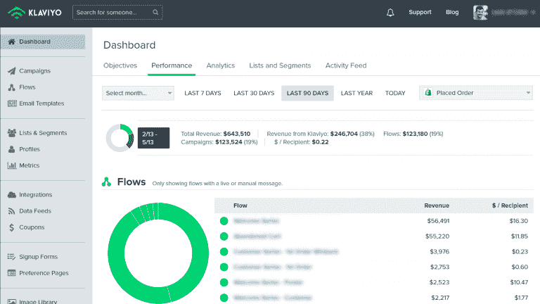
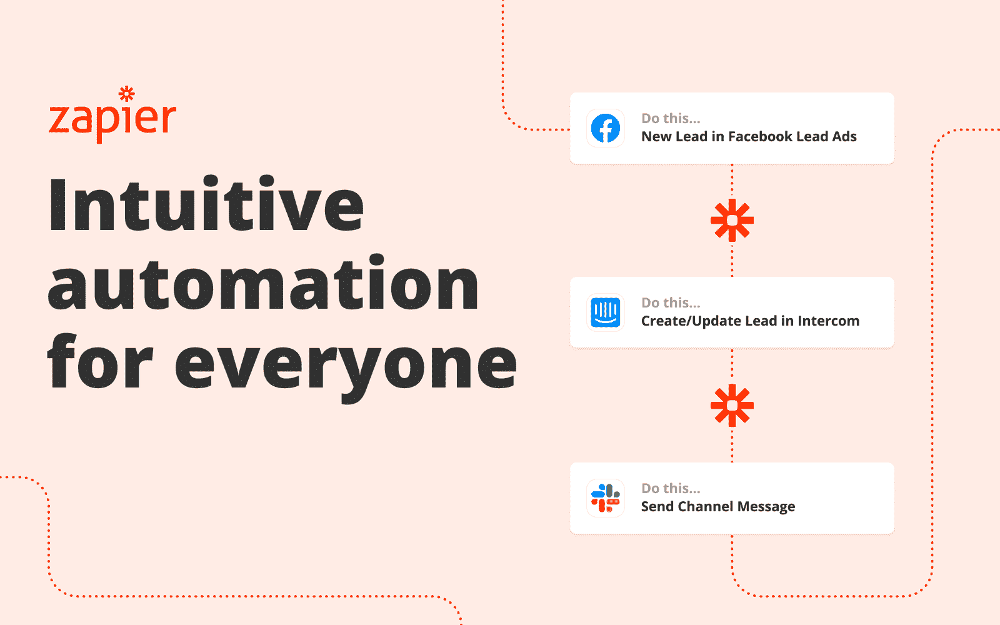

# Shopify 电子邮件自动化–如何自动发送电子邮件

> 原文：<https://www.freecodecamp.org/news/shopify-email-automation/>

电子邮件自动化在电子商务领域并不新鲜。这是一个非常简单明了的概念。

电子邮件自动化就是根据网站上发生的事件向客户发送电子邮件，如废弃购物车电子邮件、订单确认电子邮件、运输确认电子邮件等。

结果呢？您不必手动完成这项工作，从而节省了时间。

## 为什么电子邮件自动化很重要

电子邮件仍然是最有效的营销渠道之一。电子邮件营销比任何其他形式的数字广告都有更高的投资回报率，即使我们拥有所有新工具，它仍然是最具成本效益的渠道。

给你的邮件添加自动化功能可以让它们走得更远。电子邮件会根据您设置的触发器自动发送，以便在您的客户最有可能转化时发送给您。自动化还允许您在没有任何人工工作的情况下大规模发送消息。

电子邮件还提供了一条与你的客户直接沟通的渠道，如果处理得当，它会成为人们期待打开的东西。

这是一个强大的工具，但它不仅仅是发送更多的电子邮件，而是发送更好的邮件。

[Shopify 电子邮件自动化](https://www.weblime.com/stories/shopify-automation/)让您在每位客户与您的企业进行单独互动时向他们发送个性化电子邮件，并根据他们的购买行为和浏览活动接收后续消息，甚至根据他们的购买历史向他们提供建议。

这篇文章将涵盖不同类型的电子邮件自动化，它们的目的是什么，以及它如何使客户和电子商务商店受益。

## 为什么 Shopify 电子邮件自动化至关重要？

在您的 Shopify 商店上实现电子邮件自动化有很多原因。以下是几个例子:

*   它节省时间。
*   它增加了参与度。
*   它提高了转化率。
*   它增强了客户体验。
*   它节省时间。

### 节省时间

电子邮件自动化可以通过自动化繁琐、重复的任务来节省您的大量时间，否则这些任务将需要手动和单独为每个收件人完成。

这在短时间内发送大量电子邮件时特别有用，例如在活动邀请或电子邮件营销活动中。

### 建立信任

您可以使用电子邮件自动化来建立与客户的信任，这将有助于增加您的品牌和业务的参与度。

你也可以用它来与你的订户建立关系，增加他们购买或向他们的朋友和家人推荐你的可能性。

### 提高转化率

作为一个企业主，你要思考如何不断提高自己的转化率。如果你想扩大业务，这一点尤其正确。

使用**电子邮件营销自动化**软件的一个最大好处就是可以提高你的转化率。

如果使用得当，电子邮件自动化可以帮助你在更短的时间内联系到更多的人。它还可以帮助你让他们对你提供的东西足够感兴趣，这样他们就会真正从你这里购买，而不是漫无目的地浏览你的网站。

## Shopify 电子邮件营销自动化软件

### 克拉维约

Klavyio 是一个工具，您可以使用它来设置自动化的电子邮件工作流程。它是一个第三方工具(不是由 Shopify 开发的),可以与您的商店集成，帮助您与客户建立更牢固的关系，并增加销售额。

使用 Klavyio，您可以创建当客户从您的商店购买产品或放弃购物车时自动发送的电子邮件。您还可以设置在有人浏览您的网站后，或者即使有一段时间没有人访问，在不同的时间发送电子邮件。

不确定如何在商场使用 Klavyio？以下是一些想法:

*   当有人将物品留在购物车中但没有购买时，发送回收废弃购物车的电子邮件。您可以使用 Klavyio 中的个性化功能来显示他们留下的特定产品，这样他们更有可能回来购买。
*   向现有客户发送关于新产品或商店促销的简讯。这是让人们了解你店里发生的事情的好方法。
*   开始建立以前向你购买过产品的客户群。然后给他们发送其他人无法获得的独家优惠。

它是这样工作的:

*   Klaviyo 会收集您所有的客户数据，并允许您通过电子邮件、自有渠道积累经验，并衡量收入结果。
*   Klaviyo 使用机器学习来分析你的客户，并将其分为最有可能购买的细分市场。
*   Klaviyo 根据每个细分市场最感兴趣的内容自动创建个性化电子邮件。

这样，你就确切地知道该发送什么以及何时发送。

如果客户将产品添加到购物车中，但没有结账，一段时间后会触发废弃购物车电子邮件。这封邮件包括留在购物车中的产品清单。在许多情况下，这是顾客回到他们的购物车并完成交易的时候。

将产品添加到购物车的人是合格的销售线索。您可以使用废弃的购物车电子邮件自动化流程将他们带回购物车并完成交易。

废弃的手推车在一段设定的时间后被触发，通常在 60 分钟到 24 小时之间。邮件中的产品列表会提醒他们正在做什么，并引导他们回到结账页面。

### 扎皮尔

Zapier 是一项基于网络的服务，允许您连接您最喜爱的网络应用程序并自动化工作流程，而无需学习如何编码。这是扩展现有应用功能的好方法。

扎皮尔使用了一个触发动作模型。触发器启动工作流，操作结束工作流。

Zapier 会自动在您的网络应用程序之间移动信息，以便您可以专注于最重要的工作。

要使用 Zapier，您首先需要选择要在其间创建自动化的应用程序。您可以搜索您的应用程序(Shopify、Gmail 等)，也可以滚动热门应用程序列表。

以下是 Zapier 如何帮助你:

1.  向点滴营销活动添加新的销售线索
2.  购买后触发跟进电子邮件
3.  发送预定义的电子邮件回复
4.  将提交的联系人表单转发到您的收件箱
5.  将新联系人添加到您的电子邮件列表中

最精彩的部分？你不需要任何技术技能或大笔预算。如果你可以点击和输入，Zapier 可以帮助你自动化你的电子邮件营销——等等。

对于电子邮件营销服务，这意味着 Zapier 可以监听事件，然后在其他应用程序中触发操作。

例如，当有人订阅您的邮件列表或有人从您的 Shopify 商店购买某些东西时，可以指示 Zapier 将用户的信息发送到您的 CRM。

或者，如果用客户/用户数据——姓名、电子邮件、电话号码——创建了一个新的 Google Sheets 行，Zapier 可以自动将该人作为订户添加到您的邮件列表中。

### 整合体

Integromat 是一个强大的工作流自动化平台，专注于可伸缩性、可靠性和灵活性。它使您能够将 Shopify 触发器和操作连接到其他应用程序、web 服务或 API 端点。

该平台为开发人员提供了一系列功能，如对数据流的完全控制、API 创建和管理工具，以及为非技术用户提供的场景构建器。

Integromat 还允许您自动化复杂的流程，否则需要雇用有经验的开发人员。

下面是使用这种集成可以做的一些事情:

*   当您的客户注册您的商店或在商店下订单时，立即发送欢迎电子邮件、确认和评论
*   根据每位顾客购买的产品使用不同的模板
*   根据用户的活动、位置和购买历史对其进行细分。

## 外卖食品

如果您明智地实施，Shopify 电子邮件自动化可以成为您的销售伙伴。

从长远来看，电子邮件自动化可能会成为你最好的朋友，尤其是在营销方面。如果你很难决定采取哪种策略，那么想想这个:电子邮件自动化旨在帮助你改善销售体验，并最终增加销售额。

这不仅仅是市场营销。电子邮件自动化可以在客户的整个旅程中使用，以改善他们的体验。

既然你对 Shopify email automation 有了更多的了解，那就没有理由不去研究和了解它——因为肯定有很多东西等着你。