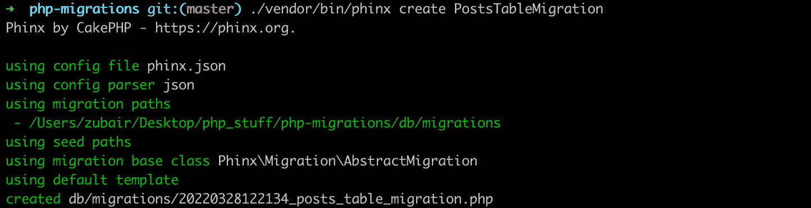
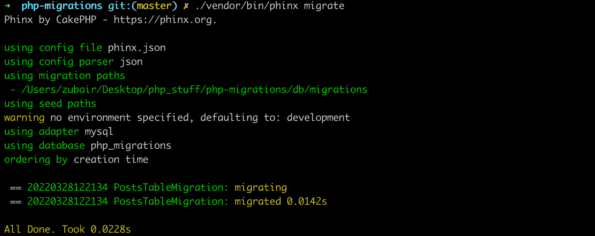
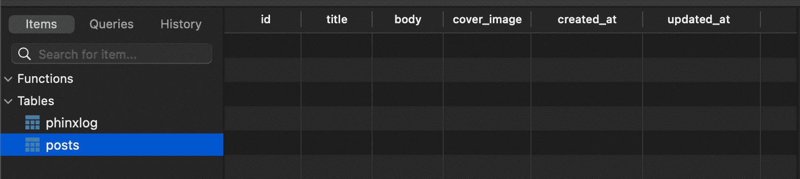
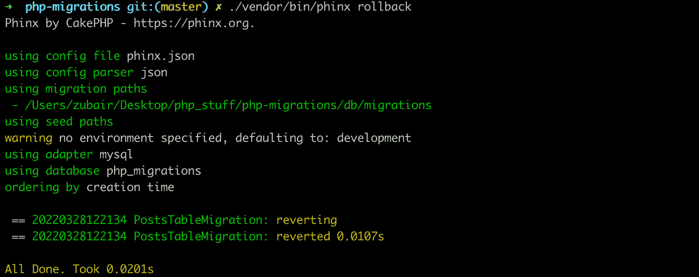
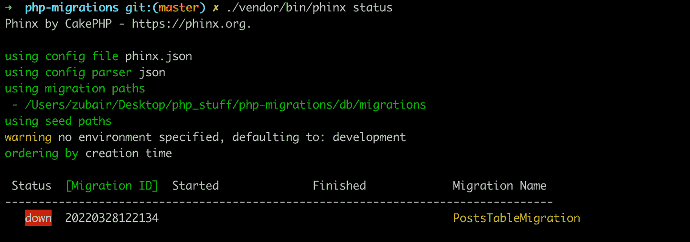

# 如何使用 Phinx 在 PHP 中迁移数据库

> 原文：<https://www.freecodecamp.org/news/easy-database-migrations-in-php-using-phinx/>

构建现代 web 应用程序通常涉及大量数据。在开发和生产过程中管理这些数据(数据库)可能会很麻烦。

如果有不止一个开发人员，以及必须手动实现变更的多个环境，这一点尤其正确。

数据库迁移帮助开发人员跨多个环境和开发人员轻松管理这些变化。

这篇文章解释道:

*   什么是数据库迁移。
*   如何使用 Phinx 在 PHP 中开始数据库迁移？
*   如何管理数据库中的表？

这篇文章是为具有基本 PHP 知识的读者准备的。它将帮助您学会更容易(和更好地)管理您的数据库。

## 什么是数据库迁移？

基本上，迁移包含您希望对数据库进行的更改。这些更改可能是创建或删除表、添加或删除表中的某些字段、更改列类型等等。

这些文件使得跨多个系统进行相同的更改变得容易，因为任何人都可以运行这些文件，并更新他们的数据库。

因此，在现实生活中，团队中的一些开发人员可以对*用户*表进行更改，以允许*性别*字段接受比默认的*男性*和*女性*更多的选项，也许还有第三个*其他*选项。

完成这一更改后，开发人员创建一个迁移。这种迁移包括他们对数据库所做的更改——在这种情况下是对表中一列的更改——其他开发人员可以通过运行迁移轻松地将这种更改应用到他们自己的本地数据库中。

> 迁移就像数据库的版本控制，允许您的团队定义和共享应用程序的数据库模式定义。如果您曾经不得不告诉团队成员在从源代码控制中获取更改后，手动向他们的本地数据库模式中添加一列，那么您就面临着数据库迁移可以解决的问题。- [拉勒维尔](https://laravel.com/docs/9.x/)

许多流行的 web 框架已经内置了对迁移的支持。但是在本文中，我们将探索如何在普通 PHP 中使用迁移。

点击了解更多关于数据库迁移的信息[。](https://www.cloudbees.com/blog/database-migration)

## 什么是 Phinx？

> Phinx 是一个 PHP 库，它让管理 PHP 应用程序的数据库迁移变得非常简单。菲尼克斯

Phinx 使得轻松管理迁移成为可能，无论您是否使用 PHP 框架。它也很容易安装(我们将在后面看到)。

它附带了几个命令来简化操作。它是完全可定制的(你可以用它做任何你想做的事🙃).它还可以在多种环境中工作，这意味着您可以进行一些生产迁移、测试迁移和开发迁移。

## Phinx 安装

可以使用 composer 将 Phinx 添加到任何 PHP 项目中。

```
$ mkdir php-migrations
$ cd php-migrations
$ composer init
```

第一个命令在当前目录`php-migrations`中创建一个文件夹，第二个命令移动到这个文件夹中。最后一个命令启动一个交互式 shell。

按照提示，根据需要填写详细信息(默认值即可)。您可以设置项目描述、作者姓名(或贡献者姓名)、依赖关系的最低稳定性、项目类型、许可证，并定义您的依赖关系。

当到达依赖部分时，安装`robmorgan/phinx` *phinx* 包作为依赖项。

接受其他默认值，并继续生成`composer.json`文件。当前生成的文件应该如下所示:

```
{
    "name": "zubair/php-migrations",
    "description": "A simple tutorial on how to use and manage migrations in PHP applications.",
    "type": "project",
    "require": {
        "robmorgan/phinx": "^0.12.10"
    },
    "license": "ISC",
    "autoload": {
        "psr-4": {
            "Zubs\\": "src/"
        }
    },
    "authors": [
        {
            "name": "Zubs",
            "email": "zubairidrisaweda@gmail.com"
        }
    ]
} 
```

Composer generated composer.json

## 初始化 Phinx

安装 Phinx 后，你需要初始化它。您可以使用安装在`vendor`文件夹中的二进制文件非常容易地做到这一点。

```
$ ./vendor/bin/phinx init
```

这将 phinx 的配置文件创建为 PHP 文件。它也可以创建为 JSON 文件。对于配置，我更喜欢 JSON，所以我将使用 JSON 格式。

```
$ ./vendor/bin/phinx init --format=json
```

默认配置文件如下所示:

```
{
    "paths": {
        "migrations": "%%PHINX_CONFIG_DIR%%/db/migrations",
        "seeds": "%%PHINX_CONFIG_DIR%%/db/seeds"
    },
    "environments": {
        "default_migration_table": "phinxlog",
        "default_environment": "development",
        "production": {
            "adapter": "mysql",
            "host": "localhost",
            "name": "production_db",
            "user": "root",
            "pass": "",
            "port": 3306,
            "charset": "utf8"
        },
        "development": {
            "adapter": "mysql",
            "host": "localhost",
            "name": "development_db",
            "user": "root",
            "pass": "",
            "port": 3306,
            "charset": "utf8"
        },
        "testing": {
            "adapter": "mysql",
            "host": "localhost",
            "name": "testing_db",
            "user": "root",
            "pass": "",
            "port": 3306,
            "charset": "utf8"
        }
    },
    "version_order": "creation"
} 
```

在这个配置文件中，注意 Phinx 期望您默认拥有一个`db/migrations`路径(用于您的迁移)。如果你愿意，你可以把它换掉，但我认为它很好，我会留着它。

```
$ mkdir db && db/migrations
```

你可以在[官方文档](https://book.cakephp.org/phinx/0/en/configuration.html)中读到更多关于这些配置的信息。

Phinx 还附带了不同动作的命令，以便在我们的项目中更容易使用。

## 如何创建迁移

Phinx 使用类进行迁移。要创建一个新的迁移(比如创建一个*帖子*表)，使用带有迁移名称的`create`命令。

```
$ ./vendor/bin/phinx create PostsTableMigration
```



Creating A Migration

这将在之前创建的`db/migrations`目录中创建一个`20220328122134_posts_table_migration.php`文件。该文件使用`YYYYMMDDHHMMSS_my_new_migration.php`格式命名。在这种格式中，前 14 个字符 *YYYYMMDDHHMMSS* 表示当前时间戳。

``20220328122134_posts_table_migration.php`` 目前看起来是这样的:

```
<?php
declare(strict_types=1);

use Phinx\Migration\AbstractMigration;

final class PostsTableMigration extends AbstractMigration
{
    /**
     * Change Method.
     *
     * Write your reversible migrations using this method.
     *
     * More information on writing migrations is available here:
     * https://book.cakephp.org/phinx/0/en/migrations.html#the-change-method
     *
     * Remember to call "create()" or "update()" and NOT "save()" when working
     * with the Table class.
     */
    public function change(): void
    {

    }
} 
```

Newly created migration file

这个文件(以及所有其他使用 Phinx 创建的迁移)扩展了`Phinx\Migration\AbstractMigration`类。这个类包含了你与数据库交互所需的所有方法。

这个迁移文件还包括一个`change`方法。这种方法最近在 Phinx 0 . 2 . 0 版本中引入，以实现 Phinx 的可逆迁移思想。

这些是只有一种方法的迁移文件， *change，*它包含执行某些动作的逻辑，让 Phinx 去想办法逆转它。而不是传统的使用两种方法，*向上*和*向下*，来创建和反转动作。

> Phinx 仍然允许你使用 *up* 和 down 方法。但是当它们一起使用时，它给了 change 方法优先权。它忽略了它们。

## 如何管理表格

表是构建结构化数据库的基础，也是 Phinx 提供的最重要的部分。

你可以用 PHP 代码和 Phinx 轻松管理数据库表。Phinx 提供了一个强大的`table()`方法。这个方法检索一个*表*对象的实例。

### 如何创建表格

使用 Phinx 创建表格非常简单。使用带有表名的`table()`方法创建一个*表*对象的新实例。

```
$table = $this->table('posts');
```

接下来，您可以添加列及其设置。

```
$table->addColumn('title', 'string', ['limit' => 20])
	->addColumn('body', 'text')
    ->addColumn('cover_image', 'string')
    ->addTimestamps()
    ->addIndex(['title'], ['unique' => true]);
```

在这里，我创建了列`title`、`body`、`cover_image`、`created_at`和`updated_at`。我还将`title`的类型设置为包含 20 个或更少字符的*字符串*。

我将`body`设置为一个文本字段，这样它就可以存放长文。`cover_image`也是一个*字符串*字段，它使用字符串的默认大小(255)。

`created_at`和`updated_at`字段是在`addTimestamps()`方法中自动生成的时间戳。

最后，我将`title` 字段设置为唯一的(就像在真实的博客中一样)。

您可以通过检查[有效列类型](https://book.cakephp.org/phinx/0/en/migrations.html#valid-column-types)来获得所有可用的列类型。您也可以通过检查[有效列选项](https://book.cakephp.org/phinx/0/en/migrations.html#valid-column-options)来获得所有可用的列选项。

最后，您可以说应该使用`create`方法创建数据库。

```
$table->create();
```

最后，您的迁移文件的 *change* 方法应该如下所示:

```
public function change(): void
{
    $table = $this->table('posts');

    $table->addColumn('title', 'string', ['limit' => 20])
        ->addColumn('body', 'text')
        ->addColumn('cover_image', 'string')
        ->addTimestamps()
        ->addIndex(['title'], ['unique' => true]);

     $table->create();
}
```

我们现在可以运行这个迁移来创建我们的表。

## 如何运行迁移

创建迁移后，下一步是在数据库中实施这些所需的更改。运行迁移实际上会强制执行这些更改。

```
$ ./vendor/bin/phinx migrate
```



Running a migration

此图显示了迁移的结果。您可以看到运行迁移所花费的时间。

现在，如果您检查您的数据库 GUI 工具，您会注意到, *posts* 表是用一个附加字段, *id* 字段创建的。默认情况下，该字段也是主字段。它还会自动递增。



*posts* table.

您可以通过将其他字段指定为主字段，或者将 *id* 字段映射到所需的主字段，将主键更改为其他键。后者包括普通 *id* 字段的自动递增能力。

```
$table = $this->table('posts', [
    'id' => false,
    'primary_key' => ['posts_key']
]);

$table = $this->table('posts', [
    'id' => 'posts_key',
]);
```

Changing The Primary Key

在第一种方法中，要使用的主键必须是表上的一列(它不是自动创建的)。

您还可以设置要运行迁移的环境。

```
$ ./vendor/bin/phinx migrate -e testing
```

### 如何逆转移民

迁移可以通过*停止*来逆转。这与迁移*到*的过程相反。先前创建的表将被删除，添加的列将被删除，数据库将返回到迁移前的初始状态。

```
$ ./vendor/bin/phinx rollback
```



Reversing a migration

### 如何检查迁移状态

随着应用程序规模的增加，预计数据库迁移也会增加。因此，在某些时候，您可能希望检查迁移的状态，以了解哪些已经运行，哪些没有运行。

```
$ ./vendor/bin/phinx status
```



Checking migration status

### 如何删除表格

在*表*对象上，您可以很容易地使用`drop`方法，然后使用`save`方法来保存更改。

```
$this->table('posts')->drop()->save();
```

### 如何重命名表格

```
$table = $this->table('posts');

$table->rename('articles')
    ->update();
```

要删除表格，请获取表格。然后使用带有新名称的`rename`方法，接着使用`update`方法来保存这个更改。

### 如何更改表的主键

您还可以非常容易地更改表的主键。

```
$table = $this->table('posts');

$table->changePrimaryKey('new_primary_key');

$table->update();
```

## 结论

现在您知道了如何在 PHP 应用程序中设置迁移。

如有任何问题或相关建议，欢迎联系我分享。

要阅读更多我的文章或关注我的工作，您可以在 [LinkedIn](https://www.linkedin.com/in/idris-aweda-zubair-5433121a3/) 、 [Twitter](https://twitter.com/AwedaIdris) 和 [Github](https://github.com/Zubs) 上与我联系。又快又简单，还免费！