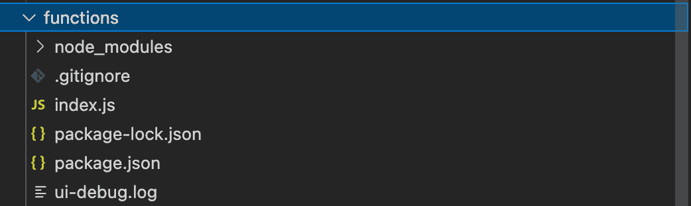
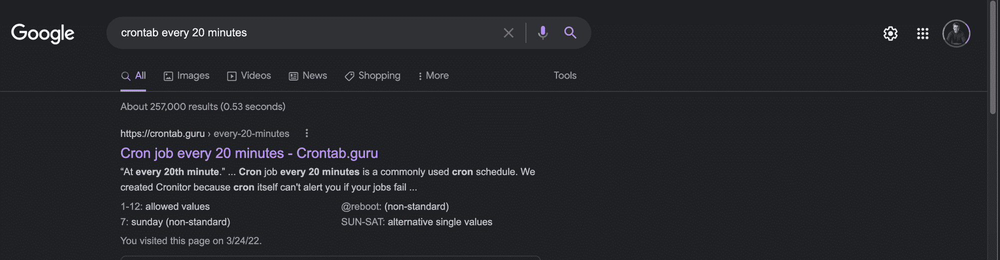
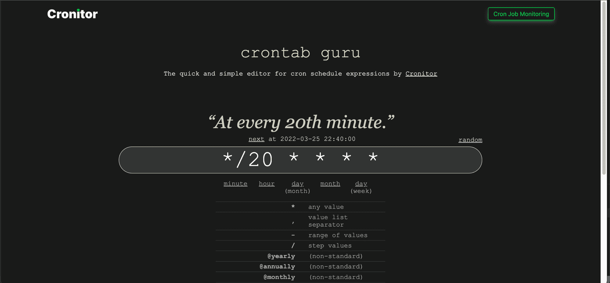
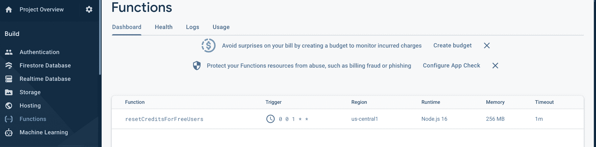
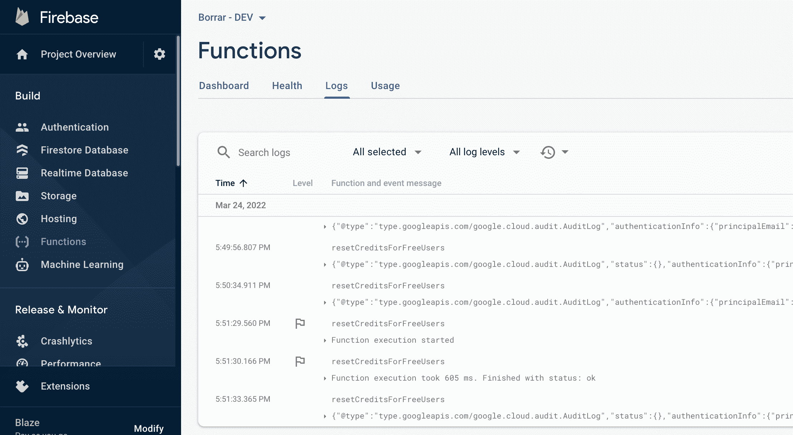

# 如何使用 Firebase 计划云功能计划任务

> 原文：<https://www.freecodecamp.org/news/how-to-schedule-a-task-with-firebase-cloud-functions/>

我开发了一个应用程序，可以移除任何图像的背景。

该应用程序将有一个免费增值计划，这意味着我将向所有用户提供免费的信用点数，如果他们需要更多的信用点数，他们需要购买更多。

我的 Android 和 iOS 应用程序使用 Firebase 和 Google 云服务，如 App Engine 和 Google Storage。

我在开发过程中遇到的一个问题是，**“我如何才能在每个月的 1 号重置免费积分？”。**

我很担心，因为我没有计划，但后来我发现了一些东西。

幸运的是，Firebase 提供了预定的云功能，拯救了我的一天。

在我解释如何创建预定的云功能之前，我想告诉你我的使用案例:

> 每个月的第一天，从 Firestore 查询所有未付费用户，并将他们的信用点数更新到某个阈值，例如 20。

## 创建 Firebase 定时云功能需要什么？

1.  一个燃烧基地项目
2.  安装 Firebase CLI 或查看以下说明
3.  Node.js 已安装
4.  你最喜欢的 IDE

这里有一些好消息——你不需要任何后端开发经验来跟进和实现它。

我们开始吧。

## 项目设置

创建一个新文件夹。在这个演示中，我称它为函数。它可以在当前项目之外，也可以在现有项目中创建另一个文件夹。

若要安装所需的依赖项，请在新项目文件夹中运行以下命令:

`npm install -g firebase-tools`

以上命令将安装 Firebase CLI。如果您还没有登录到 Firebase 项目，您可以在您的终端`firebase login`中运行。

登录 Firebase 项目后，从终端运行`firebase init`。

这将创建所有需要的文件(。gitignore、index.js 和 package.json)。

在里面。gitignore，你会发现。忽略 node_modules 文件夹。

我们将在 index.js 文件中工作。

在 package.json 中，我们将找到一些稍后会用到的脚本。

下面你可以看到`firebase init`命令后的文件夹结构。



Structure of the folder after firebase init command is run

## 我们来编码吧！

打开 index.js 并添加以下代码。我建议不要复制代码，而是一行一行地写，以便更好地理解。

```
const functions = require("firebase-functions");
const firebase = require("firebase-admin");
firebase.initializeApp()
var firestore = firebase.firestore()

exports.resetCreditsForFreeUsers = functions.pubsub
    .schedule('0 0 1 * *')
    .onRun(async (context) => {
        const users = firestore.collection('users')
        const user = await users.where('isPayingUser', '==', false).get()
        user.forEach(snapshot => {
            snapshot.ref.update({ credits: 10 })
        })
        return null;
    })
```

感觉前四行不言自明，不过我来解释一下。

前两个是进口的。在第三个示例中，我们初始化 Firebase 应用程序，在第四个示例中，我们访问 Firestore 对象。

`exports.resetCreditsForFreeUsers`是我们的功能。

```
functions.pubsub
  .schedule('0 0 1 * *')
  .onRun(async (context) => {
  // ....
  return null; 
})
```

上面的部分帮助我们在每个月的第一天安排我们的代码。你可以设置它每分钟或每 10 分钟或任何你想要的时间发生。太神奇了！

### 如何找到 cron 计划表达式

我找了一个叫 [crontab.guru](https://crontab.guru) 的网站，帮助并告诉你需要的预定表达式。

在玩的时候，我发现最简单的使用方法就是上 Google，搜索你的表达式，比如“crontab every 20 minutes”，第一个结果就会是你需要的结果。



The first Google result was the one I needed.

复制在 crontab.guru 网站，*/20 * * * *中获得的值，并在。日程功能。



crontab guru can help you get your schedule expression

这可能不清楚，因为最初，我说在每个月的第一天做一个预定的任务，但是现在我提到每 20 分钟。

您可以用您拥有的任何用例替换该值。

### 在 onRun 函数内部运行的代码

下面的代码可以在 onRun 回调中找到，它查询 Firestore 的“用户”集合，搜索字段`isPayingUser`为假的用户，然后将他们的信用更新为 10。很简单，对吧？

```
const users = firestore.collection('users')
const user = await users.where('isPayingUser', '==', false).get()
user.forEach(snapshot => {snapshot.ref.update({ credits: 10 })})
```

这就是你需要的所有代码。

现在，我们要部署云功能。

## 部署预定的 Firebase 云功能

还记得 package.json 吗？由于前面的`firebase init`命令，您将在其中找到“deploy”脚本。

在您的终端中运行命令:`npm run deploy`。

在您的函数成功部署之后，您应该可以在 Firebase 选项卡 Functions 中看到它。



恭喜你。您的预定功能现已启用，将在您需要时随时运行。

## 如何调试 Firebase 计划云功能

可能有更好的方法，但这里有一个我用过的简单方法。

在 onRun 函数中，您可以设置以下代码:

`functions.logger.info("Hello logs!");`

这相当于`console.log()`或`println()`，但针对的是 Firebase 云函数。

成功部署您的功能后，您将在 Firebase Logs 选项卡中看到一堆日志。



当您的函数运行时，如果它在 onRun 中包含 functions.logger 调用，您将在每次函数运行时看到它。

## 结论

本教程到此结束，我希望这对你有所帮助。Firebase 计划云功能帮助我实现了我对应用程序的期望。

在我每月经常性被动收入达到 1000 美元的旅程中，我写技术内容。如果你想支持或阅读我写的东西，[请在 Twitter 上关注我](https://twitter.com/dragos_ivanov)。