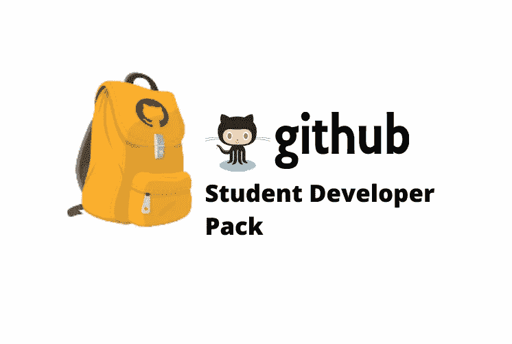
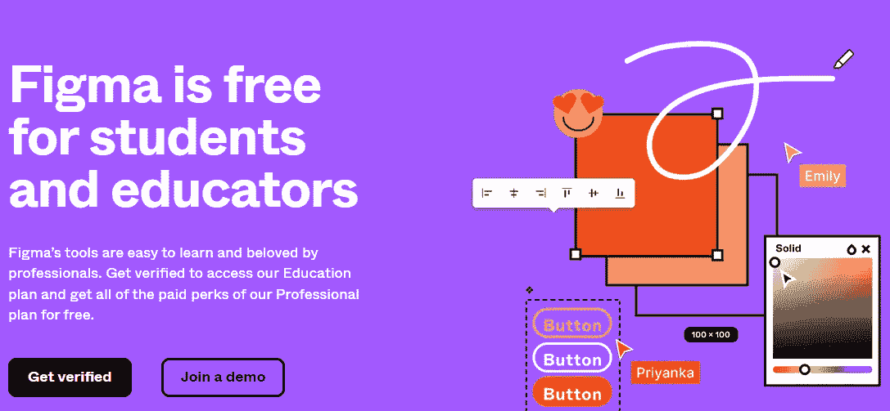
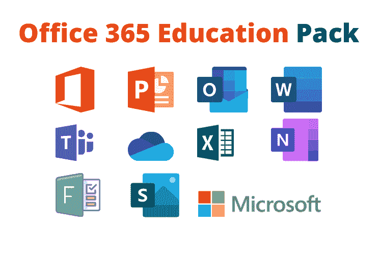
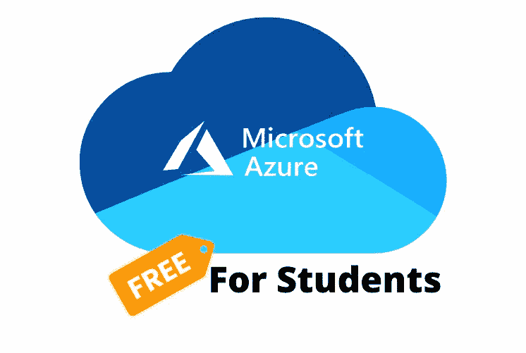
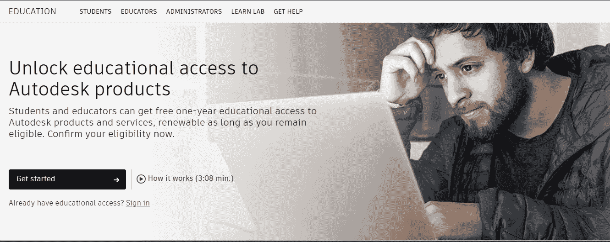

# 学生电子邮件地址的最大好处

> 原文：<https://www.freecodecamp.org/news/top-benefits-of-student-email-address/>

近年来，各种科技公司和组织开始支持对科技感兴趣和热情的学生。

许多公司免费向学生提供优质服务，还有一些公司对他们的产品打折。

如果你是一名学生，基本上所有你需要利用这些折扣和优惠是你的学生电子邮件。

拥有一个学生电子邮件将会派上用场，尤其是如果你买不起昂贵的产品或高级服务。在这篇文章中，我会给你一个运行的好处。edu 电子邮件以及如何获得它们来帮助你的教育和职业生涯。

一些一般的好处包括:

*   免费获取在线教育课程
*   免费访问内容和流媒体工具。
*   免费软件。
*   享受高级娱乐服务。
*   访问图形设计工具。
*   获得产品折扣。

让我们开始吧。

> 教育是通向未来的通行证，因为明天属于今天为之做准备的人。马尔科姆·Ⅹ

## 1.GitHub 学生开发者包

首先，在列表的顶部是我最喜欢的包之一，里面有大量的交易。

为了获得此项交易的资格，您必须:

*   在学校，注册一个学位或文凭项目。
*   有一个可核实的学校发的电子邮件地址。
*   拥有 GitHub 帐户。
*   至少 13 岁。

现在，根据与谷歌合作开展这一特定项目的不同公司，条款和条件可能会有所不同，在某些情况下，该服务可能不会在每个地区都存在。但是现在你仍然可以得到大部分的好处。

与 GitHub 合作开展该项目的公司包括:Canva、DigitalOcean、namecheap、educative、datacamp、Drovio 等。

这些公司提供的好处包括获得生产工具、信用卡，甚至托管服务。这意味着，作为一个完全的初学者，你可以得到:

*   免费获取优质学习材料。
*   免费设计工具。
*   一年免费域名。
*   微软和 DigitalOcean 等组织提供的免费托管计划。
*   访问流媒体平台

...仅举几个例子。

如果你还没有拿到你的包，请查看 GitHub 教育页面并分享这些神奇的资源。

## 2.学生 Figma

尽管 Figma 对互联网上的任何人都是免费的，但它确实有一个专业计划。这为您带来了额外的好处，例如:

*   能够创建私人项目
*   能够不受限制地与团队合作
*   能够与客户共享私人原型，还可以访问音频转换功能。

现在，为了让你有资格参加这个计划，你需要至少 13 岁并且是一名学生。

需要注意的一点是，当你申请时，你需要提供一些证明，如:你的学校名称、学校网站和有效的。edu 电子邮件。一旦你做到这一点，你的计划验证过程将开始。

一旦获得批准，你的学历将在两年内有效。如果两年结束时你仍然是学生，你可以再次重新申请教育身份。

要了解这一点，请查看第页的[Figma for students and educators。](https://www.figma.com/education/apply)

## 3.Office 365 教育

你可能在学校或个人项目中使用过微软的产品。它们都需要产品激活密钥才能使用，这意味着您需要购买。

但是通过 edu 的电子邮件，你可以免费得到这些产品。我说的是微软团队、网络办公、OneDrive、内容创建工具等产品，以及 word、Excel 和 PowerPoint 等桌面应用。

要开始，你需要有一个学校的电子邮件。要访问此计划，请查看 [Office 365 教育页面](https://www.figma.com/education/apply)。

## 4.面向学生的 Microsoft Azure

Azure 是一个拥有 200 多种产品和云服务的云平台，旨在帮助您为生活带来新的解决方案，并解决当今的挑战和创造未来。

有了 Microsoft Azure for Students pack，您将能够获得资源来帮助您使用自己选择的工具和框架跨多个云、在内部和在边缘构建、运行和管理应用程序。

Azure 有两个面向学生的程序:

### 学生用 Azure

该套餐将为您提供有效期为 12 个月的 100 美元信用点数和超过 25 项免费服务。
要获得此套餐的资格，您必须:

*   年满 18 岁。
*   参加认证的学位授予机构。
*   做一名全日制学生。
*   最后，通过你所在单位的电子邮件地址验证你的学术地位。

### 面向学生初学者的 Azure

这是不同的，因为与前者相比，你没有得到那么多。使用 Azure Students Starter，您将能够开始使用您需要在云中开发的 Azure 产品。

这一优势为您提供了对免费服务层的访问，如:Azure 应用服务、Azure 功能、Azure 通知中心、Azure MySQL 数据库等。

此套件可供认证学生免费使用，没有任何限制。要获得资格，您必须:

*   美国境内 13 岁以上，美国境外 16 岁以上。
*   您必须通过您所在组织的电子邮件地址来验证您的学术身份。

要访问这些计划，请查看面向学生的页面。

## 5.机器人形态

作为一名开发人员(或者任何使用互联网的人)，拥有一种安全的方式来存储您的密码是至关重要的。你做的很多工作都是在线的，所以网络安全非常重要。

正因为如此，它有助于提供一项服务，让你不必记住密码就能跟踪你的密码。

大多数公司确实对密码管理服务收费，但是通过一个. edu 电子邮件，你可以从 Robo 获得一年的服务。您的学生电子邮件将帮助您获得优质功能，例如:

*   在您的所有设备之间同步
*   云备份
*   双因素认证
*   安全共享文件夹
*   Web 访问

首先，请访问官方的机器人网站。

## 6.美国电脑软件公司

Autodesk 是设计领域的全球领导者，他们开发的技术致力于培养下一代修补匠、制造商、设计师、工程师和革命家，引领未来的工作。

如果你是学习这些领域的学生，你可能会在学习中遇到 AutoCAD。谢天谢地，有了学生邮箱，你可以获得更多的资源。

一旦你注册并提供你是学生的证明，只要你有资格，订阅将保持免费。

要开始使用 Autodesk，请查看注册 [Autodesk 教育产品页面](https://bit.ly/3LibREF)。

**其他学生包包括**

*   [AWS 教育](https://aws.amazon.com/education/awseducate/)
*   [Adobe 创意云](https://www.adobe.com/creativecloud/buy/students.html)
*   [平方空间](https://www.squarespace.com/students/)
*   [亚马逊优等生](https://www.amazon.com/Amazon-Student/b/ref=as_li_ss_tl?node=668781011&linkCode=sl2&tag=studentoffer0-20&linkId=ca96e394eba73f0c93caccc13dd00a80&language=en_US)
*   [Spotify 高级学生版](https://www.spotify.com/in-en/student/)
*   [惠普学生商店](https://www.hp.com/in-en/shop/students/about-the-program)

## 结论

上大学的一个困难是能够接触到所有合适的学习材料。但是有了学校的电子邮件，你就可以降低这些服务的费用。

我希望这篇文章能帮助你管理和获取对你的职业生涯有帮助的有用资源。

我感谢你花时间阅读。
享受编码❤.