# 如何用 Hasura 和 React 搭建全栈实时投票 App

> 原文：<https://www.freecodecamp.org/news/build-a-full-stack-real-time-voting-app-with-hasura-and-react/>

本文将教你如何构建一个投票应用程序来实时显示投票结果。每次有人投票时，应用程序会自动更新并显示新的结果。

即使您将构建一个全栈应用程序，由于 Hasura，您也不用编写任何后端代码！

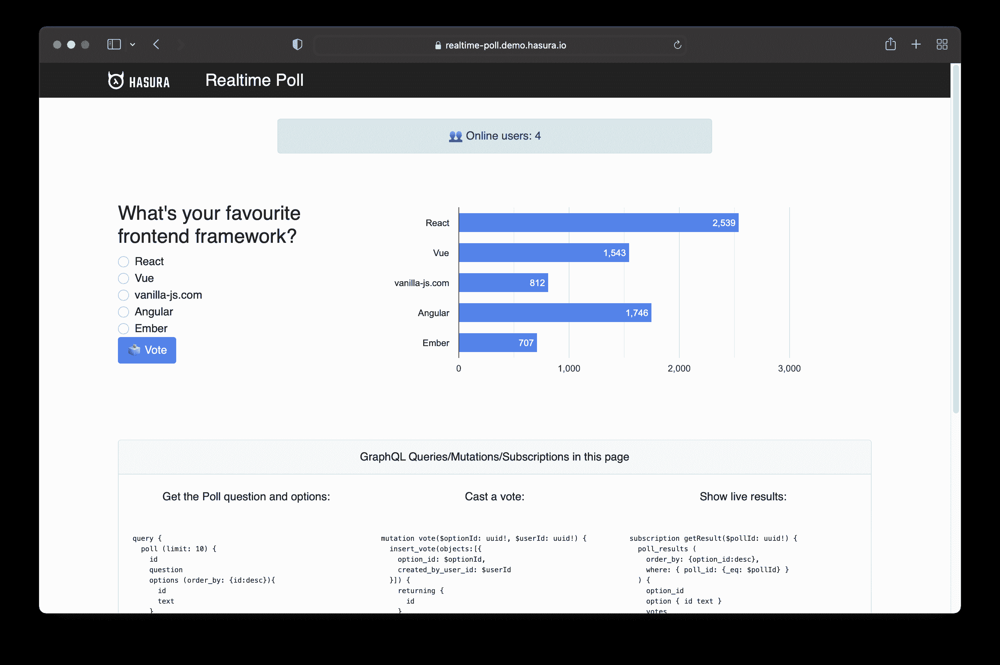

该应用程序将使用:

*   后端的 Hasura GraphQL 引擎
*   React 和阿波罗为前端

[现场演示](https://realtime-poll.demo.hasura.io/) | [后端浏览器](https://cloud.hasura.io/public/graphiql?endpoint=https%3A%2F%2Frealtime-poll.hasura.app/v1/graphql) | [GitHub 仓库](https://github.com/catalinpit/graphql-engine/tree/master/community/sample-apps/realtime-poll)

## 为什么是这些技术？

在进一步讨论之前，让我们先讨论一下我们将用于应用程序堆栈的技术。

### Hasura GraphQL 引擎

Hasura 是一个开源的 T2 graph QL 引擎，让你不用写后台代码就能创建即时、实时的 GraphQL API。

你可能想知道这是怎么回事。Hasura 连接到您的数据库，它会根据您的数据库表和视图自动生成 API。像 GraphQL 模式和解析器这样的东西都是现成的。

因此，选择 Hasura 的原因是为了加快构建实时 GraphQL API 的过程。Hasura 负责所有繁重的工作，因此我们可以专注于其他事情。

### React 和 Apollo 客户端

React 是最受欢迎的 JavaScript 框架之一，有一个很好的社区。它也是多功能的，允许你构建网络和移动应用程序。

Apollo Client 是一个全功能的 GraphQL 客户端，允许您通过 GraphQL 无缝地构建用户界面组件和获取数据。Apollo 客户机也是最流行的 GraphQL 客户机之一。

React 和 Apollo Client 共同组成了一个强大的组合，满足了实时投票应用程序的需求。

## 数据建模

第一步是确定数据库的结构。该数据库将包含以下表格:

*   用户—*用户*是在投票中投票的人
*   投票—*投票*代表这个问题(*,例如，你最喜欢的框架是什么？*)
*   选项——*选项*是人们可以选择的投票选项
*   投票–投票是用户和投票选项之间的联系。它代表用户的投票。

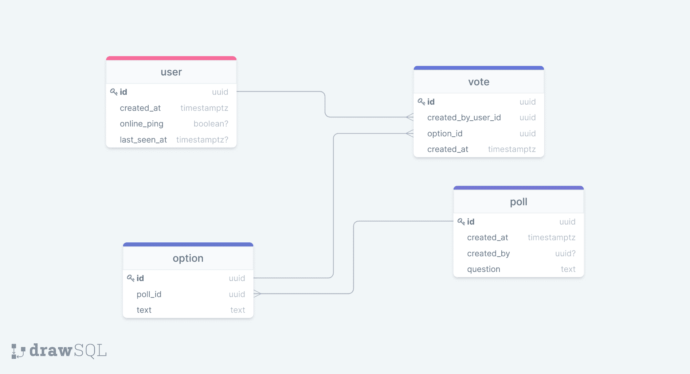

上图说明了数据库表和关系。

在`user`和`vote`之间有一个`one-to-many`的关系。一个用户可以投票多次，但一票只能属于一个用户。

`poll`和`option`有一个`one-to-many`关系，这意味着一个投票可以有多个选项，但是一个选项只属于一个投票。

最后，在`option`和`vote`表之间有一个`one-to-many`关系。这意味着你只能选择一个选项。一票代表一种选择。

数据库也有两个视图—`online_users`和`poll_results`。它们显示了在线用户的数量和投票结果。

## 使用 Hasura 的后端实现

您可以通过两种方式使用 Hasura:

*   在码头工人的帮助下在本地([参见指南](https://hasura.io/docs/latest/graphql/core/getting-started/docker-simple.html#docker-simple))
*   在云端借助 Hasura Cloud ( [参见指南](https://hasura.io/docs/latest/graphql/cloud/getting-started/index.html#cloud-getting-started))

值得一提的是，Hasura Cloud 还提供了高级性能、安全性和监控功能。它提供的一些内容如下:

*   自动放大或缩小应用程序
*   监测和追踪
*   限速

这只是三个好处，还有更多的。如果你想检查它们，你可以在这里做[。](https://hasura.io/cloud/)

本教程使用的是云版本，但是即使在本地使用 Hasura 也可以按照教程进行操作。解决了这个问题，让我们开始构建后端。

### 数据库设置

设置好账户后，进入项目仪表板，点击“数据”选项卡。

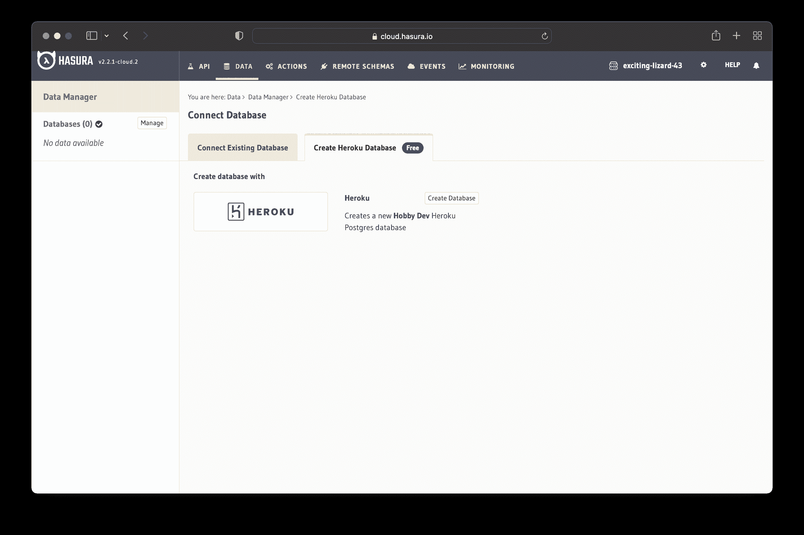

在“数据”选项卡中，您可以连接到现有的数据库或在 Heroku 上创建一个新的数据库。我们将创建一个新的数据库，所以点击“创建 Heroku 数据库”选项。

之后，点击“Create Database ”,你应该在几秒钟内就有一个 PostgreSQL 数据库开始运行了。

### 数据库表

下一步是创建数据库表。转到新创建的数据库，单击“创建表”按钮。

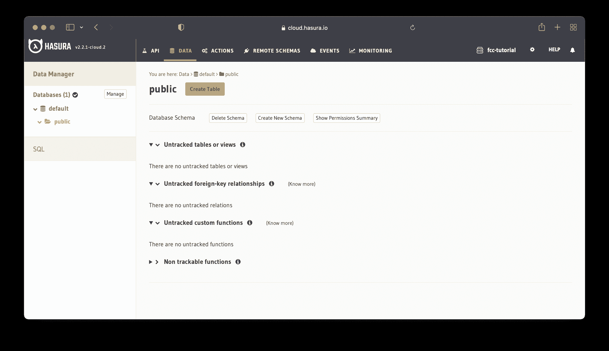

单击该按钮将打开一个新页面，您可以在其中创建一个新表。

#### 用户表

“用户”表包含以下列:

*   id(主键)–UUID，`gen_random_uuid()`，唯一
*   创建时间-时间戳，`now()`
*   online _ ping–布尔值，可为空
*   last _ seen _ at-–时间戳，可空

该图说明了表的列、类型和其他配置。

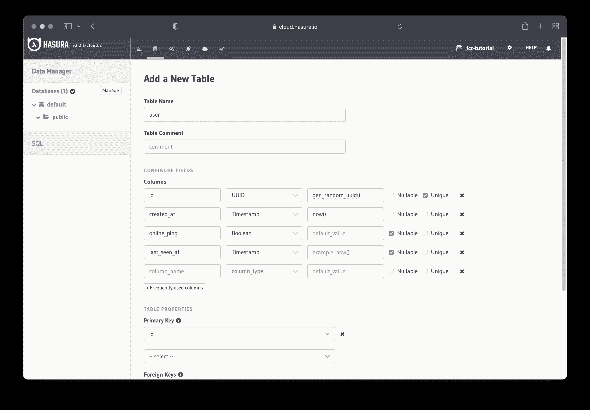

在保存表格之前，将`id`列设置为主键，如上图所示。

之后，向下滚动并按“添加表格”按钮保存它。您可以按照相同的过程创建其他表。

#### 投票表

“投票”表包含以下列:

*   id(主键)–UUID，`gen_random_uuid()`，唯一
*   创建时间-时间戳，`now()`
*   由 UUID 创建，可空
*   问题-文本

#### 选择表

“选项”表包含以下各列:

*   id(主键)–UUID，`gen_random_uuid()`，唯一
*   poll _ id–UUID
*   文本–文本

#### 投票表

“投票”表包含以下各列:

*   id(主键)–UUID，`gen_random_uuid()`，唯一
*   创建者用户标识–UUID
*   option_id – UUID
*   创建时间-时间戳，`now()`

### 数据库视图

我们将为投票结果和在线用户使用视图，因为它们允许我们重用复杂的查询。视图是查询一个或多个表的结果。

您可以将视图想象成保存一个复杂的查询并给它一个名称，这样您就可以重用它。视图被称为“虚拟表”，您可以像查询常规表一样查询它。

#### 投票结果

显示投票结果需要我们在`poll`、`option`和`vote`表上执行数据库连接。

第一个数据库连接返回来自`vote`表的所有记录和来自`option`表的匹配记录。也就是说，它返回每个投票及其相关的投票选项。

第二个连接返回来自`option`表的所有记录和来自`poll`表的匹配记录。也就是说，它返回所有选项及其所属的投票。

之后，视图统计返回的所有记录，并将其作为“投票”返回。

```
CREATE
OR REPLACE VIEW "public"."poll_results" AS
SELECT
  poll.id AS poll_id,
  o.option_id,
  count(*) AS votes
FROM
  (
    (
      SELECT
        vote.option_id,
        option.poll_id,
        option.text
      FROM
        (
          vote
          LEFT JOIN option ON ((option.id = vote.option_id))
        )
    ) o
    LEFT JOIN poll ON ((poll.id = o.poll_id))
  )
GROUP BY
  poll.question,
  o.option_id,
  poll.id;
```

SQL code for the "Poll Results" view

您将这些数据库视图添加到哪里？

要添加数据库视图，请转到“数据”选项卡，然后单击“SQL”选项。“SQL”页面允许您直接在数据库上运行 SQL 语句。

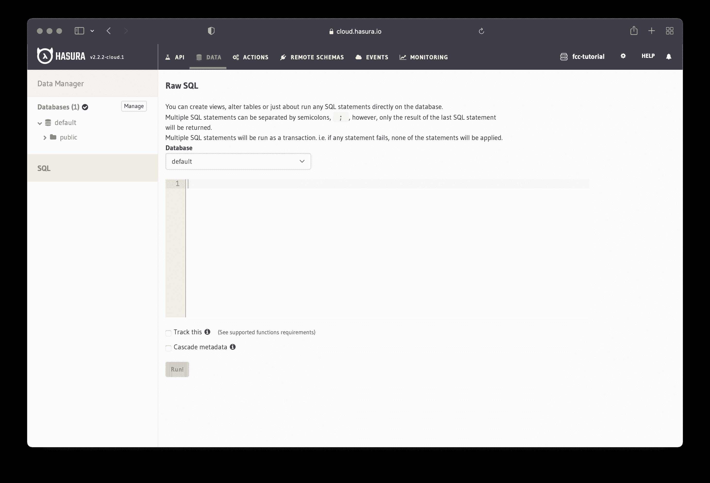

之后，添加 SQL 代码并单击“Run！”按钮。如果没有错误，您应该能够访问和使用新创建的视图。

#### 在线用户

对于在线用户的数量，我们也可以使用视图。

`users`表有一个属性`last_seen_at`,用于跟踪用户的最后一次登录。我们可以使用这个属性来确定登录用户的数量(在线)。

```
CREATE
OR REPLACE VIEW "public"."online_users" AS
SELECT
  count(*) AS count
FROM
  "user"
WHERE
  (
    "user".last_seen_at > (now() - '00:00:15' :: interval)
  );
```

SQL code for the "Online Users" view

上面的视图统计了过去 15 秒内看到的用户数量。如果他们在过去 15 秒内登录，我们会将他们视为在线用户。

### 关系

实现后端的最后一步是配置表之间的关系。使用 Hasura，您可以通过两种方式创建表之间的关系:

1.  使用外键约束
2.  手动(当不可能使用外键约束时)

更进一步，我们将通过添加外键约束来创建关系。如果您想了解更多关于关系的内容，文档中有一个关于[表关系](https://hasura.io/docs/latest/graphql/core/databases/postgres/schema/table-relationships/index.html)的综合章节。

#### 用户投票

导航到`vote`表中的“修改”并点击按钮“添加外键”。

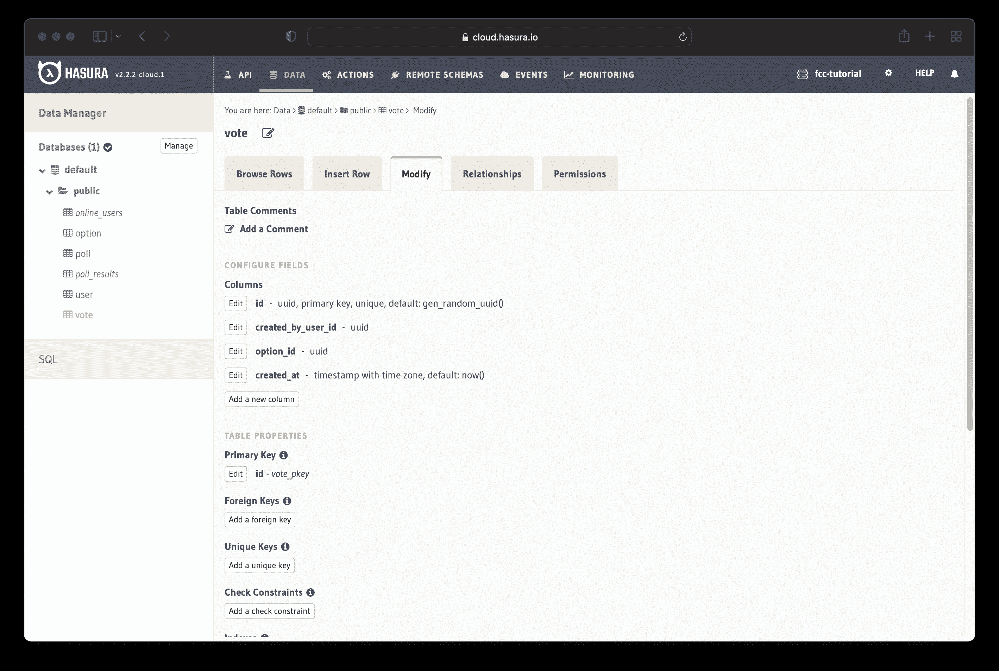

让我们将`created_by_user_id`列配置为`users`表中`id`列的外键。

该图说明了添加外键的过程。

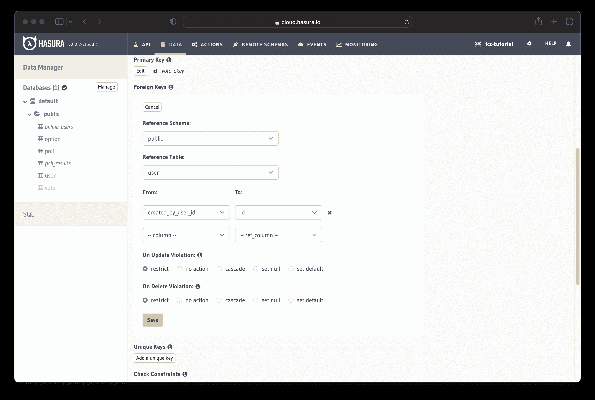

按照相同的过程，在`option`表中添加`option_id`列作为`id`列的外键。

“参考表”字段值应为`option`。“从”的值应该是`option_id`，而“到”的值应该是`id`。

由于添加了外键，Hasura 会自动建议潜在的关系。如果您转到“关系”选项卡，您应该会看到建议的关系。

当你点击“添加”按钮，你就有机会命名你的关系。您可以保留默认名称，也可以使用自定义名称。

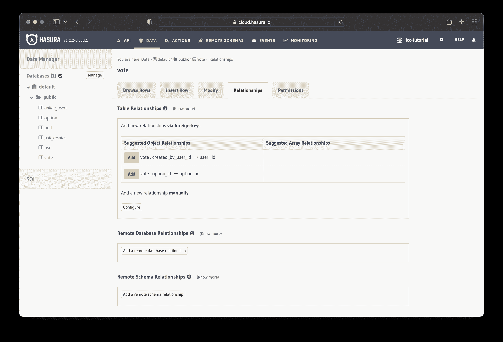

点击“添加”按钮保存关系，就完成了！

#### 投票–选项

转到`option`表，添加`poll_id`作为`poll`表中`id`列的外键。

*   **参考表**–投票
*   **从**开始–投票编号
*   **至**–id

保存后，转到“关系”选项卡，只接受建议的“对象关系”。

#### 选项–投票

当您在前面为“User–Vote”关系配置外键时，您添加了`option_id`列作为`option`表中`id`列的外键。

这意味着剩下要做的唯一事情就是转到`poll`表中的“关系”选项卡，并接受建议的“数组关系”。

#### 投票结果视图

对于`poll_results`视图，我们需要手动设置与`option`和`poll`表的关系。查看视图，您可以看到我们有外键`poll_id`和`option_id`。

转到`poll_results`中的“关系”选项卡，手动添加关系。一旦你在那里，点击按钮说“配置”。

`poll_results`与`option`和`poll`表之间的关系是对象关系。

如下图所示配置`poll_results`和`option`的关系。

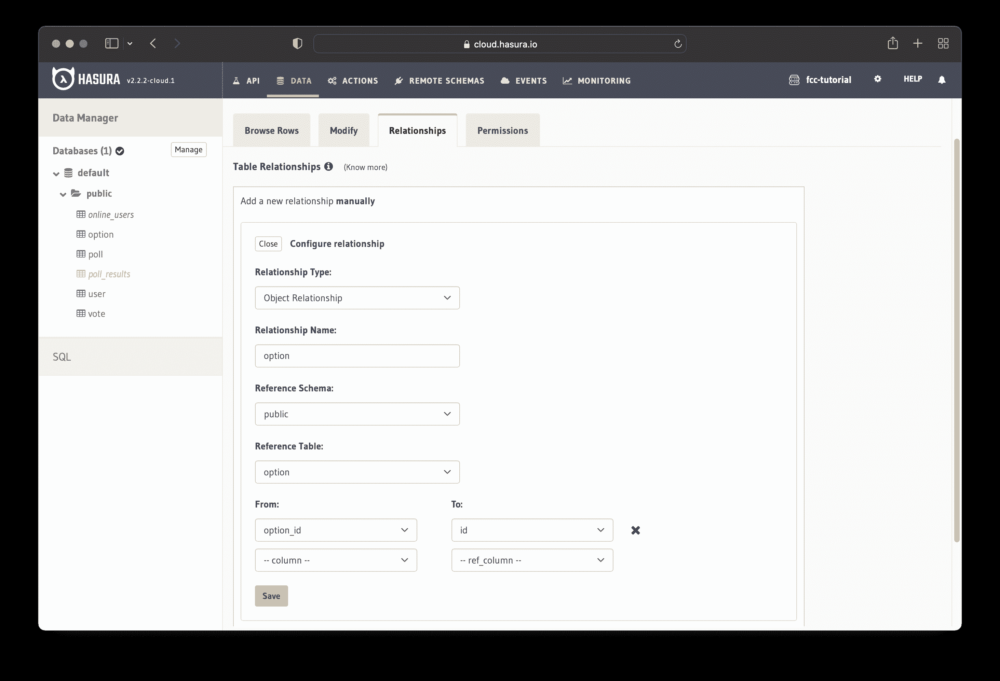

`poll_results`和`poll`之间的关系以类似的方式配置。添加以下信息:

*   **关系类型**–对象关系
*   **关系名称**–投票
*   **参考模式**–公共
*   **参考表**–投票
*   **从**开始–投票编号
*   **至**–id

保存它们，你就完成了关系！

### graphql api 已就绪

现在，您无需编写任何代码，就拥有了一个全功能的 GraphQL API。如果你进入 Hasura 控制台的 API Explorer，你可以插入、修改和删除数据。

想象一下手动构建相同的应用程序——这将是非常乏味和耗时的。

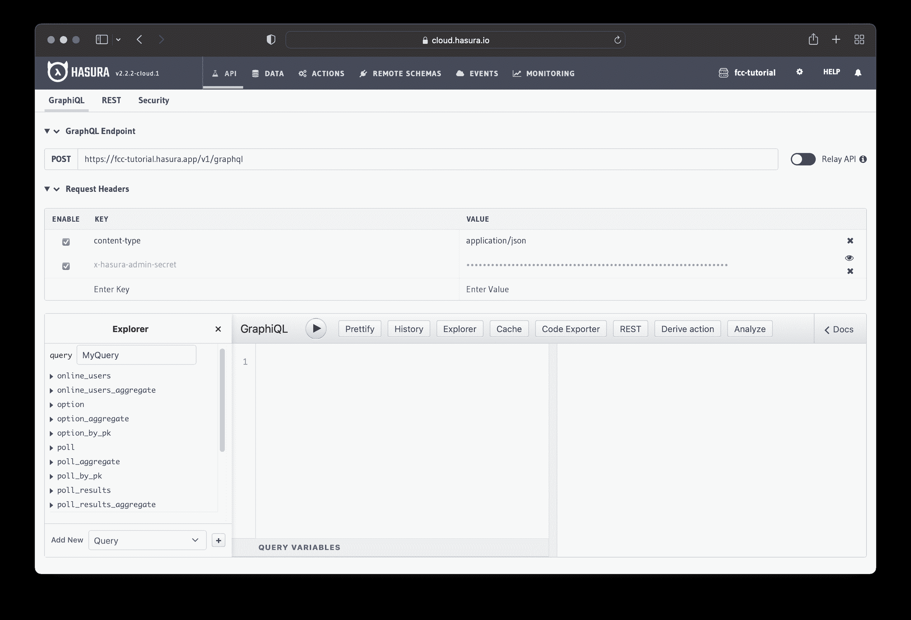

下一步是实现前端部分。

## 前端实现

前端实现的第一步是创建和初始化项目。转到您的首选文件夹并运行:

```
npx create-react-app realtime-poll 
```

安装完成后，转到`realtime-poll`文件夹并安装所需的依赖项:

```
npm i react-bootstrap react-google-charts @apollo/client graphql graphql-ws 
```

`react-bootstrap`包将允许我们用 Bootstrap 构建应用程序接口，而`react-google-charts`将帮助我们以图表形式显示投票结果。其他包将使我们能够使用我们之前构建的 GraphQL API。

在继续之前，从`src`文件夹中删除`setupTests.js`、`reportWebVitals.js`和`logo.svg`。之后，从`index.js`和`App.js`中删除对这些文件的所有引用。

### 用 Apollo 设置 GraphQL 客户端

投票应用程序使用 GraphQL 订阅来实时显示投票结果。当人们投票时，投票结果会自动更新，所以我们需要在不强迫人们刷新页面的情况下显示它们。

GraphQL 订阅是一种允许我们通过订阅服务器事件来做到这一点的操作。当数据(*投票结果*)更新(*有人投票*)时，我们会实时收到更新。

因为每次有更新时，数据都被推送到客户机，所以我们需要一个特殊的连接。GraphQL 订阅使用 WebSockets，它允许我们在服务器和客户机之间保持一个开放的连接。

*注意:本文简要介绍了订阅。有关更多信息，请查看文档以[了解 GraphQL 订阅](https://hasura.io/learn/graphql/intro-graphql/graphql-subscriptions/)。*

让我们开始用 Apollo 实现 GraphQL 客户机。第一步是在`src`文件夹中创建一个新文件:

```
📂 realtime-poll
 └ 📁 node_modules
   📁 package-lock.json
   📁 package.json
   📁 public
   📁 README.md
   📂 src
    └ apollo.js 
```

打开新创建的文件`apollo.js`，导入以下包:

```
import { ApolloClient, HttpLink, InMemoryCache, split } from "@apollo/client";
import { GraphQLWsLink } from '@apollo/client/link/subscriptions';
import { createClient } from "graphql-ws";
import { getMainDefinition } from "@apollo/client/utilities"; 
```

之后，将应用程序端点存储在一个单独的变量中。将值“real time-poll-example . hasura . app”替换为应用程序的 URL。

正如我们前面提到的，GraphQL 订阅使用 WebSocket 协议，所以我们需要两个链接。我们将使用一个链接`httpURL`进行查询和变更，另一个链接`wsURI`进行订阅。

```
const GRAPHQL_ENDPOINT = "realtime-poll-example.hasura.app";

const scheme = (proto) =>
  window.location.protocol === "https:" ? `${proto}s` : proto;

const wsURI = `${scheme("ws")}://${GRAPHQL_ENDPOINT}/v1/graphql`;
const httpURL = `${scheme("https")}://${GRAPHQL_ENDPOINT}/v1/graphql`; 
```

我们还有一个函数(splitter)来决定使用哪个链接。如果操作是查询或变异，它使用 HTTP 链接。否则，它使用 WebSocket 链接。

```
const splitter = ({ query }) => {
  const { kind, operation } = getMainDefinition(query) || {};
  const isSubscription =
    kind === "OperationDefinition" && operation === "subscription";
  return isSubscription;
}; 
```

使我们能够执行订阅。`createClient`构造函数接收 WebSocket 链接和附加的连接选项作为参数。然后，我们将`createClient`返回的值传递给`GraphQLWsLink`构造函数。

```
const cache = new InMemoryCache();
const options = { reconnect: true };

const wsLink = new GraphQLWsLink(createClient({ url: wsURI, connectionParams: { options } })); 
```

我们只剩下:

*   为查询和变异设置 HTTP 链接
*   使用拆分器功能
*   创建阿波罗客户端

`split`函数以我们之前写的 splitter 函数和两个链接作为参数。我们将“split”函数返回的链接作为参数传递给`ApolloClient`构造函数。

```
const httpLink = new HttpLink({ uri: httpURL });
const link = split(splitter, wsLink, httpLink);
const client = new ApolloClient({ link, cache }); 
```

最后，我们导出客户端，这样我们就可以使用它进行查询、突变和订阅。

```
export default client; 
```

你可以在[这个要诀](https://gist.github.com/catalinpit/839c22b0a430c5b690a3d2d409115674)里看到完整的代码。

### GraphQL 操作

我们将在应用程序中使用几个 [GraphQL 查询](https://hasura.io/learn/graphql/intro-graphql/graphql-queries/)、[突变](https://hasura.io/learn/graphql/intro-graphql/graphql-mutations/)和[订阅](https://hasura.io/learn/graphql/intro-graphql/graphql-subscriptions/)。它们也将显示在应用程序的主页上。

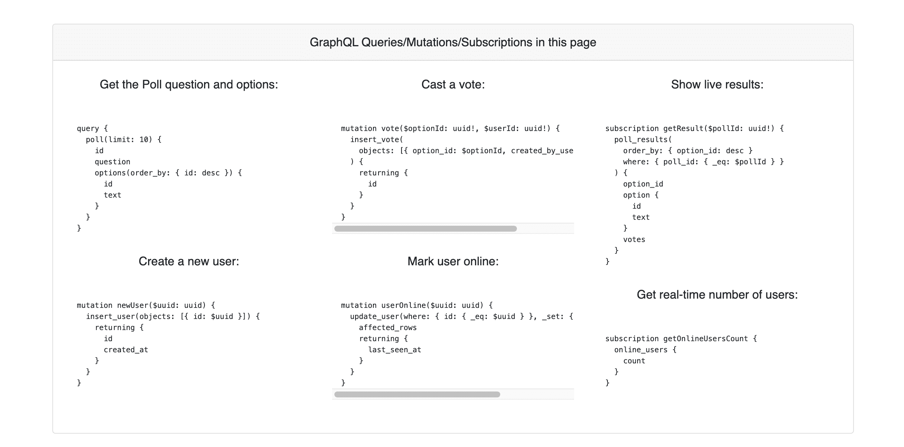

因此，我们将它们存储在一个单独的文件中，并在必要时导入它们。

转到`src`文件夹，创建一个名为`GraphQL.jsx`的新文件。

```
📂 realtime-poll
 └ 📁 node_modules
   📁 package-lock.json
   📁 package.json
   📁 public
   📁 README.md
   📂 src
    └ GraphQL.jsx 
```

打开`GraphQL.jsx`并添加以下导入:

```
import gql from "graphql-tag";
import React from "react";
import { Card } from "react-bootstrap"; 
```

我们需要`gql`,这样 GraphQL 查询、变异和订阅就可以被解析成标准的 GraphQL AST。我们还需要 React 和 Card 组件，因为我们将在页面上呈现 GraphQL 查询、变异和订阅字符串。

#### 获得投票

应用程序需要一个查询来从数据库中获取所有的投票。

```
const QUERY_GET_POLL = gql`
  query {
    poll(limit: 10) {
      id
      question
      options(order_by: { id: desc }) {
        id
        text
      }
    }
  }
`; 
```

上述查询返回 10 个投票及其 id、问题和选项(答案)。这些选项按 id 降序排列。

#### 投票

既然是投票，就应该有选择答案和投票的方式。

```
const MUTATION_VOTE = gql`
  mutation vote($optionId: uuid!, $userId: uuid!) {
    insert_vote(
      objects: [{ option_id: $optionId, created_by_user_id: $userId }]
    ) {
      returning {
        id
      }
    }
  }
`; 
```

上面的变异将一个新的投票插入到数据库中。

#### 实时投票结果

投票应用程序在该订阅的帮助下实时显示结果:

```
const SUBSCRIPTION_RESULT = gql`
  subscription getResult($pollId: uuid!) {
    poll_results(
      order_by: { option_id: desc }
      where: { poll_id: { _eq: $pollId } }
    ) {
      option_id
      option {
        id
        text
      }
      votes
    }
  }
`; 
```

这些是应用程序用来显示投票的 GraphQL 操作，允许用户投票并实时显示结果。

该文件还包含:

*   创建新用户和将用户标记为在线的两个突变
*   一个订阅实时显示在线用户的数量

你可以在这个[要点](https://gist.github.com/catalinpit/11d9e23b12878749b7eb44a22b047169)中找到`GraphQL.jsx`的完整代码。

### 投票实施

下一步是实施投票。在`src`文件夹中创建一个新文件`Poll.jsx`。

```
📂 realtime-poll
 └ 📁 node_modules
   📁 package-lock.json
   📁 package.json
   📁 public
   📁 README.md
   📂 src
    └ Poll.jsx 
```

`Poll.jsx`文件将包含两个部分:

*   它代表投票本身，并处理投票
*   `Poll`呈现投票问题和答案

打开新创建的文件，并添加以下导入:

```
import { useMutation, useQuery } from "@apollo/client";
import React, { useEffect, useState } from "react";
import { Button, Form } from "react-bootstrap";
import { Error, Loading } from "./Components";
import { MUTATION_VOTE, QUERY_GET_POLL } from "./GraphQL";
import { Result } from "./Result"; 
```

第一行从 Apollo 客户机导入两个钩子，允许您执行查询和变异。我们在第二行导入 React 及其两个默认挂钩，而在第三行，我们导入两个引导组件。

最后三行导入定制的 React 组件、GraphQL 查询和突变。它们现在还不存在，但是我们以后会实现它们。

#### 投票问题组件

下一步是实现投票问题的组件。“PollQuestion”组件处理投票过程。导入后，编写以下代码:

```
const PollQuestion = ({ poll, userId }) => {
    const defaultState = {
      optionId: "",
      pollId: poll.id,
      voteBtnText: "🗳 Vote",
      voteBtnStyle: "primary",
    };
    const [state, setState] = useState(defaultState);
    const [vote, { data, loading, error }] = useMutation(MUTATION_VOTE);
}; 
```

在上面的代码中，我们设置了轮询的默认状态。当有人第一次访问民意测验时，不应选择任何答案。此外，该按钮应该显示“🗳投票”。

该图展示了默认状态下的投票结果。

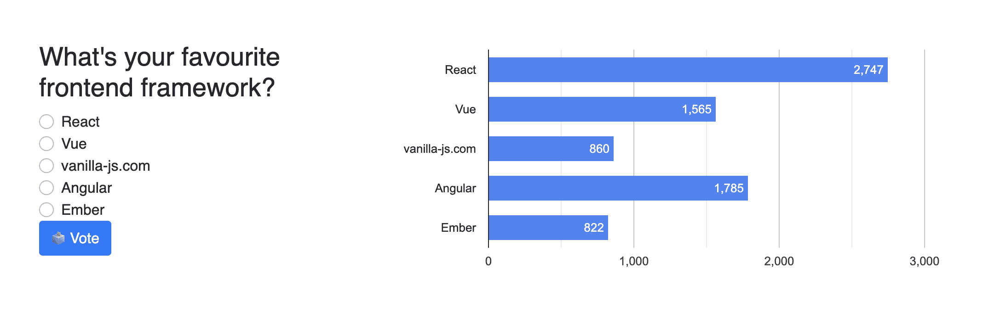

我们还使用了`useMutation`挂钩，这样人们就可以投票了。钩子返回一个包含两个元素的数组。第一个元素(`vote`)是一个函数，我们可以调用它来运行变异。第二个是我们可以进一步分解的对象。

每次用户选择答案时，我们都需要更新`optionId`。例如，如果用户在这个投票中选择“Vue ”,我们将`optionId`设置为该选项的 id。

```
const handleOptionChange = (e) => {
    const optionId = e.currentTarget.value;
    setState((prev) => ({ ...prev, optionId }));
}; 
```

让我们继续编写处理投票提交的逻辑。首先，我们需要确保用户不能提交空表单。如果用户没有选择答案，该按钮将变为黄色，并提示用户选择一个答案并重试。

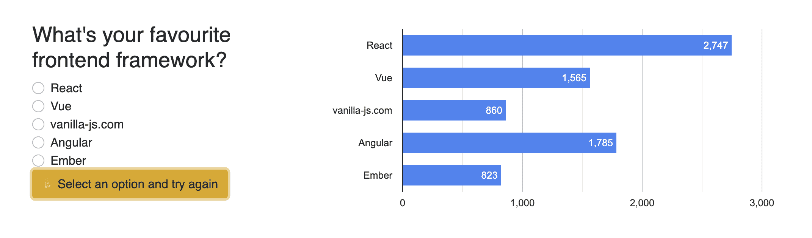

如果选择了一个答案，我们调用由`useMutation`钩子返回的`vote`函数。我们传递所选答案的 id 和投票用户的 id。

```
const handlesubmitVote = (e) => {
    e.preventDefault();

    if (!state.optionId) {
      setState({
        voteBtnText: "✋ Select an option and try again",
        voteBtnStyle: "warning",
      });
      return;
    }

    setState({
      voteBtnText: "🗳️ Submitting",
      voteBtnStyle: "info",
    });

    vote({
      variables: {
        optionId: state.optionId,
        userId,
      },
    });
}; 
```

如果投票成功，我们相应地更新按钮状态。5 秒钟后，我们重置按钮的状态，以便用户可以再次投票。如果有错误，按钮会高亮显示。

每次`data`或`error`的值改变时，`useEffect`钩子运行。

```
useEffect(() => {
    if (data) {
      setState({
        voteBtnText: "👍 Done",
        voteBtnStyle: "success",
      });

      //  Re-authorize to vote after 5 seconds
      let timer = setTimeout(() => {
        setState({
          voteBtnText: "🗳️ Vote",
          voteBtnStyle: "primary",
        });
      }, 5000);

      return () => clearTimeout(timer);
    }

    if (error) {
      setState({
        voteBtnText: "Error 😞 Try again",
        voteBtnStyle: "danger",
      });
    }
}, [data, error]); 
```

最后，我们呈现表单、投票选项和投票按钮。

```
return (
    <div className="textLeft">
      <h3>{poll.question}</h3>
      <Form
        className="pollForm textLeft"
        onSubmit={(e) => {
          handlesubmitVote(e);
        }}
      >
        {poll.options.map(({ id, text }) => (
          <Form.Check
            custom
            type="radio"
            name="voteCandidate"
            id={id}
            key={id}
            value={id}
            label={text}
            onChange={handleOptionChange}
          />
        ))}
        <Button
          className="voteBtn info"
          variant={state.voteBtnStyle}
          type="submit"
        >
          {state.voteBtnText}
        </Button>
      </Form>
    </div>
); 
```

我们已经完成了`PollQuestion`组件。你可以在这个[要点](https://gist.github.com/catalinpit/74a64bcb9a6af13364ea1ebf8aa61729)中找到`PollQuestion`的完整代码。

#### 投票组件

`Poll`组件呈现投票问题和结果。让我们首先用返回所有投票的 GraphQL 查询字符串调用`useQuery`钩子。

```
export const Poll = ({ userId }) => {
    const { data, loading, error } = useQuery(QUERY_GET_POLL);

    if (loading) return <Loading />;
    if (error) return <Error message={error.message} />;
}; 
```

如果查询成功，`data`属性将包含一个带有轮询的数组。一旦我们有了这个数组，我们就可以对它进行映射，并呈现民意测验及其相应的答案。

```
return (
    <div className="container">
      {data?.poll.map((poll) => (
        <div key={poll.id} className="pollWrapper wd100">
          <div className="displayFlex">
            <div className="col-md-4 pollSlider">
              <PollQuestion poll={poll} userId={userId} />
            </div>
            <div className="col-md-8 pollresult">
              <Result pollId={poll.id} />
            </div>
          </div>
        </div>
      ))}
    </div>
); 
```

如果你看上面的代码，你会发现我们使用了`Result`组件，这个组件现在还不存在。下一步，我们将这样做！

你可以在这个[要点](https://gist.github.com/catalinpit/f8015f660984f7f1997e3b8caedf6085)中找到`Poll`文件的完整代码。

### 结果组件

让我们从在`src`文件夹中创建`Result.jsx`开始。

```
📂 realtime-poll
 └ 📁 node_modules
   📁 package-lock.json
   📁 package.json
   📁 public
   📁 README.md
   📂 src
    └ Result.jsx 
```

打开文件并添加以下导入:

```
import { useSubscription } from "@apollo/client";
import React from "react";
import { Chart } from "react-google-charts";
import { Error, Loading } from "./Components";
import { SUBSCRIPTION_RESULT } from "./GraphQL"; 
```

第一行导入了`useSubscription`钩子，我们将使用它来实时显示投票结果。在第二行，我们导入 React，在第三行，我们导入 Chart 组件。最后两行导入两个定制组件和 GraphQL 订阅字符串。

在导入后编写以下代码:

```
export const Result = ({ pollId }) => {
    const { data, loading, error } = useSubscription(SUBSCRIPTION_RESULT, {
      variables: { pollId },
    });

    const hasResults = data?.poll_results.length > 0;

    if (loading) return <Loading />;
    if (error) return <Error message={error.message} />;

    return (
      <div>
        {hasResults ? <PollChart data={data?.poll_results} /> : <p>No result</p>}
      </div>
    );
}; 
```

“Result”组件将一个投票 ID 作为一个属性，这样它就可以显示特定投票的结果。

在第一行中，我们用轮询 ID 调用`useSubscription`钩子。如果调用成功，`data`属性将包含一个包含轮询结果的数组。同样，所有新的投票都将反映在`data`属性中。每次提交新的投票时，包含投票结果的数组都会更新。

在显示投票结果之前，我们检查是否有任何结果。如果有，我们显示结果。如果没有，我们显示一个“没有结果”字符串。

如果你看一下代码，你会发现我们使用了一个`PollChart`组件。你可以在这个[要点](https://gist.github.com/catalinpit/ede866d28e62928f58904447d9d4ba36)中找到`PollChart`的代码和`Result.jsx`的完整代码。

本文主要关注前端实现的基本部分。它强调了如何实现更棘手的部分。您可以在这个 [GitHub 资源库](https://github.com/catalinpit/graphql-engine/tree/master/community/sample-apps/realtime-poll)中浏览完整的应用程序代码。

## 结论

至此，您无需编写任何后端代码，就拥有了一个全栈应用程序。Hasura 提供了一个有用的用户界面，您可以用它来构建您的 API。因此，它简化并缩短了构建 GraphQL API 的过程。

您可以:

*   请参见应用程序的现场演示
*   探索[后端](https://cloud.hasura.io/public/graphiql?endpoint=https%3A%2F%2Frealtime-poll.hasura.app/v1/graphql)
*   浏览这个 [GitHub 库](https://github.com/catalinpit/graphql-engine/tree/master/community/sample-apps/realtime-poll)中的完整代码

如果你感兴趣，我还写了关于用最少的代码构建电子商务后端的文章。

感谢阅读！如果你想保持联系，我们就在 Twitter[@ catalinpit](https://twitter.com/intent/follow?screen_name=catalinmpit)上联系吧。如果你想阅读我的更多内容，我也会定期在我的博客 [catalins.tech](https://catalins.tech) 上发表文章。