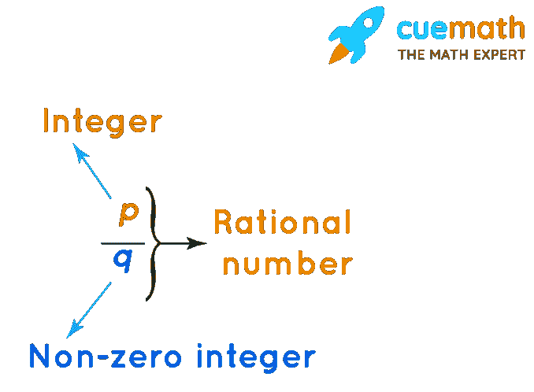

# 什么是有理数？定义和有理数例子

> 原文：<https://www.freecodecamp.org/news/what-is-a-rational-number-definition-and-rational-number-example/>

有理数是任何可以写成分数的数，其中分子(上面的数)和分母(下面的数)都是整数，分母不等于零。

换句话说，有理数可以表示为 p/q，其中 p 和 q 都是整数，q ≠ 0。

在本文中，我们将回顾什么是整数和整数，涵盖不同类型的有理数，并学习如何确定一个数是否有理数。

## 什么是整数和整数？

在讨论整数之前，回顾一下什么是整数是有帮助的。

### 整数

整数是从 0 到无穷大的任何数:0，1，2，3，4，5，...

请注意，整数就是整数。它们不包括小数或分数，因为它们从 0 开始向上，所以所有的整数都是正数。

所以 11，0，2014，938，840，123 都是整数。

-2、3.8 和 13/100 都不是整数。

### 整数

整数与整数完全一样，但也可以包括负数:..., -5, -4, -3, -2, -1, 0, 1, 2, 3, 4, 5, ...

12，-33，0 都是整数。

但是 1/2、3.14 和-3.333 都不是整数。

## 有理数

同样，有理数是可以表示为分数的任何数，其中分子和分母都是整数，并且分母不是 0:

Source: [Rational Numbers](https://www.cuemath.com/numbers/rational-numbers/)

有理数的一些例子包括:

*   四分之三(四分之三)
*   1/2(一半)
*   八分之五(八分之五)

[根据维基百科](https://en.wikipedia.org/wiki/Rational_number#Etymology)，术语*比*来源于*有理*。

因此，如果一个数可以清晰地表示为一个分数，或者两个整数的比值，那么它就是一个有理数。如果一个数不能这样表达，那么它就是一个无理数。

### 有理数的类型

虽然您在本文的前面已经了解了什么是有理数，但是将它们分成几个大的类别，并查看不同的例子还是很有帮助的。

有理数有四种类型:

*   整数
*   由整数组成的分数
*   终止十进制数
*   具有无限重复模式的非终止十进制数

#### 整数

任何整数都可以干净地转换成分数，而且是有理数。

比如 3 可以表示为 3/1。而且由于分子(3)和分母(1)都是整数，分母不为 0，那么 3 就是有理数。

这适用于负整数，如-2(或-2/1)和-2006(或-2006/1)。

数字 0 也是一个有理数，因为它可以转换成分数。例如，0/1、0/-4 和 0/18，572 都是有效的分数，并且符合有理数的定义。

#### 由整数组成的分数

任何由整数组成的分数都是有理数，只要分母不为 0。

比如 1/3，-5/3，27/-463 都是有理数。

#### 终止十进制数

任何终止于或结束于某点的十进制数都是有理数。

例如，取十进制数 0.5。这可以转换成 1/2，这意味着它是一个有理数。

甚至更长的终止十进制数可以干净地转换成分数。例如，0.0001 可以表示为 1/10，000，这意味着它是一个有理数。

只要一个十进制数最终终止，没有舍入或近似，它就是一个有理数。

#### 具有无限重复模式的非终止十进制数

以重复模式持续下去的十进制数是有理数。但是这有点棘手，因为模式必须无限重复。

例如，以数字 0.33333 为例...尽管这通常被简化为 0.33，但小数点后的 3 的模式会无限重复。这意味着这个数可以转换成分数 1/3，并且是有理数。

但是一个更复杂的数字，比如 0，会怎么样呢？46660.68866868661...？还是那句话，小数点后的 142857 模式无限重复，数可以换算成 1/7，这是有理的。

然而，有一些不包含重复模式的无限延续的十进制数。这几类数都不是有理数，称为*无理数*。

## 无理数

任何不符合有理数定义的数都是无理数。

像 pi (π = 3.1415926536)这样的数字...)和许多平方根(√2 = 1.41421356237...)有无限超过小数点的数字。但是它们不包含无限重复的模式，所以被认为是不合理的。

例如，虽然圆周率通常被缩短为 3.14159，但这只是一个近似值。在撰写本文时，[已经计算出的圆周率位数的世界纪录是 62.8 万亿](https://theconversation.com/why-bother-calculating-pi-to-62-8-trillion-digits-its-both-useless-and-fascinating-166271)。随着计算能力的提高，记录也会增加。

但是据任何人所知，在这些无穷无尽的数字中没有重复的模式，所以圆周率被认为是一个无理数。

## ******感谢阅读******

如果你觉得这篇关于有理数的文章很有帮助，可以考虑分享一下，让更多的人从中受益。

此外，请随时在 [Twitter](https://twitter.com/kriskoishigawa) 上联系我，告诉我你的想法。