# React.js 基础——解释了 DOM、组件和声明性视图

> 原文：<https://www.freecodecamp.org/news/reactjs-basics-dom-components-declarative-views/>

React.js 是一个用于创建用户界面的开源 JavaScript 库。它是由脸书在 2013 年创建的。

对 React 开发人员的需求正在飙升，这意味着了解这个库绝对是值得的！使用 ReactJS 建立的一些流行网站包括 Dropbox、网飞和 insta cart——还有很多。

现在，每个人都想到的一个普遍问题是，我们真的需要一个 JavaScript 库，仅仅是为了创建用户界面吗？我们可以只用 HTML 和 CSS 做同样的事情，对吗？

那么是什么让 React 如此受欢迎，而不是仅仅使用普通的 HTML、CSS 和 JavaScript 呢？为此，我们先来看看 React 的两个主要特性:

1.  声明性视图
2.  基于组件的方法

当然，除此之外还有更多的东西需要反应，但是我们在这里将重点关注这两个特性。在继续学习这些特性之前，我们必须清楚地了解浏览器 DOM。

## 这只狗是什么

DOM(文档对象模型)将网页表示为树形结构。我们编写的任何一段 HTML 都会作为节点添加到这个树中。

使用 JavaScript，我们可以访问这些节点(HTML 元素)中的任何一个，并更新它们的样式、属性等等。这意味着 DOM 使 JavaScript 能够轻松地访问和修改网页。

任何树都必须有一个根节点，对吗？这里，根节点是**文档。**你想知道这个**文件**节点是从哪里来的吗？这是浏览器的一部分。您编写的任何 HTML 标记都将是根节点文档的直接或间接子文档。

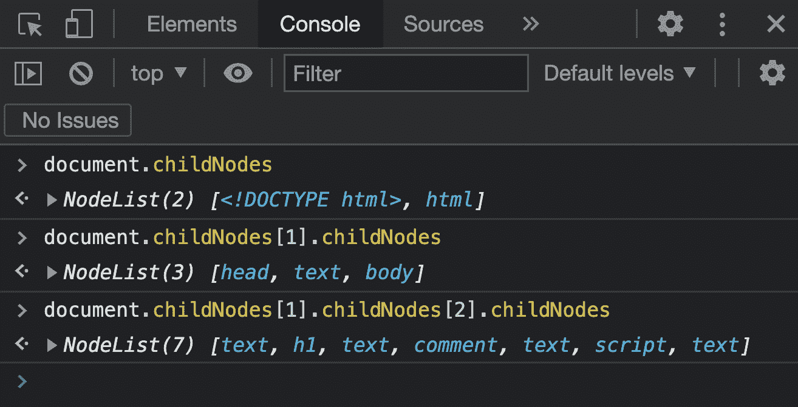

DOM tree with root node as document

下图显示了 DOM 的等效概念树结构:

Browser DOM tree

现在，希望您对浏览器 DOM 有了清晰的理解。因此，让我们深入到我们今天要讨论的 ReactJS‌的两个主要特征，即它的基于组件的方法和声明性视图。

## 基于组件的方法

React 中的一切都是组件。网页是组件的集合。

将组件想象成任何编程语言中的常规函数。函数的主要优势是什么？可重用性、抽象和避免冗余代码，对吗？

React 中的组件也是如此。不要和下图中的代码混淆，因为我们混合使用了 HTML 和 JavaScript。坚持住，我们马上就来。

Code for component named Card

上图代表一个名为**卡**的组件(因为函数名是卡)。如前所述，功能或组件可以重用任意多次。这正是我们在下图中所做的。我们正在重用**卡**组件( **`<Card />`** )四次。请记住，书写 **`<Card />`** 相当于 **`<Card></Card>`** 。(坚持前一种符号，因为它更常见)。

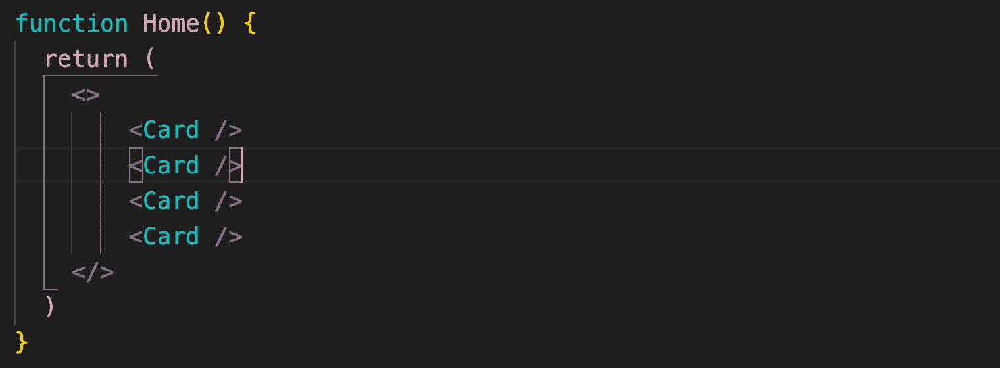

Card Component reused multiple times

恭喜你想到了这个！四个`<Card />`组件被写在另一个名为 **Home** 的组件中(因为函数名是 Home，`<Home />`)。再次祝贺你，如果你想到了这一点！

当然，您可以重用`<Home />`组件，它又是许多`<Card />`组件的集合。也就是说，我们可以在其他组件中嵌套任意数量的组件。

现在出现了一个大问题:如果组件要像我们提到的那样嵌套，那么最顶层的组件是什么？它是`<**App />**`组件(由 React 提供)。您编写的任何定制组件都将是 React 中 **App** 组件的直接或间接子组件。

在高层次上，整个组件结构看起来像一棵树，根节点是 **App** 。

还要记住，组件名称的第一个字母要大写。该约定用于区分 React 组件和常规 HTML 标记。

如果组件名的第一个字母不大写会怎样？无论是 HTML 标签还是 React 组件，都会有歧义。

在下图中，**导航栏、Carousal、服务**等等都是组件。组件共同构成了网站的主页或主页组件。很整洁，不是吗？

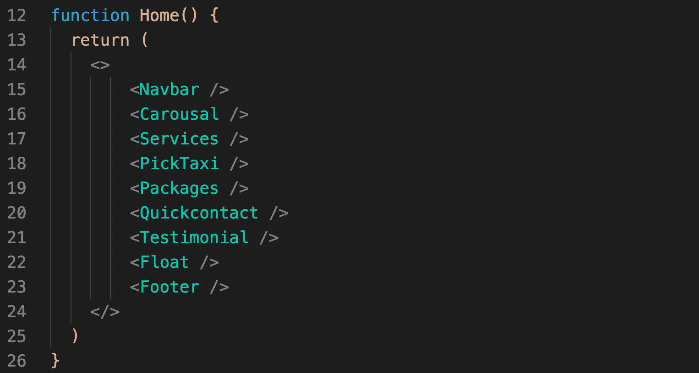

Home page consisting of Navbar, Carousal, Services etc components

组件按照它们在页面中出现的顺序进行布局。在这里，导航条首先出现，在顶部，然后狂欢出现在导航条下面，以此类推。

如果你仔细观察上面的图片，你会发现我们混合使用了 JavaScript 和 HTML。这就是所谓的**JSX(Java script XML)**。这只是一种编写 React 的好方法。

Weird isn't it ? This is JSX

在上图中，我们将 HTML 赋值给一个名为 **element** 的变量，就像我们在 JavaScript 中给变量赋值一样。当然，您现在可以在代码中的任何地方重用这个变量(元素)，如下所示:

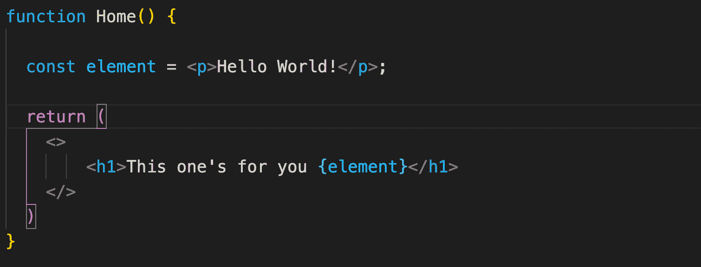

Output of the above code 

这就是 React 中的组件。现在让我们进入下一个功能。

## React 中的声明性视图

在 React 中，我们实际上并不与浏览器 DOM 交互。是的，你没听错！我们与虚拟 DOM 交互，虚拟 DOM 是浏览器 DOM 的精确副本，但是在内存中。

耶！我们正在处理一个新的 DOM，而不是浏览器 DOM。这意味着我们编写的任何 React 组件都作为子组件插入到虚拟 DOM 中。

你一定想知道，我们已经有了浏览器 DOM，为什么还需要这个虚拟 DOM？虚拟 DOM 是 React 渲染如此快速高效的原因。

当我们更新浏览器 DOM 时(不使用 React 时)，需要花费大量的时间来布置元素并重新绘制屏幕以让用户看到变化。这涉及到 DOM 树的很大一部分被重画。

但是，当使用 React 时，更新首先发生在虚拟 DOM 中。然后，对浏览器 DOM 和虚拟 DOM 进行区分或比较，以查看是否存在必须在浏览器 DOM 中反映或更新的对虚拟 DOM 的任何更新。

如果有的话，只有在那时才更新浏览器 DOM 以匹配虚拟 DOM。并且这些更新仅在要执行更新的地方进行。这意味着整个浏览器 DOM 不会像前面提到的那样更新。这提高了速度和效率。

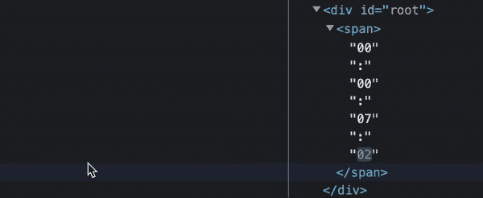

Only part of the DOM is getting updated, instead of whole

## React 的优势

现在你已经知道了 React 的主要特性，让我们来了解一下使用它的优势。

1.  **代码可维护性，**因为我们现在可以重用组件，把复杂的逻辑分解成更小的部分。
2.  **快速和高性能，**因为只更新了浏览器 DOM 的一部分，而不是全部。
3.  **单向数据流，**这意味着数据流只能从父组件流向子组件。也就是说，组件是嵌套的，最顶层的组件是 App。这使得一切都模块化。
4.  **易学易用，**开发时间少，学习曲线小。

假设您想要构建一个复杂的 web 应用程序。您希望它速度快、性能好，但您没有太多时间来开发它。在这种情况下，React 应该是您的首要任务！

现在你有希望理解为什么 React 如此受欢迎，尽管我们可以只用 HTML、CSS 和 JavaScript 构建一个网站。

现在让我们看看，如何在您的机器上设置 React 并创建一个全新的项目。

## 如何开始一个新的 React 项目

### 步骤 1–安装节点

在考虑 React 之前，您必须正确安装节点。这是因为通过安装 Node，您还可以获得 npm，它是 JavaScript 的一个包管理器。可以把它想象成一个可以用来下载额外的库的应用程序，这些库在你的项目中可能会用到。

从这里下载安装:**(下载 LTS 版)。**

**安装后，打开你的终端(Mac 或 Linux)或命令提示符(Windows)并输入 **`npm -v`** ，它应该输出如下:**

**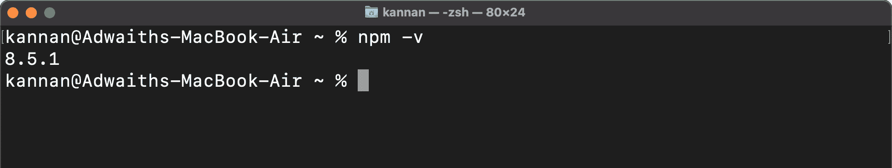**

### **步骤 2–创建您的 React 应用程序**

**现在，是时候安装一个工具来简化 React 项目的构建了。恭喜你。你可能已经猜到我说的是 **create-react-app** 。**

**输入命令`npm install create-react-app`并等待几秒钟。**

**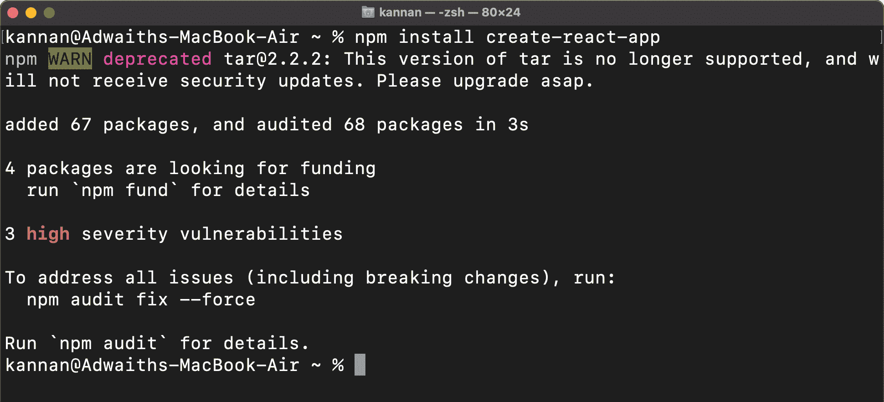**

### **步骤 3–设置 React web 应用程序**

**现在让我们开始设置我们的第一个 React web 应用程序。我们把它命名为 **myreactapp** 。**

**要启动一个新的 React 项目，请键入以下命令:`npx create-react-app myreactapp`。**

**一般语法是`npx create-react-app <application_name>`(还有注意是 npx 不是 npm，不要搞混了:)。**

**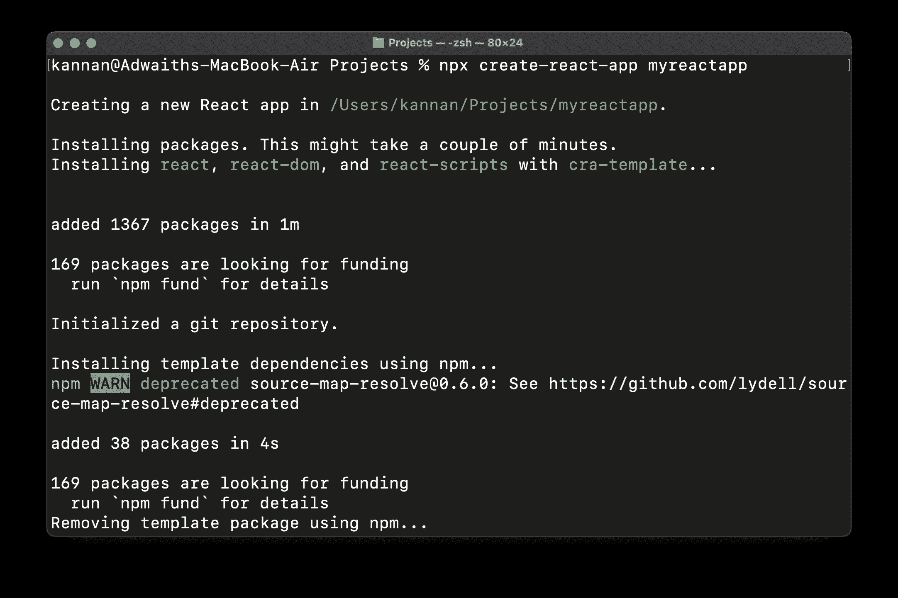****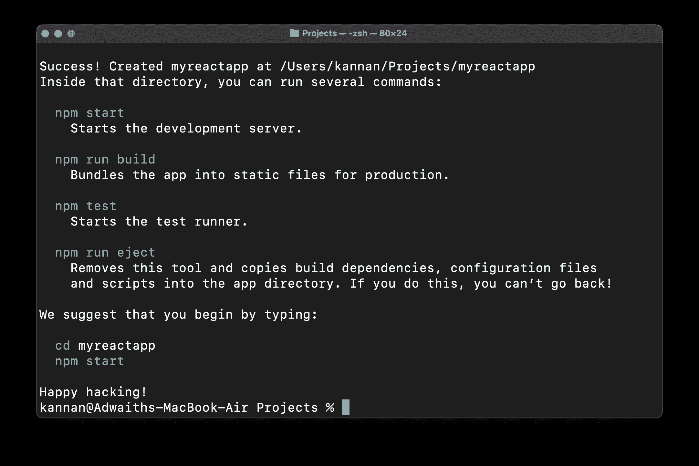

Continuation of above image** 

### **‌step 4-打开您的新 React 应用程序**

**现在是时候来看看我们的 React 应用程序了。为此，通过使用命令`cd myreactapp`进入创建的项目( **myreactapp** ，因为我们在上一步中创建了它)，并键入以下内容:`npm start`。**

**现在，该命令将打开一个浏览器，其中包含我们新创建的 React 应用程序:**

**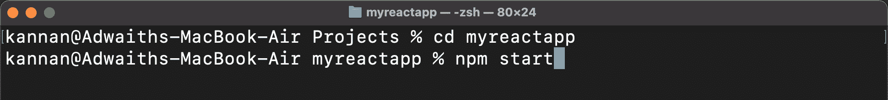****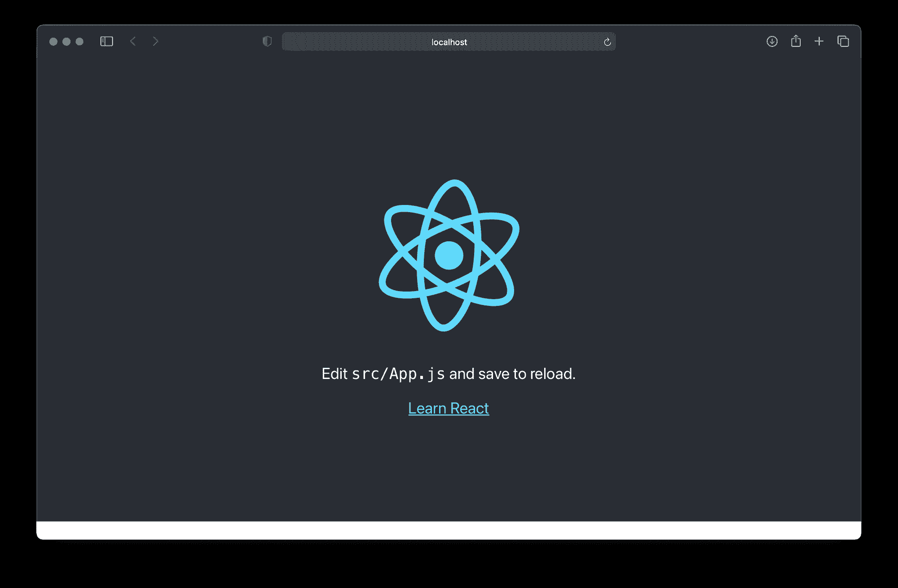**

**就是这样！您已经成功地在您的机器上设置了 React，并开始了一个全新的项目。现在您已经准备好在 React 中掌握更大的概念了！快乐的 hacking❤️**