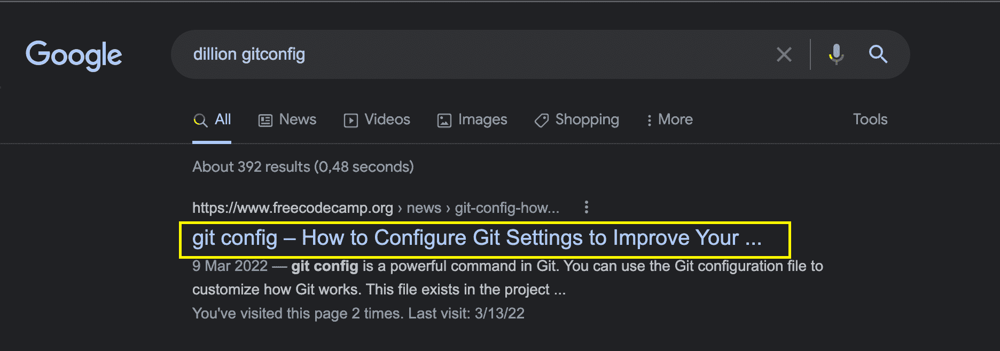

# HTML Starter 模板–index.html 的基本 HTML5 样板文件

> 原文：<https://www.freecodecamp.org/news/html-starter-template-a-basic-html5-boilerplate-for-index-html/>

HTML 有不同的标签，其中一些有语义含义。HTML 文件的基本样板文件如下所示:

```
<!DOCTYPE html>
<html lang="en">
  <head>
    <meta charset="UTF-8">
    <meta name="viewport" content="width=device-width, initial-scale=1.0">
    <meta http-equiv="X-UA-Compatible" content="ie=edge">
    <title>My Website</title>
    <link rel="stylesheet" href="./style.css">
    <link rel="icon" href="./favicon.ico" type="image/x-icon">
  </head>
  <body>
    <main>
        <h1>Welcome to My Website</h1>  
    </main>
	<script src="index.js"></script>
  </body>
</html> 
```

在本文的其余部分，我将解释这个样板文件的每个部分的含义。

# HTML 样板语法

## 文档类型

```
<!DOCTYPE html> 
```

这个元素是 HTML 文件的 doctype 声明。告诉浏览器将 HTML 代码呈现为 HTML5(而不是其他版本的 HTML)。

这很重要，因为如果没有这个声明，HTML5 元素如`section`、`article`等可能无法正确呈现。

## html 标签

```
<html lang="en">
    ...
</html> 
```

标签是 HTML 文档的根。它包含了`head`标签、`body`标签以及网站中使用的所有其他 HTML 元素(除了 DOCTYPE)。

它还有一个`lang`属性，可以用来指定网站上文本内容的语言。默认值为“未知”，因此建议您始终指定一种语言。

定义语言有助于屏幕阅读器正确阅读单词，并帮助搜索引擎返回特定语言的搜索结果。

## 头部标签

```
<head>
    ...
</head> 
```

标签存放了你网站的元数据。这些是用户看不见的数据，但是它们提供了关于你的网站内容的信息。搜索引擎特别使用这些数据来对你的网站进行排名。

head 标签中的元数据包括 meta 标签、title 标签、link 标签、脚本、样式表等等。

## meta tags

```
<meta ... /> 
```

标签是一个元数据元素，用来给你的网站添加比 title 这样的非元标签更多的元数据。

您可以将这些标签用于各种目的:

*   为社交媒体平台添加元数据以创建链接预览
*   为网站添加描述
*   为您的网站添加字符编码
*   还有很多。

搜索引擎、社交媒体平台和 web 服务使用这些元数据来了解您网站的内容，并确定如何将它们呈现给用户。

## title tag

```
<title>My Website</title> 
```

标签用来为你的网站指定一个标题。您的浏览器使用它在标题栏显示标题:


此标签还可以帮助搜索引擎在搜索结果中显示您网站的标题:



## 链接标签

顾名思义，使用`link`标签链接到另一个文档。通常，这在当前文档和单独的文档之间建立了不同类型的关系。

```
<link rel="stylesheet" href="./style.css"> 
```

例如，如上面的代码块所示，我们已经与 styles.css 文件建立了“样式表”文档关系。

此标签最常见的用途是向文档添加样式表，以及向网站添加图标:

```
<link rel="icon" href="./favicon.ico" type="image/x-icon"> 
```

favicon 是靠近网页标题的小图像，如下所示:


## 正文标签

```
<body>
    ...
</body> 
```

标签包含了网站的主体内容，用户可以看到。虽然这里也可以添加像`style`和`script`这样的不可见元素，但是大多数 body 标签通常是可见的。

从标题到段落到媒体等等，这些元素都被添加到这里。任何在这里找不到的元素(可能包含在 head 标签中)都不会显示在屏幕上。

## 主标签

```
<main>
    ...
</main> 
```

标签指定了一个网站的基本内容。这将是与网站标题相关的内容。

例如，博客文章页面。左侧的社交媒体共享、右侧的广告、页眉和页脚是网页的次要部分。显示封面图像、标题和帖子文本内容的帖子本身是中心部分，应该在`main`元素中。

## h1 标签

HTML 有不同的标题元素，分别是`h1`、`h2`、`h3`、`h4`、`h5`和`h6`。标题元素用于描述网页的不同部分。而且这些元素是有顺序的，`h1`是最高的。

一个网页上应该只有一个`h1`元素，因为这是主部分的开始。然后，您可以使用其他标题元素创建其他区段和子区段。

此外，请注意，你不应该跳过标题。例如，你不应该在使用了一个`h2`元素之后再使用一个`h4`元素。一个好的结构可能是这样的:

```
<h1>Welcome to my website</h1>

<h2>What do I have to offer</h2>

<h3>1\. Financial Benefits</h3>

<h3>2\. Society improves</h3>

<h4>a. Improving the tax system</h4>

<h4>b. Providing more refuse dumps</h4>

<h2>Who am I</h2>

<h2>Conclusion</h2> 
```

从这段代码中，您可以看到标题级别是如何指定它们在节和子节中的位置的。

# 包裹

在这篇文章中，我们看到了一个 HTML starter 样板文件，以及在这个模板中使用的每个标签的含义。

这个元素列表并不是详尽的，因为在 head 标签和 body 标签中可以找到更多的元素，还有许多属性。