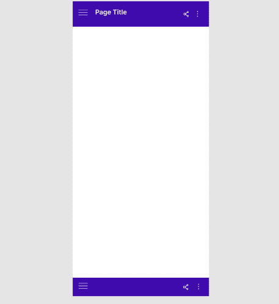
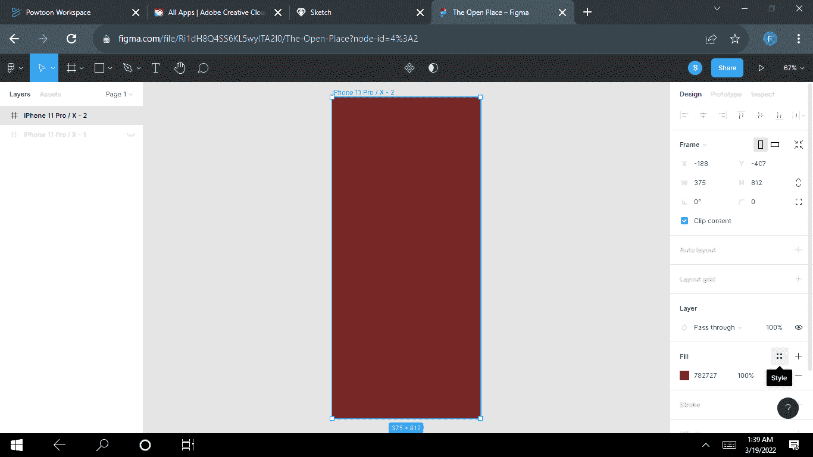
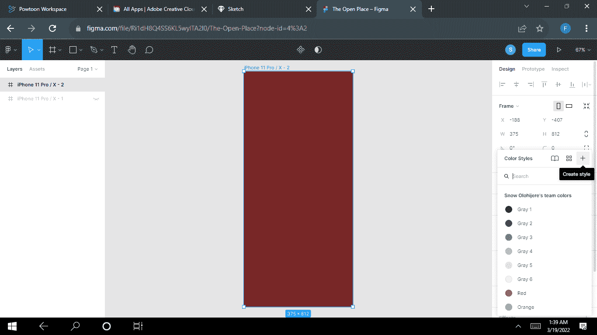
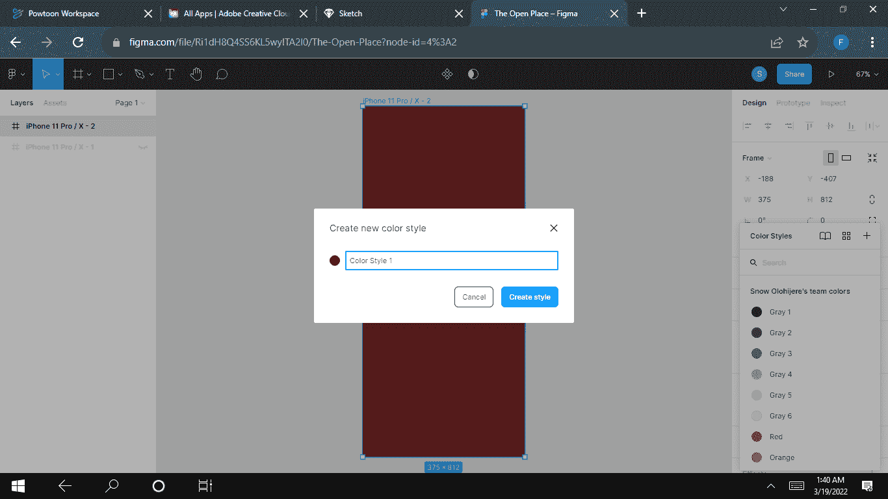
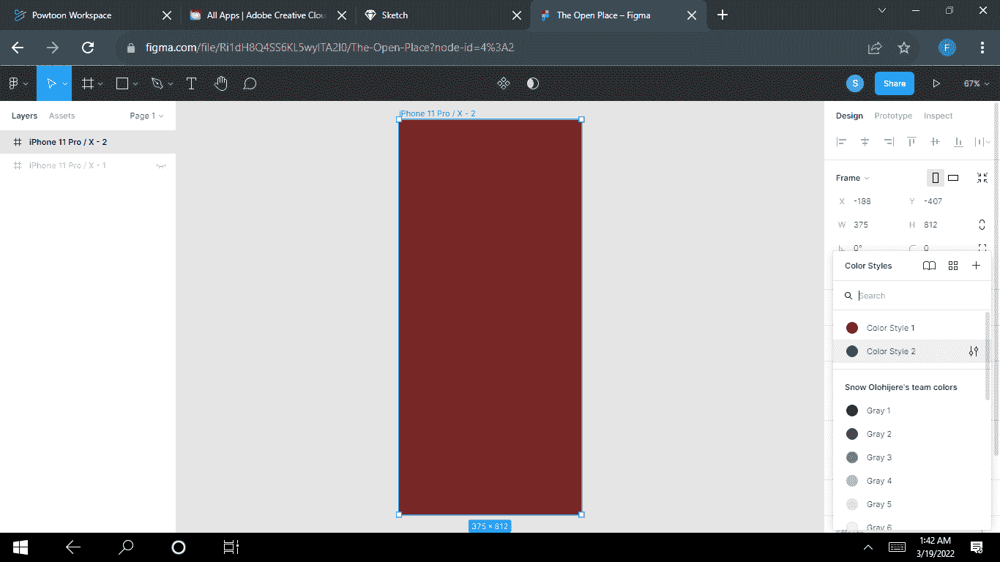
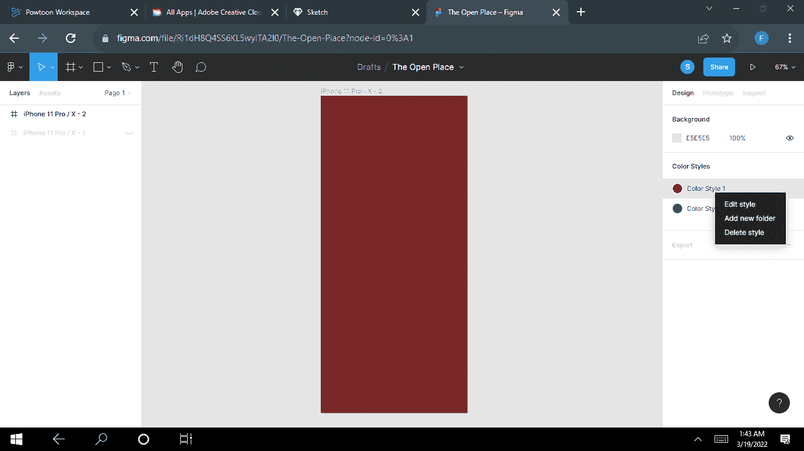
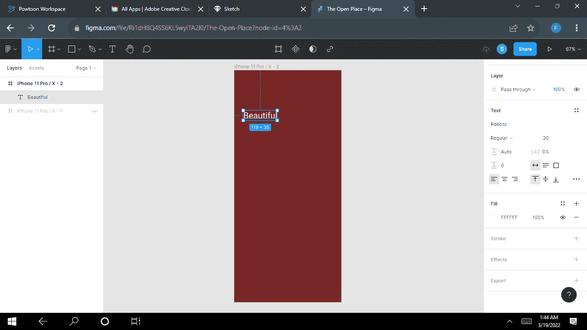
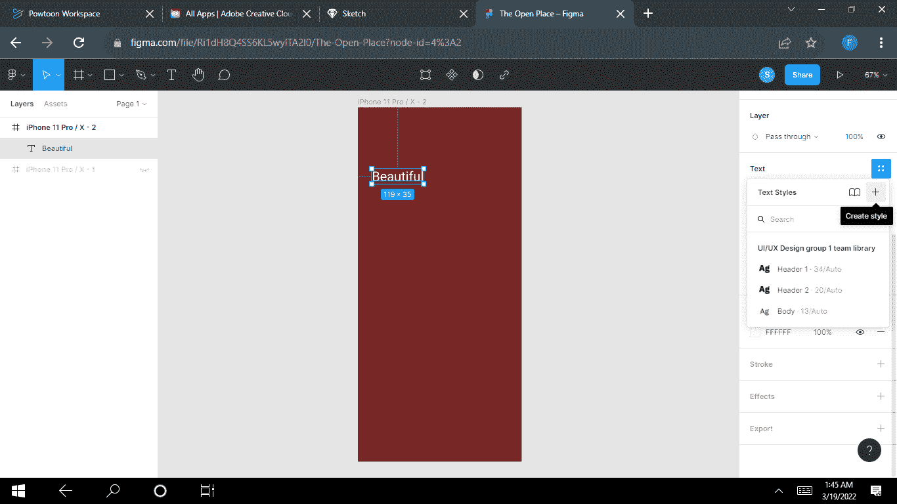
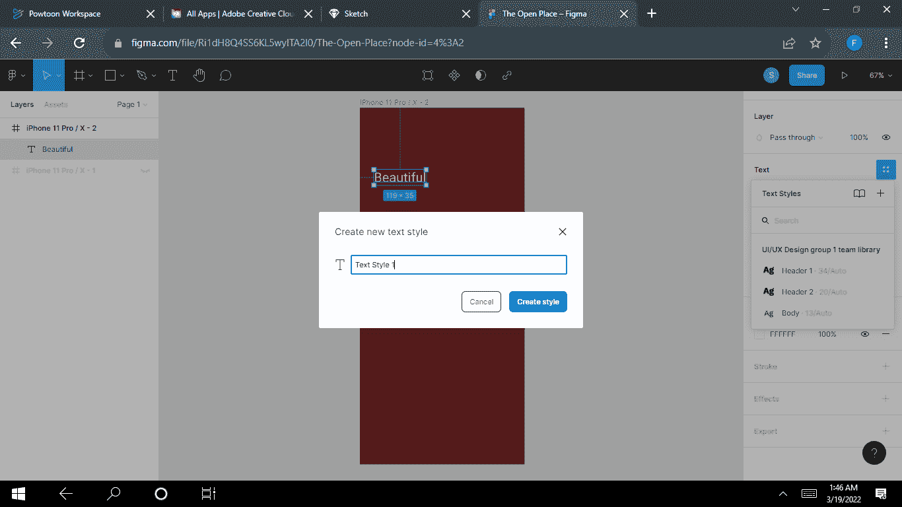

# 如何在 Figma 中创建颜色和文本样式

> 原文：<https://www.freecodecamp.org/news/how-to-create-color-and-text-styles-in-figma/>

在本文中，我们将学习如何在 Figma 中创建、编辑和使用颜色和文本样式。我们还将学习如何结合颜色和文本风格，并用它们来创造美丽的设计。

样式帮助您简化工作流程，保持文本和图层一致，并节省宝贵的时间。

## ‌‌How 将在 Figma 中使用颜色样式

您可以将颜色样式应用于文本、背景和笔画。您还可以将颜色样式应用于设计中创建的形状，或者应用于您正在设计的特定网站或移动应用程序的元素或部分。这些可以包括按钮，矩形，顶部和底部的酒吧，等等。

您也可以对图像或渐变使用颜色样式。

### 如何创建颜色样式

要创建颜色样式，请按照下列步骤操作:

*   创建一个新的形状，然后点击**填充。用你选择的任何颜色填充你的图层。**

*   点击**四点**图标触发颜色样式模式。
*   点击颜色样式模式右上角的 **+** 图标。

*   给你的样式起一个喜欢的名字(比如颜色样式 1)，然后点击**创建样式**按钮。

请记住，您可以创建任意多的颜色样式。‌‌

### 如何将颜色样式应用于图层

选择你的图层，进入右边栏的**填充**部分。

*   点击填充部分右上角的**四点**图标，触发颜色样式模式。
*   选择您喜欢的颜色风格。

搞定了。

### ‌‌How 编辑颜色样式

点击文件的灰色背景来显示你的风格。

*   右键点击**颜色样式**，在菜单中选择**编辑样式**。

### 如何删除颜色样式

删除颜色样式真的很容易做到。

*   点击文件的灰色背景来显示你的风格。
*   右击**颜色样式**并选择**删除样式。**

## ‌How 将在 Figma 中使用文本样式

您也可以将样式应用于文本。它可以是整个文本块，也可以是块中的部分文本。这有助于定义标题的样式。

要创建一个新的文字样式，首先创建一个新的文字层，并添加一些设置。例如:

*   字体系列:Roboto
*   字体大小:30
*   字体粗细:常规

*   单击文本部分的四点图标，触发文本模式。
*   单击文本样式模式右上角的+图标。

*   给你的样式起一个你喜欢的名字(比如文本样式 1)，然后点击**创建样式**按钮。

### ‌‌How 将文本样式应用于图层

首先，选择你的图层，进入右边栏的**文本**部分。

然后点击**文本**部分右上角的四点图标，触发文本样式模式。

最后，只需选择您喜欢的**文本样式。** ‌‌

### 如何删除文本样式

要删除一个文本样式，你需要点击文件的灰色背景来显示你的样式。然后你可以右击你想要删除的文本样式，选择**删除样式**。

### 如何组合颜色和文本样式

您也可以在设计时组合文本和颜色样式。您可以为不同的文本对象添加颜色样式。这是一个额外的步骤，可以使你的系统更容易维护，特别是当你不必为每种颜色组合创建不同的文本样式时。

*   要保存专门用于文本的颜色样式，请执行下列操作:创建一个文本框并输入文本。遵循“**如何将颜色样式应用到图层**”的步骤。
*   当你到达你应该给你的样式一个描述/名称的地方，输入你的文本描述，例如副标题、页面标题、按钮文本等等。

## 结论

请注意，设计时使用和创建样式完全取决于您。除非你让他们知道，否则没有人会知道你在设计中使用了什么颜色/文字样式。就像我说的，这完全取决于你！

然而，样式有助于保持设计的一致性，创建优秀的样式有助于让您的用户体验无缝衔接。

‌‌‌‌‌‌‌‌‌‌