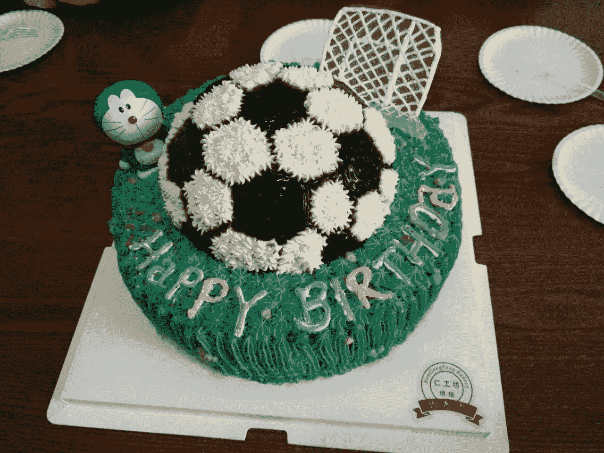
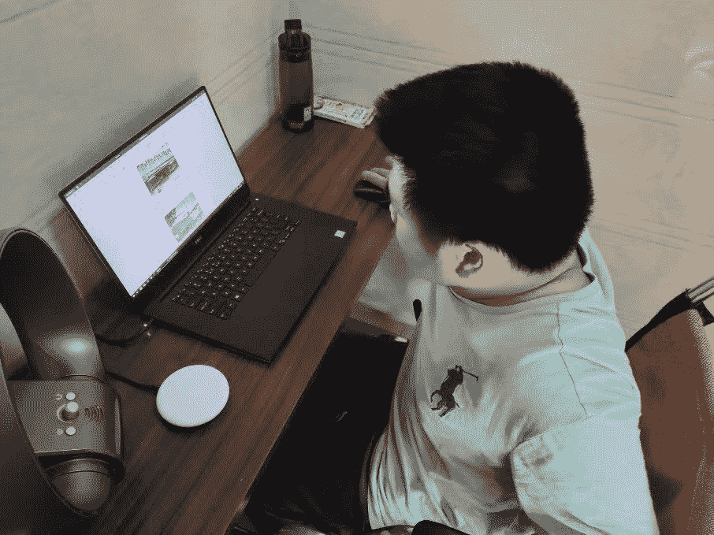
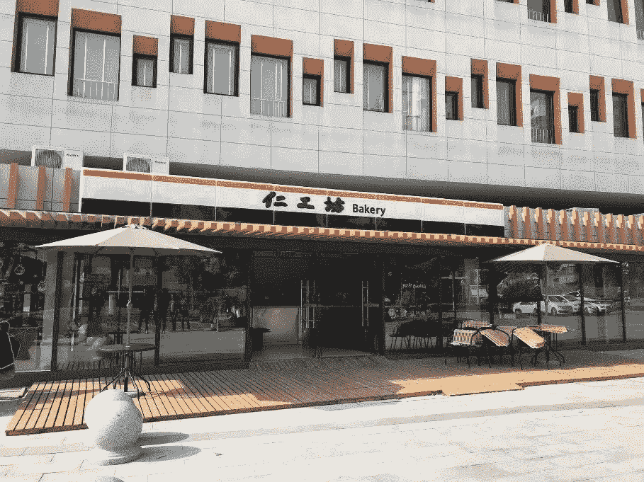
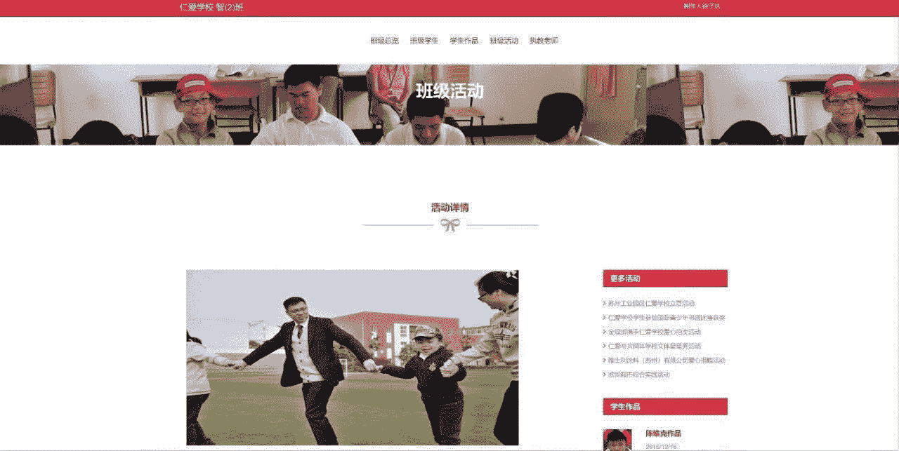
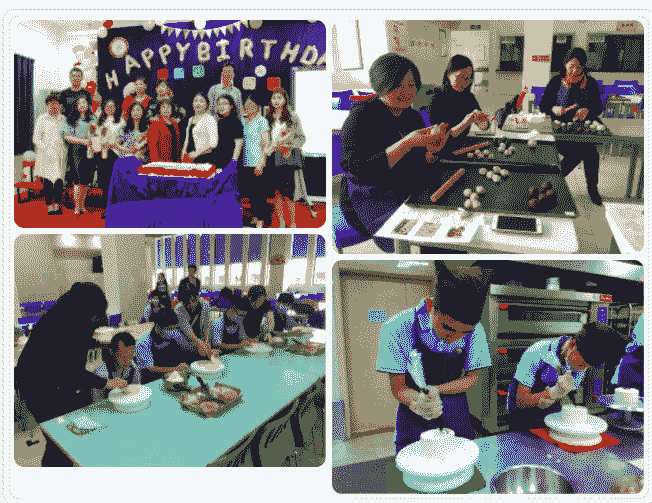

# freeCodeCamp 的学生如何创业并教孩子们编程

> 原文：<https://www.freecodecamp.org/news/freecodecamp-student-started-business-teaches-kids-about-computers/>

****Original** A **RTICLE:** [Cerebral palsy, bakery, volunteers-"Programming makes me more real"](https://chinese.freecodecamp.org/news/cerebral-palsy-bakery-volunteer-programming-makes-me-real/)**

**原作者:** [【刘】](https://chinese.freecodecamp.org/news/author/miyaliu/)

2019 年，freeCodeCamp 华人社区推出了 DevTalk 访谈节目。我们邀请了资深开发者、互联网从业者、有开发背景的人来分享他们学习编程的经验、工作经验，以及其他激动人心的故事。

作为这次采访的主持人，我会为每位嘉宾写一篇介绍。今天我们有徐子达(徐子达).我会为这个介绍多写一点。感谢您在阅读本文时的耐心。^_^

2016 年夏天，我第一次见到徐自达是在苏州工业园(苏州工业园区)仁爱学校(仁爱学校).他坐在教室的最后一排，吃力地用一个手指敲击着键盘，用 freeCodeCamp 学习编程，参加我们在华人社区组织过的一次编程比赛。

在教室的前排，他的同学——几名自闭症儿童——正在老师的指导下进行康复训练。

我们在苏州社区活动与编程大赛颁奖典礼学习小组主办的下一次活动中又见过两次面。每次见面，他总是笑着和大家说话。他的话语透露出乐观的态度，冷静而有力。

2018 年初，我联系了仁爱学校的张老师(子达的老师)，问子达过得怎么样。我很惊讶地得知他已经毕业了，正在经营一家仁工坊(仁工坊)面包店，就在仁爱学校里面。

所以我拜访了他，送了他 freeCodeCamp 贴纸作为小礼物。我还办了一张会员卡。一是为了表示我的支持，二是因为店里的面包和蛋糕太诱人了。

是的，走进这家面包店真的很舒服。阳光温柔地倾泻在入口处的木地板上，年轻的店员把刚出炉的面包一个一个地摆放在橱窗里。面包是如此的精致和充满活力，仿佛在对我说:“欢迎光临，今天天气真好！”

Image via Rengongfang Bakery ^_^

齐达正在一个小工作室里修图。他们把每一个面包都拍了漂亮的照片，固定好，发到成员的微信群里。

他不工作了，我们聊起了过去一年多彼此的故事。中午仁爱学校送来几份盒饭，我们坐在面包店的角落边吃边聊。那个时候，齐达也像 2016 年初我们见面时一样笑容满面，眼里更多的是自信的光芒。

记得 2016 年，他的编程导师齐老师在一次社团活动上发言，希望能给他找一份编程实习的工作。

如今的齐大，除了编程还学会了新技能，开始了新媒体运营。我真的为他高兴，那天早上的聊天格外轻松。

然后一年多没有联系。我最近在昆西(freeCodeCamp 的创始人)的鼓励下开始了 DevTalks，邀请齐达作为嘉宾是很自然的想法。

他愉快地接受了邀请。从回复我的初稿，到根据我的建议修改，再到定稿，他花了将近 14 个小时才写完。

我非常感谢他愿意接受我的采访邀请，并认真回答了每个问题。

在回答一些问题时，子达会直接告诉我，“这个问题我回答不了，因为有些经历我不想和大家分享。”

他无意把自己的学习经历作为典型的励志故事向节目描述。他只是承认“编程并没有让我变得比以前更好，也没有让我变得非常自信。”

当被问及对未来的期望时，他说他想回到学校，志愿教其他孩子计算机，“因为这是我所知道的一切。”

说实话，他的回应并不像我预料的那样。他的回答并不令人震惊，也不总是鼓舞人心。

但是，这是真正的徐自达。**因为真实，所以迷人，因为珍贵。**

事实上，我同意齐达的观点。你可以把编程当成一种爱好，也可以当成一种职业，根据自己的实际情况选择自己的学习方式和资源(当然 freeCodeCamp 是一个很好的学习资源)。

但我相信你会从这篇采访中有所收获。

我相信每个人都有一个精彩的故事可以分享。希望读者从前辈和同龄人已经经历或正在经历的故事中得到启发。下次，我们希望听到你的故事^_^

## 采访齐达

问:请简单介绍一下你自己。

嗨，自由代码营的朋友们。我叫徐自达。我 1997 年出生在江苏宜兴，现在住在江苏苏州。

由于早产和延迟性新生儿黄疸，我的小脑发育不全。

两岁时，我被诊断患有小儿脑瘫。“脑瘫”是少数无法治愈的疾病之一，这意味着它将伴随我的余生。

但我可以向你保证，这不是一个悲伤的故事，在过去的 23 年里，我过着愉快的生活。

至于为什么一开始就告诉你我的身体状况？因为要了解我，我的病是一个无法回避的话题。况且，每个故事的主角不都需要一个“背景故事”吗？

问:这些天你在忙些什么？

我目前在一家面包店工作，帮店里制作一些微信文章，以及促销图片的后期处理。

总的来说，我现在的工作状态有点类似于程序员。我们都长时间坐在电脑前，同时使用多种软件，一天下来感觉很累。

与我正在做的工作相比，我更喜欢我的“副业”一个月前开始，每周五去仁爱学校，教其中一个学生写公帖。简而言之，我会教他我正在做的所有事情。

Zida working in the bakery

**问:我们最后一次见面是在 2018 年 1 月，在仁宫坊面包店。这家面包店是你从仁爱学校毕业后开始的创业项目。到目前为止生意怎么样？**

我们开面包店已经一年半了。虽然经历了一些波折，但业务进展顺利。

平时来这里的顾客大多也是回头客。

一些顾客买了面包后会和我们聊天。有时你会听到他们的故事，有时你会听到他们最近的麻烦。

**虽然这些事与我无关，但我还是喜欢听别人的故事。因为他们的经历可能是我永远无法经历的。**

Zida's Renggongfang bakery is located in Renai School. The address is No. 9, He Yun Street, Suzhou Industrial Park

**问:我记得 2016 年我们第一次见面是在仁爱学校的教室里。当时我从范校长和张女士那里得知，这所特殊教育学校在国际上很有名气。尤其是在自闭症教育和康复领域。能简单介绍一下仁爱学校吗？**

如问题所述，仁爱学校是一所为有特殊需要的学生而设的特殊学校。

“特殊学生”是指在运动或智力上不同于其他学生的未成年人，这是仁爱学校服务的主要人群。

**问:你是什么时候报读仁爱学校的？那里的主要学习课程是什么？**

2012 年入学。

我在仁爱学校的大部分时间都是比较自由的，当时上的课都是比较初级的。

在那段时间里，我读了整个系列的哈利波特小说，整个系列的温斯顿丘吉尔二战回忆录，还有一些东野圭吾的书。

我可能还会看一些电影，像漫威在过去十年里制作的所有电影。

问:你是从什么时候开始学习编程的？你在学习编程的过程中遇到过哪些困难，得到过谁的帮助？

2016 年开始学编程。

在那之前我学到的大部分技能都涉及到体能训练，比如摔倒了怎么爬起来，怎么伸手去拿杯子，怎么站着才不会摔倒。

但这些技能并不与他人联系，也不为他人创造价值。直到编程出现。

当校长问我“你想学编程吗”的时候，我其实是想拒绝的，因为我知道学编程对我来说会很艰难。而且毕竟谁也不想给自己的生活增加一件烦人的事。

但我最终同意了，因为我想看看当我在做一件我从未尝试过的事情时，我能走多远。

后来校长邀请齐老师每周来学校一次。

最初，他教了我所有关于编程的基础知识，比如什么是“绝对定位”，什么是“相对定位”，什么是“px”，等等。

了解到这一点后，齐老师向我推荐了网站 freeCodeCamp。我完成了所有的 HTML5 和 CSS 挑战以及一些 JavaScript 挑战。

我记得你们举办比赛的时候，一等奖是一架无人机。然后我就疯狂的去解决所有的挑战，一时间排名很高。

The webpage Zida made for Renai School

至于我在学习过程中遇到的困难，现在想来真的没有什么困难。**后来我也开始慢慢喜欢上编程，做自己喜欢的事情并不难。**

**问:可以分享一些你认为不错的编程学习平台和资源吗？**

除了 freeCodeCamp，我发现 W3Schools 和 jQuery 插件库是两个有用的网站。

前者是完全免费的，并提供关于前端开发的最基本教程。

对于后者，部分内容免费，部分不免费。这个网站有很多自制的动画效果和很多网页可以使用的交互插件，比如表单、搜索栏、对话框等等。下载后，它们可以直接应用到您的网页上。

**问:2017 年苏州工业园区编程大赛，你获得了高中组一等奖。这是一项了不起的成就！你能告诉我们一些这个比赛的背景吗？你的参赛作品是什么？你从这场比赛中得到了什么？**

本次大赛是苏州工业园区中小学网页编程大赛。

是的，你没看错。那是一次面向中小学生的编程竞赛，所以我能说的就是最后我考了一个比较好的名次。

我的作品是关于中国传统文化，四大发明等等。从构思到最终完成花了一两个月的时间。

主办方定主题，所以大家的作品内容应该差不多。

这次比赛后，据我老师说，我得了一个获奖证书，一直留在学校。

**问:你认为编程给你带来了哪些改变？**

编程并没有让我变得比以前更好。这让我更加真实。

这让我明白了一个人得到多少奖励取决于他有多努力。

它也让我知道了自己的极限在哪里，并教会了我如何跨越它们。

编程也没有让我自信。但这让我意识到世界的知识是多么的无穷无尽。

人们的想法是交织在一起的，当这些想法被他人分享时，它们可以成为改变世界的力量。

在知识面前永远要有一颗不自信的心。

问:你试过找一份开发人员的工作吗？

我没有试图去找一份与编程相关的工作，因为编程只是一种爱好。

问:freeCodeCamp 社区充满了编程新手。她们可能是全职妈妈、高中生、大学生、司机、会计，也可能是转行学编程的律师。一些人把编程作为一种爱好，另一些人希望在未来找到一份开发人员的工作。你能根据自己的学习经验给他们一些建议吗？

如果你只是把编程当成一种爱好，只要开心就好。

至于学编程，很抱歉不能给你建议。

让我打个比方:fCC 网站为你烹制了许多与编程相关的菜肴。但是只有你能决定你是想用勺子还是筷子吃它们。

**问:再来说说仁宫坊。你和你的团队对这个项目有什么计划？**

从 2018 年元旦到现在，我们已经为苏州的几所学校提供了甜品解决方案。

并与仁爱学校合作，为全国乃至新加坡的朋友们举办 DIY 烘焙活动。

在未来几年，我们将继续举办类似的活动。

**问:除了工作，你平时还有什么爱好？**

我通常喜欢玩游戏，听音乐，看电影。

我记得我看的第一部电影是《纳尼亚传奇》。

我最喜欢的游戏是巫师 3。

我最喜欢的音乐是源氏米努的《柠檬》。

问:你能用简短的单词和句子来描述你此刻的生活和工作吗？

我的工作丰富了我的生活。

问:你对未来有什么期待？

假设我以后不开面包店了。在这种情况下，我可能会作为志愿者回到学校，教其他孩子电脑知识。

至于我为什么要教他们计算机？因为我只知道这些。

问:谢谢你接受 freeCodeCamp 的采访。我们是一个非常小的非营利组织，其使命是帮助世界各地的人们免费学习编程，并在这个过程中获得了很多支持。你有什么想告诉我们的吗？

人的力量是渺小的，这一点我最清楚。

谢谢你在我需要帮助的时候出现。

正如你所说，帮助他人是你的使命，我希望你继续下去。