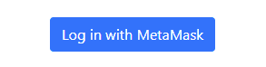
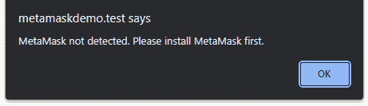
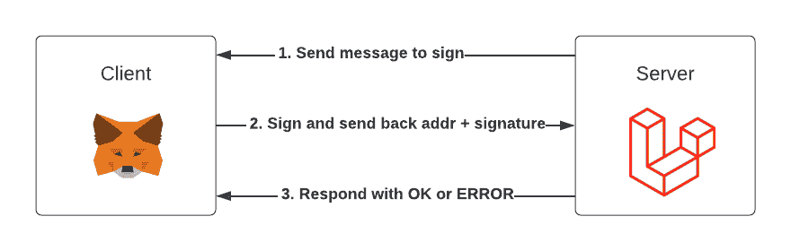

# 如何向您的 Laravel Web 应用程序添加元掩码登录

> 原文：<https://www.freecodecamp.org/news/add-a-metamask-login-to-your-laravel-app/>

通过第三方登录网站在网上无处不在。几乎所有其他会员制网站都允许你用脸书、推特和谷歌等账户登录。

如果你曾经访问过像 OpenSea 或 Rarible 这样的 NFT 市场，你会注意到他们允许你用 MetaMask 这样的加密钱包登录。

这个登录过程确认你是以太坊地址的所有者，并允许系统验证你的访问。非常类似于用户名和密码可以让你进入一个网站的门控部分。

## 先决条件

在开始本教程之前，我假设您对 Laravel 有一个基本的了解，并且您可以在您的环境中初始化一个新项目。尽管本教程是以 Laravel 为中心的，但是经过一些调整，您可以将它应用于任何其他 PHP 项目。概念保持不变。

我已经尽可能地保持它的通用性。我只关注元掩码签名和验证，并不限制您将它与特定的前端技术(如 React 或 Vue)或身份验证框架(如 Breeze 或 Jetstream)一起使用。这使您可以在现有项目中轻松实现它。

开始之前，我们需要以下内容:

*   新的或现有的 Laravel 项目。
*   安装在浏览器中的[元掩码](https://metamask.io/)。

## 样板文件

我们将从一些样板代码开始，导入 [Bootstrap 5](https://getbootstrap.com/) 并创建一个简单的“用元掩码登录”按钮。



```
<!DOCTYPE html>
<html lang="en">
<head>
    <meta charset="utf-8">
    <meta name="viewport" content="width=device-width, initial-scale=1">
    <title>MetaMask Login</title>
    <link href="https://cdn.jsdelivr.net/npm/bootstrap@5.1.3/dist/css/bootstrap.min.css" rel="stylesheet" integrity="sha384-1BmE4kWBq78iYhFldvKuhfTAU6auU8tT94WrHftjDbrCEXSU1oBoqyl2QvZ6jIW3" crossorigin="anonymous">
    <script src="https://cdn.ethers.io/lib/ethers-5.2.umd.min.js"></script>
</head>
<body>
<div class="container">
    <div class="row">
        <div class="col-12 text-center">
            <button class="btn btn-primary mt-5">Log in with MetaMask</button>
        </div>
    </div>
</div>
</body>
</html>
```

很简单。😀

我们还导入了 [ethers.js 库](https://docs.ethers.io/)，这将允许我们通过 MetaMask 与以太坊区块链进行交互，在这种情况下，meta mask 充当提供者的接口(默认情况下是 [Infura](https://infura.io/) )。

### 快速提示:

提供商允许我们与以太坊区块链互动。要连接到网络，您需要访问一个节点。根据节点的类型，它可能需要大量的磁盘空间和带宽。运行一个节点也可能是一个复杂的过程，特别是如果您想专注于开发而不是维护和操作一个节点。

输入，提供者！像 Infura 这样的公司提供这些节点作为服务，所以你不需要担心运行自己的节点。相反，您可以通过他们的 API 访问这个功能。

您可能会遇到一些较旧的教程，它们说明 MetaMask 在默认情况下将 web3.js(一个提供类似 ethers.js 功能的库)注入到页面中。这是[不再是](https://docs.metamask.io/guide/provider-migration.html#summary-of-breaking-changes)的情况。

## 检测提供商

我们将通过检查浏览器是否有可用的提供者来开始新的`web3Login()`函数。如果安装了元掩码，就会出现这种情况。您也可以在没有安装 MetaMask 的地方测试这段代码(例如，一个隐姓埋名的窗口)，以确认检测工作正常。

将 click 事件添加到按钮:

```
<button class="btn btn-primary mt-5" onclick="web3Login();">Log in with MetaMask</button>
```

从 ethers.js 导入下面的`<head>`中的检测片段开始这个函数:

```
<script>
    async function web3Login() {
        if (!window.ethereum) {
            alert('MetaMask not detected. Please install MetaMask first.');
            return;
        }
    }
</script>
```

继续在没有安装元掩码的浏览器中进行测试。



## 安装 Laravel 依赖项

在我们继续前端登录过程之前，我们需要设置一些端点。我们的登录脚本将需要这些，这样用户就可以用他们的钱包签署消息，然后我们的系统可以验证他们的签名。

我们需要通过 Composer 安装两个依赖项，以帮助我们执行散列和使用椭圆曲线加密:

```
composer require kornrunner/keccak
composer require simplito/elliptic-php
```

## 添加 Laravel 路线

打开您的 **routes/web.php** 文件并添加以下路由:

```
Route::get('/web3-login-message', 'Web3LoginController@message');
Route::post('/web3-login-verify', 'Web3LoginController@verify');
```

第一个路由将返回需要签名的消息，第二个路由将验证已签名的消息。

## 创建登录控制器

现在是时候创建将生成消息并执行验证的控制器了。

在 **app/Http/Controllers** 中创建一个名为**Web3LoginController.php**的新文件，并在其中添加以下代码:

```
<?php

namespace App\Http\Controllers;

use Elliptic\EC;
use Illuminate\Http\Request;
use Illuminate\Support\Str;
use kornrunner\Keccak;

class Web3LoginController
{
    public function message(): string
    {
        $nonce = Str::random();
        $message = "Sign this message to confirm you own this wallet address. This action will not cost any gas fees.\n\nNonce: " . $nonce;

        session()->put('sign_message', $message);

        return $message;
    }

    public function verify(Request $request): string
    {
        $result = $this->verifySignature(session()->pull('sign_message'), $request->input('signature'), $request->input('address'));
        // If $result is true, perform additional logic like logging the user in, or by creating an account if one doesn't exist based on the Ethereum address
        return ($result ? 'OK' : 'ERROR');
    }

    protected function verifySignature(string $message, string $signature, string $address): bool
    {
        $hash = Keccak::hash(sprintf("\x19Ethereum Signed Message:\n%s%s", strlen($message), $message), 256);
        $sign = [
            'r' => substr($signature, 2, 64),
            's' => substr($signature, 66, 64),
        ];
        $recid = ord(hex2bin(substr($signature, 130, 2))) - 27;

        if ($recid != ($recid & 1)) {
            return false;
        }

        $pubkey = (new EC('secp256k1'))->recoverPubKey($hash, $sign, $recid);
        $derived_address = '0x' . substr(Keccak::hash(substr(hex2bin($pubkey->encode('hex')), 1), 256), 24);

        return (Str::lower($address) === $derived_address);
    }
} 
```

这里面有很多东西，让我们来分解一下:

### 创建消息

`message()`方法创建我们将提供给前端的消息。它还包括一个随机令牌，以确保每次要签名的消息都不同。

这个令牌通常被称为 nonce，或者使用一次的数字。然而，在这种情况下，它是一个简单的随机字符串。

这样做的目的是为了防止[重放攻击](https://en.wikipedia.org/wiki/Replay_attack)，如果恶意用户获得了你的签名，他们就可以用它在网站上验证你的身份。

然后将消息保存到会话中，并返回到前端。

### 验证消息

一旦你通过元掩码用你的私钥签署了消息，你的以太坊地址和签名将被发送到后端进行验证。

如果它通过了验证，我们将确定对消息进行签名的以太坊地址，并确保它与签名过程中前端发送的以太坊地址相匹配。

如果通过，我们向前端发回一个**正常**或**错误**。

也是在这一点上，您可以添加额外的逻辑，如登录会员或创建一个新的会员记录(如果有问题的以太坊地址不存在会员记录的话)。



## 完成前端

既然后端已经准备好了，我们可以完成前端的其余部分。这将涉及启动 MetaMask，要求用户签署消息，然后使用我们的后端路由验证签名。

下面是完整的`web3Login()`功能:

```
<script>
    async function web3Login() {
        if (!window.ethereum) {
            alert('MetaMask not detected. Please install MetaMask first.');
            return;
        }

        const provider = new ethers.providers.Web3Provider(window.ethereum);

        let response = await fetch('/web3-login-message');
        const message = await response.text();

        await provider.send("eth_requestAccounts", []);
        const address = await provider.getSigner().getAddress();
        const signature = await provider.getSigner().signMessage(message);

        response = await fetch('/web3-login-verify', {
            method: 'POST',
            headers: {
                'Content-Type': 'application/json'
            },
            body: JSON.stringify({
                'address': address,
                'signature': signature,
                '_token': '{{ csrf_token() }}'
            })
        });
        const data = await response.text();

        console.log(data);
    }
</script> 
```

让我们来分解一下:

*   我们首先将提供者设置为提供的元掩码`window.ethereum`。
*   接下来，我们获取从我们的后端返回的消息(刷新页面几次来尝试一下，您会注意到每次随机的令牌变化)。
*   一旦我们得到消息，我们就获得用户的以太坊地址，并要求他们签署消息。


*   然后，我们将地址和签名(连同我们的拉韦尔 CRSF 令牌)发送到后端进行验证。
*   结果是我们在控制台中输出的一个 **OK** 或 **ERROR** 字符串。
*   此时，如果用户在后端验证期间注册或登录，您可以选择显示错误消息(如果适用)或重定向用户。

## 结论

在本教程中，我们介绍了在网站中添加元掩码登录的基础知识。我希望这证明是有用的！[注册我的时事通讯](https://webdev.chowles.com/)或[访问我的博客](https://www.chowles.com/)，在那里我会分享有见地的网络开发文章来增强你的技能。

以下是一些让您的整合更进一步的想法:

*   整合一个类似 [Web3Modal](https://github.com/web3modal/web3modal) 的库，为用户提供各种钱包选项，而不是只有 MetaMask。
*   验证用户的以太坊地址后，为他们提供显示以太网余额等功能。

### 资源

*   Download [MetaMask](https://metamask.io/) .
*   查看 [ethers.js 文档](https://docs.ethers.io/)。
*   最新 [Laravel 文档](https://laravel.com/docs)。