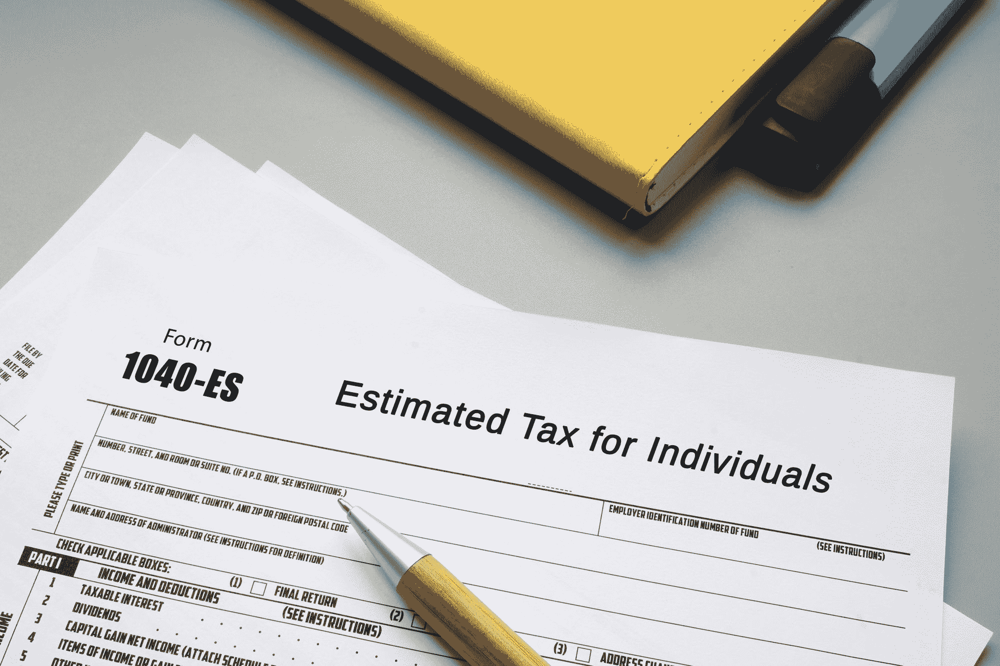

# 自由开发者的税收——作为一名自由职业者，你应该交多少税

> 原文：<https://www.freecodecamp.org/news/taxes-for-freelance-developers/>

*免责声明:本文不应被理解为税务管理或投资决策的建议。*

本文作者和 freeCodeCamp 都不是这些领域的专业人士。下面的讨论仅仅是个人观点，你应该和有执照的专业人士讨论这些问题。

如果你正在考虑开始自己的开发业务，那么你可能会有很多问题和担忧。你最可能担心的是从哪里获得客户，如何推销自己，如何度过低迷期，等等。

不幸的是，许多刚接触自由职业的人(以及许多从来懒得关注这些事情的人)没有考虑到正确管理税收的重要性。

这是一个很大很大很大的错误，原因有很多。不考虑你的税收的影响很简单——为了在一天结束时有任何钱，你将会比你需要的更努力地工作。换句话说，你可能会变成这样:

相比之下，专注于保留更多成果的开发人员可能看起来像这样:

如果你正在读这篇文章，那么我假设你并不反对繁荣，你宁愿看起来像后者而不是前者。如果你反对繁荣，那么…...嗯…..好的。

我之前为 freeCodeCamp 写过关于自由开发者如何管理税收的文章。那篇文章本质上比较粗略，没有深入到一些细节。

此外，自从我发表以来，美国税法也发生了变化。考虑到这一点，我觉得是时候对这个话题进行深入和最新的探讨了。

需要理解的一件重要事情是，这篇文章只与美国的税收有关。如果你喜欢通过视频获取信息，那么我准备了这个 ~~rant~~ 讨论:

[https://www.youtube.com/embed/l8HB14TBzs8?feature=oembed](https://www.youtube.com/embed/l8HB14TBzs8?feature=oembed)

如果你和我一样，喜欢通过阅读来吸收，那就继续读下去。

在这篇文章中，我将深入探讨几个主题。下面是这次讨论的路线图。要跳转到特定的部分，只需点击其链接。

## 目录

1.  为什么人们应该留意他们的税收

1.  你最大的支出之一，如果不是最大的，就是你的税收
2.  今天关于“收入不平等”的讨论忽略了一点，即机会是给予自由职业者和小企业主的
3.  注意你的税收，你可以大大改善你的财务状况

3.  控制税收需要了解的概念([跳到第](#quest5)节)

1.  理解收入和收益之间的差异([跳到第](#quest6)节)
2.  雇员和企业主的税收如何不同([跳到第](#quest7)节)
3.  了解一个人必须缴纳的不同类型的税&分级括号([跳到第](#quest8)节)
4.  缴纳的税款与年内缴纳的税款([跳到第](#quest9)节)

5.  你的业务结构如何影响你的税单([跳到第](#quest10)节)

1.  了解符合条件的业务扣款([跳转到](#quest11)节)
2.  作为独立承包商工作([跳到第](#quest111)节)
3.  独资企业([跳到第](#quest12)节)
4.  有限责任公司税收([跳到第](#quest13)节)
5.  美国公司税([跳到第](#quest14)节)
6.  根据您的情况选择合适的实体([跳到第](#quest15)节)

7.  采取和最大化扣除的重要性([跳到第](#quest16)节)

1.  错过一项支出相当于向政府捐款([跳转到第](#quest17)节)
2.  可以扣除的费用([跳转到](#quest18)节)
3.  最大化退休计划以节省税收([跳到第](#quest19)节)

9.  作为企业主/自由开发者在一年内付款([跳到第](#quest20)节)
10.  你选择住在哪里会影响你的税单([跳到第](#quest21)节)
11.  结束语([跳到第](#quest22)节)

所以，让我们开始吧！

## 为什么自由开发者和其他企业主必须注意他们的税收

[返回页首](#table-of-contents)

如果你正在考虑做自由职业者，或者已经这样做了，那么我假设你的动机至少有一部分是为了赚更多的钱和/或拥有工作灵活性。

好吧，如果你想要这些东西中的任何一个，那么关注你的税收是至关重要的。

原因有三。首先，正如许多人没有意识到的那样，你的税收是你最大的支出之一，当你的大笔支出没有得到控制时，你很难取得进展。

第二，如果你忽略了这个领域，你就会错过一个巨大的金融机会。

最后，关于留意你的税收如何能改善你的财务状况，这些数字不会说谎。让我们依次来看一下每一项。

### 大多数人，包括企业主，都没有意识到税收是他们最大的支出之一

[返回页首](#table-of-contents)

人们感受压力最大的事情之一就是钱。对于自由职业者和小企业主来说尤其如此，因为他们没有来自雇主的薪水。

不言而喻，良好的财务健康最重要的一个方面是保持低支出。当你考虑可以减少的开支时，大问题就来了。你的分析通常不涉及税收。

对于几乎所有人来说，试图通过减少各种开支而不考虑减税来取得成功，就像试图通过在麦当劳点一份三倍价值的餐，外加鸡块来减肥一样。不是很好用。

让我们看看我的意思。

例如，假设你住在旧金山(你很快就会明白为什么我用 S.F .作为例子),你为自己工作一年赚 110，000 美元。另外，假设这是你唯一的收入来源。

现在假设你没有关注减税(意味着你和大多数自由职业者一样)。

到今年年底，你将支付 32，838 美元的税款([来源:免费所得税计算器](https://smartasset.com/taxes/income-taxes#cx6fDxWcPn))，这意味着你实际上只保留了 77，162 美元的辛苦钱。这方面的细分如下:

| 收入 | 11 万美元 |
| 联邦所得税 | (17504 美元) |
| FICA(社会保障等。) | (8415 美元) |
| 州所得税 | (6919 美元) |
| 网 | $ 77162 |

在这种情况下，一个自由职业者每月大约要支付 2736 美元的税款。现在想一想，你认识的人中有多少人为了节省房租而找了一个室友，他们想方设法在网飞账户或食品杂货上节省一些钱，但却没有努力减少他们的税单。这也是我做上面麦当劳对比的原因。

为什么我选择旧金山和 110，000 美元的收入作为例子？简单的...这是现实生活中的场景。几个月前，一个朋友来看望我和我的妻子，她住在旧金山。一些评论是关于努力“出人头地”

当我问她最大的两项开支是什么时，她提到的第一项是房租。第二项是每年 8000 美元的费用。换句话说，她在寻找省钱的方法，但却没有考虑到一个最大、最容易的省钱方法。

如果你想真正获得成功，那么你需要明白你最大的开销是什么。对大多数人来说，这是他们的税单。

### 许多提到“收入不平等”的人忽略了一点，即税法为普通的开发商或其他企业主提供了巨大的机会

[返回页首](#table-of-contents)

我确信这一部分的标题会导致对这篇文章的一些负面反应。然而，在驳回我的陈述之前，请考虑一些事情。

首先，重要的是要认识到一个普遍的抱怨，即当今的税法“有利于富人”。事实上，这是不准确的。税法不支持个人或富人。它偏爱的是某些活动。

一个普通人可以像富人一样参与这些活动。我将在本文后面讨论的细节将说明为什么会出现这种情况。

现在要记住的一件大事是，税法的制定是为了支持那些创业和投资的人。这意味着，如果你没有把你的“自由职业”组织成一门生意，也没有进行投资，那么你就是在浪费金钱。

一个在旧金山年收入 110，000 美元的人，就像上面的例子中的人，如果他们不利用税法中的任何条款，他们每年将支付 32，838 美元的税款。

然而，如果他们利用税法提供的机会，他们可以将每年的税单降低到 15，000 美元多一点。换句话说，以注意减税的方式经营你的企业和做出选择，每年可以为你节省 17，838 美元。

人们普遍认为，关注税收是“富人做的事情”，这是不准确的。人们不关注他们的税收，因为他们富有——他们之所以富有，部分是因为他们关注他们的税收。

如果你创业是增加收入的一种方式，那么考虑这个事实是至关重要的。

### 关注税收可以极大地改善自由开发者的财务状况

[返回页首](#table-of-contents)

上面的讨论是为了阐明一个重要的观点——作为一名自由开发者，留意你的税收是改善你财务状况的最快方法之一。

保持更多的收入意味着你口袋里有更多的钱，而不必增加你的总收入。相反，不关注你的税收意味着你在每次领工资时都要向政府机构支付额外的钱。

这意味着你没有尽可能多的钱，你经常认为你需要更多的顾客来获得更多的现金。然后，你得到这些客户，并从这些客户的付款中支付超额税款。

换句话说，你试图通过把一块巨石推上一个非常陡峭的山坡来领先，就像这个人:

祝你好运。现在让我们来看看你可以采取哪些措施来控制你的税收。该过程的第一部分是理解美国税法下的一些不同概念。

## 自由开发者为了正确管理他们的税收必须理解的概念

[返回页首](#table-of-contents)

在你能控制你的税单之前，有几个概念你需要理解。我在以前的税务文章中提到了一些(在本指南的介绍部分有链接)。

我们需要关注的是:

*   收入和收益之间的差异
*   雇员和企业主的税收如何不同
*   美国存在的不同级别的税收
*   累进税级的概念，以及
*   预扣税款和实际缴纳税款之间的差额。

理解其中的每一项，对于确定你的选择如何影响你的整体税单，并帮助你制定未来的战略是非常重要的。

在开始管理你的税收之前，理解一些核心概念是很重要的。现在，我将把它保持在税收概念上，而不是进入我的关于需要尽可能多学习商业知识的更大的咆哮中。

我们先来看一下这些税收概念，因为，出于可以理解的原因，大多数人认为他们的税收传统上是从他们的工资中扣除的，他们从来没有真正担心过。此外，许多自雇人士从来没有花时间真正考虑他们的税收结构。

所以，让我们来看看收入和收入之间的差异，企业主和员工的税收如何不同，在美国你必须支付的不同类型的税，以及你每年支付的与实际支付的之间的差异。

### 自由开发者和其他企业主一样，是按收入缴税，而不是按收入缴税

[返回页首](#table-of-contents)

当你作为雇员工作时，计算你的收入很简单。您会收到一份工资或一份小时工资，并且在年底时，您的 W2 上会报告该报酬的总额。

当你是自由职业者时，这是不同的。一年中进入你公司账户的钱数并不是你实际赚到的。这是因为你的企业有费用，你不得不承担，以赚取这笔钱。扣除费用后剩下的部分，也就是你的利润，是你在纳税时考虑的收入。

假设 Jane Developer 为一家当地企业建立了一个网站或应用程序，获得了 5000 美元。她先付了 60 %( 3000 美元),剩下的 2000 美元在 30 天后她完成项目时支付。在此期间，简的收入为 5000 美元。

现在假设她花了 200 美元在开发业务的广告上，50 美元在责任保险上，50 美元在业务相关的软件订阅上。简的*利润*或*净收入*为 4700 美元，细分如下:

| **收入** | 5000 美元 |
| 广告 | (200 美元) |
| 保险 | ($50) |
| 软件订阅 | ($50) |
| 净收入 | 4700 美元 |

我花时间来解释这一点，因为我已经和太多太多的自由职业者交谈过，他们通过背诵他们的收入数字来回答他们赚了多少的问题。

这些人然后把这个数字作为他们的收入放在他们的税上。因此，在上面的例子中，许多人申报的收入是 5000 美元，而不是 4700 美元。如果他们支付 15%的税，那么这些人将支付 750 美元的税($5k x 15%)，而不是他们应该支付的 705 美元($4.7k x 15%)。

理解税收和收入之间的区别对于不向美国国税局多报收入和为你实际上没有赚到的钱缴税是至关重要的。

### 开发商如何被征税将取决于他们是雇员，一个“真正的”自由职业者，还是一个企业主(你想成为一个企业主)

[返回页首](#table-of-contents)

美国的税收结构极其复杂。这就是为什么这个国家存在一个完整的行业来帮助人们处理这个问题。它也被称为“唯一一部要求人们付钱给专业人士以确保他们不违法的法律。”

作为开发商，这种税收结构如何适用于你取决于几个因素。首先，雇员和“独立承包人”的征税方式不同，其次，企业的征税方式也不同。至于如何对企业征税，这进一步分为理解不同类型的企业如何归入该系统。

在本文的后面，我将通过例子详细说明。现在，这里有一个快速的概述，根据你作为雇员、承包商、企业主等的身份，你将如何被征税。

顺便说一句(这将向你展示我极客研究的主题类型)，如果你对美国的税收制度以及支撑它的一个行业的无用* 如何形成感兴趣，那么我建议你阅读约翰·布鲁克斯(链接到亚马逊)的[《商业冒险》的第三章。](https://www.amazon.com/gp/product/B00LX6G752?pf_rd_r=8DBF61M9Y5QWNXY8Z5RC&pf_rd_p=1ab92b69-98d7-4842-a89b-ad387c54783f&pd_rd_r=3ea1b78e-c060-4b30-9527-804322bc0e2e&pd_rd_w=GyQCH&pd_rd_wg=rS7JX&ref_=pd_gw_unk)

无用的工作或活动——浪费的或无意义的，但看起来有价值的工作或活动。

如果你是一个在工作的开发者，那么你将从你的雇主那里得到一份薪水。你将为这份薪水支付百分之百的联邦税、州税和地方税。

您的义务的联邦税部分将包括您的所得税以及您的 FICA(联邦保险缴款法)付款。这些 FICA 付款构成了您对社会保障和医疗保险的贡献。

因为你所有的收入都记录在你的薪水册上，而且你的雇主负责记账，所以在年底向政府报告你的收入很简单。

一些“自由职业者”选择做独立承包人。这些人没有开始正式的业务，而是在年底从他们为之工作的人那里收到一份 1099。

这些个人在完成纳税时将填写“附表 C”表格。他们的收入是通过把从顾客那里得到的所有钱(收入)加起来，然后减去他们的费用而确定的。

大多数独立承包人将为他们利润的前 80%缴纳联邦所得税(更多信息见下文)，他们还将为他们的净收入缴纳个税(相当于 FICA)。你是否为你的利润缴纳州税和地方税，部分取决于你住在哪里。

如果你不希望成立一个正式的法律实体来开展业务(稍后会详细介绍)，但你希望拥有一个法律认可的企业名称，那么你可以获得一个营业执照，并开始一个*独资企业*(这种类型的结构的许可/文书工作将因地区而异)。这将允许你在一个商业名称下操作，有一个商业级别的银行帐户，等等。

你将在年底填写一个附表 C，类似于独立承包商，你将有一个类似的税收结构。从税收/财务的角度来看，成为独资经营者和独立承包商是相似的。

另一个选择是成立一个正式的法律实体，通过它你可以做生意。这带来了许多好处(比如责任保护)，但超出了本文的范围。

实际上，大多数人会成立一个有限责任公司，一些人会选择将有限责任公司作为“S”公司来征税。后一种选择意味着你拥有一个有限责任公司，但仅出于税收目的，它被国税局视为 S 公司。

如果你在经营一个有限责任公司，而没有 S 的选择，那么企业的利润会“流”给你。换句话说，如果企业有 100，000 美元的利润，那么你将在你的个人纳税申报表上报告这些利润，因为有限责任公司本身不纳税。

走这条路的大多数开发商将支付 80%的利润的联邦所得税(同样，更多的在下面)和所有利润的自雇税。

如果你是走 S 选，那么作为公司的员工，你必须给自己支付一份“合理的薪水”。这份薪水将像任何 W2 员工的薪水一样被征税。S 公司的剩余利润将流入你的个人纳税申报单。

大多数开发商将为这些利润的 80%缴纳联邦所得税，而不会被要求为这些利润缴纳个税。有限责任公司或股份有限公司的所有者是否缴纳州税和地方税取决于他们的居住地。

如果你是为自己工作，那么与税务和/或法律专业人士交谈以确定哪种业务结构最符合你的目标是很重要的。每种结构都有自己的好处，也有自己的额外费用和复杂性。

### 开发人员应了解可能适用于他们和/或其业务的不同类型和等级的税收

[返回页首](#table-of-contents)

我们刚刚讨论了你在自由职业中可能使用的不同类型的商业结构。下一个要讨论的“核心概念”是美国存在的不同层次的税收结构。

一旦我们做到了这一点，那么，在本文的稍后部分，我们将把两者放在一起，并展示不同的业务结构是如何受到这些税收等级的影响的。

#### 自由开发者应该知道不同级别的税收

如果你是个体户，那么你需要了解三个核心级别的税收(实际上还有其他的，但不在讨论范围之内)。

这些税是支付给联邦政府的，支付给州政府的，以及支付给当地政府的。让我们依次来看一下每一项。

向联邦政府缴纳的税是大多数人提到“纳税”时想到的税。然而，这些税收由两部分组成。

首先是联邦所得税。这是一种税，由政府根据你的收入来征收。你的收入越高，税就越高。

联邦税的第二个组成部分是 FICA 和医疗保险缴款。如上所述，这是您对社会保障和医疗保险等计划的贡献。

对于 2021 纳税年度(这些计算每年都有变化)，FICA 和医疗保险缴款在稍微简化后，占你最初 142，800 美元收入的 6.2%，占总收入的 1.45%。6.2%的缴款用于社会保障，后者用于医疗保险。

因此，简单来说，一个年收入 10 万美元的人，如果没有适当的规划，除了联邦所得税之外，还需要支付 7650 美元的 FICA 和医疗保险税。

除了联邦税，你可能还要向州政府和地方政府缴税。这将因地区而异。

如果你住在“Y”州的“X”市，你可能需要通过州税务机关向 Y 提交州纳税申报表，同时还要通过 X 的税务机关提交市纳税申报表。

然而，有些州没有任何形式的州所得税。有些州仅对某些商业活动征收州所得税，而有些州则对所有人征收州税。

地方也是如此。如果你住在一个有几级税收的地区，那么你需要为每一级政府报税。

#### 自雇开发人员应该了解税级

相当多的人听说过美国税法中的“税级”,但并不真正了解它们是如何工作的。

例如，如果有人被告知他们“今年将处于 32%的范围内”，那么他们很可能会认为这意味着他们的联邦所得税将等于他们收入的 32%。事实并非如此。这是因为联邦所得税等级是“分级”的。让我们看看这意味着什么。

对于 2021 纳税年度，美国的单个申报人有七个不同的税级。纳税人的收入将在每一个等级中纳税。

例如，你挣的第一笔 9，950 美元，在扣除之后(扣除将在本文后面讨论)需要缴纳 10%的联邦所得税。

任何介于 9950 美元到 40525 美元之间的收入都要缴纳 12%的联邦所得税。这意味着一个收入为 40，525 美元的人，在扣除之后，将被征税如下:

| **应税所得** | **税率** | 总税收 |
| $ 9950 | 10% | $995 |
| 30575 美元(40525-9950 美元) | 12% | $ 3669 |
|  |  | 总税收 4664 美元 |

如下表所示，扣除所得税后收入为 40，525 美元的人将支付总额为 4，664 美元的联邦所得税，约占其收入的 11.5%。这样的个人将被称为“在 12%的范围内”,因为这是他们收入的一部分被征税的最高范围。

然而，这并不意味着他们所有的收入都要按这个税率纳税。因此，当你听到像我这样的人抱怨极高的税率时，我们实际上只是在抱怨高收入阶层的税率。

仅供参考，以下是个人[^(^(【3】))](#_ftn3)的 IRS 2021 括号细目。

| **应税所得** | **税率** |
| $0 到$ 9950 | 10% |
| $ 9950-$ 40525 | $995 +超过$ 9950 金额的 12% |
| $40，525-$ 86，375 | $ 4664+超过$ 40525 金额的 22% |
| $86，376-$ 164，925 | 【14751 美元+超过 86375 美元金额的 24% |
| $164，926-$ 209，425 | $ 33603+超过$ 164925 金额的 32% |
| $209，426-$ 523，600 | $ 47843+超过$ 209425 金额的 35% |
| $523，601 或更多 | 157804.25 美元+523600 美元以上金额的 37% |

来源: [2021 年联邦所得税税率，括号，&标准扣除额| IRS.com](https://www.irs.com/articles/2021-federal-income-tax-rates-brackets-standard-deduction-amounts/#:~:text=1%202021%20Individual%20Income%20Tax%20Brackets.%20The%20federal,deductions%3A%20the%20standard%20deduction%20and%20itemized%20deductions.%20)

这就结束了本文中关于许多人缴纳的税种(联邦税、州税和地方税)的部分，以及对累进税级的解释。

在详细说明如何减少你的税收之前，最后一个要点是，理解一年中支付的税收和支付给政府的款项之间的差异。

### 自由职业者需要意识到一年中缴纳的税款和支付的款项之间的差异

[返回页首](#table-of-contents)

我与许多人交谈过，他们没有考虑到他们在一年中支付的税款和他们实际支付的税款之间的差异。

这对自由开发者和任何自由职业者来说都是至关重要的，因为在一年中未能支付适当的款项可能会导致国税局的处罚。

让我们来看看缴纳的税款和实际缴纳的税款之间的区别，然后我们来看看作为一名自由职业者，你是如何纳税的。

如果你有一份工作，那么你应该很熟悉雇主从你的薪水中扣缴税款。这些税收然后被送到联邦政府。在年底，当你准备纳税申报表时，你根据你的收入确定要向政府缴纳的税额。然后，通过您的工资扣缴所支付的款项将应用于该金额。

如果你的扣缴超过了要支付的税款，那么你会收到差额的退款。如果要支付的税款超过你的预扣金额，那么你欠国税局的余额。

作为一名自由开发人员，在讨论一年中如何纳税之前，重要的是要理解关于接收“退税”的一件事。

我知道很多人在年底会很兴奋，因为他们会收到退款。这些人通常认为这种退款是政府给他们的某种意外之财。他们不明白的是这是他们的钱！这只是对他们多付税款的退款。换句话说，通过在一年中支付太多，他们实质上是把钱借给了政府*无息*，并在年底收回盈余。

虽然我不喜欢在年底欠钱，但无息借钱给任何人肯定不是好的理财方式。这就是为什么我试图以一种方式来组织我的事务，在年底我要么没有余额，要么有一个小的余额来避免惩罚。这样我一年中会有更多的钱。

如果你是一个自由职业者/个体户开发者，那么如果你收到一个 1099，如果你是一个独资经营者，或者如果你经营一个没有选择 S 公司的有限责任公司，你就不会被扣缴税款。这是因为你直接从你的顾客那里得到报酬。

如果你在这一年中没有定期向政府付款，如果你少交了足够多的税款，除了你所欠的税款之外，你还可能被国税局征收罚款。

为了确保你不会被罚款，你需要使用[表格 1040es](https://www.irs.gov/pub/irs-pdf/f1040es.pdf) 按季度向政府付款。虽然该表格提供了一个计算器，可以计算出你每季度需要支付的金额，以避免罚款，但这并不意味着你在年底仍不会欠美国国税局的钱。至关重要的是*你要和税务专家讨论你的预计支出。*

如何计算季度纳税额以及罚款的应用可能会成为一个相当长的讨论，超出了本文的范围。我的强烈建议是，你要意识到这个问题，确保你的付款，并与税务会计师讨论你的情况。

年内纳税的方式不同于成立了有限责任公司并选择作为 S 公司纳税的个体户开发商。这是因为，如上所述，S 公司的所有者必须支付给自己一份“合理的薪水”超过工资的任何利润都将分配给所有者。

然而，工资的支付意味着企业主收到的是一份可以扣缴税款的薪水支票。

记住，S 公司的所有者必须为他们的工资和利润缴纳联邦所得税。因此，虽然工资税会从你的支票中扣除，但你仍然需要确保你支付的足够支付你的利润税。

在我们的业务中，除了已经从我们的工资中扣除的部分之外，我们还通过征收额外的联邦所得税来解决这个问题。再次，与税务专家讨论你的情况，找出你的最佳行动方案。

现在，所有这些都不在话下了，让我们来看看自由职业者可以利用的不同商业结构所带来的税收后果。

## 自由开发者的业务结构将如何影响他们的纳税义务

[返回页首](#table-of-contents)

你组织商业活动的方式会影响你缴纳各种税的程度。

一般来说，你要么作为一个独立的承包商工作，在年底收到 1099(通常是一个坏主意)，作为一个有限责任公司(称为“LLC”)的所有者，“独资经营者”，或者你可以选择作为 S 公司纳税。

每种结构都有不同的复杂程度，正如每种结构都有不同的好处一样。为了理解这是如何影响你将支付给税务员的，让我们深入了解一个典型的公司雇员是如何被征税的，然后在我刚才提到的每种业务结构下，自由职业者是如何被征税的。

但是，首先，我们需要了解关于所谓的“合格业务收入”扣除的规则。这也被称为“QBI”演绎。

### 2017 年的减税与就业法案创造了合格的企业收入扣除

[返回页首](#table-of-contents)

合格的商业收入扣除是根据 2017 年减税和就业法案创建的。这项扣除允许个体户只要他们的总收入低于 164，900 美元，就可以免除他们企业收入的前 20%的联邦所得税。是的……我知道这听起来令人困惑。让我们把它分解一下。

如果您 2021 年的总收入低于 164，900 美元，那么来自“合格商业活动”的任何收入的前百分之二十将不缴纳联邦所得税。为了更容易地解释这是如何工作的，让我们看看这如何应用于两种不同的情况。

假设 Joe Developer 是一名自由职业者，并且能够扣除符合条件的业务收入。乔的全部收入来自他的自由职业活动，他 2021 年的总利润是 15 万美元。Joe 将只为价值 120，000 美元的收入缴纳联邦所得税，因为他没有为其 150，000 美元利润的前 20%纳税。

现在假设 Jill Developer 有 30，000 美元的自由职业收入，100，000 美元的全职工资，以及另外 20，000 美元的来自她所拥有的出租单元的利润。吉尔的总收入也是 15 万美元。

然而，吉尔将被征收 144，000 美元的所得税，因为只有 30，000 美元与“合格企业”有关。因此，只有 30，000 美元适用于符合条件的业务收入扣除。如果吉尔的总收入超过 164，900 美元，那么她可能根本无法扣除她的 QBI。

现在，让我们来看看 QBI 和其他与税收相关的问题如何适用于拥有一份工作、拥有一家企业，以及您的企业形式如何影响纳税义务。

### 作为 W2 员工的开发人员可能比自由职业者支付更多的税款

[返回页首](#table-of-contents)

当一个人在一家公司工作时，他们会被认为是“W2 员工”这意味着雇主将在年底向员工发放 W2。雇主将从雇员的工资中扣缴联邦所得税和 FICA(如上所述)。

成为 W2 员工的最大缺点之一是，由此产生的收入是一个人可以赚取的最高税收收入。这是因为他们要为他们所有的收入缴纳联邦所得税。他们还负责为 2021 年赚的前 142，800 美元缴纳社会保障税(这一限额每年调整)。最后，他们还要为他们所有的收入缴纳医疗保险税。

当有人自动从你的所有收入中分一杯羹时，你很难在生活中取得成功。这就是 W2 员工的处境。幸运的是，那些走自由职业路线的人有选择。让我们依次来看一下每一项。

### 自由开发人员，他们没有形成一个企业，也许可以减少他们的纳税义务。

[返回页首](#table-of-contents)

一个自由职业的开发者，没有形成一个企业，年底会收到一个 1099。根据他们的自由职业活动是否持续和正在进行，他们可能会认为自己是一个“独资经营者”，这将在下面解释。独资经营者有资格获得上述的合格企业收入扣除。

一个没有正式成立企业的人是否可以认为自己是独资经营者的关键在于他们的活动是否是持续的。我们用几个例子来解释一下这个。

假设 Joe Developer 有一份全职工作，但只做了一个需要六个月才能完成的兼职项目，而且他没有创业。他在这个兼职项目中获得 100，000 美元，并在年底获得 1099 分。

在此期间，他不接其他项目，也不试图获得其他项目，一旦一个项目完成，他就停止“自由职业”工作。

最有可能的是，Joe 的活动不是“连续的和正在进行的”，而是一次性的活动。很可能，乔将不能称自己为独资经营者，而必须以独立承包商的身份支付全部 10 万美元的联邦收入。

现在假设 Jill Developer 全年都在做一些小项目，并从她的副业中赚了 30，000 美元。她一直在寻找更多的工作和/或为不同的客户表演。

因为吉尔的活动是“连续的”,她很可能能够采取 QBI 的演绎。这意味着她只需为她收入的 24000 美元缴纳联邦所得税(30000-20%)。

有一件事对 Joe 和 Jill 来说很重要，那就是独立承包人和独资经营者都必须为他们所有的商业收入缴纳“个体经营”税。

自雇税相当于 FICA/医疗保险支付。因此，换句话说，由于 QBI 扣除，Jill 支付的联邦所得税比 W2 员工略少，并且支付的自营职业税与 W2 员工支付的 FICA/医疗保险税相同。在各方面，Joe 将与 W2 员工处于相同的纳税水平。

正如这些例子所示，如果你走自由职业路线，那么你可以看到税收优惠(主要是 QBI 减税)，只要你不是简单地完成一个“一次性”项目，而是参与连续的活动。

### 组建一个正式的独资企业可以为自由开发者带来税收优惠

[返回页首](#table-of-contents)

独资经营者是指个体经营者，但并没有创办正式的商业实体，如有限责任公司或股份有限公司。这是一个获得当地营业执照并注册一个商品名称的个人(取决于他们特定地区的规则和法律)。

通过这项业务获得的收入在他们的个人纳税申报表附表“C”中报告，并有资格获得合格的业务扣除。与独立承包人一样，独资经营者将为其所有利润缴纳个体户税。

组建正式企业的好处之一是，它消除了关于你是否可以把自己视为独资经营者的模糊性。

在上面的例子中，Joe developer 可能无法将自己归类为独资经营者，因为他没有从事持续的商业活动，也没有通过获得营业执照和注册商号来组建企业。

通过组建企业，你可以更舒服地称自己为独资经营者(一般来说)，并确保你获得符合条件的业务收入扣除的好处。

从全局来看，获得营业执照和商标通常并不昂贵。很有可能这样做是值得的。

### 自由程序员可以选择成立一个有限责任公司

[返回页首](#table-of-contents)

自由程序员的另一个选择是创办一家有限责任公司。这是一家被视为独立于所有者的公司。

组建有限责任公司有很多好处。这些好处包括很多超出本文范围的东西，比如责任保护、轻松引入合作伙伴的能力。

当你开始一个有限责任公司时，你将通过你所在州的州务卿办公室成立实体。你还需要检查你所在的州关于商业许可等方面的要求。

有限责任公司将拥有自己的银行账户，客户将通过有限责任公司付费。公司的所有者可以以“分配”的形式从企业中提取资金

有限责任公司本身在这一年中不纳税。它将通过纳税表格 1065 向国税局报告其收入和支出。每年年底，企业的所有者都会收到一份叫做 K-1 的表格。所有者将负责支付其各自分享的有限责任公司利润的任何税款。

作为有限责任公司运营的自由开发者将能够获得上面解释的合格商业收入扣除。他们还将对自己在有限责任公司利润中的份额承担全部责任。让我们通过例子来看看这在实践中是如何工作的。

Jill Developer 和 Joe Programmer 一起创建了一个 LLC，并开始接受客户。吉尔拥有该公司 60%的股份，乔拥有 40%的股份。该公司 2021 年的利润为 10 万美元。吉尔在企业收入中的份额是 60，000 美元(百分之六十)，乔的份额是 40，000 美元(百分之四十)。

由于适用合格商业收入扣除，Jill 收入中的 48，000 美元(60，000-20%)将缴纳联邦所得税。乔收入的 32，000 美元(40，000-20%)将缴纳联邦所得税。每个人都将对他们在公司利润中的全部份额承担个税。

一个人也可以创办一个有限责任公司——不一定要采取合伙的形式。然而，出于税务目的，单一成员有限责任公司被称为“被忽视的实体”,单一所有人将申报附表 C，就像他们是独资经营者一样。

就联邦税收而言，这几乎没有区别，因为作为独资经营者和有限责任公司的税收后果本质上是相同的。然而，在国家税收方面可能存在差异，重要的是要记住，存在非税收利益，如责任保护，这可以通过组建单一成员有限责任公司来实现。

### 个体户开发者可以通过参加“S Corp 选举”来节省联邦所得税和个体户税

[返回页首](#table-of-contents)

个体开发者的另一个选择是成立一个有限责任公司，并选择像一个“S”公司一样被征税。

在这种情况下，企业是一个有限责任公司，但仅出于税收目的，被国税局视为 S 公司。这为所有者提供了拥有有限责任公司的好处，但也带来了一些额外的税收优惠——主要的好处是公司的利润不需要缴纳个税。

让我们看看一个 S 公司的选举是如何实现这一点的，以及当你开始创业时，你如何进行选举。

当一个有限责任公司选择作为 S 公司纳税时，所有者必须支付给自己一份“合理的薪水”这份薪水来自于老板的薪水支票，薪水支票的征税和其他 W2 员工一样。

然而，在此之后，业主开始获得多种税收优惠。首先，如果你是一名个体户开发者，那么公司的利润将被视为合格的商业收入，这意味着你可以获得 QBI 扣除。

第二，公司的利润不用缴纳个税。这意味着 S 公司的选举可以带来多重好处。

假设 Jill Developer 想走自由职业路线。她开办了一家有限责任公司，并选择作为 S 公司纳税。Jill 认为对于她这种技能水平的开发人员来说,“合理的工资”是每年 60，000 美元。S 公司付给吉尔 60，000 美元的薪水。该公司在 60，000 美元的工资之外还有 50，000 美元的利润。这意味着 Jill 的总收入为 110，000 美元(60k 工资 50k 利润)。

然而，其中只有 10 万美元需要缴纳联邦所得税。6 万美元的工资是要纳税的，由于百分之二十的 QBI 扣除，只有 4 万美元的利润要缴纳联邦所得税。此外，50k 美元的利润免于个税。

因此，虽然独资经营者或有限责任公司所有者会为全部 11 万美元的收入缴纳个税，但吉尔只会为她的“合理工资”缴纳个税。

组建有限责任公司通常是通过国务卿来完成的。要被视为 S 公司，LLC 需要填写并向国税局发送 2553 表格[。](https://www.irs.gov/pub/irs-pdf/f2553.pdf)

需要注意的是，表格 2553 只能在纳税年度开始后的 75 天内发送给 IRS。这意味着，如果你刚刚开始有限责任公司，你有 75 天的时间进行选举。否则，你必须等到下一个纳税年度开始被当作 S 公司对待。

如果您错过了这个截止日期，您将在下一个纳税年度开始后的 75 天内使该选择在该年度生效。

股份有限公司的好处超过了独资企业或有限责任公司。然而，一家美国公司确实会带来额外的负担和需要考虑的事情。在决定哪个企业实体适合你时，权衡所有利弊是很重要的。

### 开发者应该选择最适合他们情况的业务结构

[返回页首](#table-of-contents)

在经历了上述所有选择后，看起来成立一个 S 公司性质的有限责任公司是显而易见的选择。这种结构提供了尽可能多的税收优惠。

然而，重要的是要记住，每一级的节税都会带来额外的繁文缛节和费用。

一方面，成立一个独资企业很简单，因为获得营业执照和商标通常不贵，成本也很低。在光谱的另一端是 S 公司状态——这涉及支付自己“合理的薪水”，这意味着管理工资单文件和其他监管障碍。选择最适合你的情况的结构是很重要的。

同样，你应该与税务专家(我不是)讨论如何构建企业需求的任何决定。我个人的、非专业的观点是，你越想发展你的业务，就越有必要将你的业务结构提升一个档次。

在我们公司，我们省下的税款证明支付 [Quickbooks 工资单服务](https://quickbooks.intuit.com/payroll/)和管理工资单所涉及的时间是合理的。换句话说，收益大于成本。

然而，如果你只是到处进行一个项目，那么你就需要权衡潜在的节税和给定结构的时间和费用。

归根结底，如何构建你的企业是个人的选择。然而，了解这些选择如何影响你的税收，对于规划你的业务和努力在这个世界上取得成功是很重要的。

既然我们已经了解了你的企业结构将如何影响你的纳税义务，让我们来看看采取和最大化你的各种扣除的重要性。

## 自由职业者和个体开发者必须理解税收减免的重要性，并利用它们

[返回页首](#table-of-contents)

最大限度地减少你的纳税义务的一个重要部分是确保你利用所有可能的扣除。

我与那些没有最大化扣除额的人定期交谈的程度令我个人感到震惊。这些人把大量的钱放在桌子上，同时抱怨不能“出人头地”。

本税务指南的这一部分将专门讨论扣除的重要性。

首先，我们将看看如何不利用你的扣除相当于向政府捐款。

第二，我们会看看年底可以从你的应税收入中扣除的各种费用。

最后，我们将看看适当的退休计划如何影响您的税单。然而，在深入这些话题之前，我认为解释一下“演绎”的概念是很重要的。

许多人都熟悉减税的概念。然而，大多数人不明白扣除并不是一美元换一美元的信贷。相反，扣除会减少收入，从而减少你的税单。

在本指南的前面，我们看到了收入越高，纳税越多。例如，如果你在 2021 年处于 24%的税收等级，那么你赚的最后一美元将导致 24 美分的纳税义务。

我们还研究了自由职业者是根据他们的利润纳税，而不是根据他们的 T2 收入纳税。这意味着，如果你有 100 美元的收入，10 美元的业务相关费用，那么你只需为 90 美元的收入纳税(100 美元的收入-10 美元的费用)。

将这些概念放在一起，我们看到，如果你在百分之二十四的范围内，那么你的纳税义务将是最后 90 美元的 21.60 美元(24% * $90)。因此，通过从 100 美元的收入中扣除 10 美元的业务费用，你节省了 2.4 美元的税款(24-21.6 美元)。

换句话说，你作为费用扣除的任何东西都意味着你必须纳税的收入的减少。因此，重要的是你要了解哪些业务费用是可扣除的，并向你的会计师报告/在你的纳税申报表上报告。

### 如果开发商未能扣除他们的业务费用，他们实际上是在向政府捐款

[返回页首](#table-of-contents)

我与太多的小企业主(包括开发商)交谈，他们没有很好地确保在年底将所有业务费用作为扣除额进行申报。这相当于不必要地向联邦政府捐款。

你可以这样想——如果你没有注销一项可扣除的费用，那么你必须为这笔钱纳税。让我们以举例的方式来看这个问题。

Jill Developer 的自由职业带来了 10 万美元的收入。她扣除了 20，000 美元的业务必需服务费用(AWS 等)。这使她的应税收入(她将支付的税款)下降到 80，000 美元。

然而，作为工作的一部分，她会定期开车去见客户。在这一年中，她的汽车产生了价值 2000 美元的工作里程。她没有将里程数作为费用扣除(更多信息见下文)。

这意味着吉尔为她的工作里程支付了 2000 美元，并通过不注销支付了 440 美元的不必要的税款。这相当于吉尔让政府不必要地保留了她的 440 美元。如果吉尔想出人头地，给她一个建议:不要那样做。

对于个体经营者来说，不确定什么是可以扣除的业务费用是很常见的。我在工作中遵循的一条规则是，宁可错误地假设一些东西是可扣除的，然后询问我们的会计师。

如果你不向你的会计师报告一笔费用，那么他们甚至没有办法知道这笔费用的存在。这可能导致可扣除的费用被遗漏。

相反，如果你让你的会计师知道所有的事情，然后让他们排除不可扣除的费用，你确保你不会错过任何扣除。

换句话说，确保你的会计师知道你所有的费用。这将有助于防止你向政府捐款。

### 开发商可以在年底从税款中扣除的普通费用

[返回页首](#table-of-contents)

希望上面的讨论能让你明白，你必须扣除所有的业务费用。不幸的是，许多自由职业者不扣除任何费用。

所以，让我们花点时间来理解你应该要求的更常见的扣除，以及一些不太明显/不太为人所知的扣除。

首先，有些东西可以明确归类为业务费用。例如，如果您为 AWS 等服务付费，它可以作为费用从您的收入中扣除。

如果您租用任何形式的办公室，或者如果您支付专用于您的业务的邮政信箱，那么这些费用通常可以免税。

同样，与办公室相关的费用，如水电费，显然是业务费用。

不幸的是，许多开发人员错过了一些鲜为人知/考虑的扣除。

第一个经常被忽略的业务支出是与工作相关的里程。对于 2021 纳税年度，个体户可以为与工作相关的驾驶扣除每英里 56 美分。这意味着要支付汽油费、汽车折旧费、保险费等等。

“为工作而开车”的例子包括开车去见客户、开车去和潜在客户吃晚餐、开车去百思买购买与工作相关的设备等等。

工作里程*不包括*从你家开车到你的办公室(那是你每天的通勤时间),反之亦然。

如果你是独资经营者，那么你将在你的附表 c 中扣除里程数。然而，根据 2017 年减税和就业法案，私人车辆的里程数对于有限责任公司的所有者来说是不可扣除的。但是，如果您选择了 S 公司处理您的有限责任公司，它仍然有可能索赔里程扣除。

这是通过让 S 公司(公司)以每英里 56 美分的费率报销员工(您)使用私人车辆的费用来实现的。这对于个人(您)来说是免税的，并从 S 公司的收入中扣除，该收入将流入个人(您)的账户。

因此，简而言之，如果你是一个独资经营者，那么你可以扣除你的里程。如果你拥有一个 S 公司选举的有限责任公司，你可以通过让公司报销你的里程费用来扣除你的里程。

第二个经常被忽略的扣分是使用个人手机。如果你有一部单独的手机，只是以公司的名义，那么它的费用显然是可以扣除的。

但是如果你在工作中使用私人电话呢？答案是，你可以把你账单中可以分摊到工作上的部分一笔勾销。因此，如果你个人手机使用的 40%是与工作相关的，那么你可以在你的时间表上声称这是一项费用，如果你是一个独资经营者的话。如果你拥有一个有限责任公司或 S 公司，那么你的企业可以报销你的百分之四十。它对企业来说是可扣除的，对个人来说是免税的。

因此，坚持 40%的例子，如果你的手机账单是每月 100 美元，那么你将减少 480 美元的应税收入[12 个月*(100-40 美元)]。这是一个更常见的遗漏扣除。

第三，与工作有关的设备购买也是可扣除的。重要的是，出于工作目的的个人购买也是如此。例如，如果你买了一台笔记本电脑，专门用于你的自由职业业务，那么你可以扣除它的全部成本(你可能需要随着时间的推移对它进行折旧，这是你的会计师的问题)。

但是一台既用于工作又用于个人目的的笔记本电脑怎么样呢？就像手机一样，你可以扣除“与工作相关”的部分所以，如果你花 1000 美元买了一台笔记本电脑，其中 60%的使用与工作有关，你可以从税收中扣除 600 美元。

另一个经常被忽略的支出是非奢侈的工作旅行。这包括机票、酒店住宿和商务旅行的餐饮。

这一推论的要点是，旅行必须是非奢侈的，并且*主要是为了工作*。换句话说，如果旅行是变相度假，那么你就不能扣除这些费用。然而，如果你能达到“主要是为了工作”的标准，那么根据减税&就业法案，这些费用可以完全扣除。

上述只是几个经常被忽略的推论的例子。和你的会计师谈谈，看看你还错过了哪些扣除的机会。

### 自由开发者可以通过最大化退休计划来最小化他们的税务负担

[返回页首](#table-of-contents)

美国人错过的一件大事是通过税收储蓄为自己的退休生活提供部分资金的能力。每当我遇到没有通过雇主充分利用 401(k)计划的人，我都会摇头表示诚实。

幸运的是，如果你是一名走自由职业道路的开发人员(我认为这是你阅读本指南的原因)，那么你就不会犯这个错误。

为了了解如何在积累财富的同时省钱，让我们来看看你可以用个人退休账户或简单账户(简称“员工储蓄激励匹配计划”)做些什么。

在看 IRA 和 SIMPLE 之前，让我们先了解一下 IRS 一般是如何对待退休计划的。

对退休账户的缴款可以免税。这意味着你不用为这些账户支付联邦所得税。2021 年，个人最多可以向个人退休账户缴纳 6000 美元。同一时期简单的限制是 13，000 美元。

值得注意的是，在能够两者兼得方面，存在低收入限制。如果你修改后的总收入低于 76，000 美元，那么你仍然可以向个人退休帐户和简单退休帐户缴款。然而，如果你的收入超过 66，000 美元，你就不能享受全部的税收优惠。那么，让我们来看看这些是如何工作的。

个人退休帐户是一个“个人退休帐户”正如刚才提到的，您可以在 2021 年每年捐赠 6000 美元(这个数字每年都有变化)。

你向个人退休帐户缴纳的金额会在年底从你的税款中扣除。然后你把钱投资到你选择的投资工具中。该投资的任何收益和支付的股息都不纳税。

当这个人年满 59 岁时，他们可以从个人退休帐户中取钱来维持生活。这些提款在提款时被作为“正常收入”征税。

推荐阅读:[托尼·罗宾斯的《不可动摇的》](https://www.amazon.com/Unshakeable-Tony-Robbins-audiobook/dp/B01N6U1D0Y/ref=sr_1_1?crid=34OFW3CI536R4&keywords=unbreakable+tony+robbins+book&qid=1646678633&sprefix=unbreakable+tony+%2Caps%2C143&sr=8-1)(链接到亚马逊)

让我们看看个人退休帐户在实践中是如何运作的。Jill Developer 2021 年的自由职业应税收入为 80，000 美元，扣除了 QBI 的扣除额。她今年的联邦所得税是 13，348 美元，最高税率是 22%。那是一大笔税金。

现在假设吉尔向她的个人退休帐户中存入了 6000 美元。这将使她的应纳税收入降至 74，000 美元，并且由于她的应纳税收入较低，她的纳税义务将减少至 12，028 美元。这意味着吉尔可以省下 1320 美元的税款。

此外，这意味着向个人退休帐户缴纳 6，000 美元仅花费 Jill 4，680 美元(6，000 美元，节税 1，320 美元)。因此，在一天结束时，吉尔最终获得了 6000 美元的退休储蓄，这笔储蓄将免税增长，成本仅为 4680 美元。更美妙的是，任何个人都可以向个人退休帐户捐款。

另一种选择是创建一个简单的，如果你有一个有限责任公司是 S 公司征税。简单计划是一种允许雇主为其员工的退休做贡献的计划。它类似于 401(k ),但适用于小型企业。

如上所述，如果你作为 S 公司被征税，你既是企业主又是企业的雇员。这意味着您可以创建一个简单的。

根据这种类型的计划，员工(您)可以在 2021 纳税年度为他们的退休金贡献 13，000 美元。员工可以从他们的应税收入中扣除这笔金额。然后，公司(你拥有的公司)可以将员工(也就是你)的贡献与员工工资的百分之三相匹配。这场比赛可从公司利润中扣除。

现在让我们来看一个简单的操作。还记得吉尔·开发者吗？嗯…她回来了。Jill 开办了一家有限责任公司，并选择作为 S 公司纳税。公司付给吉尔 6 万美元的“合理工资”。该公司还有利润，在扣除 QBI 所得税后，她的应纳税总收入为 132，000 美元(工资加利润)。吉尔的联邦所得税是 25，701 美元。

现在，让我们假设吉尔为一个简单的。她个人可以贡献 13，000 美元，公司(她拥有的公司)将贡献 1，800 美元(她工资的 3%)。一旦所有的数据都处理完毕，吉尔将得到 14，800 美元的退休金，扣除节税因素后，实际成本为 11，623 美元。

这个故事的寓意是，无论是个人退休帐户还是简单帐户，个体户开发商都可以通过节税为他们的退休生活提供部分资金，并积累财富。

## 小企业主和自由开发者如何在一年内缴纳税款

[返回页首](#table-of-contents)

当您是 W2 员工时，预扣税很简单。你去工作，你得到一份薪水，你的雇主从薪水中扣缴任何必要的税。

然而，当你为自己工作时，这一年中的纳税就成了你的责任。

当你报税时，一年中没有缴纳足够的税款会导致一大笔账单。这也可能导致潜在的惩罚。相反，支付太多可能意味着你把钱无息借给了政府——这不是一个好主意。

在我们开始讨论个体户如何在一年内缴纳税款之前，让我们先来看看预扣税的一般概念，以及在这一年中缴纳过少或过多税款的后果。

一年中支付的联邦税(无论是通过你支付的款项还是从薪水中扣缴的款项)进入国税局，美国政府用这笔钱为其当前的运营提供资金(以及它为赤字融资而借入的资金——但这是一个不同的讨论)。

年末，你提交一份纳税申报表，计算你一年的欠税金额，如本指南所述。

如果在这一年中，您支付的金额超过了纳税申报表上显示的金额，您将获得与您多付的金额相等的“退款”。相反，如果你缴纳的税款少于纳税申报表上显示的数额，那么你必须将余额交给政府。

这一年中未能缴纳足够的税款是有后果的。如果个人年末欠税超过 1000 美元，那么他们将面临罚款，除非他们在这一年中支付的税款至少达到全年税款的 90%*或*,如果他们在这一年中支付的税款等于前一年支付的税款总额。

如果评估了罚金，则利息将适用于该罚金，直到支付为止。是的，这看起来很复杂。让我们看几个例子，看看这在实践中是如何工作的。

Jill Developer 在 2021 年以自由职业者的身份获得了“x”。当她完成纳税申报表时，它显示她这一年的纳税总额为 10，000 美元。吉尔这一年只交了 8500 美元的税款。这意味着她有 1500 美元的余额。

因为这一余额超过 1000 美元，Jill *可能会*欠罚款。现在吉尔必须看看她 2020 年的纳税申报表。如果她 2020 年的总纳税义务是 8500 美元或更少，她就不会欠罚款。这是因为她 2021 年的付款等于或大于她 2020 年的总纳税义务。如果她 2020 年的纳税申报显示纳税义务超过 8500 美元，那么她将被罚款。

现在假设吉尔 2021 年的纳税义务是 20，000 美元。此外，假设她 2021 年的纳税额仅相当于 18500 美元。吉尔有 1，500 美元的余额。同样，由于这 1500 美元的余额，Jill 可能欠罚款。2020 年，吉尔的纳税义务为 3 万美元。虽然吉尔欠了 1000 多美元，并且 2021 年的付款少于她 2020 年的债务，但她不会欠 2021 年的罚款。这是因为她 2021 年的付款超过了她当年总纳税义务的百分之九十。

在一年中支付过多的税款也会带来潜在的后果。这些后果是，这样做等于无息借钱给政府。

换句话说，在一年中进行超额支付，只是为了在年底可以无息收回资金，这并不完全是财务成功之路。

你可能已经从阅读本指南中了解到，明智的税收管理是在财务上“领先”的关键之一。免费出借资金并不明智。对于那些对年底退税感到兴奋的人来说，没有正确管理税收并因此支付过多的人也很常见。

考虑下面的例子。2020 年，Joe Developer 的总纳税义务为 15，000 美元。这意味着乔在 2021 年期间不需要支付超过 15，000 美元来避免罚款。

尽管乔的业务在 2021 年没有显著增长，但他仍然支付了 20，000 美元。此外，Joe 没有将他的业务组织成 S 公司(见上面的讨论)。因此，这意味着 2021 年，乔借给政府 5000 美元无息贷款。他也因为没有参加 S 公司的选举而缴纳了不必要的个体户税。

乔只是不明白为什么他不能在财务上取得进展，但从未停下来想过他的税务管理可能是一个罪魁祸首。不幸的是，像乔这样的人还有很多。

现在我们已经讨论了一年中纳税太少和太多的问题，让我们讨论一个自由开发者如何在一年中纳税。

如果你是自雇人士，有多种方式可以让你在一年内纳税。

首先，如果你的公司被视为 S 公司，那么你将会收到一份薪水，因为你既是公司的所有者，也是公司的雇员。税收将从这些工资中扣除，就像其他员工的支票一样。

如果你不是作为一名雇员被征税，那么你必须每季度估计纳税额。让我们依次来看一下每一项。

如果你从你的公司收到一份薪水支票，那么预扣税将只基于薪水支票的金额。这可能会在年底给你留下一大笔税款，这笔钱来自企业的利润。

处理这种情况的一个选择是，除了正常发放的金额之外，在每张支票中发放额外的金额。这些额外的预扣可以用来处理你的利润应纳税款。如果你不希望每次薪水里都有额外的钱，那么你可以按季度估算纳税额(更多信息见下文)。

如果你没有收到工资，那么你必须在这一年中向美国国税局缴纳估计的税款。这些估计的付款可以通过将支票连同 1040-ES 表格[一起发送给 IRS 来完成。付款也可以直接通过国税局网站。](https://www.irs.gov/forms-pubs/about-form-1040-es)

一年中你应该支付多少是一个问题，我建议你和税务专家讨论。同样，付得太少会导致罚款，而付得太多会导致你把钱无息借给政府。

如何在一年中最好地管理你的付款将取决于你的具体情况，强烈建议你与注册会计师协商后做出决定。

## 你选择住在哪里会影响你的整体税单

[返回页首](#table-of-contents)

如前所述，美国有几层税收，包括各种联邦税(这是本文的主要焦点)。但是这些也包括州税和地方税。这种州税和地方税可以包括支付给你居住/工作的州以及你居住/工作的城市的税。这些州税和地方税差别很大。

正如我一再重复的那样，考虑你的税收对你的财务健康很重要，所以理解你选择住在哪里会影响你的税收负担是很重要的。

关于不同州的各种税收结构，我就不赘述了(因为本指南已经够长了)。要考虑的最重要的事情是:一些州没有州所得税，一些州有个税，个体户很受青睐，而另一些州有很高的州所得税。

例如，内华达州是一个没有个人所得税的州。俄亥俄州有州所得税，但个体经营者享有几项免税。住在加利福尼亚将导致支付高额的州所得税。

生活就是选择，这包括选择你住在哪里。如果你选择在一个生活成本高、税收结构高的地方生活和工作，那么取得成功将会非常困难。

在本指南的前面，我提到了一位来自旧金山的朋友，她没有意识到她的税收是她的第二大支出。嗯，她住在加州，那里的房价很高，税收也很高。我住在俄亥俄州，那里的房价更便宜，像我这样的个体户基本上不用缴纳州所得税。你住在哪里很重要。

## 结束语

[返回页首](#table-of-contents)

如果你一直在阅读这个指南，那么我假设你有一个愿望来节省你的税单。关注你的税收是你在财务上取得成功的最有力的方法之一。

通过创业，合理组织，并留意你的居住地，你可以大大改善你的财务状况。

如果你觉得自己在财务上苦苦挣扎，那么问问自己这两个问题:

1.  你正在积极努力减少你的税单吗？
2.  你愿意搬到生活成本较低的州吗？

除非你对这些问题都回答“是”，然后采取行动，否则当涉及到你的财务状况时，你要做的第一件事就是和镜子里的人进行一次严厉的讨论。

只是精神食粮。

## 关于我

我是一名前端开发人员，也是[现代网站设计](https://www.modern-website.design/)的创始人。我喜欢写与商业相关的问题，并对创业充满热情。为了跟上我更多的漫谈，请在[推特](https://twitter.com/Luke_Ciciliano)上关注我。