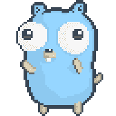

# 通过构建 11 个项目学习围棋编程

> 原文：<https://www.freecodecamp.org/news/learn-go-by-building-11-projects/>

Go 编程语言是 Google 设计的开源编译语言。Go 在基于云或服务器端的应用中很受欢迎。

我们刚刚在 freeCodeCamp.org YouTube 频道上发布了一门课程，通过教你如何创建 11 个项目来帮助你提高围棋技能。

Akhil Sharma 开发了这个课程。他是一位经验丰富的开发人员，使用 Go 已经很多年了。

以下是您将使用 Go 构建的项目:

*   简单 Web 服务器
*   CRUD API
*   YSQL 图书管理系统
*   计算年龄的 SlackBot
*   用于文件上传的 Slackbot
*   电子邮件验证工具
*   自动气象站λ
*   CRM 纤维
*   HRMS 纤维
*   完整的无服务器堆栈
*   A.我用 wolfram 和 wit.ai 机器人

Dancing Go mascot.

观看 freeCodeCamp.org YouTube 频道的全部课程(8 小时观看)。

[https://www.youtube.com/embed/jFfo23yIWac?feature=oembed](https://www.youtube.com/embed/jFfo23yIWac?feature=oembed)