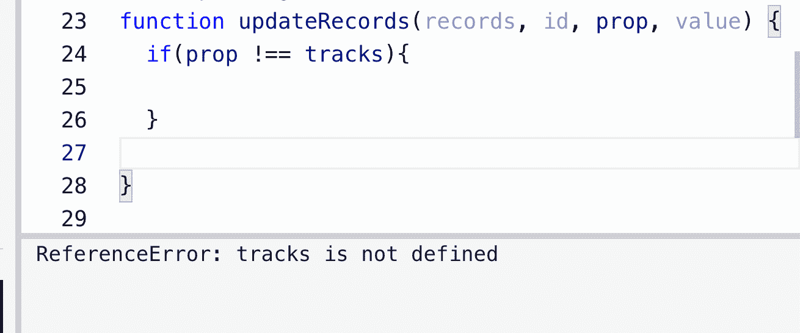

# 如何解决 freeCodeCamp 的唱片收集挑战

> 原文：<https://www.freecodecamp.org/news/how-to-solve-the-record-collection-challenge/>

[freeCodeCamp 的 JavaScript 认证](https://www.freecodecamp.org/learn/javascript-algorithms-and-data-structures/)充满了数百个互动挑战。但是对于大多数初学者来说，最难解决的问题之一是[唱片集](https://www.freecodecamp.org/learn/javascript-algorithms-and-data-structures/basic-javascript/record-collection)。

在本文中，我将带您浏览[记录收集](https://www.freecodecamp.org/learn/javascript-algorithms-and-data-structures/basic-javascript/record-collection)，并帮助您了解挑战的所有部分是如何工作的。

## 如何理解函数参数

参数是传递到函数中的特殊类型的变量，充当实际值的占位符。当函数被调用时，我们将使用实数值作为参数。

这是[记录集合](https://www.freecodecamp.org/learn/javascript-algorithms-and-data-structures/basic-javascript/record-collection)的函数参数示例。

```
function updateRecords(records, id, prop, value)
```

`records`参数代表一个对象文字。以下是挑战中的目标文字:

```
const recordCollection = {
  2548: {
    albumTitle: 'Slippery When Wet',
    artist: 'Bon Jovi',
    tracks: ['Let It Rock', 'You Give Love a Bad Name']
  },
  2468: {
    albumTitle: '1999',
    artist: 'Prince',
    tracks: ['1999', 'Little Red Corvette']
  },
  1245: {
    artist: 'Robert Palmer',
    tracks: []
  },
  5439: {
    albumTitle: 'ABBA Gold'
  }
};
```

`id`参数表示嵌套在我们的`recordCollection`对象中的对象。这是其中一个 id 的示例。

```
 2548: {
    albumTitle: 'Slippery When Wet',
    artist: 'Bon Jovi',
    tracks: ['Let It Rock', 'You Give Love a Bad Name']
  },
```

`prop`参数表示对象内部的属性名或键。`albumTitle`、`artist`和`tracks`都是`id`对象内部属性的例子。

`value`参数表示对象属性中的值。在下面的例子中，`albumTitle`是属性名或键，而`ABBA Gold`是值。

```
albumTitle: 'ABBA Gold'
```

`records`、`id`、`prop`和`value`是我们将在函数内部使用的四个参数。

## 如何应对挑战的规则

通过这个挑战的关键是打破这四个规则，一次解决一个。下面是我们必须在函数中包含的四条规则:

*   如果`prop`不是`tracks`并且`value`不是空字符串，更新或设置该专辑的`prop`为`value`。
*   如果`prop`是`tracks`但是相册没有`tracks`属性，那么创建一个空数组并添加`value`到其中。
*   如果`prop`是`tracks`并且`value`不是空字符串，则将`value`添加到相册现有`tracks`数组的末尾。
*   如果`value`是空字符串，则从相册中删除给定的`prop`属性。

### 如何解决第一条规则

这是第一条规则:

*   如果`prop`不是`tracks`并且`value`不是空字符串，更新或设置该专辑的`prop`为`value`。

该规则的第一部分可以看作是一个`if`语句。在我们的函数中，我们可以开始写出一个`if`语句的基本结构。

```
function updateRecords(records, id, prop, value) {
  if (condition is true) {
    // do some code
  }
  return records;
}
```

现在，我们需要弄清楚针对我们的情况应该写些什么:

```
if (condition is true)
```

规则的第一部分说如果`prop`不是`tracks`。我们可以换个说法，好像`prop`不等于`tracks`。

记住不等式操作符`!==`可以用来检查两个操作数是否不相等。

但是我们不能在代码中这样使用`tracks`,因为我们会得到一个错误消息。

```
if(prop !== tracks)
```



为了消除这个错误消息，`tracks`需要是一个字符串。

```
if(prop !== 'tracks')
```

但是我们还没有完成我们的条件，因为我们还必须处理这一部分:

*   并且`value`不是空字符串

我们可以再次使用不等式运算符`!==`来表示`value !== ""`。然后我们可以使用 AND `&&`操作符来替换单词`and`。

这是目前为止第一个条件的样子:

```
 if (prop !== 'tracks' && value !== "") {
    // do some code here
  }
```

既然我们已经弄清楚了我们的状况，我们需要弄清楚它里面有什么。这是该规则的第二部分:

*   将该专辑的`prop`更新或设置为`value`

我们首先需要引用整个对象文字，即`records`。然后我们需要访问代表专辑的`id`。

最后，我们需要访问那个`prop`。我们将使用括号符号来实现这一点。

```
records[id][prop]
```

最后一步是给相册的`prop`赋值。我们将使用赋值操作符`=`来完成这项工作。

```
records[id][prop] = value
```

这是整个第一个条件的样子:

```
function updateRecords(records, id, prop, value) {
  if (prop !== 'tracks' && value !== "") {
    records[id][prop] = value
  }
  return records;
}
```

### 如何解决第二条规则

这是第二条规则:

*   如果`prop`是`tracks`但是相册没有`tracks`属性，那么创建一个空数组并添加`value`到其中。

让我们来看看第一部分。

*   如果`prop`是`tracks`

我们可以用等号运算符替换单词“is”，因为我们正在检查`prop`是否等于`tracks`。

```
else if (prop === 'tracks')
```

这是条件的第二部分。

*   但是该相册没有`tracks`属性

我们需要检查相册是否有一个`tracks`属性，我们可以通过使用`hasOwnProperty()`方法来完成。

这是基本语法:

```
object.hasOwnProperty(prop)
```

本例中的对象是`records[id]`，因为它代表相册，属性是`"tracks"`。

```
records[id].hasOwnProperty('tracks')
```

但是我们需要检查相册是否没有`tracks`属性。由于`hasOwnProperty()`方法返回一个布尔值(真或假),那么我们可以这样写:

```
records[id].hasOwnProperty('tracks') === false
```

我们也可以使用`NOT`操作符`!`重写该语句，如下所示:

```
!records[id].hasOwnProperty('tracks')
```

通过在这里使用`NOT`操作符`!`，我们基本上是在说如果某事不为真。

这是目前为止我们的`if`语句的样子:

```
else if (prop === 'tracks' && records[id].hasOwnProperty('tracks') === false) {
    //do some code here
  }
```

这是规则的第二部分:

*   创建一个空数组并将`value`添加到其中

我们知道，要创建一个数组，我们可以使用括号`[]`。然后我们可以像这样在里面添加`value`:

```
[value]
```

最后一部分是将数组分配给相册属性，如下所示:

```
 records[id][prop] = [value]
```

下面是整个第二个条件的样子:

```
function updateRecords(records, id, prop, value) {
  if (prop !== 'tracks' && value !== "") {
    records[id][prop] = value
  } else if (prop === 'tracks' && records[id].hasOwnProperty('tracks') === false) {
    records[id][prop] = [value]
  }
  return records;
}
```

### 如何解决第三条规则

这是第三条规则:

*   如果`prop`是`tracks`并且`value`不是空字符串，则将`value`添加到相册现有`tracks`数组的末尾。

让我们来看看这里的情况:

*   如果`prop`是`tracks`并且`value`不是空字符串

我们从前面的代码中知道，`prop`是`tracks`可以重写为`prop === "tracks"`。

我们也可以将`value`不是空字符串重写为`value !== ""`。

这是目前为止我们第三个条件的样子。

```
else if (prop === 'tracks' && value !== "") {
    // do some code 
  }
```

这是规则的第二部分:

*   将`value`添加到相册现有`tracks`数组的末尾。

我们可以使用`push`数组方法，将元素添加到数组的末尾。

```
records[id][prop].push(value)
```

这是我们整个第三个条件的样子:

```
function updateRecords(records, id, prop, value) {
  if (prop !== 'tracks' && value !== "") {
    records[id][prop] = value
  } else if (prop === 'tracks' && records[id].hasOwnProperty('tracks') === false) {
    records[id][prop] = [value]
  } else if (prop === 'tracks' && value !== "") {
    records[id][prop].push(value)
  }
  return records;
}
```

### 如何解决第四条规则

这是第四条也是最后一条规则。

*   如果`value`是空字符串，则从相册中删除给定的`prop`属性。

让我们来看看第一部分:

*   如果`value`是空字符串，

我们从前面的代码中知道，我们可以将`value`转换为空字符串`value === ""`。

下面是目前为止`if`语句的样子:

```
else if (value === ""){
    // do some code
  }
```

这是规则的第二部分:

*   从相册中删除给定的`prop`属性。

如果我们需要从对象中删除一个属性，那么我们可以使用 JavaScript 的`delete`操作符。

以下是如何从相册中删除道具:

```
else if (value === "") {
    delete records[id][prop]
  }
```

这是整个函数的样子:

```
function updateRecords(records, id, prop, value) {
  if (prop !== 'tracks' && value !== "") {
    records[id][prop] = value
  } else if (prop === 'tracks' && records[id].hasOwnProperty('tracks') === false) {
    records[id][prop] = [value]
  } else if (prop === 'tracks' && value !== "") {
    records[id][prop].push(value)
  } else if (value === "") {
    delete records[id][prop]
  }
  return records;
}
```

## 结论

我希望这次对[唱片集](https://www.freecodecamp.org/learn/javascript-algorithms-and-data-structures/basic-javascript/record-collection)的回顾能帮助你理解如何解决这个挑战。我们讨论了许多不同的方法，并学习了如何将一个问题分解成更小的部分。

祝您接下来的 JavaScript 之旅好运。