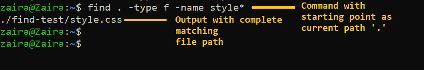
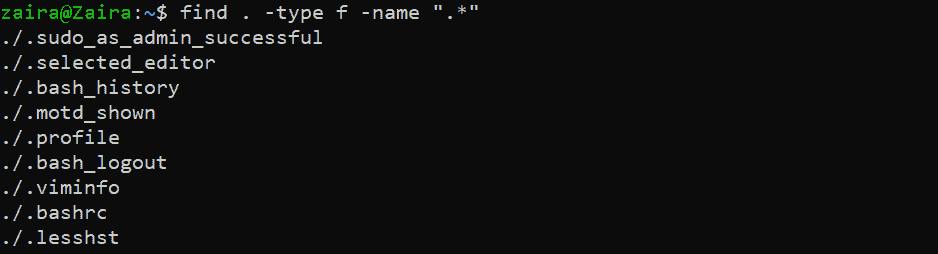
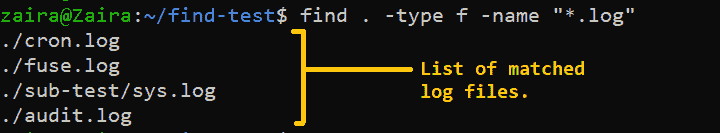
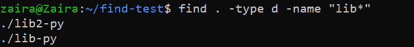
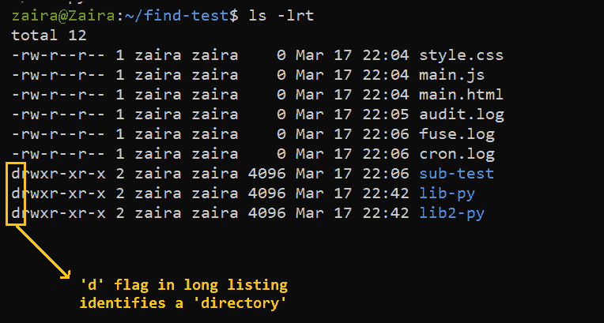
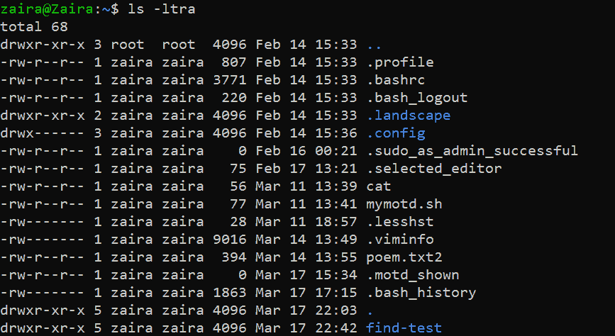
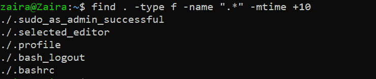

# 如何从 Linux 命令行搜索文件

> 原文：<https://www.freecodecamp.org/news/how-to-search-for-files-from-the-linux-command-line/>

使用 GUI 时，搜索文件相对容易。但是在某些环境中，比如无 GUI 服务器，您需要使用命令行来搜索文件。

Linux 中有一个强大的命令可以帮助你搜索文件和文件夹，这个命令叫做`find`。在本文中，我们将通过一些例子来讨论`find`命令。

## Linux 中的 find 命令是什么？

`find`命令可以让你有效地搜索文件、文件夹、字符和块设备。

下面是`find`命令的基本语法:

```
find /path/ -type f -name file-to-search 
```

在哪里，

*   `/path`是期望找到文件的路径。这是搜索文件的起点。路径也可以是分别代表根目录和当前目录的`/`或`.`。
*   `-type`代表文件描述符。它们可以是以下任何一种:

`f`–**常规文件**如文本文件、图像和隐藏文件。

`d`–**目录**。这些是正在考虑的文件夹。

`l`–**符号链接**。符号链接指向文件，类似于快捷方式。

`c`–**人物装置**。用于访问字符设备的文件称为字符设备文件。驱动程序通过发送和接收单个字符(字节、八位字节)与字符设备通信。例子包括键盘、声卡和鼠标。

`b`–**闭塞装置**。用于访问块设备的文件称为块设备文件。驱动程序通过发送和接收整个数据块来与块设备通信。例子包括 USB、CD-ROM

*   `-name`是您要搜索的文件类型的名称。

## find 命令的示例

现在我们知道了`find`命令的语法，让我们看一些例子。

### 如何按名称或扩展名搜索文件

假设我们需要找到名称中包含“style”的文件。我们将使用这个命令:

```
find . -type f -name style*
```

**输出**



现在，假设我们想要查找带有类似于`.html`的特定扩展名的文件。我们将像这样修改命令:

```
find . -type f -name *.html
```

**输出**


### 如何搜索隐藏文件

隐藏文件由文件名开头的点表示。它们通常是隐藏的，但是可以在当前目录中用`ls -a`查看。

我们可以修改如下所示的`find`命令来搜索隐藏文件。

```
find . -type f -name ".*"
```

**输出**



List of hidden files in my home directory

### 如何搜索日志文件和配置文件

日志文件通常有扩展名`.log`，我们可以这样找到它们:

```
 find . -type f -name "*.log"
```

**输出**



同样，我们可以像这样搜索配置文件:

```
 find . -type f -name "*.conf"
```

### 如何按类型搜索其他文件

我们可以通过提供`c`到`-type`来搜索字符块文件:

```
find / -type c
```

类似地，可以使用`b`找到设备块文件:

```
find / -type b
```

### 如何搜索目录

在下面的例子中，我们找到了名为`lib`的文件夹。注意，我们使用的是`-type d`。

```
find . -type d -name "lib*"
```

**输出**



💡提示:我们可以通过查看`ls -lrt`输出中的`d`标志来识别目录。



### 如何按大小搜索文件

`find`命令的一个非常有用的用途是根据特定大小列出文件。

```
find / -size +250MB
```

Here, we are listing files whose size exceeds 250MB

其他单位包括:

*   `G`:千兆字节。
*   `M`:兆字节。
*   `K`:千字节
*   `b`:字节。

把<unit type="">换成相关单位就行了。</unit>

```
find <directory> -type f -size +N<Unit Type> 
```

### 如何按修改时间搜索文件

```
find /path -name "*.txt" -mtime -10 
```

*   **-mtime +10** 表示你在找一个 10 天前修改过的文件。
*   **-mtime -10** 表示不到 10 天。
*   如果你跳过+或-这意味着整整 10 天。

以下是我的主目录的内容:



让我们在我的主目录中应用一个例子。

```
find . -type f -name ".*" -mtime +10
```



Here we have files that were modified more than 10 days ago.

## 使用 bash 脚本的`find`实例

我们可以将`find`与`rm`或`mv`结合起来，创建有意义的、可以自动化的 bash 脚本。

假设我们想要创建一个脚本，将超过 7 天的日志文件移动到备份路径。在那里，它会删除超过 30 天的日志文件。我们可以创建一个脚本并用`cron`来调度它。你可以在这里了解更多关于`cron`工作[的信息](https://www.freecodecamp.org/news/cron-jobs-in-linux/)。

让我们来看看脚本:

```
#!/bin/bash
# Script to move from logs older than 7 days to backup logs path: /app/backup_logs/ESB0*

# move ESB01 logs to backup
find /logs/esb01/audit  -name "*.tar.gz" -mtime +7 -exec mv {} app/backup_logs/ESB01/ \;

# Remove logs from backup path after 30 days
find /app/backup_logs/ESB01 -name "*.tar.gz" -mtime +30  -exec rm {} \; 
```

注意，我们将`exec`与`find`一起使用。基本上，`exec`执行提供的命令(在我们的例子中是`mv`和`rm`)。`{}`是保存命令结果的占位符。最后，我们提供了分隔符`;`。因为我们不希望 shell 解释分号，所以我们用`\`对它进行了转义。

共享脚本在归档和删除日志时非常有用。

## 包扎

在本文中，我们详细研究了`find`命令，并了解了如何根据名称、类型、大小和修改时间来搜索文件。

我希望这篇教程对你有所帮助。

在 [Twitter](https://twitter.com/hira_zaira) 上分享您的想法！

你可以在这里阅读我的其他帖子[。](https://www.freecodecamp.org/news/author/zaira/)

资源:横幅图片来自 Storyset 和 Canva 的[办公室插图。](https://storyset.com/office)