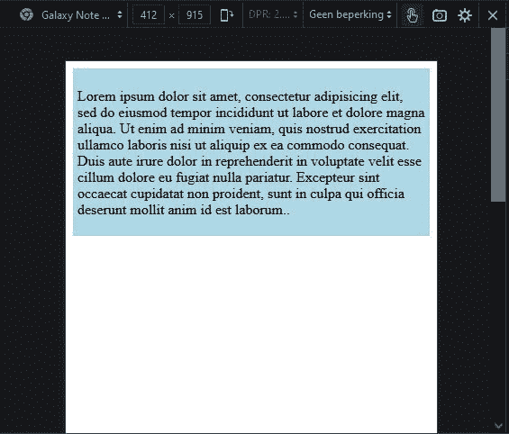
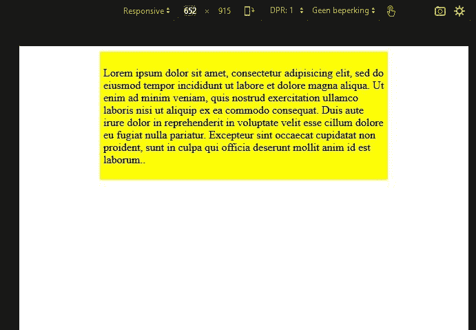
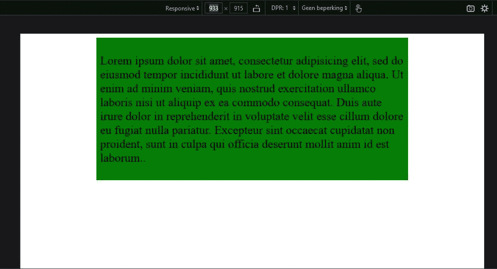

# CSS REM–CSS 中的 REM 是什么？

> 原文：<https://www.freecodecamp.org/news/what-is-rem-in-css/>

在这篇文章中，我将讨论 CSS 中 REM (Root EM)的一些用例。

我先说一些 CSS 属性和值的背景知识，我觉得很有必要。然后我将讨论绝对长度值和相对长度值的区别。REM 是一个相对长度值。

在最后两部分中，我讨论了为什么 REM 在字体大小方面是有用的，以及它是如何帮助网页响应的。我们开始吧。

## 你需要知道的是

在这一节中，我将首先说一些关于 CSS 的事情，作为一种介绍方式。

### 什么是 CSS？

CSS(代表级联样式表)使用属性和值来创建网页中所有的美学魔法。

比如说，你想用一个制作精美的边框来增强你的形象，你想让边缘是一条黑色的实线。在这种情况下，`border`是要选择的属性，`solid`是值。这是 CSS 中的一个关键字，指示它创建所需的实心边框。

正如你可能已经猜到的，这些值肯定有不同的种类，因为仅仅用一条实线作为边界并不是一种装饰。

属性`border`确实接受关键字、颜色和长度。实际上，这是因为`border`是`border-width`、`border-style`和`border-color`的简写。因此，`border`没有指定这些属性中的每一个，而是一次接受所有这些属性的值，如下所示:

```
border: 2px solid #ffff00;
```

use of border shorthand property

在上面的代码片段中，您可以看到值`2px`是长度值，`solid`是边框样式的关键字，以及黄色的 RGB 十六进制值`#ffff00`。现在，这是一个很好的边界(不是真的，我知道，但我表明了我的观点)。

在我们进入正题之前，关于这些价值观还有最后一件事。不同的属性有不同种类的适用值。这些值的集合被恰当地称为`value types`(也称为`data types`)。

我用最后一个例子来澄清一下:`color`是值类型，RGB 十六进制值`#ffff00`(代表颜色黄色)是这个值类型的特定值。如果需要，可以将值类型视为类型，将值视为这些类型的标记。

因此，如果您需要知道某个特定属性接受哪些值，只需搜索它的`value types`，就可以了。

### CSS 中的 REM 是什么？

这篇文章是关于这些值中的一个，即 REM，代表 Root EM。REM 是值/数据类型`length`的值。`length`的另一个价值是我们的好老朋友 pixel ( `px`)。每个接受长度作为值的属性都将接受 REM。其中一些是`margin`、`padding`等等。

你可能想知道为什么你应该考虑使用快速眼动？让我们在下一节看看为什么。

## CSS 中的相对值与绝对长度值

CSS 中有两种类型的长度值:绝对长度值和相对长度值。

### 绝对长度值

绝对长度值的例子有:`px`(1/96 英寸)、`in`(1 英寸)或`cm`(37.8 px 或 25.2/64 英寸)。您可以在 [MDN](https://developer.mozilla.org/en-US/docs/Learn/CSS/Building_blocks/Values_and_units) 中找到关于这些值的更多信息。

当你使用这些长度值时，你可以确定它们的大小总是差不多的。当您知道输出的确切尺寸时，这尤其有用，因为输出主要是打印布局。但是如果不是这样，就没什么用了，比如屏幕尺寸各不相同。

不要忘记人们可能使用不同的浏览器设置，无论是因为偏好还是可访问性的需要。

### 相对长度值

相对长度值是根据一些其他值来定义的。例如，`REM`、`EM`和`vw`。我们将在下面详细讨论`REM`，所以让我们简单讨论一下其他的。

`EM`的定义是相对于:

*   当涉及属性`font-size`时，父元素的字体大小，以及
*   当我们处理像`height`这样的其他属性时，元素本身的字体大小。

`vw`代表 1%的视窗宽度。也就是说，如果您将`width`属性定义为 10vw，该元素将占据可用视口宽度的 10%。还有很多，你可以在这里找到它们[。](https://developer.mozilla.org/en-US/docs/Learn/CSS/Building_blocks/Values_and_units)

这些相对长度值比绝对长度值有明显的优势，因为它们有助于提高网站的响应性。也就是说，您的网站会自动适应可用屏幕的大小，以一种可预测的方式这样做。

## 根 EM 和根字体大小

REM 是相对于根元素的字体大小定义的。根元素由`:root`伪类或`html`选择器匹配。

因此,`1rem`采用给予根元素的`font-size`的值。这意味着 1 REM 在整个 CSS 代码中保持相同的值。如果用户没有改变根元素的字体大小，这个值通常是`16px`。

这里有一个例子:

```
html {
	font-size: 18px; // default value would be 16
}

h1 {
 	font-size: 2rem; // 2 * 18px = 36px;
}
```

从`2rem`倒推至`px`并不是一件难事。但是你需要在附近放一个计算器来知道你设置为 1.125 雷姆(即:16 * 1.125: `18px`)的副标题的确切字体大小吗？

谢天谢地，有一个聪明的方法来处理这个问题。请记住，您还可以用百分比(%)来指定根元素的字体大小，开发人员发现，根元素默认值的 62.5%等于`10px`。这非常好地简化了事情:

```
html {
	font-size: 62,5%; // 16px * 0.625 = 10px;
}

h1 {
	font-size: 1.8rem; // 10px * 1.8 = 18px;
}
```

对`font-size`使用 REM(或另一个相对长度值)对于可访问性是必须的，因为在一些浏览器中，当浏览器设置改变时`px`不会调整大小。

例如，由于视觉障碍，有些人可能需要放大 400%才能阅读你的文本。使用 REM 可以确保你的文本满足这些需求，因为字体大小是相对于用户选择的默认字体大小来定义的。

## 基于 REM 的响应式网页设计

首先让我说，响应式网页设计是一个广泛的主题，有许多不同的方面。在 freeCodeCamp 的课程中有两个关于响应式网页设计的证书(如果你感兴趣，可以在[https://www.freecodecamp.org/learn](https://www.freecodecamp.org/learn)查看)。

下面我将集中讨论 REM 如何帮助网页响应。

在这篇关于响应式网页设计的[文章中，谷歌鼓励你将字数限制在 10 个字以内。这与经典的可读性理论相一致。](https://web.dev/responsive-web-design-basics/#optimize-text-for-reading)

他们建议您使用媒体查询时，断点的选择应确保内容/文本行的宽度不要太长。这有助于提供最佳的阅读体验。

这里有一个例子，灵感来自 Adrian Sandu 的这篇文章:

```
html {
  margin: 0;
  padding: 0;
  font-size: 62.5%;
}

#divOne {
  width: 100%;
  box-sizing: border-box;
  font-size: 1.6rem;
  padding: 0.5rem;
  background-color: lightblue;
}

@media (min-width: 27.1875rem) { // first breakpoint: 27.1875*16px= 435px 
  p {
    font-size: 1.6rem;
  }
#divOne {
  width: 41.8rem;
  background-color: yellow;
  margin: auto;
  }
}

@media (min-width: 40.78125rem) { 1.5 * first breakpoint: 653px
  p {
    font-size: 2.4rem; // 1.5 * font-size first breakpoint
  }
#divOne {
  width: 62.7rem; // 1.5 * width of first breakpoint
  background-color: green;
  padding: 0.75rem; // 1.5 * padding of first break point
  margin: auto;
  }
}
```

Example of a responsive webpage

你可以在 CodePen 上的这里查看这个代码[。更改视窗的大小，查看布局的变化。](https://codepen.io/slimattcode/pen/jOaJrjZ?editors=0100)

在上面的代码中，您可能会注意到的一点是，在已定义的媒体查询中，`1rem`的值始终是`16px`。媒体查询块中的`1rem`遵循的是`16px`的 62.5%的`font-size`的词根定义，也就是我们之前发现的`10px`。

这种行为是由于媒体查询中的 REM 总是采用浏览器字体大小的默认值，通常是`16px`。但是，如果用户更改了这个默认的浏览器设置，REM 将采用那个值。这意味着用户可能已经指定的可访问性首选项被包含在内。

该代码采用了移动优先的设计方法。我在`435px`定义的第一个断点。请注意，该断点之后的文本宽度永远不会改变，但是它周围的值的比率成比例地改变，确切地说是 1.5。以下是每个步骤的图示:

视口小于 435 像素时的布局:



Container takes 100% width for mobile screens

视口在`435px`和`652px`之间时的布局:



Container keeps text at approximately 10 words per line

视口大于`652px`时的布局:



## 结论

在本文中，我们探讨了在 CSS 中使用 REM。我们看到，REM 是一个相对长度值，可以用来制作网页中字体大小的逻辑模式。

使用它，你的网页也可以被那些需要改变浏览器的默认`font-size`值来满足他们需求的人访问。

最后，我们探讨了 REM 如何帮助您使网页具有响应性，同时还考虑到需要/喜欢其他设置的用户可能会更改默认设置。

在写这篇文章的时候，我从这些文章中受益匪浅:

*   [学习 CSS 单元——Em、Rem、VH 和 VW 以及代码示例](https://www.freecodecamp.org/news/learn-css-units-em-rem-vh-vw-with-code-examples/),作者 Joy Shaheb
*   CSS 单位指南:CSS em，rem，vh，vw，和更多，解释，来自 freeCodeCamp
*   [CSS 单位战:EMs vs . REMs…打！](https://www.freecodecamp.org/news/em-units-versus-rem-units-fight-382c16af8a67/)，作者扎德克
*   CSS 中的 rem:理解和使用 Rem 单元
*   [CSS 值和单位](https://developer.mozilla.org/en-US/docs/Learn/CSS/Building_blocks/Values_and_units)、[、<长度>、](https://developer.mozilla.org/en-US/docs/Web/CSS/length)[字号](https://developer.mozilla.org/en-US/docs/Web/CSS/font-size)，由 MDN
*   Dave Gash，Meggin Kearney，Rachel Andrew，Rob Dodson
*   Pete LePage 和 Rachel Andrew 的《响应式网页设计基础知识》

封面照片由 **[黑脸田鸡岛崎](https://www.pexels.com/nl-nl/@sora-shimazaki?utm_content=attributionCopyText&utm_medium=referral&utm_source=pexels)** 通过 Pexels 拍摄。