# 什么是调试？如何为初学者调试代码

> 原文：<https://www.freecodecamp.org/news/what-is-debugging-how-to-debug-code/>

在这篇文章中，我们将讨论什么是调试，如何调试你的代码，以及如何做得更好。

## 目录

*   [调试如何开始](#howdebuggingstarted)
*   [为什么要学习调试？](#whyshouldyoulearnaboutdebugging)
*   [如何调试你的代码](#howtodebugyourcode)
*   [如何进入调试状态](#howtogetinadebuggingmindset)
    *   [注意错误信息](#payattentiontoerrormessages)
    *   [谷歌事物](#googlethings)
    *   向另一个人或一只鸭子解释你的逻辑
    *   [缩小你的问题范围，了解错误产生的地方](#narrowdownyourproblemandunderstandwheretheerrorisgenerated) 
    *   [休息一下，想想别的事情](#takeabreakandthinkaboutsomethingelse)
    *   [寻求帮助](#lookforhelp)
    *   [确保臭虫已经死亡](#makesurethebugisdead)
    *   [编写干净的代码](#writecleancode)
        *   [写干代码](#writedrycode)
        *   [尽可能编写简单的代码](#writesimplecodewhenpossible)
        *   [运用扎实的原则](#usethesolidprinciples)
*   [技术调试工具](#technicaldebuggingtools)
    *   【TypeScript 如何帮助编写干净的代码
    *   [如何使用 Console.log 调试代码](#howtouseconsolelogtodebugcode)
    *   [如何使用 Visual Studio 调试器](#howtousevisualstudiodebugger)
    *   [Chrome 调试器](#chromedebugger)
*   [结论](#conclusion)

# 调试是如何开始的

软件中的“ *bug* ”和“*调试*”这两个词被普遍归因于[上将格蕾丝·赫柏](https://es.wikipedia.org/wiki/Grace_Murray_Hopper)。一个真正的传奇，她写了有史以来第一个编译器。

20 世纪 40 年代，当她在哈佛大学为美国海军开发计算机时，她的同事发现一只飞蛾(一种真正的昆虫)卡在继电器里，导致计算机崩溃。

在解决这个问题时，她说他们正在“调试”系统。

如果你是词源学的爱好者，你可能会对“调试”这个词在进入计算机世界之前似乎已经作为一个术语用于航空学这个事实感兴趣。

显然，有某种证据表明，甚至托马斯·爱迪生在 1878 年也在“技术错误”的意义上使用了它。

但这不是本文的重点。关键是调试是软件开发的核心部分。它一直都是，而且可能永远都是。

然而，值得庆幸的是，现在我们需要从电脑中移除真正的昆虫的情况非常少。

# 为什么要学习调试？

软件开发中很容易出现错误，因为这是一项概念性和抽象的活动。

作为开发人员，我们与信息打交道。我们组织它，移动它，更新它，编辑它，把它发送到各个地方，然后再接收它。

我们一直在与信息打交道，但不是直接与信息打交道。信息并不“实际”存在于计算机中，至少不是以用户认为的格式存在。

在计算机中只有电脉冲，然后被抽象成 1 和 0，然后再被抽象成我们正在处理的任何信息。

为了与计算机互动和利用计算机，我们使用编程语言。这些提供了计算机正在执行的实际任务的抽象层次，以及我们正在管理的信息的表示。

编程可能是一项非常抽象的活动，很容易忽略计算机正在执行的实际任务，或者我们在某一行代码中处理的信息。从那以后，很容易给计算机错误的指令，错过我们要找的目标。

软件开发界的一个内部笑话是，开发人员通常花 5 分钟写代码，花 5 个小时试图理解为什么事情不像他们应该的那样工作。

作为开发人员，无论我们做得多好，我们都要花无数的时间调试代码，所以我们应该努力做得更好更快。

# 如何调试您的代码

调试可以定义为在代码库中找到问题的根源并修复它的过程。

通常我们会从思考所有可能的原因开始，然后测试每个假设(从最可能的开始)，直到找到最终的根本原因。然后我们纠正它，并确保它不会再次发生。

没有解决 bug 的神奇方法。通常需要结合使用谷歌搜索、记录我们的代码，以及对照实际发生的情况检查我们的逻辑。

虽然有许多工具可以帮助您进行调试，但是使用这些工具并不一定是最难的部分。难的是真正理解你所犯的错误，并真正理解对他们来说什么是最好的解决方案。

因此，让我们首先讨论“调试思维”，然后探索一些可以用来调试代码的有用工具。

# 如何进入调试心态

## 请注意错误消息


在几乎所有的开发环境中，如果您的代码失败，您可能会看到一条错误消息，该消息(在某种程度上)解释了代码失败的原因。

以这段代码为例:

```
mickTheBug('Im a scary bug!')

const mickTheBug = message => console.log(message) 
```

此代码引发以下错误:

```
ReferenceError: Cannot access 'mickTheBug' before initialization
    at Object.<anonymous> (/home/German/Desktop/ger/code/projects/test.js:4:1) 
```

如您所见，错误消息清楚地指出了问题所在，甚至声明了问题发生在哪一行( `test.js:4:1`)。

这看起来像是一个愚蠢的建议，但是你可能会惊讶地发现有多少程序员没有仔细阅读错误消息，只是对他们脑海中出现的第一个想法做出反应。

错误消息的出现是有原因的，这至少让我们对问题的来源有了初步的了解。

## 谷歌事物

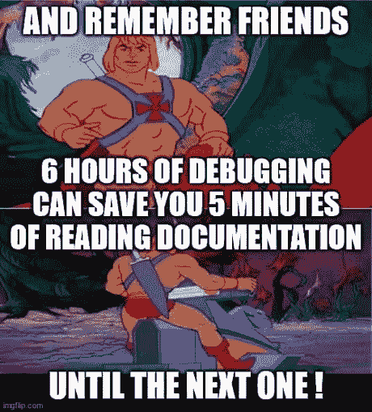

如果你对得到的错误信息不清楚，或者你不知道为什么会得到它，最好的第一步是谷歌一下。

关于编码的许多令人惊奇的事情之一是在线社区是巨大的。几乎可以肯定的是，已经有成千上万的人面临着你所面临的同样的问题，他们已经解决了这个问题，并且解释了这个问题，所以其他人也不必为这个问题而挣扎。

谷歌搜索时，一个好主意是在搜索中尽可能详细。
按照前面的例子，我会使用“ *javascript ReferenceError:无法在初始化之前访问*”。我发现在搜索中提及你使用的技术会给你带来更准确的结果。

我还了解到，删除那些只属于我的代码的东西，而不是每个人都会遇到的错误，比如我的函数名( *'mickTheBug'* )，是很重要的。

另一个好主意是尝试**使用可信的和最近的来源**。可信是指官方文档或经他人验证的解决方案。最近意味着尽可能最近实施的解决方案，因为五年前有效的方法现在可能不是解决问题的最佳方法。

无论是在学习新知识还是处理错误时，官方文档都应该是首先要查看的。

对于任何给定的工具，官方文档通常是最完整和最新的信息来源。浏览如此多的技术信息有时可能会令人感到乏味或不知所措，但从长远来看，我认为这样可以节省时间。

官方文件的问题在于，有时它们包含了太多的信息，而且解释得如此详细，以至于与其说是解释性的，不如说是令人困惑的。

正因为如此，我认为对任何特定的话题总是使用一个以上的来源是一个好主意，并且“听到不同的声音”解释同一件事情。通常只有在阅读了文档、几篇文章和看了几个 youtube 视频之后，我才觉得自己对正在使用的工具有了很好的理解。

## 向另一个人或一只鸭子解释你的逻辑


我之前提到过编程可能是一种抽象的活动，这使得我们很容易忽略事物，做出错误的假设，并曲解我们正在处理的信息。

解决这个问题的一个好办法是一行一行地检查你的代码，边读边大声解释。橡胶鸭技术是一种流行的方法，但是你可以选择你最喜欢的宠物或者想象中的朋友。=P

这个想法是强迫你自己真正阅读你的代码，而不是假设你知道它做什么。通过这种方式，您可以对照代码中实际发生的情况来检查您头脑中的逻辑。

事实上，我们倾向于假设事情，而不是仔细关注每一行代码，这是人类的天性。这是一种帮助我们节约能源和更快做事的机制。

但是在调试的时候，我们需要让大脑和我们一起工作，尽可能地出现在每一行代码中。

## 缩小问题的范围，并了解错误是在哪里产生的


随着你的代码库变得越来越大，在搜索你的 bug 时分析每一行代码会变得很困难。所以分而治之是个好主意，从最有可能产生问题的地方开始搜索。

让我们看看这个例子。我有一个函数，它接受一个数并将其乘以 2 返回，另一个函数打印名、姓和乘法函数的结果。

```
const multiply = num => num*2

const mickTheBug = async (firstName, lastName, age) => {
  console.log(`My name is ${firstName} ${lastName} and the double of my age is ${multiply(age)}`)
}

mickTheBug('Mick', 10) 
```

代码有意义，运行时没有抛出错误，但我得到的结果是`My name is Mick 10 and the double of my age is NaN`，这不是我想要的。

在这里我可以看到`10` 正在应该打印`lastName`的地方打印。因为参数是在调用函数的行中设置的。

从检查参数是否以正确的方式传递开始可能是一个不错的猜测。事实上，我们可以看到，当我调用这个函数时，我给它传递了两个参数，`Mick`和`10`，这个函数需要三个参数`firstName, lastName, age`。

> Typescript 可以很容易地防止我们犯这个错误。稍后会详细介绍。；)

同样，这是一个愚蠢的例子，但是它说明了即使我们没有错误消息来帮助我们，我们如何推断问题来自哪里。

在这些时刻，试着问自己以下问题:

*   我如何知道我看到了一个错误？
*   我提供了什么输入？它从哪里来的？这个输入和函数期望的一样吗？
*   我得到了什么输出？输入是如何变化的？
*   还有其他实体与这段代码交互吗？
*   我最近做了什么可能导致密码破解的改动吗？

## 休息一下，想想别的事情


像我们到目前为止看到的例子这样的错误是很容易解决的。但是许多其他人不是这样，在许多情况下，您必须与错误斗争几个小时(或几天)，直到您找到解决方案。

在这些场合，我发现关注自己的精神状态真的很重要。编程是一项非常脑力劳动。因此，你的大脑在某个时刻的工作方式或你的感觉方式将直接影响你的代码外观和你有效解决问题的能力。

如果你花几个小时阅读、大声重复相同的代码行、搜索、检查堆栈溢出问题，而你的代码仍然失败，迟早你会感到沮丧，并开始给自己施加压力。

当你尝试不同的解决方案并一次又一次失败时，你对细节的关注可能会减弱，你会开始跳跃到不同的想法，并同时尝试许多事情。

一旦你到了这一步，明智的做法是去散散步，或者把它留到第二天。

如果你一直处于这种紧张和疲惫的精神状态，你可能找不到解决办法。更重要的是，你甚至可能会因为接触到与它不相关的东西而使错误变得更糟。

当把事情搁置一段时间，思考其他事情时，我们的大脑会继续在背景上处理问题，并以“潜意识”和创造性的方式连接想法。

在很多情况下，当我在洗澡的时候，或者第二天早上一看到问题，一个新的解决方案就会出现在我的脑海里。这是那种"*啊哈！*“瞬间。它可能就在你眼前，但是因为你太累了，压力太大，所以你看不到它。

专注、休息好、放松是写好代码和有效修复 bug 的关键。努力工作和耗尽精力之间只有一线之隔，但重要的是我们要注意这一点，并在需要的时候让自己休息一下。

通常我发现休息的好时机是当我没有主意了，或者开始失去注意力，以一种冲动的，非系统的方式尝试不同的方法。

此外，请记住错误只是软件开发的一部分。这并不意味着你作为开发人员很差劲。每个人都会有错误，即使是最好的程序员。所以冷静下来，利用这个机会学习新的东西。

## 寻求帮助

我之前提到过在线社区的重要性，以及我们可以在几秒钟内轻松找到几乎任何主题的帮助是多么酷。

进入正确的社区，在那里你可以询问和与对你所使用的工具有经验的人交谈，这真的非常非常有帮助。

这将取决于你工作的领域和你使用的工具，但对我来说，像 [freecodecamp](https://www.freecodecamp.org/) 、 [stackoverflow](https://stackoverflow.com/) 这样的网站，以及像 [meetupjs](https://meetupjs.com.ar/) 这样的 Sack 或 Dscord 社区已经带来了巨大的变化。

在这些社区中提问时，我发现记住以下几点很重要:

*   尽量**详细**。仅仅通过阅读理解别人的代码并不总是容易的，所以试着解释你在做什么，你想达到什么目标，你面临的问题是什么。
*   显示您得到的**精确误差**。
*   显示您认为导致错误的**相关代码**。
*   提及**到目前为止你已经尝试过的解决方案**以及为什么它们不起作用。
*   调查并展示你已经对这个问题做了**研究**。尽管寻求帮助是完全可以的，但我认为在让别人替你思考之前，你必须先撤离那些更明显、更容易的路径。这意味着你已经分析了你的代码，谷歌了这个问题，阅读了其他解决方案和官方文档，尝试了许多方法，但没有一个奏效。只有这样，向别人寻求帮助才是可以接受的。我觉得这是一个能够独立学习和解决问题的问题，也是尊重别人时间的问题。
*   提及你就该主题咨询过的**文档**以及该文档对此有何说明。
*   在在线回购中提供对您的**完整代码库**的访问。

这将使另一个人更容易理解你的问题，并有希望为你提供解决方案。

如果你得到了回应，对你来说重要的是**回应他们**，要么确认解决方案是否有效，并解释原因。

请记住，您提出的问题可能会被存储起来，下次有人来搜索相同的 bug 时就可以使用了。这里的想法是**构建知识**并使其**对每个人**可用，而不仅仅是解决这个特定的 bug。

此外，如果你最终自己找到了解决方案，那么**回答自己的问题**并与大家分享解决方案是个好主意。

按照同样的思路，如果你通过提问参与到这些社区中，你也可以参与回答问题。只要你能，并且发现你有知识，回馈是好的。；)

关于这一点，我的最后一个想法是，这些社区中的大多数人都很友好、开放，并且非常愿意帮助和分享知识。但是就像生活中的其他领域一样，你偶尔会遇到粗鲁、傲慢甚至好斗的人。

我的建议是，不要让别人吓倒你，即使他们看起来比你有更多的知识。

没有人生来就知道所有的事情，如果你已经做了研究并解决了这个问题，你完全有权利问任何你想问的问题。如果其他人傲慢或粗鲁，那是说他们不好，而不是你不好。

## 确保虫子已经死了


唯一比与一个棘手的 bug 战斗更令人沮丧的事情，是修复它却发现 bug 仍然存在。或者更糟的是，由于“解决方案”，更多的错误被引入到您的代码中。

为了避免这种情况，测试你的代码是很关键的。如果你能用自动化单元测试来做，那就更好了。

理想情况下，代码库的每个部分或组件都应该有自己的测试。每次对代码库进行修改时，都应该运行这些测试。通过这种方式，如果测试写得正确，我们可以在引入新的 bug 时立即注意到它。这当然更容易找到其原因并解决它。

如果你没有自动化测试(如果你想创建高质量的软件，你真的应该这样做)，至少手动测试你的代码，重现用户可能与它的所有可能的交互，并确保 bug 被有效地杀死。

## 编写干净的代码


对抗 bug 的最好方法是避免一开始就插入它们。对于任何程序员来说，编写保证无 bug 的代码都是不可能的，但是您可以做一些事情来减少插入 bug 的机会。

一个很好的起点是经典的干，吻和固体原则。

有很多关于这些主题的书籍，但长话短说，这些原则旨在使软件易于开发，易于理解和维护，并尽可能接近无 bug。

### 写枯燥的代码

**干**原则代表**“不要重复自己”**。这基本上意味着我们应该尽可能避免相同代码的重复。

例如，如果您发现自己在代码的不同部分反复执行相同的操作，那么更好的方法是将该逻辑抽象成一个函数并调用该函数，而不是直接在代码的不同部分执行操作。

这样，如果操作中发生了一些错误或意外行为，我们知道只有一段代码要负责，而不是分散在代码库中。

### 尽可能编写简单的代码

**吻**原则代表**“保持简单愚蠢”**。随着软件项目的增长，它不可避免地开始变得越来越复杂。随着新的、计划外的特性的增加和不同的开发人员开始工作，不同的逻辑和执行任务的方式可能会在同一个项目中实现。

这使得代码更难理解、维护和使用。当代码难以理解时，就很容易做出错误的假设并插入错误。

我们应该始终以易于阅读和理解的软件为目标，其清晰的逻辑对每个人都是显而易见的，而不仅仅是对我们。

请记住，将来可能会有其他人使用你写的代码，所以要让那个人容易理解你在做什么。甚至几个月后的你可能都不记得你试图用那个函数做什么了。

也请记住，没有一个软件是永远不变的。软件的本质是变化的，并被新的特性增强，所以如果需要的话，你的代码应该很容易修改。

进一步说，只要你能找到更简单的方法来执行同样的任务，你就应该修改你的代码。

也许在加入一些新功能后，你最初想到的设计并不是最好的选择。编码的另一个很酷的地方是，没有什么是一成不变的，需要的时候事情可以很容易地改变。因此，利用这一点，并习惯于不断地重构代码，寻找更简单的方法。

有助于此的一些实用概念是使用显式函数和变量名，将关注点分成不同的函数和代码模块，以及在任务不可避免地复杂时编写简短的注释来解释您的代码。

### 使用可靠的原则

**固体**是一套原则，主要适用于 [OOP](https://en.wikipedia.org/wiki/Object-oriented_programming) 。它们是由[罗伯特·c·马丁](https://en.wikipedia.org/wiki/Robert_C._Martin)(他也是[敏捷宣言](https://en.wikipedia.org/wiki/Agile_software_development#The_Agile_Manifesto)的作者)在关于面向对象设计的[这本书](https://www.amazon.com/-/es/Robert-Martin/dp/0135974445)中建立的。

*   S 代表“单一责任”,这意味着一个类应该有且只有一个任务。
*   O 代表“开闭原则”，这意味着你应该能够扩展一个类的行为，而不需要修改它。
*   **L** 代表“利斯科夫替换原理”，意思是派生类必须可以替换其基类。
*   代表“接口分离”，这意味着客户端永远不应该被强迫实现它不使用的接口，或者客户端不应该被强迫依赖它们不使用的方法。
*   D 代表“依赖倒置原则”,这意味着实体必须依赖抽象，而不是具体。它声明高级模块不能依赖于低级模块，但是它们应该依赖于抽象。

如前所述，SOLID 更适用于 OOP，而不是通用编程。在本文中，我们不打算深入探讨 OOP，但是了解这些原则并牢记在心仍然是有好处的。

现在让我们了解一些可以用来帮助您调试代码的工具。

# 技术调试工具

我们可以使用许多工具来减少在代码中插入 bug 的机会，或者更有效地对抗现有的 bug。

在这方面，我们将看看 **TypeScript** ，流行的(非常有用的) **console.log** ，以及内置在 **VS Code** 和 **Chrome** 中的**调试器**。

这些工具和例子将以 JavaScript 为中心，但是这些原则适用于任何编程语言。

你也应该知道，现在大多数代码编辑器和网络浏览器都有内置的调试器，但是我们将回顾 VS code 和 Chrome，因为它们是最流行的。

最后，你还应该知道有特定的调试工具可以用来调试特定类型的应用程序，如 [React](https://chrome.google.com/webstore/detail/react-developer-tools/fmkadmapgofadopljbjfkapdkoienihi?hl=es) 和 [Redux](https://chrome.google.com/webstore/detail/redux-devtools/lmhkpmbekcpmknklioeibfkpmmfibljd?hl=es) dev 工具，它们是浏览器扩展，你可以安装它们来帮助你更有效地调试代码。

但是我们将在以后的另一篇关于如何调试 React 应用程序的文章中讨论这些问题。；)

## TypeScript 如何帮助编写干净的代码

我提到 TypeScript 是第一个工具，因为它与前面关于编写干净代码的部分密切相关。

TypeScript 不仅为您提供了一个健壮的 JavaScript 类型系统。它还添加了一个编译器，帮助您在运行代码之前识别代码中的错误和误解。它提供了惊人的自动完成功能，可以被认为是一个自动文档工具。

为了了解它的一点好处，让我们回顾一下前面的例子，在这个例子中，我们没有为函数调用提供正确的参数。

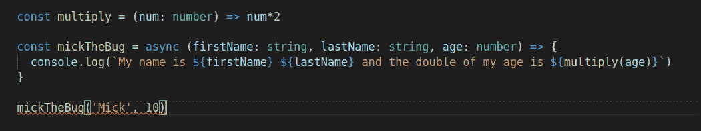

正如您在这里看到的，在运行程序之前，TypeScript 立即检测到我们缺少一个参数，并给出以下错误:

```
Expected 3 arguments, but got 2.ts(2554)
index.ts(6, 64): An argument for 'age' was not provided. 
```

这些类型的通知非常有用，特别是在您必须与许多 API 或不同代码段进行交互的大型项目中。

因此，如果您习惯于普通的 JavaScript，那么一开始 TypeScript 可能感觉像是不必要的样板文件。但从长远来看，它肯定会节省您的时间，并防止您在代码中插入愚蠢的错误。

## 如何使用 Console.log 调试代码

在控制台中记录你的代码是最基本的调试方法，也是我们作为开发人员学会使用的第一种方法。

这个想法是打印变量、函数、输入和输出的值，以对照我们代码中实际发生的事情来检查我们头脑中的逻辑。这也有助于我们看到我们做了哪些错误的假设。

虽然它是一个基本工具，但我们可以用它做一些很酷的事情。让我展示给你看。

如果我们调用`console.log`,我们将得到我们作为参数传递的任何对象，并打印在我们的控制台中。

```
const arr = []
console.log(arr) // []

const populateArr = (elem1, elem2, elem3) => arr.push(elem1, elem2, elem3)
console.log(populateArr) // [Function: populateArr]

populateArr('John', 'Jake', 'Jill')
console.log(arr) // [ 'John', 'Jake', 'Jill' ] 
```

`console.table`在处理数组或对象时非常有用，因为它在一个表中设置信息，在这个表中你可以很容易地看到键/索引和属性/值。

```
const arr = ['John', 'Jake', 'Jill']
console.table(arr)

//┌─────────┬────────┐
//│ (index) │ Values │
//├─────────┼────────┤
//│    0    │ 'John' │
//│    1    │ 'Jake' │
//│    2    │ 'Jill' │
//└─────────┴────────┘

const obj1 = {
  name: 'John',
  age: 30,
  job: 'Programmer'
}

const obj2 = {
  name: 'Jason',
  age: 32,
  job: 'Designer',
  faveColor: 'Blue'
}

const arr2 = [obj1, obj2]

console.table( arr2 )
// ┌─────────┬─────────┬─────┬──────────────┬───────────┐
// │ (index) │  name   │ age │     job      │ faveColor │
// ├─────────┼─────────┼─────┼──────────────┼───────────┤
// │    0    │ 'John'  │ 30  │ 'Programmer' │           │
// │    1    │ 'Jason' │ 32  │  'Designer'  │  'Blue'   │
// └─────────┴─────────┴─────┴──────────────┴───────────┘ 
```

当同时记录许多事情时，`console.group`给了我们一种有组织的方式来看待事情。

```
const arr1 = [22, 23, 24]
const arr2 = [25, 26, 27]

console.group('myArrays')
console.log(arr1)
console.log(arr2)
console.groupEnd()

const obj1 = {
  name: 'John',
  age: 30,
  job: 'Programmer'
}

const obj2 = {
  name: 'Jason',
  age: 32,
  job: 'Designer',
  faveColor: 'Blue'
}

console.group('myObjects')
console.log(obj1)
console.log(obj2)
console.groupEnd()

// myArrays
//   [ 22, 23, 24 ]
//   [ 25, 26, 27 ]
// myObjects
//  { name: 'John', age: 30, job: 'Programmer' }
//  { name: 'Jason', age: 32, job: 'Designer', faveColor: 'Blue' } 
```

在测试代码中的条件时,`console.assert`很有用。它有两个参数:第一个是条件，第二个是条件为假时记录的消息。

```
const arr1 = [22, 23, 24]

console.assert(arr1.indexOf(20) !== -1, '20 is not in my array')
// Assertion failed: 20 is not in my array 
```

`console.warn`和`console.error`在调试代码中的错误时很有用。第一个用黄色背景打印错误，第二个用红色背景打印错误。

```
console.warn('No biggie') // No biggie
console.error(new Error('Error detected'))

// Error: Error detected
//     at Object.<anonymous> (/home/German/Desktop/ger/code/projects/test.js:6:15)
//     at Module._compile (node:internal/modules/cjs/loader:1101:14)
//     at Object.Module._extensions..js (node:internal/modules/cjs/loader:1153:10)
//     at Module.load (node:internal/modules/cjs/loader:981:32)
//     at Function.Module._load (node:internal/modules/cjs/loader:822:12)
//     at Function.executeUserEntryPoint [as runMain] (node:internal/modules/run_main:79:12)
//     at node:internal/main/run_main_module:17:47 
```

## 如何使用 Visual Studio 调试器

随着我们的应用程序增长并开始变得越来越复杂，console.logging 变得不那么有效了。

为了帮助我们对抗 bug，调试器被开发出来。它们只不过是能够读取其他程序并逐行检查它们的程序，在此过程中检查我们想要的任何信息(例如变量值)。

我们要看的第一个例子是 **Visual Studio 调试器**。

为了调试 Node.js 应用程序，我们不需要安装任何额外的东西(假设我们的计算机上安装了 VS 代码和 Node)，因为节点调试器内置在 VS 代码中。

如果使用 Python 或 Java 等其他语言进行调试，可能需要在运行调试器之前安装特定的 VS 扩展。

首先，我们只需选择要调试的文件，然后点击 bug 图标。

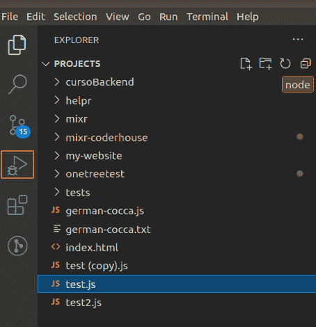

之后，我们将看到以下屏幕:

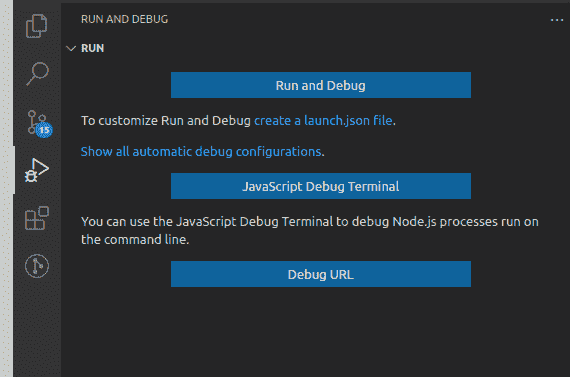

我们将选择“运行和调试”，这将为我们在编辑器中运行程序。

考虑到你也可以创建一个`launch.json`文件，这是一个 VS 代码用来“知道”如何运行你的程序的文件。对于这个简单的例子来说，这是不必要的，但是要知道这种可能性是存在的。

单击“运行和调试”按钮后，我们的程序将运行，我们将进入以下屏幕:

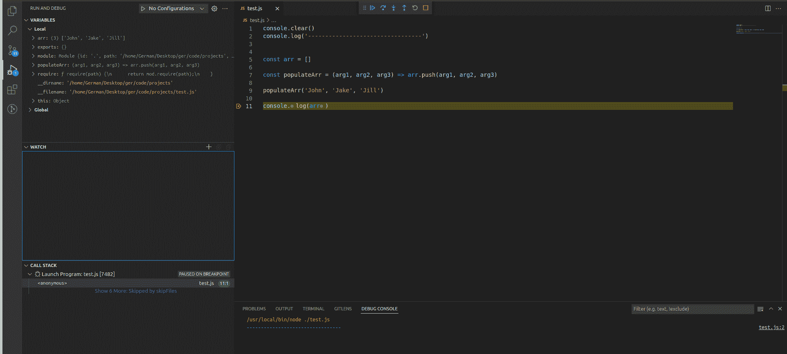

在左上角，我们有程序中所有可用的变量，包括本地和全局级别的变量。

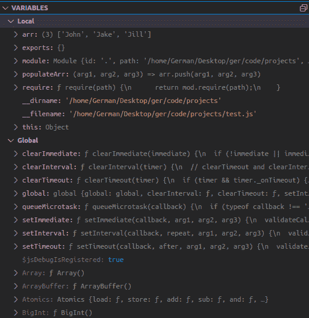

在下面，我们将有一个空间，我们可以声明我们特别想看的表达式。表达式可以是任何东西，比如你想关注的特定变量或函数，以评估它们如何随着你的程序而变化。

例如，我添加了变量`arr`, VS 代码显示了该变量的值:

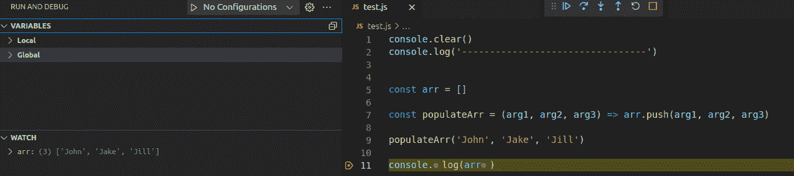

在它下面，我们可以看到调用堆栈(如果你不知道那是什么[，这里有一个很棒的视频来解释它)，正在加载的脚本，以及我们在代码中设置的断点(我们马上就会看到这些是什么)。](https://www.youtube.com/watch?v=8aGhZQkoFbQ)

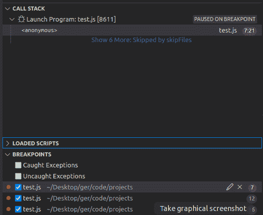

断点是调试器有用的一个重要部分。顾名思义，它们是可以在代码中声明的点，调试器将在这些点停止运行程序。当程序停止时，您将能够检查我们之前提到的所有信息，因为它是在那个特定的时刻。

因此断点允许我们看到程序正在处理的实际信息，而不需要在控制台中记录任何东西。相当酷！

您可以通过代码中行号左侧出现的小红点来识别断点(或者查看上面提到的部分)。

默认情况下，当您运行调试器时，会在代码的最后一行插入一个断点。要插入新的断点，只需单击您希望调试器停止的行号的左侧。

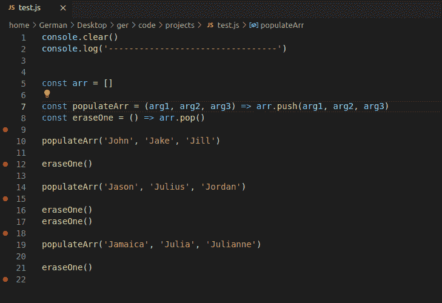

现在，当您运行调试器时，您会看到在第一个断点的顶部有一个小小的左箭头，表示程序执行已经停止。

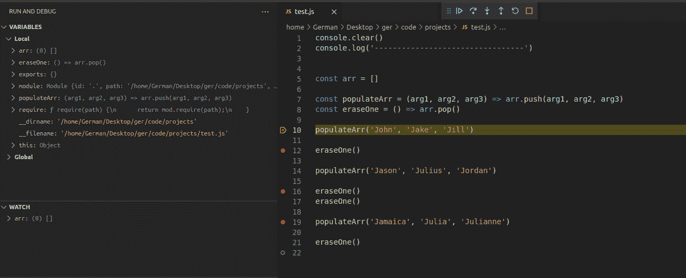

在屏幕的顶部，我们有**控件**，它将允许我们从一个断点到另一个断点逐步执行程序。

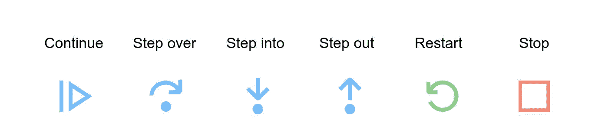

*   **继续**按钮运行程序，仅在用户定义的断点处停止。
*   用**步过**，如果有函数调用，它就执行它并返回结果。不要进入函数内部的行。你只需直接进入函数返回值。
*   **Step Into** 逐行进入函数内部，直到它返回，然后在函数调用后立即返回到下一行。
*   使用**单步执行**按钮，如果您已经单步执行了一个函数，您可以跳过该函数的剩余执行，直接进入返回值。
*   **重启**从顶部重新运行调试器，**停止**退出调试器。

所以，这就是你的代码编辑器中内置的一个非常强大的调试器。正如您所看到的，使用这个工具，我们可以同时检查大量信息，只需在任何我们想要的地方设置断点，而不需要任何 console.logs。

## Chrome 调试器

为了在 Chrome 中调试，我们首先在浏览器中打开我们的应用程序。在我的例子中，我创建了一个简单的 HTML 文件，其中链接了我的 JS 文件(与上一个例子中的文件相同)。

然后我们打开**开发者工具** (ctrl+shit+i 或右键- > inspect)并转到“**源**选项卡。

我们应该会看到这样的情况:

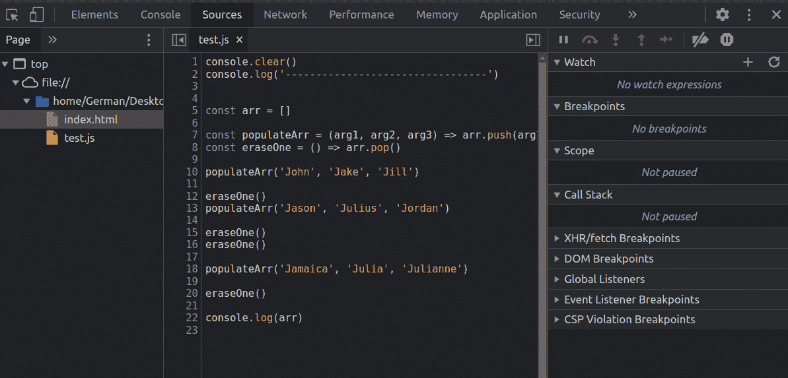

在左侧，我们可以看到我们的应用程序中可用的文件(在我的例子中，只有一个 HTML 文件和 JS 文件。)在中间我们可以看到我们选择的文件的代码，在右边我们有一组非常类似于 VS 代码的信息。

要设置断点，我们必须在想要停止的行的顶部单击。在 Chrome 中，断点被标识为行号上方的蓝色箭头。

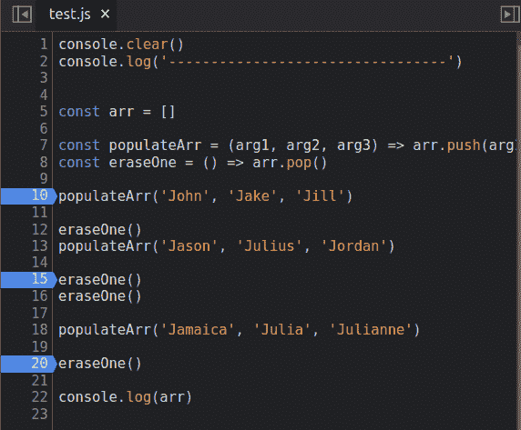

然后，如果我们刷新页面，脚本将在第一个断点处停止，我们将被允许使用控件在其中导航，这与 VS 代码中的工作方式完全相同。

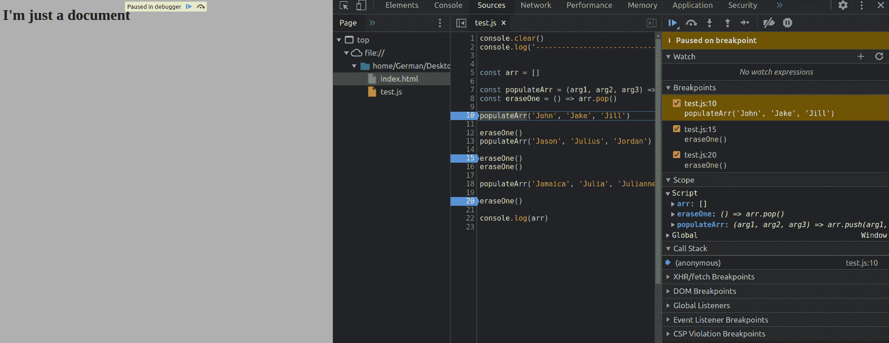

正如我们所见，Chrome 和 VS 代码调试器的工作方式非常相似，你决定使用哪一个只是个人喜好的问题。

# 结论

作为开发人员，调试是我们工作的核心部分。正因为如此，我认为以一种有效的方式去思考和做是一个好主意，而不是仅仅在错误发生时做出反应。

正如我们所看到的，为了成为更好的调试器，我们可以做很多事情，无论是从心理角度还是从技术角度。

希望这有所帮助，下次再见！

你也可以在 [Twitter](https://twitter.com/CoccaGerman) 和 [LinkedIn](https://www.linkedin.com/in/germancocca/) 上关注我。