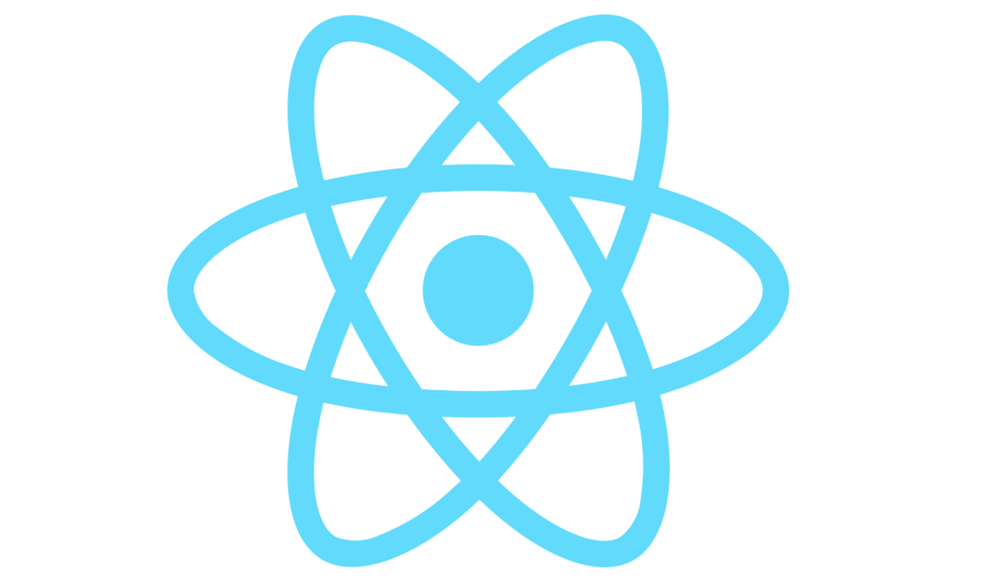
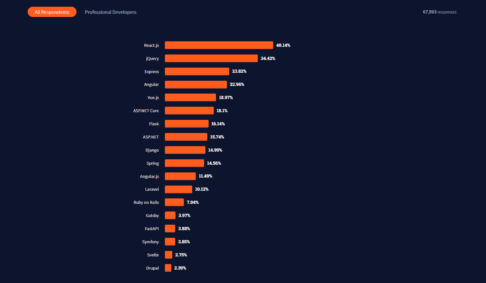
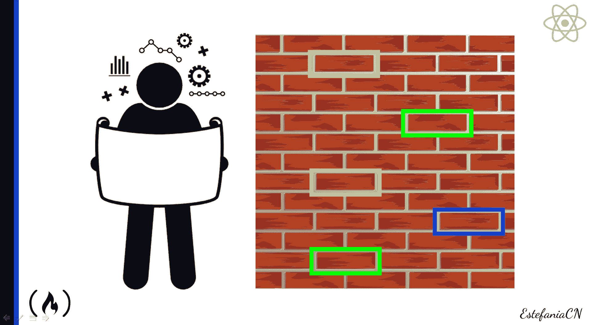
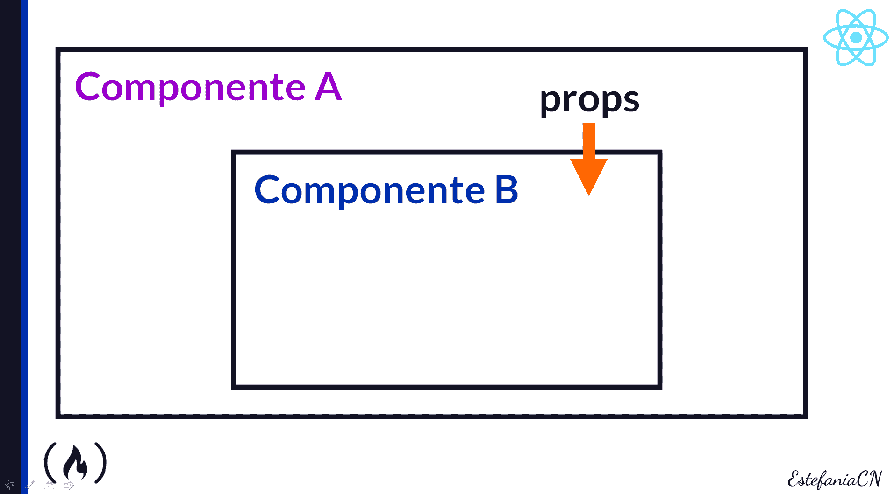
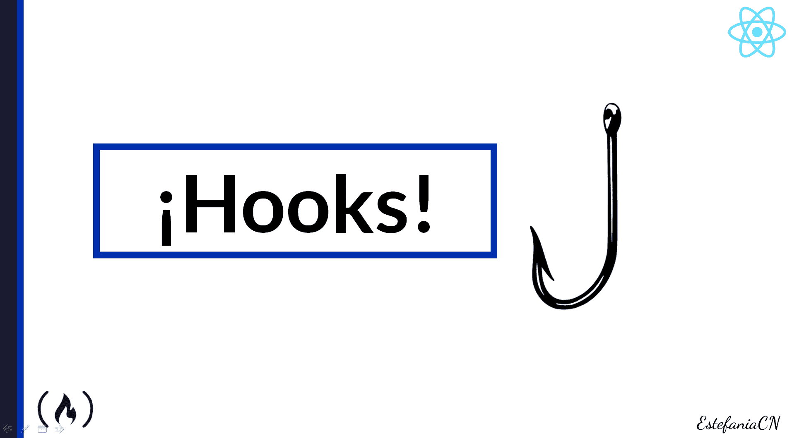
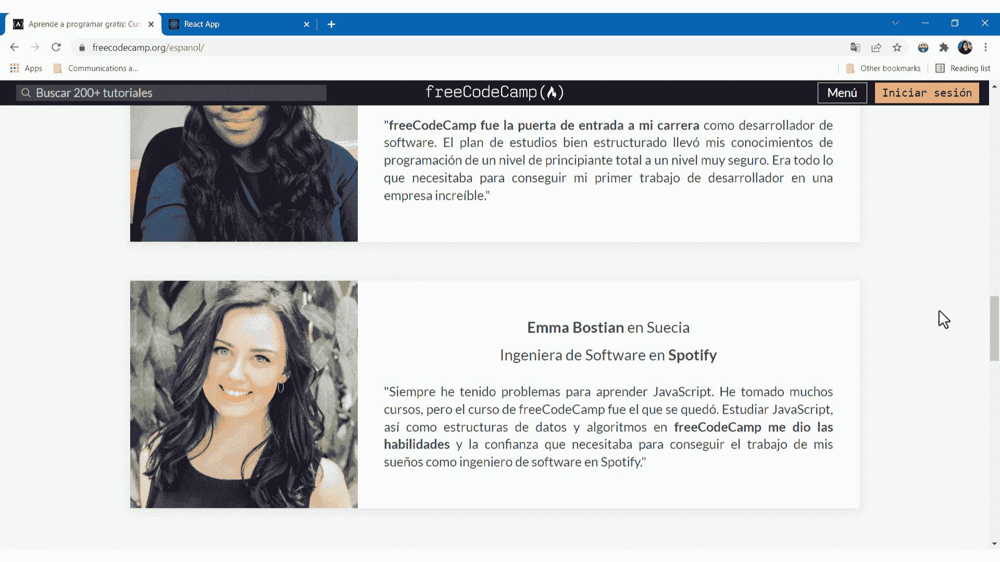
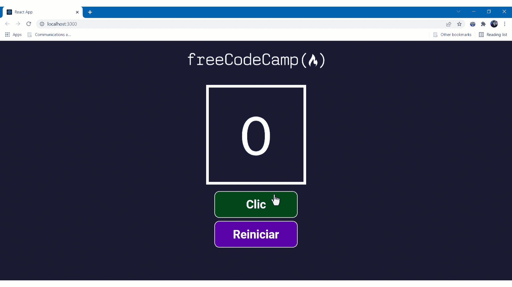
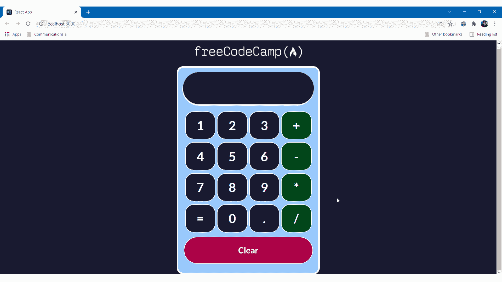
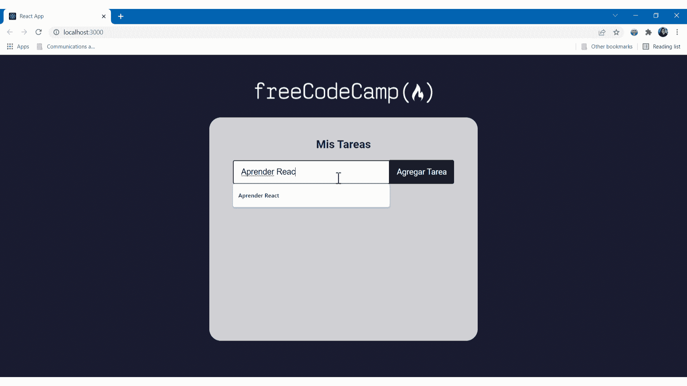

# 学习西班牙语反应——初学者课程

> 原文：<https://www.freecodecamp.org/news/learn-react-in-spanish-course-for-beginners/>

嗨！如果你会说西班牙语，并且想学 React，那你来对地方了。

在这篇文章中，你会找到 React 的简介。您将了解为什么它对 web 开发如此重要，以及为什么您应该学习它。

然后，你会在 freeCodeCamp 的西班牙语 YouTube 频道上找到一个免费的 8 小时 React 课程，在那里你可以学习西班牙语 React 的基础知识，并一步一步地构建四个项目。

如果你认识说西班牙语的朋友，欢迎你把本文 的 **[西班牙语版分享给他们。](https://www.freecodecamp.org/espanol/news/aprende-react-desde-cero-curso-de-react-con-proyectos/)**

我们开始吧！✨

## 🔸什么是反应？

**React** 是一个用于构建用户界面的 JavaScript 库。您可以使用它来创建交互式用户界面，这些界面可以非常高效地更新和渲染，因为 React 只更新应该更新的组件。

### 你为什么要学反应？

React Logo

React 在开发人员社区中的受欢迎程度一直在持续上升。根据 Stack Overflow 进行的 [2021 年开发者调查](https://insights.stackoverflow.com/survey/2021#section-most-popular-technologies-web-frameworks)，React.js 是 67593 名受访者中最常用的库。

当开发人员被问及他们在这一年中广泛使用了哪个框架或库，或者他们打算在明年(2022 年)使用哪个时，React 也获得了 40.14%的选票。

The results of the Web Frameworks category in the [2021 Stack Overflow Developer](https://insights.stackoverflow.com/survey/2021#overview) Survey. **React.js leads with 40.14%** **of the responses.**

基于这些结果，现在你知道通过学习 React，你正在明智地投资你的时间和资源。这些数字是 React 作为一个网络库的当前和未来相关性的关键指标。

## 🔹基本反应概念

让我们来看看开始使用 React 时需要的一些基本概念:

*   **组件:**组件是用户界面的一个独立的、可重用的部分。一个组件可以管理它自己的状态，我们可以像构建积木一样组合组件来制作复杂的用户界面。

A React component is like a building block that you can compose with other components to create the web application that you design. 

*   **Props:** 这是“属性”的缩写在 React 中，如果一个组件由另一个组件呈现，它可以从呈现它的组件接收值。向组件发送 props 就像向它发送“消息”,但是消息代表不同的值，您可以使用这些值来定制组件在应用程序中的外观和工作方式。

**💡提示:**道具只能从父组件发送到子组件，**不能**从子组件发送到父组件。

*   **状态:**组件的状态是在应用程序执行的特定时刻，它的一组属性和它们的当前值的表示。组件可以在内部处理和更新它们自己的状态。
*   **挂钩:**挂钩是“让你”挂钩到“来自功能组件的反应状态和生命周期特性”的“功能”([来源](https://reactjs.org/docs/hooks-overview.html))。

*   **事件监听器:**事件监听器是在特定事件发生时执行的功能。例如，当用户点击按钮时将被调用的函数。

**牛逼！**现在你已经知道了这些重要的概念，让我们来看看你将在课程中学到什么。

## 🔸课程内容

这是对您将在本课程中学到的主要主题的概述。

**💡提示:**要参加这个课程，你应该先有 HTML、CSS 和 JavaScript 的知识。如果你需要用西班牙语复习这些话题，我推荐你在我们的西班牙语 YouTube 频道上观看[这些课程。](https://www.youtube.com/freecodecampespanol)

### 基本概念和工具

*   参加该课程所需的先前知识。
*   React 是什么，为什么它对 web 开发很重要。
*   基本的 React 概念(库、组件、功能和类组件、道具、挂钩和事件监听器)。
*   React 的优势。
*   如何下载安装 Node.js？
*   React 官方网站和文档的快速浏览。

### React 应用的结构

*   如何用`npx create-react-app`命令创建 React App？
*   此命令创建的文件夹和文件的详细概述。
*   如何在 Visual Studio 代码中打开应用程序的文件夹？
*   如何用`npm start`运行一个 React App？
*   如何删除不必要的文件并更新现有文件以满足项目的需要。

### JSX 简介

*   JSX 的意思。
*   JSX 的优势。
*   JSX 元素。
*   React 中的元素与组件。
*   DOM 介绍。
*   JSX 的属性。
*   如何用 react-dom 渲染组件？
*   如何在 JSX 嵌入 JavaScript？
*   JSX 的嵌套元素。
*   JSX 的自闭标签。
*   JSX 的风格。

### React 组件和文件

*   如何定义一个功能组件和一个类组件？
*   React 文件的命名约定。
*   从最初的应用程序设计开始分析组件。
*   导出和导入组件。
*   默认导出与命名导出。
*   谷歌 Chrome 中的 React 开发者工具。
*   向组件传递属性并在组件中使用它们。
*   开始和结束标签和`props.children`。
*   用 CSS 样式表给组件添加样式。
*   在 React 应用程序中使用图像。
*   呈现多个组件。
*   将事件侦听器分配给组件的元素。
*   传递事件侦听器作为道具。
*   类组件，如何使用它们，以及如何将功能组件转换成类组件，反之亦然。

和...多得多！✨

您将构建 4 个项目来练习您的技能。让我们看看他们。

## 🔹反应项目

在课程中，您将逐步构建 **4 个 React 项目**:

### freeCodeCamp 推荐克隆

首先，您将构建一个 freeCodeCamp 的西班牙语推荐部分的克隆。

在这个项目中，你将学习和练习如何分析一个组件的结构，如何用 JSX 实现它，如何用 CSS 给一个组件添加样式，以及如何渲染多个组件并给每个组件传递不同的道具。

freeCodeCamp Testimonials Clone

### 点击计数器

我们的第二个项目将是一个点击计数器。当我们点击蓝色按钮时，计数将增加，我们可以用紫色按钮重置它。

在这个项目中，您将学习如何使用功能组件的`useState`钩子来跟踪组件的状态并更新它。您还将使用事件侦听器。

Click Counter

### 交互式计算器

我们的第三个项目将是一个交互式计算器，它将执行四种基本的算术运算。

在本项目中，您将练习 React 知识，并使用 Flexbox 创建更复杂的布局。

您还将学习如何使用节点包管理器安装包，以及如何检查包是否已添加到项目的依赖项中。你也将和`props.children`一起工作。

Interactive Calculator

### 交互式待办事项应用

我们的第四个项目将是一个交互式的待办事项应用程序。您将能够添加任务，将任务标记为已完成，以及删除任务。

在这个期末专题中，你将结合你所有的知识，你将学习如何从数组中呈现组件列表，以及如何处理用户输入的文本。

Interactive To-Do List App

在课程的最后，我们还将改编前两个项目(freeCodeCamp references Clone 和 Click Counter)，以练习如何使用类组件以及如何将功能组件转换为类组件。

## ****📌**在 YouTube 上反应**课程****

太棒了。现在，您已经了解了 React 的基础知识以及您将在课程中学到的内容，欢迎您开始参加 ****西班牙语**** 的课程:

[https://www.youtube.com/embed/6Jfk8ic3KVk?feature=oembed](https://www.youtube.com/embed/6Jfk8ic3KVk?feature=oembed)

由**Estefania cassingena navone**创建的✍️球场(Twitter: [@EstefaniaCassN](https://twitter.com/EstefaniaCassN) ，YouTube: [用 estefan ia 编码](https://youtube.com/codingwithestefania))。

我真的希望你喜欢这个课程，并且你会发现它对你迈出 React 世界的第一步很有帮助。

也欢迎您继续学习我们的 ****西班牙语**** 课程:

[https://www.youtube.com/embed/XqFR2lqBYPs?feature=oembed](https://www.youtube.com/embed/XqFR2lqBYPs?feature=oembed)

[https://www.youtube.com/embed/ivdTnPl1ND0?feature=oembed](https://www.youtube.com/embed/ivdTnPl1ND0?feature=oembed)

[https://www.youtube.com/embed/DLikpfc64cA?feature=oembed](https://www.youtube.com/embed/DLikpfc64cA?feature=oembed)