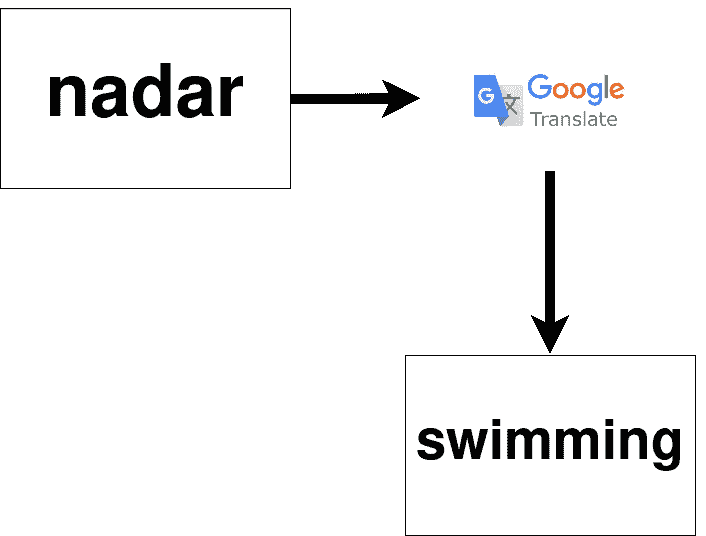
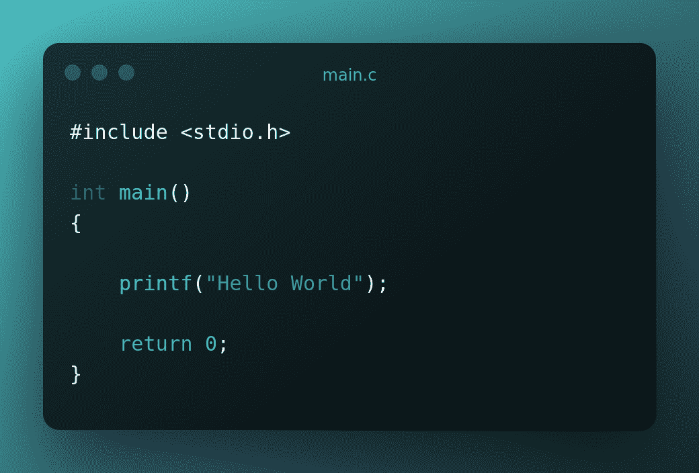
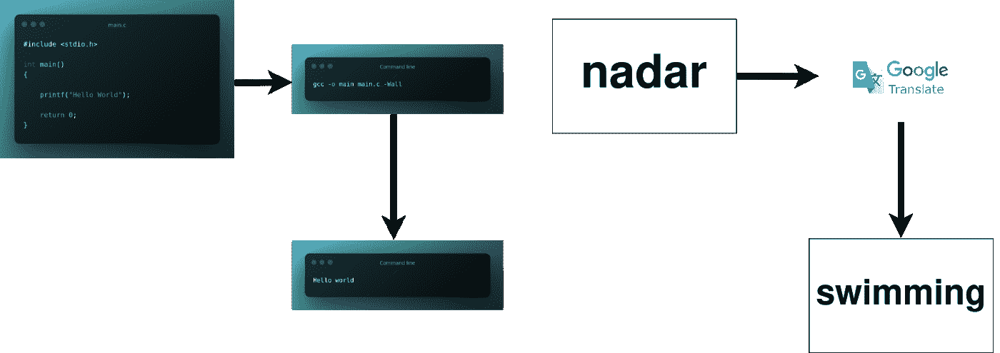

# 什么是编译器？为初学者讲解的 C 编译器

> 原文：<https://www.freecodecamp.org/news/what-is-a-compiler-in-c/>

您知道吗，正是由于编译器，软件才得以存在。

完全正确——编译器非常重要，所有编程语言中都存在某种形式的编译器。

但是，什么是编译器呢？他们具体是做什么的？

这篇文章将教会你:

1.  用类比来说明编译器是什么。
2.  C 编译器的基本历史。

别担心，你不需要编程经验就能理解什么是编译器。

你只需要先理解概念，然后如果你愿意，你可以去寻找技术定义。

## 1.什么是编译器？类比


Photo by [**Tyler Lastovich**](https://www.pexels.com/@lastly?utm_content=attributionCopyText&utm_medium=referral&utm_source=pexels) from [**Pexels**](https://www.pexels.com/photo/black-iphone-7-on-brown-table-699122/?utm_content=attributionCopyText&utm_medium=referral&utm_source=pexels)

假设你正在学习一门语言(法语、西班牙语或葡萄牙语)，你想知道一个单词或句子的意思。

为此，您将使用谷歌翻译。

**第一步**是知道你将在谷歌翻译中键入什么，并检查它是否键入正确。

第二步是选择你想转换的语言。对许多读者来说，这将是英语。

第三步也是最后一步是了解这句话在英语中的意思。

本质上，你只是输入谷歌翻译一个你不理解的句子或单词。谷歌翻译把那句话翻译成了英语。



Example: nadar(Portuguese) –> swimming (English)

同样的事情也发生在编程中。

在这种情况下，我们使用 C 语言。

你必须采取的第一步是知道你将在。c 文件，以及它是否输入正确。

在本例中，该文件名为 main.c *。*

```
#include <stdio.h>

int main()
{
	printf("Hello World");

    return 0;
}
```



**First step: This code will print “Hello world”**

第二步是编译它。它将根据您拥有的编译器进行编译。

```
gcc -o main main.c -Wall
```


**Second step: Command to compile c code**

第三步也是最后一步就是了解程序的输出——确保它像我们想要的那样运行。

快速提示:如果您想知道命令行终端中每个单词的意思，请查看本文中的“更多…”部分！


**Third step: Hello world!**

您可以在下图中看到编译过程的直观解释:



Comparing the compilation of a C file with the translation of words

## C 编译器如何工作


Photo by [**JÉSHOOTS**](https://www.pexels.com/@jeshoots?utm_content=attributionCopyText&utm_medium=referral&utm_source=pexels) from [**Pexels**](https://www.pexels.com/photo/person-holding-sony-ps4-dualshock-4-21067/?utm_content=attributionCopyText&utm_medium=referral&utm_source=pexels)

多年来，科技以惊人的速度发展。这同样适用于编译器。

随着时间的推移，C 编译器已经发展成许多版本。

就像 PlayStation 一样，有 Playstation 2、Playstation 3、Playstation 4 等等。

C 编译器也是如此。一旦*标准化，*许多版本被创建:

*   C89/90，C 的一个版本曾经*标准化，*
*   1999 年 C99 取代 C89 和 C90。
*   C11 在 2011 年取代了 C99。
*   2018 年 C17 取代了 C11。
*   C2X 将在 2023 年取代 C17。

就像 PlayStation 一样，每个新版本都有新功能。

有些人更喜欢在他们的 PlayStation2 上玩。

程序员也是一样。出于各种原因，程序员可能更喜欢用 C99 或 C11 编写和调试 C 代码。

## 关于编译器的更多信息

我们在上面的代码中看到的 *"gcc -o main main.c -Wall"* 到底是什么意思？让我们一点一点地分解它。

`gcc`是调用编译过程(预处理、编译、汇编和链接)的命令。

`-o main`表示编译“main.c”所创建的可执行文件的名称将被称为“main”。

`main.c`是要编译的文件的名称。

`-Wall`选项启用编译器警告。编译器警告让你知道你的代码中有些地方不太对劲。

这类似于语法上的。如果语法上建议改变一个句子，你应该在大多数情况下改变它，使它更清楚和更正确。

否则，如果你试图改变一个短语中已经正确的东西，它会变得难以辨认。

同样，如果您忽略代码中的警告，最终可能会导致重大错误，您的项目甚至可能会失败。

### “标准化”是什么意思？

所以你可能想知道，我们上面看到的“*标准化*”*是什么意思？*

*

Photo by [**Pixabay**](https://www.pexels.com/@pixabay?utm_content=attributionCopyText&utm_medium=referral&utm_source=pexels) from [**Pexels**](https://www.pexels.com/photo/architecture-building-construction-daylight-534220/?utm_content=attributionCopyText&utm_medium=referral&utm_source=pexels)* 

*我们通过另一个类比来看。盖房子有很多方法。但是有一种方法通常是最有效和最安全的。*

*正因为如此，人们和组织必须同意有一个建造房子的标准方式。*

*创建该标准的过程被称为标准化。*

*当一套规则成为标准，这套规则就成为**标准化*。****

*这套规则可以是法律，可以是证书，也可以只是某一领域工作者使用的基本约定。*

*这同样适用于 C 编译器。*

*正是标准化帮助人们就应该如何做事情达成一致，无论是 C 编译器、汽车组件还是其他任何东西。*

*标准化还可以帮助人们就使用哪个版本的 C 语言达成一致。c 编译器就是一个例子。*

*长期以来，C 编译器一直被认为是软件开发的基础组件。*

*作为 C 编译器标准的结果，开发人员可以编译和运行其他人的代码，而不用担心他们的编译器无法工作。*

*为了创建这样一个重要的行业构件，必须有一个负责建立标准的组织*

*许多组织创建和管理标准。在 C 编译器的情况下，ISO(国际标准化组织)管理标准。*

*只要 ISO 管理未来的 C 编译器标准，程序员和公司就能开发出可靠的软件。*

## *包扎*

*感谢阅读！现在你明白了:*

*   *什么是编译器*
*   *C 编译器的基本历史*
*   *标准化意味着什么*

*[H](https://github.com/tiagomonteiro0715/freecodecamp-my-articles-source-code) [ere](https://github.com/tiagomonteiro0715/freecodecamp-my-articles-source-code) 是我创建的带有代码和镜像文件的 GitHub 库。*