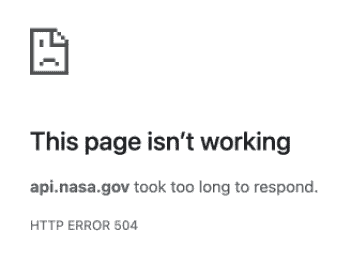
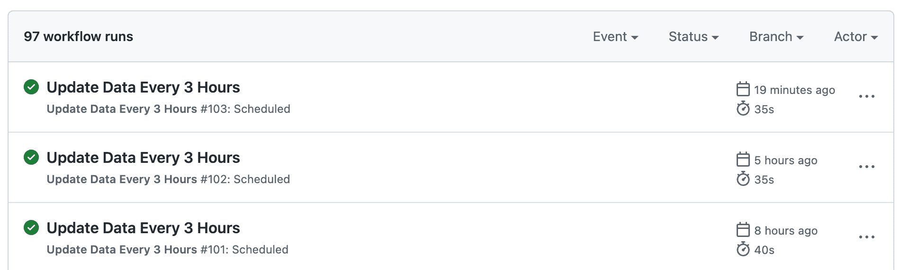

# 我如何构建一个更快更可靠的 APOD API

> 原文：<https://www.freecodecamp.org/news/building-a-faster-and-more-reliable-apod-api/>

[天文当日图](https://apod.nasa.gov/apod/) (APOD)就像宇宙的 Instagram 账号。自 1995 年以来，这个网站每天都在发布令人惊叹的宇宙新图像。

当我使用 APOD 的官方 API 构建一个项目时，我发现请求会周期性地超时，或者需要很长时间才能返回。

出于好奇和一点困惑(返回的数据很简单，应该不需要太多计算，并且应该很容易缓存)，我决定研究一下 API 的 repo，看看是否能找到原因，甚至可能修复它。

## 作为数据库的网站

我着迷地发现没有数据库。API 使用 BeautifulSoup 从 APOD 网站的 HTML 中解析出数据，并根据请求进行直播。

然后我想起来了，这个网站是 1995 年创建的。MySQL 将会在 6 月 16 日第一张 APOD 照片的前几周发布。


ap950616, the first APOD

不过这对性能并不好，因为 API 需要返回的每天的数据需要额外的网络请求来获取。

看起来对日期范围的请求是串行的，而不是并行的，所以即使请求一个月的数据也要花很长时间才能返回。一年的数据需要半分钟以上的时间，而不是超时或发送回服务器错误。



womp womp

官方 API 似乎也没有做任何缓存——第一次加载一个需要 30 秒的请求，第二次加载又需要 30 秒。

我相信我们可以做得更好。

## 更快更可靠的 APOD API

因为我正在使用 APOD API 来支持一个投资组合项目(是的，我正在找工作😛)，真的需要它可靠，加载快。我决定实现自己的 API。

如果你想在阅读过程中详细浏览，你可以在 GitHub repo 中找到所有代码[。](https://github.com/ellanan/apod-api)

以下是我采取的方法:

### 1.避免按需刮擦

NASA 的 API 响应缓慢的主要原因之一是因为数据抓取和解析是实时进行的，这给每个请求增加了大量开销。我们可以将数据提取步骤与 API 请求的处理分开。

我最终编写了一个脚本，将网站的数据转储到一个 12MB 的 JSON 文件中。对于 JSON 文件来说相当大，但是考虑到一个自由层 Vercel 函数可以有 250MB 的解压缩大小和 1024MB 的内存，它仍然足够小，可以直接加载，而不需要麻烦数据库。

该脚本由两部分组成:

*   `[getDataByDate(date: DateTime)](https://github.com/ellanan/apod-api/blob/main/api/_data/getDataByDate.ts)`是一个函数，当给定一个特定的日期时，它将获取当天相应的 APOD 网页，使用 [cheerio](https://www.npmjs.com/package/cheerio) (JavaScript 相当于 BeautifulSoup)解析 HTML 中的数据，并以 JavaScript 对象的形式返回结构化数据。
*   [`extractData.ts`](https://github.com/ellanan/apod-api/blob/main/extractor/extractData.ts) ，它使用[异步](https://www.npmjs.com/package/async)库的`eachLimit`方法调用日期范围内[天的`getDataByDate`(最初为“今天*到 1995 年*6 月 16 日*之间的每一天”)来并行发出多个请求。它*](https://github.com/ellanan/apod-api/blob/b43ee90a9a1b169447ed22c9a977e259eaf9bf39/extractor/extractData.ts#L30-L35)*[将每天的结果作为一个单独的 JSON 文件存储在文件系统](https://github.com/ellanan/apod-api/blob/b43ee90a9a1b169447ed22c9a977e259eaf9bf39/extractor/extractData.ts#L11-L19)中，最后[将所有每天的 JSON 数据合并成一个单独的 data.json](https://github.com/ellanan/apod-api/blob/b43ee90a9a1b169447ed22c9a977e259eaf9bf39/extractor/extractData.ts#L58-L77) 。*

您可能会想——为什么不先获取所有数据，最后只保存一个文件呢？在进行 9000+的网络请求时，其中一些请求肯定会失败，你真的不想从零开始。运行时保存每天的数据允许我们从故障发生的地方继续。

以下是按需抓取前后的时间对比:

| **自变量** | **我的 APOD-API** | 美国宇航局的 APOD 空气污染指数 |
|  | 平均 TTFB*
(n=20) | 标准
偏差 | 平均 TTFB
(n=20) | 标准
偏差 |
| 没有争论 | 110 毫秒 | 21 毫秒 | 58 毫秒 | 29 毫秒 |
| 日期 | 80 毫秒 | 34 毫秒 | 105 毫秒 | 88 毫秒 |
| start _ date = 2021-01-01
&end _ date = 2022-01-01 | 151 毫秒 | 63 毫秒 | 35，358 毫秒 | 2891 毫秒 |
| 计数=100 | 96 毫秒 | 48 毫秒 | 9701 毫秒 | 1，198 毫秒 |

[*https://en.wikipedia.org/wiki/Time_to_first_byte](https://en.wikipedia.org/wiki/Time_to_first_byte)

### 2.回退到按需数据提取

提取的 JSON 将只有运行提取时的数据。这意味着有时会有一个新的 APOD 从我们的 JSON 中消失。对于这些情况，最好还是使用实时请求作为补充数据源。

在我们的 API 请求处理程序的代码中，我们[检查我们提取的 data.json 以发现哪个日期是我们得到](https://github.com/ellanan/apod-api/blob/b43ee90a9a1b169447ed22c9a977e259eaf9bf39/api/index.ts#L7-L11)数据的最后日期，并且[如果最后日期和今天之间的天数大于 1](https://github.com/ellanan/apod-api/blob/b43ee90a9a1b169447ed22c9a977e259eaf9bf39/api/index.ts#L103-L109) ，那么我们[并行地](https://github.com/ellanan/apod-api/blob/b43ee90a9a1b169447ed22c9a977e259eaf9bf39/api/index.ts#L114-L136)获取任何缺失日期的数据(再次使用`getDataByDate`，我们用于提取 json 文件数据的相同函数)。

### 3.积极缓存请求

APOD 官方 API 的大部分时间都在等待服务器发送第一个字节。由于历史数据不会改变，而且每天都会添加一次新条目，所以实际的应用服务器在大多数时候都不需要被攻击。

我们可以使用头部来告诉内容交付网络(CDN)积极地缓存我们的云功能的响应。我在 Vercel 上托管，但这应该也适用于 Netlify 和 Cloudflare。

我们希望从函数处理程序发送的特定头的代码是:

```
response
    .status(200)
    .setHeader(
        'Cache-Control',
        'max-age=0, ' +
        `s-maxage=${cacheDurationSeconds}, `+
        `stale-while-revalidate=${cacheDurationSeconds}`
    )
```

the above is a reformatted paraphrasing of [the actual handler](https://github.com/ellanan/apod-api/blob/b43ee90a9a1b169447ed22c9a977e259eaf9bf39/api/index.ts#L156-L164) 

分解它，

*   告诉浏览器缓存请求多长时间。如果对资源的请求在最大时限内，则使用缓存的响应。我们按照 [Vercel 的建议](https://vercel.com/docs/concepts/edge-network/caching)，将`max-age`设置为`0`，以防止浏览器在本地缓存 API 响应。这样，客户端仍然可以在数据更新时立即获得新数据。
*   `s-maxage`告诉服务器缓存请求的时间。因此，当对资源的请求在 s-maxage 内时，服务器(在我们的例子中，是 Vercel 的 CDN)将发送缓存的响应。这非常强大，因为所有用户和设备都可以共享这个缓存。
*   我们将`s-maxage`设置为一个可变的时间量，因为对于使用相对时间(“今天的数据”，或“过去 10 天的数据”)请求日期的请求，我们只想让 CDN 缓存大约一个小时，因为这可能会在下一个 APOD 发布时更新。对于要求特定日期数据的请求(例如在“2001-01-01”和“2002-01-01”之间)，我们可以要求 CDN 缓存更长时间，因为这不会改变。
*   我们最后设置了一个`stale-while-revalidate`头。这样，当指定的缓存时间到期时，我们会告诉 CDN 为当前用户提供缓存数据，而不是让下一个用户等到新数据返回，但同时，我们会为新数据访问 API 端点，并为下一个请求缓存这些数据。

由于我们的 API 已经将所有数据加载到内存中，缓存和未缓存请求之间的性能差异应该不会太明显，但是越快越好。

缓存的主要目标是避免运行云功能，因为 Vercel 的免费层有 100 GB-hours 的配额(不知道这是什么意思，但不管是什么，我不想触及它)。

缓存请求前后的时间比较:

| **自变量** | **我的 APOD-API** | 美国宇航局的 APOD 空气污染指数 |
|  | 平均 TTFB
(n=20) | 标准
偏差 | 平均 TTFB
(n=20) | 标准
偏差 |
| 没有争论 | 33 毫秒 | 11 毫秒 | 58 毫秒 | 29 毫秒 |
| 日期 | 37 毫秒 | 23 毫秒 | 105 毫秒 | 88 毫秒 |
| start _ date = 2021-01-01
&end _ date = 2022-01-01 | 46 毫秒 | 29 毫秒 | 35，358 毫秒 | 2891 毫秒 |
| 计数=100 | 31 毫秒 | 13 毫秒 | 9701 毫秒 | 1，198 毫秒 |

### 4.(奖金)自动每日更新

我们希望尽可能地保持我们的数据文件与 NASA 的 APOD 网站同步，因为从我们的 JSON 文件中读取数据比通过网络获取数据要快得多。

自动化并不能完全提高性能——我可以为自己设置一个警报，每天午夜运行提取脚本，提交任何更改，然后触发新的部署。

谢天谢地，我不需要这么做，因为显然 Github 动作并不局限于运行 Pull 请求，你也可以调度它们。

```
name: Update Data Every 3 Hours

on:
  schedule:
    # At minute 15 past every 3rd hour.
    - cron: '15 */3 * * *'
  workflow_dispatch:

jobs:
  update-data:
    runs-on: ubuntu-latest
    steps:
      - uses: actions/checkout@v2
      - uses: actions/setup-node@v2
        with:
          node-version: '16'
      - run: npm install
      - run: npm run update-data
      - name: Commit changes
        run: |
          if [ -n "$(git status --porcelain)" ]; then
            git config --global user.name 'your_username'
            git config --global user.email 'your_email@users.noreply.github.com'
            git add .
            git commit -m "Automated data update"
            git push
          else
            echo "no changes";
          fi
```

Tip - https://crontab.guru/#15_*/3_*_*_* 



## 结论

总之，在可能和合理的情况下:

1.  在接收到请求之前提取数据*,并尝试使其保持最新*
2.  并行发出回退请求
3.  在 CDN 上缓存响应

所有这些代码对于一篇文章来说有点太长了，但我相信这些原则应该更广泛地适用于面向公众的 API(更多内容请见[api.nasa.gov](https://api.nasa.gov/)！).请随意阅读[回购](https://github.com/ellanan/apod-api)，看看它们是如何组合在一起的。

感谢您的阅读！我很乐意听到您的任何反馈。你可以在 Twitter [@ellanan_](https://twitter.com/ellanan_) 或 [LinkedIn](https://www.linkedin.com/in/ellanan/) 上找到我。