# 值得一试的 10 个 Node.js 框架:Express、Loopback、哈比神等等

> 原文：<https://www.freecodecamp.org/news/10-node-js-frameworks-worth-checking-out-express-loopback-hapi-and-beyond-7b537b590f89/>

作者桑杰·拉特诺塔尔

# 值得一试的 10 个 Node.js 框架:Express、Loopback、哈比神等等

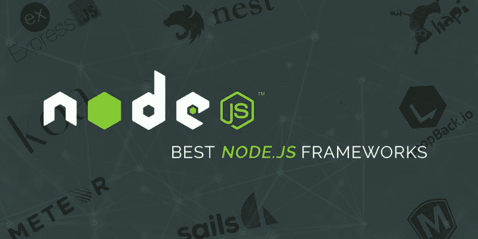

Node.js frameworks

随着技术的快速发展，开发人员开始使用新技术，并采用更方便的框架来满足他们的 web 开发需求。Node.js 得到了喜欢使用 JavaScript 进行应用开发的开发者的大量关注。

作为一名开发人员，您可以为客户端和服务器端脚本管理相同的语言，这带来了 Node 的大量采用和使用。

Node.js 框架在市场上获得了巨大的需求，2019 年将带来更多的功能和优势。市场上有如此多的顶级编程语言，但 2019 年最好的 Node.js 框架彻底改变了开发过程。

#### **但是在我们深入讨论之前，理解什么是节点框架是很重要的**

Node.js 是一个开源的跨平台 JavaScript 运行时环境，在浏览器之外运行 JavaScript 代码。当你准备一个 [JavaScript 框架](https://technostacks.com/blog/javascript-frameworks/)的列表时，你不能忽略它。

JavaScript 主要用于客户端脚本，其中用 JavaScript 编写的脚本嵌入在网站页面的 HTML 中，并由浏览器中的 JavaScript 引擎在客户端运行。

Node.js 允许开发人员利用 JavaScript 获得编写的命令行工具。对于服务器端脚本，它在页面被驱动到可用用户的浏览器之前，运行所需的服务器端脚本来开发动态网页内容。因此，Node.js 体现了一种“JavaScript 无处不在”的范式，将跨特定编程语言的 web 应用程序开发结合起来，用于服务器端和客户端脚本。

### **node . js 框架的主要优势**

Node.js 框架的使用越来越多，因为它们具有巨大的功能，如最佳的生产率、高速度和可伸缩性。所有这些特性使得 Node.js 成为大型公司开发企业级应用程序的首选。

Node.js 允许您对前端和后端使用相同的语言。这使你从学习新语言和实现它们来运行整个代码结构和程序的压力中解脱出来。

在 Node.js 框架的帮助下，您可以使用不同的工具，参考不同的指南，还可以推荐最终会节省您大量时间的实践。通过这样的方法，你可以成为编码领域的专家。

以下是一些主要的好处:

*   高速运行
*   支持数据流
*   实时工作
*   拥有所有数据库查询的解决方案
*   简单编码
*   开放源码
*   跨平台
*   负责代理服务器
*   更高的生产率
*   胜任同步问题
*   用户和社区友好

**让我们来看看 2019 年和未来几年将大放异彩的顶级 Node.js 框架。**

### **1\. [AdonisJs](https://adonisjs.com/)**

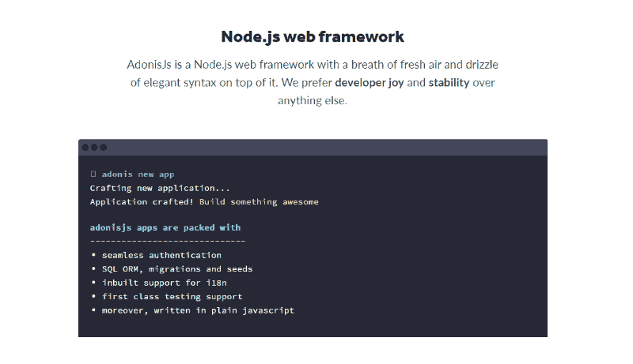

AdonisJs

AdonisJs 是最流行的 Node.js 框架之一，可以在所有主流操作系统上运行。这个框架有一个用于编写服务器端 web 应用程序的静态生态系统，这样您就可以针对您的业务需求，决定使用哪个包。它是最简单的框架，特别针对开发。

#### **AdonisJs 的特点**

*   支持由 SQL 数据库组成的 ORM
*   基于主动记录思想的高效 SQL 查询创建
*   一个简单易学的查询生成器，允许您快速构建简单的查询
*   它为 MongoDB 这样的非 SQL 数据库提供了很好的支持

### **2。[express . js](https://expressjs.com/)**

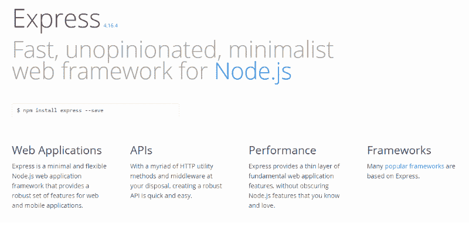

Express.js

Express.js 是最简单、最快速、无主见的 Node.js 框架**。**这是一项简单的技术，构建于 Node.js 之上，作为中间件来管理服务器和路由。

Node.js 具有异步特性，Express.js 能够开发轻量级应用程序，无缝处理多个请求，并依赖于 Express 技术的能力。

#### **express . js 的特点**

*   完全可定制
*   Node.js web 中间件的标准
*   低学习曲线
*   更加关注浏览器

### **3。[hapi . js](https://hapijs.com/)**

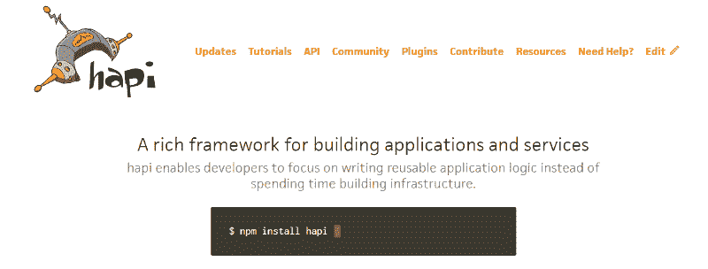

Hapi.js

Hapi.js 是用于开发应用程序接口的最佳 Node.js web 框架。这个框架有一个强大的插件系统，帮助开发者管理整个开发过程。

Hapi.js 属于 web 应用程序开发的顶级 Node.js 框架，受到开发人员的喜爱，因为他们发现使用和管理整个脚本很容易。

#### **hapi . js 的特性**

*   强输入验证
*   基于配置的功能
*   缓存实现
*   改进的错误处理

### **4。[meteor . js](https://www.meteor.com/)**

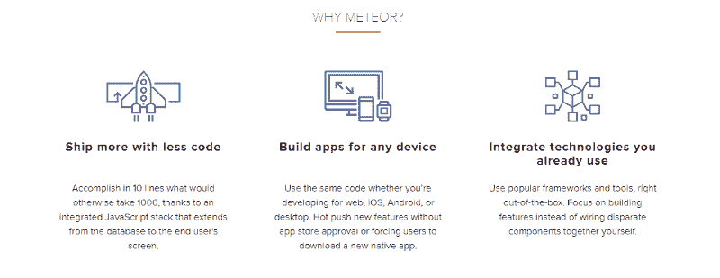

Meteor.js

Meteor.js 用于构建现代 web 和移动应用程序，被定义为全栈 JavaScript 平台。Meteor.js 最重要的特性是它提供实时更新，这样你在网上的所有更改都会在模板上即时更新。

该框架为整个应用程序层提供了一个简化的平台，并且使用相同的语言(JavaScript)。这使得这个框架在服务器端和客户端都能以更高效的方式工作。

#### **meteor . js 的特点**

*   它有能力管理更大的项目
*   拥有丰富且有组织的文档社区
*   它利用了脸书 GraphQL 数据堆栈
*   对于大多数开发人员来说，这很容易理解

### **5。[sails . js](https://sailsjs.com/)**

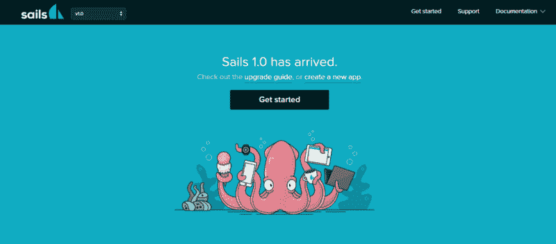

Sails.js

Sails.js 是另一个流行的 Node.js 框架，用于开发定制的企业级 Node.js 应用程序。它有能力构建最好的应用程序，并提供现代应用程序所需的支持。Sails.js 由数据驱动的 API 组成，附加到可扩展的面向服务的架构上。

#### **sails . js 的特点**

*   很多自动发电机
*   不需要额外的路由
*   出色的前端兼容性，支持不同的前端技术
*   清除对 Web 套接字的支持
*   与所有数据库兼容

### **6\. [Koa.js](https://koajs.com/)**

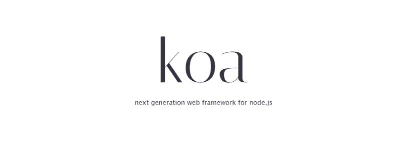

Koa.js

创建 Express.js 的团队开发了 Koa.js。它是为了填补 Express.js 的空白而开发的。Koa 有一个独特的脚本和方法，使它可以在不同的浏览器上工作。它有助于您在没有任何回调的情况下工作，并将为您提供强大的错误处理能力。

#### **KOA . js 的特点**

*   利用所需的生成器来管理和处理回调
*   拥有强大而高效的错误处理流程
*   基于组件的构建块
*   级联中间件和抛弃回调地狱

### **7。[loopback . js](https://loopback.io/)**

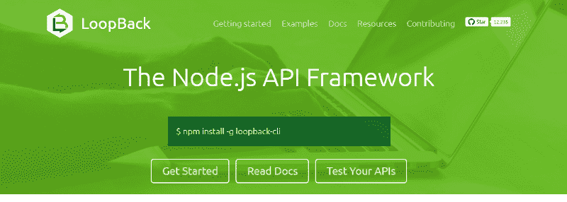

LoopBack.js

LoopBack.js 是另一个著名且被广泛使用的 Node.js 框架，它具有易于使用的 CLI 和本质上是动态的 API explorer。它帮助您根据所需的模式创建不同的模型(或者即使不需要模式)。它与不同的 REST 服务和涵盖 MySQL、MongoDB、Oracle、Postgres 等不同种类的数据库具有良好的兼容性。

#### **loopback . js 的特性**

*   快速创建动态端到端 REST APIs
*   不同设备和浏览器之间更好的连接
*   改进不同数据和服务之间的相关性
*   利用 Android、iOS 和 Angular SDKs 创建客户端应用
*   在自己的前提下运行，甚至在云中运行

### **8。[derby . js](https://derbyjs.com/)**

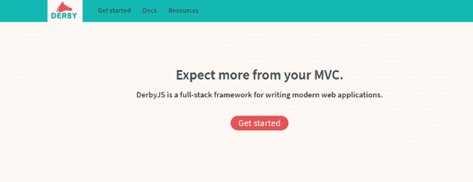

Derby.js

Derby.js 提供了服务器和客户机之间的无缝数据同步。Derby.js 是众所周知的用于编写现代 web 应用程序的全栈 Node.js 框架。它为您提供了添加定制代码和构建高效 web 应用程序的机会。Derby.js 将在 2019 年获得大量曝光，因为它有一些很棒的功能。

#### **derby . js 的特性**

*   适用于客户端和服务器端的 MVC 架构
*   最适合用于创建移动和 web 应用程序
*   它使用服务器渲染来实现快速页面加载、HTML 模板和搜索引擎支持

### **9。[total . js](https://www.totaljs.com/)**

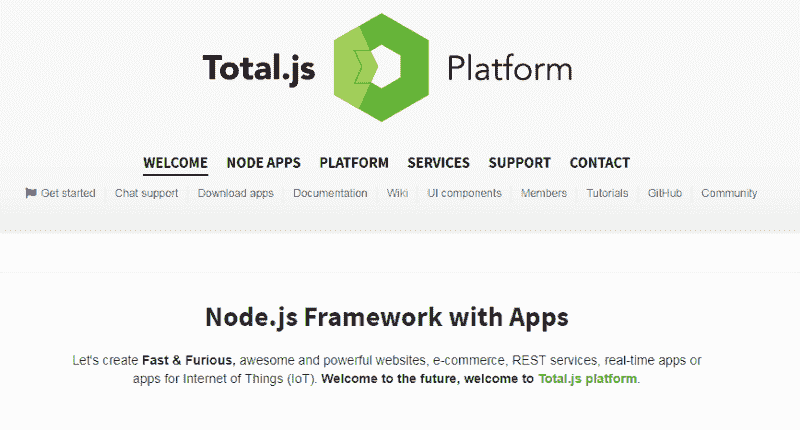

Total.js

Total.js 需要很少的维护，并提供强大的性能和完美的扩展过渡。Total.js 的整个团队都在努力匹配用户需求，让它成为全球范围内一个可爱的、高可用性的 Node.js 框架。这表明 Total.js 框架可能会在未来几年获得良好的曝光率。

#### **total . js 的特性**

*   模型-视图-控制器软件架构
*   高度可扩展的异步框架
*   提供对 RESTful 路由机制的全面支持
*   完全支持网络套接字和媒体流

### 10。[nest . js](https://nestjs.com/)

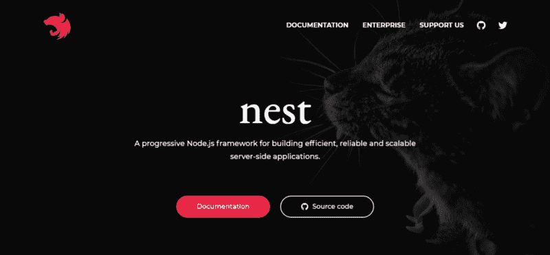

Nest.js

Nest.js 是一种 Node.js 框架，用于开发专业且可扩展的 Node.js 服务器端应用程序。它使用 JavaScript，并且是用 TypeScript 编写的。因为它是用 TypeScript 构建的，这意味着它具有强大的类型，并且结合了面向对象编程(OOP)、函数式编程(FP)和函数式反应编程(FRP)的所有元素。

#### **nest . js 的特性**

*   它有一个现成的应用程序架构
*   轻松创建高度可测试和可伸缩的应用程序
*   Nest CLI 用于生成 Nest.js 应用程序

### **如何选择节点框架**

这可能是一个艰难的决定，因为正如我们在这里看到的那样，市场上有如此多的 Node.js 框架。但是这个决定完全取决于您的项目和业务需求。不同的 Node.js 框架有不同的特点，包括速度、学习曲线、编码结构、灵活性、配置等等。

#### **关键要点**

在当今的数字世界中，技术的渗透越来越大。这意味着框架和不同技术之间的竞争程度越来越高。市场上有如此多的 Node.js 框架，但是您只需要选择一个最佳的来满足您的业务需求。

Node.js 框架的特性和功能具有所有的功能，允许您为您的企业构建一个强大的、没有错误的应用程序。你也可以[为此雇佣最好的 Node.js 开发者](https://technostacks.com/hire-node-js-developer/)。

选择最佳的 NodeJS 框架是一项艰巨的任务，因为需要进行大量的研究和分析来了解每个特定框架的细节。这取决于你做进一步的研究，并选择有助于你开发顶级网站应用程序的框架。