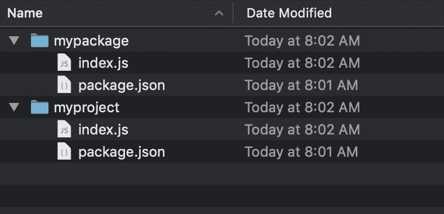
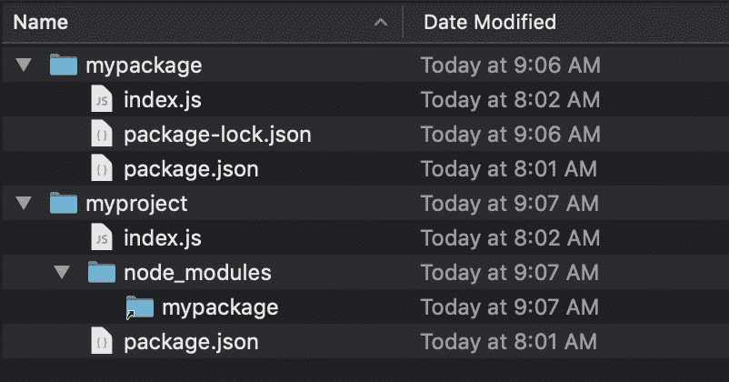
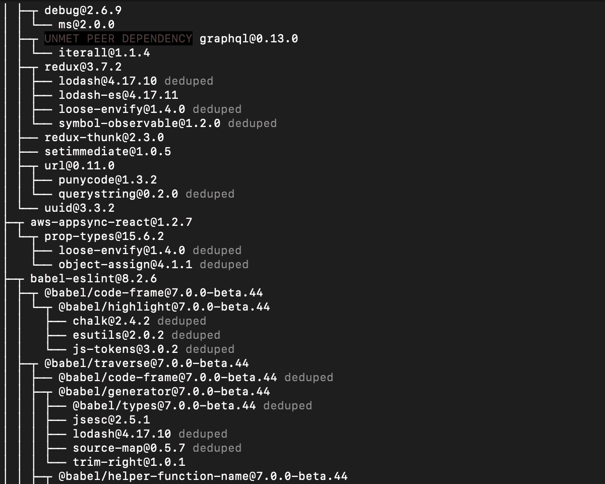
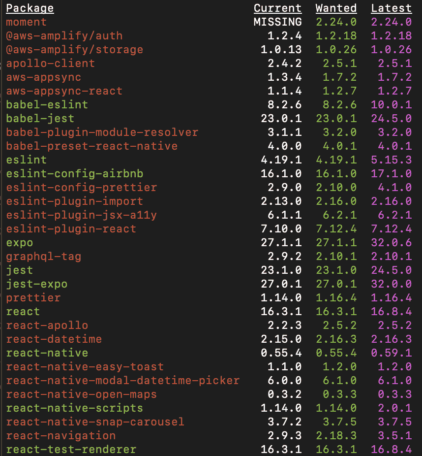
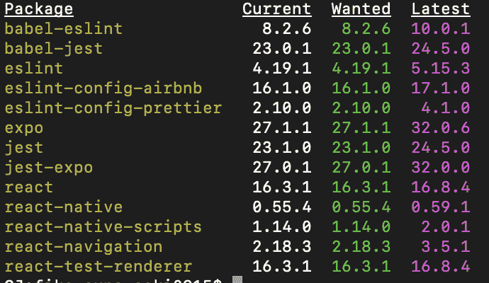
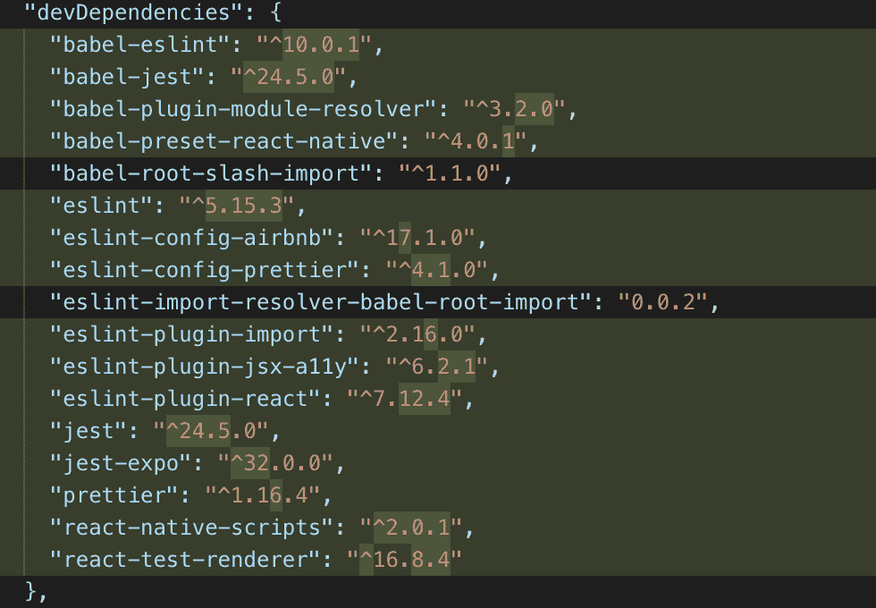
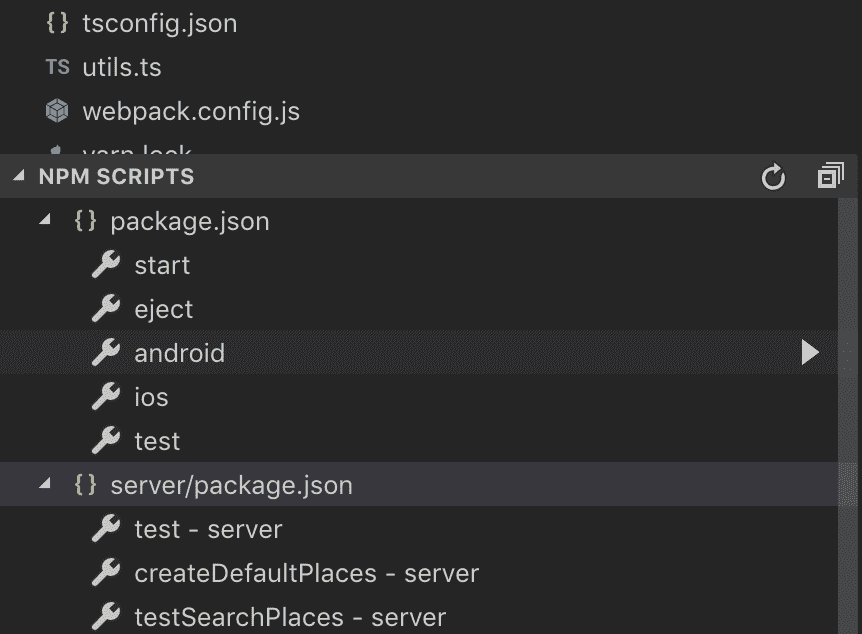

# 这些 NPM 技巧将使你成为一名职业选手

> 原文：<https://www.freecodecamp.org/news/10-npm-tricks-that-will-make-you-a-pro-a945982afb25/>

作者:卡尔-约翰·基尔

在使用 NPM 近 8 年后，我学到了一些我希望在开始时就知道的东西。让我们称之为技巧吧，这些技巧极大地改善了我与 NPM 合作的方式。今天我想和你分享我的 10 大诀窍。

### 1.节省时间。⏲使用快捷方式

这是最有用的特性之一，但是没有很好的记录。一个命令的快捷方式可能看起来是一件微不足道的事情，但是事实是你将会少写 30-60%的代码。你可以把节省下来的时间花在有意义的事情上，比如多喝一杯咖啡，☕️？

把`npm ****install**** <package>`写成`npm ****i**** <package>`而不是
。

把`npm ****install**** ****--save**** <package>`写成`npm ****i -S**** <package>`而不是
。

把`npm ****install**** ****--save-dev**** <package>`写成`npm ****i -D**** <package>`而不是
。

把`npm ****install**** ****--global**** <package>`写成`npm ****i -G**** <package>`而不是
。

？奖金捷径！想给你的同事留下深刻印象吗？？它来了…

把`npm ****test****`写成`npm ****t****`而不是
。

### 2.在一个命令中安装多个软件包

能写一行为什么要写多行？？如果你对你的软件包了如指掌，最快的选择是把它们全部安装在一行程序中，但是要小心！一个拼错的包，整个命令都会失败。如果你不确定名字，就一个一个地安装。

```
npm i -S react redux react-redux 
```

### 3.安装不同来源的软件包

默认情况下，运行`npm-install`时，https://registry.npmjs.org*NPM-registry*([NPM](https://registry.npmjs.org/))会安装最新版本

但还有更多！NPM 也可以从其他来源安装软件包，比如 URL 或 tarball 文件。

当您创建自己的包或对现有包进行拉式请求时，这个特性非常强大。比如你有自己的 [Redux](https://redux.js.org/) 的 fork，你可以直接从你的 fork 安装包。*(将* `*username*` *改为你在 GitHub 上的用户名。)*

```
npm i 
```

更好的是，如果您使用的是 GitHub 存储库，您可以使用以下快捷方式:

`npm i ****username/redux****`

还有呢！您也可以从特定的分支安装软件包。在测试未来版本时非常有用。只需在末尾加上`#`和分支名称即可。

```
npm i username/redux#
```

？奖金捷径！你不是在用 GitHub 吗？别担心， ****BitBucket**** 和 ****GitLab**** 也有快捷方式:

```
npm i bitbucket:username/myrepositorynpm i gitlab:username/myrepository
```

### 4.链接包

有时你想在一个项目上工作，同时开发它的包。对于您想要尝试的每一个更改，将您的包提交并推送到远程存储库是令人厌烦的！？相反，你可以使用一个叫做*包链接*的特性。

*包链接*的工作原理是在 node_modules 文件夹中创建一个符号链接，指向包的本地存储库。通过这种方式，您可以在本地编辑包，并且所做的更改会立即在使用它的项目中生效。

了解*套餐链接*最简单的方法就是尝试一下！
假设我们有一个名为`myproject`的项目和一个名为`mypackage`的包。我们希望`mypackage`成为`myproject`的附属。



One project and one package.

去文件夹`mypackage`写

```
npm link
```

不错！现在，去文件夹`myproject`写

`npm link mypackage`

搞定了。仔细看看文件夹结构



如您所见，`myproject/node_modules/mypackage`现在是文件夹`mypackage`的符号链接！现在你可以继续开发`mypackage`，你所做的所有改变都将在`myproject`中立即生效。

### 5.npx 命令

NPM 上有很多脚本工具，你可能会用到，但不会成为你的运行时包的一部分。Grunt，gulp，react-create-app，react-native-cli 和 mocha 只是其中的几个。

在 NPM 5.x 之前，您必须将这些工具作为全局包或 devDependencies 安装。这非常耗时，不仅要安装，还要维护多个项目的所有工具。还有，大多数工具你只会用一两次。

在这里，二进制 NPX 来救援，节省了我们很多工作！例如，要启动一个新的 react 项目，您可以简单地编写:

`npx create-react-app my-new-project`

将立即下载并执行最新版本的 [create-react-app](https://github.com/facebook/create-react-app) 。不再以全局包的形式安装和维护工具。

### 6.监控和清理您的项目


为了解决问题并使依赖关系树和最终的包尽可能小，在安装包时理解发生了什么是很重要的。

首先，我们需要对依赖树有一个很好的概述，以及实际上已经安装了哪些包版本。使用命令`npm list`。添加标志`--depth=0`以仅列出顶层包，添加`-g`以列出您的全局包。

`npm listnpm list --depth=0 -g`



NPM 擅长于动态维护自己和展平依赖树，但是在发布之前对项目进行**重复数据删除是一个好习惯。它可能会为您删除一些包。**

**`npm dedupe`**

**这也是一个很好的想法，让您的过时和丢失的软件包有一个很好的概述。很难不喜欢这种精心组织的圆柱和圣诞氛围的配色方案？？**

**`npm outdated`**

**

The outdated list is really beautiful!** 

**如果你得到很多红色的行，你需要运行`npm update`来根据你的 package.json 更新你的包到最新的版本，这也在 ****通缉**** 栏中有说明**

**`npm update`**

**太好了！现在，如果您再次运行`npm oudated`，所有红色的行应该都消失了。**

****

**如果您在 package.json 中的版本前面使用插入符号`^`,那么主要版本将不会更新(因此会出现黄色的行)。这很好，因为更新到一个新的主要版本可能会有突破性的变化。**

**如果你还想把所有东西都更新到最新版本，可以使用工具`npm-update-all`。就像在项目文件夹中运行这个命令一样简单。**

**`npx npm-update-all`**

**酷！现在您已经获得了所有依赖项的最新版本。您的 package.json 也更新了。⚠️意识到⚠️的突破性变化**

**

As you can see, npm-update-all will update all your packages to the latest version.** 

### **7.转到包的主页**

**需要查看软件包的文档吗？当你所需要的一切都是终端时，为什么还要切换到浏览器并开始谷歌搜索呢？？**

**在浏览器中打开包的存储库**

**`npm repo <package>`**

**打开主页**

**`npm home <package>`**

**打开文档**

**`npm docs <package>`**

### **8.使用 NPM 脚本**

**我喜欢 npm 脚本！在大多数情况下，您可以使用 npm 脚本来代替使用 Gulp 和 Grunt 这样的任务运行器来自动执行重复的任务，原因如下:**

**➕需要维护的开发依赖性或全局依赖性更少。
➕没有新的工具供贡献者和团队成员学习
➕更少的代码和配置。**

**首先，你有像`start, install, test, prepublish`这样在 NPM 有特殊含义的预定义脚本。你可以在我的[之前的教程](https://itnext.io/step-by-step-building-and-publishing-an-npm-typescript-package-44fe7164964c)中读到如何使用它们，在那里我们从头构建了一个 npm 包。**

**您也可以创建自己的自定义脚本。下面是一个脚本的例子，它会用 [ESLint](https://eslint.org/) 格式化`src`文件夹中的代码:**

**package.json:**

```
`"scripts":{"test": "jest","format": "eslint src --fix"}`
```

**现在你可以运行`npm run format`和[了，ESLint](https://eslint.org/) 会完成它的工作。**

**您可以使用 npm 脚本做很多事情，比如运行 shell 命令和一个接一个地链接脚本。请查看 [npm-scripts](https://docs.npmjs.com/misc/scripts) 以深入了解这一强大功能。**

### **9.在 vsCode 中运行 NPM 脚本**

**有时候我的 package.json 中有 ****30**** 个 npm 脚本(不是开玩笑)。？幸运的是，如果你使用的是 [Visual Studio 代码](https://code.visualstudio.com/)，你可以在浏览器中列出你所有的 npm 脚本，然后点击一个按钮运行你的脚本！确保启用了此设置:**

**`npm.enableScriptExplorer: true`**

**

Run your scripts with a click of a button! VSCode supports listing scripts from multiple packages at the same time.** 

### **10.设置您的默认值**

**当创建一个新项目时，你将运行`npm init`，你将被询问关于你的项目的问题。为了节省时间，您可能会编写 run `npm init -y`来用默认值填充 package.json。**

**但是你的默认值到底是什么呢？？我喜欢自己设置一些来节省时间！？**

**npm 配置集 init . author . name " Carl-Johan(C-J)Kihl "
NPM 配置集 init . author . email " Carl Johan . Kihl @ mail . com "**

### **摘要**

**这就是我现在给 NPM 的建议！如果你有更多的技巧和诀窍想要分享，请在下面添加评论！？**

**？奖金捷径！
想象一下，现在是周五晚上，你即将完成一个新项目，但是你太累了，不想写了`npm dedupe`。？**

**别担心！写下三个字母:**

**`npm ****ddp****`**

**感谢您的阅读。**