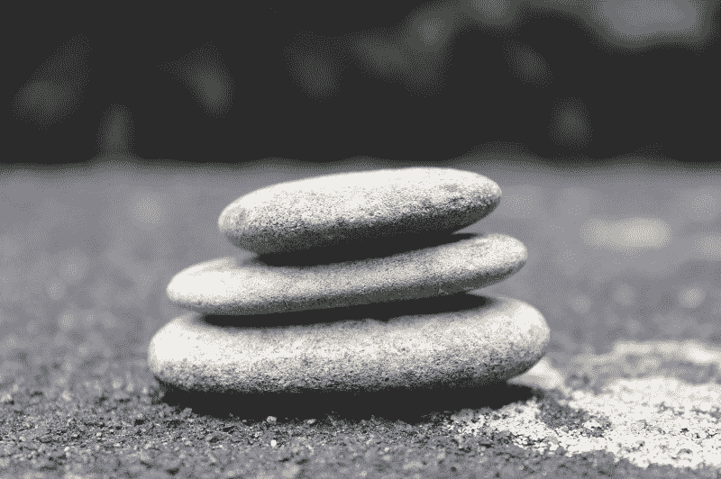
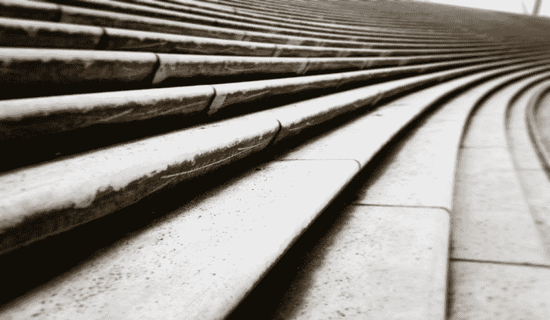
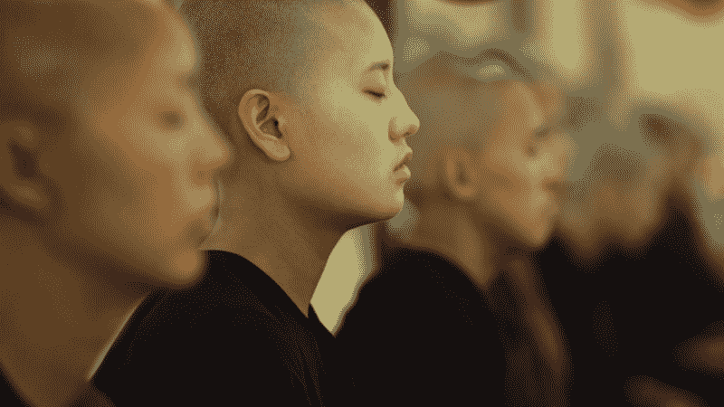

# 我想遵循的 10 条原则

> 原文：<https://www.freecodecamp.org/news/10-principles-i-want-to-live-by-fae94ded9c84/>

作者 Haseeb Qureshi

# 我想遵循的 10 条原则

我刚从北加州一个冥想中心的沉默誓言中回到家。经过五天的静心，回到城市生活是一种奇怪的感觉。

环顾四周，气喘吁吁的慢跑者、圣诞花环、在餐馆外等候的热切夫妇、走走停停的交通——这几乎让我无法忍受。

我最后一次发誓保持沉默是在 5 年前。持续了十天。那时，我刚刚告别扑克生涯。我迷失了，困惑了。我生自己的气。进入沉默的面纱，我期望从另一边带着答案出来。

这可能是我一生中最艰难的十天。但是当我到达另一边时，我带着更多的问题出现了。

这次感觉不一样。尽管冬至是黑暗的，我从沉默的誓言中带着意想不到的清晰回来了。

我决定回家后，给自己写一封信。这是那封信。

过去两年是变革的旋风。我已经发誓要赚钱奉献，我已经重新开始了我的生活，并移居到了三藩市，我已经在 T2 的带领下进入了科技行业。现在我是一名全职软件工程师。

我走得太快了，很多事情都发生了变化。然而在我内心，我仍然有这个旧的自我形象。我甚至忘了问自己——我现在看重什么？发生了怎样的变化？

我想创建一个文件，让我可以回顾过去，提醒自己我的原则。如果日子不好过，或者我感到束手无策，这封信可以成为指引我的磁石。

称之为个人宣言。

通常当我写博客的时候，我是为其他人写的。这篇文章将是一个例外——我写这篇文章首先是为了我自己。然而，我希望这篇文章能激发你的思考，并且你能考虑这些原则对你有什么用。

### **1。简单的生活。**

你已经拥有了你需要的一切。

简化。把东西送人。拒绝更多的提议。要知道你是完整的，你不需要更多的东西来过好生活。

把自己的人生打包成几个行囊，踏上新的生活，是一件多么惬意的事情啊！允许自己一次又一次地这样做。

当然，拥有东西并不可耻。但是，无论你拥有什么，都要把它看作是借来的——当它必须归还时，要高兴地归还。

### **2。你永远会有仇人。**别理他们。

如果你充满激情，如果你很奇怪，如果你藐视大多数人认为是规则的东西，你会吸引那些讨厌你的人。

那很好。如果这是他们需要的，就让他们去恨吧。他们的仇恨会让你更有韧性。

但最重要的是，你应该感谢他们的出现。因为如果他们没有，这将是一个明确的信号，表明你所做的事情并不重要。

> “你有敌人吗？很好。这意味着，在你生命中的某个时刻，你曾为某些事情挺身而出。”

> ——温斯顿·丘吉尔

### **3。为重要的事情安静地战斗。**

无论是你爱的人，还是对你来说重要的事，做好工作。要谦虚。努力战斗，全力以赴。

关注或名声会令人愉快，有时甚至是有益的。但更多的时候，这是对真正工作的一种干扰。

### **4。自首吧。**

不是关于你的。是关于比你更重要的事情。

给。投稿。不仅仅是钱，或者时间，还有你的身份。让你的生活不仅仅是你自己。

> “告诉我，你打算用你那狂野而宝贵的生命做什么？”

> —玛丽·奥利弗《夏日》

### **5。求精通。**

好起来。

更加努力。

练习，学习，摸索。

一辈子都这样。

称之为激情。

### **6。永远做学生。**

总会有人比你更好，更强，更聪明。

当你不知道什么的时候，大声说出来。狂热地寻求答案。谦卑地磨破你的膝盖。永远不要让无知或羞耻阻止你，因为学习的欲望永远是高尚的。

去寻找你的老师，不找到他们不要放弃。

### **7。培养美德——如果有必要，可以通过武力。**

你是个懦夫。你害怕，你懒惰，你自私。只有当你知道这一点，你才能开始培养美德的工作。

你主要是你所做的。所以宣誓。出现吧。不断回来。而当你太害怕呆不住的时候，有时候你必须把自己锁在房间里，把钥匙扔掉。

### **8。你会找到自己的路。**

你的人生，你的道路，你的失败和成功都不会像其他人一样。尽管你会读很多书，听很多故事，不管是好是坏，他们的蓝图都不会适用于你。

那很好。你会做大事，用你自己的方式。你将打造一条没有人会想到的道路——即使是你。

没关系。相信你的道路，尽管看起来很奇怪，但对你来说是正确的。

### **9。在下山的路上打造你的翅膀。**

要聪明，要算计，要小心。但是当机会出现时，鼓起勇气，大胆尝试。如果你看不到任何值得冒的风险，你就没有注意。

如果你不知道自己在做什么没关系——相信你会在落地前学会。如果你崩溃了:振作起来，原谅你的错误，再试一次。这是进步的唯一方式。

### 10。保持饥饿，保持愚蠢。

你有点疯狂。这个世界需要像你这样的人——鲁莽、冒火、倒霉的空想家。

所以不要放弃。继续要求太多。对这个世界和其中的一切充满渴望，不要放慢脚步，不管人们说什么。

> 别管安全了。住在你害怕住的地方。

> 毁了你的名声。臭名昭著。

> —鲁米，“困惑”

我很快会写更多关于我的捐款和对 2016 年的一些思考。但是现在，一如既往地感谢你的阅读。

—Haseeb