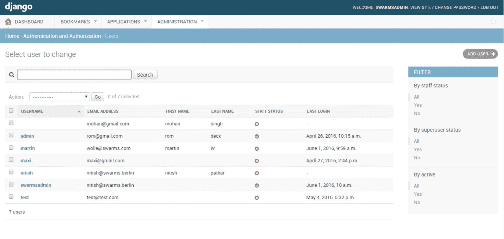

# Python 的 Django 是用来做什么的？我在客户项目中使用 Django 框架的 5 个主要原因

> 原文：<https://www.freecodecamp.org/news/10-reasons-to-try-django-for-client-projects/>

如果几年前你告诉我，我会选择 Python 的 Django 作为客户项目的首选框架，我不会相信你。

当时，我更喜欢 Flask 和 Express 这样的轻量级框架，因为它们的灵活性和它们给我提供的额外控制。

什么变了？

一部分原因是我被雇佣到姜戈工作！另一部分是厌倦了从零开始为不同的公司一次又一次地设置相同的功能——数据库、迁移、身份验证系统、电子邮件等等的 ORM。设置所有这些功能并使其正常工作非常耗时。

Django 为我提供了所有这些开箱即用的最小配置。是的，太棒了。

有了 Django，我可以更快地构建应用程序，而不会牺牲功能。开发者体验也很好——不仅仅是因为 Python 很棒。这也是因为有好的调试工具，日志记录已经设置好了，并且有一个服务器可以通过文件更改自动重启。

我可以继续列举 Django 的所有优点，但这里我只列出我最喜欢的 5 个。我希望这会激起你的兴趣，让你想为自己的公司和项目尝试 Django。

## Django 的管理界面

我把它列在第一位，因为它是 Django 中我最喜欢的特性。

如此多的客户端需要有一个应用程序视图，以便管理用户、数据或页面上的内容。通常，客户不是技术人员，也没有足够的时间深入实际代码并进行修改。

那么处理这种情况的最好方法是什么呢？

Django 的管理界面是一个很好的解决方案。无需任何额外的配置，您就可以获得一个强大的、完全可定制的、受登录保护的管理区域，显示您的应用程序的所有数据。

Image from [Stack Overflow](https://stackoverflow.com/questions/37572343/django-count-todays-logged-in-users)

该管理区域中的数据包括您想要在其中列出的任何表，以及来自第三方包(如 auth libraries)的所有表。

## Django 有内置的 Auth

几乎每个应用程序都需要某种身份验证，因此市场上有许多工具、服务和库可供使用。因为有这么多选择，很难选择一个。即使您使用托管服务，连接它也不总是容易的。

嗯，Django 自带了通过会话的内置认证。想用代币怎么办？只需安装带有令牌认证的 Django REST 框架(DRF)库。

我个人喜欢将 DRF 与额外的 [dj-rest-auth](https://github.com/jazzband/dj-rest-auth) 库一起使用，以获得像过期令牌这样的额外功能。无论哪种方式，所有这些部分都可以在 Django 生态系统中无缝地协同工作，并且只需要很少的配置。

这里是一个 Django repo 的例子，我在 Django REST 框架中设置了令牌验证(和 GitHub 验证)。

您在 Django 项目中使用的任何认证系统也将使用 ORM。接下来，我们来谈谈它的一些好处。

## ORM

您是否曾经尝试过手动设置一个 ORM 来将您的数据库连接到您的应用程序？例如，SQLAlchemy、TypeORM 或 Sequelize。即使有好的文档，也不容易。您必须让不同类型的查询工作，还有迁移、播种等等。

Django 为您提供了开箱即用的一切。只需插入您最喜欢的数据库——Postgres、MySQL、Mongo 等等——的凭证，Django 就会处理剩下的事情。无论您选择什么样的数据库，您都可以通过相同的 Python 接口创建模型并与之交互。

这里有一点需要注意:除非你是 SQL 高手或者有非常特殊的情况，否则你应该在每个应用程序中使用 ORM 与数据库进行交互。

到目前为止列出的所有特性都不是 Python 的 Django 独有的。不同之处在于，大多数框架允许您设置自己的 ORM、身份验证等等。Django 不费吹灰之力就做到了这一切。这意味着您可以更快地发布特性、MVP 和应用程序。

## 发展速度

Python 是一种常用于快速原型化和构建应用程序的语言。Django 为您提供了 Python 的速度和能力，以及许多额外的内置特性，有助于更快地构建 web 应用程序和 API。

做出决策、研究工具和库需要花费大量时间，而不是实际编写代码。Django 有记录良好的做事方法，可以省去你为自己找出一个好的解决方案所花费的额外时间。

从为你启动一个项目，到创建复杂的查询，再到部署你的应用程序，Django 为你提供了[优秀的文档](https://docs.djangoproject.com/en/3.1/)和[大型社区](https://forum.djangoproject.com/)来帮助你。

然而，不仅仅是核心的 Django 库可以帮助您更快地构建应用程序。Django 也有数千个带有通用 API 的插件，所以你可以对如何在你的项目中使用它们有一定的期望。

## Django 插件

想建一个 CMS？Django 有一个插件。实际上是相当多的。如果你搜索 Github 和[DjangoPackages.org](https://djangopackages.org/)，你会发现几乎所有用例的大量解决方案。

以下是我最喜欢的一些:

*   Django Rest 框架:路由器、序列化器和其他工具，使构建 API 变得简单。
*   Django Graphene :可以轻松地将 GraphQL 功能添加到 Django 应用程序中。
*   为 Django 添加了一个漂亮的 CMS 风格的界面，为常见的 CMS 用例添加了许多内置特性。
*   Django Crispy Forms :如果您正在构建全栈应用程序，这个包使得在模板中使用表单变得更加简洁和容易。
*   [姜戈调试工具栏](https://pypi.org/project/django-debug-toolbar/):这是姜戈项目必须的。您可以使用此工具调试从 SQL 查询到模板的所有内容。

我希望我已经给了你足够的姜戈的味道，让你想自己尝试一下。让我知道进展如何:)

作为一名高级软件开发人员，我在 RocketBuild 的一个优秀团队中工作！我们在 Django、React 和其他技术中建立了很多很酷的项目。

如果你想看更多 Django、Python、JavaScript 的内容，可以看看我的 YouTube 频道，[法拉第学院](https://www.youtube.com/c/FaradayAcademy)。或者，在推特上联系我， [@faradayacademy](https://twitter.com/faradayacademy) 。