# 这些工具将提高你的 Android 工作效率

> 原文：<https://www.freecodecamp.org/news/10-tools-which-will-boost-your-android-productivity-and-hype-bea88e0bcd86/>

迈克尔·比亚拉斯

# 这些工具将提高你的 Android 工作效率

这篇文章的主要目的是列出并描述一些工具(主要是免费的工具)，这些工具可以让你提高生产力和效率，并增加产品所有者和经理的关注度。

对于每一个单独的工具(或者工具组)，我会添加注释，比如:
**【免费】**或者**【免费/付费】**或者**【付费】**。

我们不要浪费时间了！

[**1。用于 Mac 的 Android 工具**](https://github.com/mortenjust/androidtool-mac) **【免费】——**当我发现这个工具时，它让我高兴了一天。它完全免费，允许您:

*   录制屏幕视频，
*   截图，
*   安装(侧装)APKs，
*   接受错误报告，
*   使用通用脚本。

下图可以看到主菜单。你只需点击一个合适的图标，就可以截图或开始录制视频。

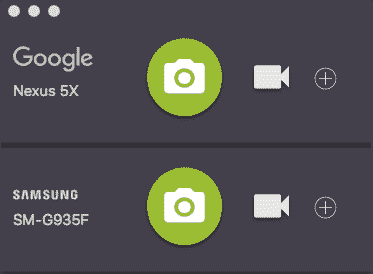

该工具还提供了非常强大的首选项，如下所示:

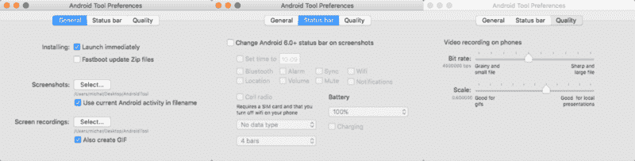

对我来说真正重要的是，除了 mp4 格式，它还可以**为你创建 gif** 。

您可以设置视频和 gif 的质量，也可以根据视频或截图的需要调整 Android **状态栏**。

缺点之一是 **Android 工具只适用于 OSX / MacOS** 。

**2。[维瑟](https://www.vysor.io/)【免费/付费】**——这是一款 Chrome 应用，兼容所有操作系统。它让你有可能从你的桌面操作你的物理设备。

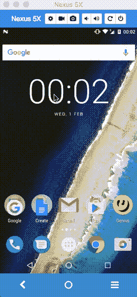

按照上面的 gif，你可以用鼠标指针点击和滚动设备。你的电脑键盘也能工作。

该应用程序有两个版本:

*   *免费的* —它提供镜像和控制你的 Android 设备，以及截图。
*   *Pro* —它为您提供高质量镜像、拍摄屏幕视频、全屏模式、无线和拖放&功能。

老实说，Android Tool for Mac 和 Vysor Free 的**组合覆盖了大部分用例**。你可以做一个现场演示，你可以拍摄屏幕视频并在之后分享，或者录制一个 gif。然而，为了有一个真正好的流媒体/镜像质量，我认为它是值得的，特别是因为它的成本只有 1.99 美元/月。

综上所述，**使用这两个 app，让你的演示完美！**这也会让你的利益相关者高兴！

**3。 [Genymotion](https://www.genymotion.com/) 【免费/付费】**——我想大家都知道 Genymotion。如果没有，这是一个强大的 Android 模拟器。

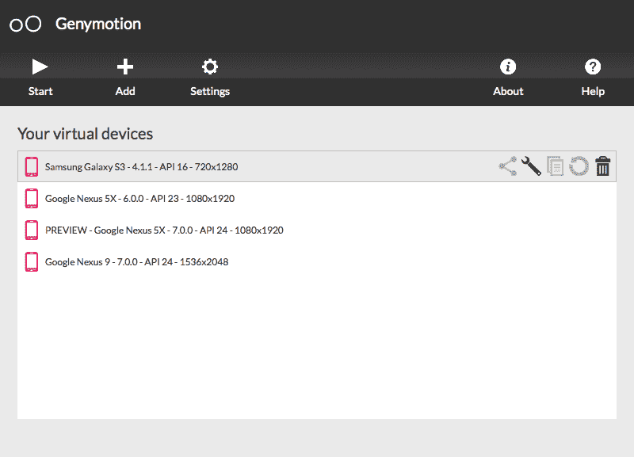

> Genymotion 是一个 AOSP，移植到 VirtualBox(通过集成其驱动程序)。直接用 x86 编译。所以它可以直接在你的 CPU/GPU 上运行，不需要任何抽象或翻译。这在性能方面有很大的不同。

该工具提供:

*   兼容 Android SDK 工具、Eclipse 和 Android Studio(还有一个插件，我在上一篇关于 Android Studio 提示&技巧的文章中已经列出)
*   许多预定义的模拟器，
*   使用笔记本电脑摄像头作为 Android 摄像头的视频源，
*   用不同的充电水平测试你的应用，看看它如何处理这些用例，
*   使用 GPS 小部件测试基于地理位置的应用程序，
*   运行像 Espresso 这样的 UI 测试，
*   截屏(截屏、录音等。).

此外，您可以安装谷歌服务应用程序，如 Goole Play Store，并享受完整的 Android 体验。

不幸的是，每朵玫瑰都有它的刺，Genymotion 是一个额外付费的解决方案。
[最便宜的方案](https://www.genymotion.com/pricing-and-licensing/)99 欧元/年。

2017 年 2 月 4 日更新: **Genymotion 也是免费的**，但仅限个人使用。你可以在这里下载[。](https://www.genymotion.com/fun-zone/)

**另一个【免费】的替代方案**是使用内置的[安卓模拟器](https://developer.android.com/studio/run/emulator.html)。自 2015 年以来，它运行得非常好，因为它使用了谷歌英特尔 x86 映像。我喜欢它的流畅、直观以及与 Android Studio 的良好集成。

**4。[邮递员](https://www.getpostman.com)** **【免费/付费】** —这个工具就是**牛逼**。我已经用了 3 年了，最初是作为谷歌 Chrome 的扩展，然后作为一个原生应用。Postman 帮助您在使用 API 时尽可能地高效。

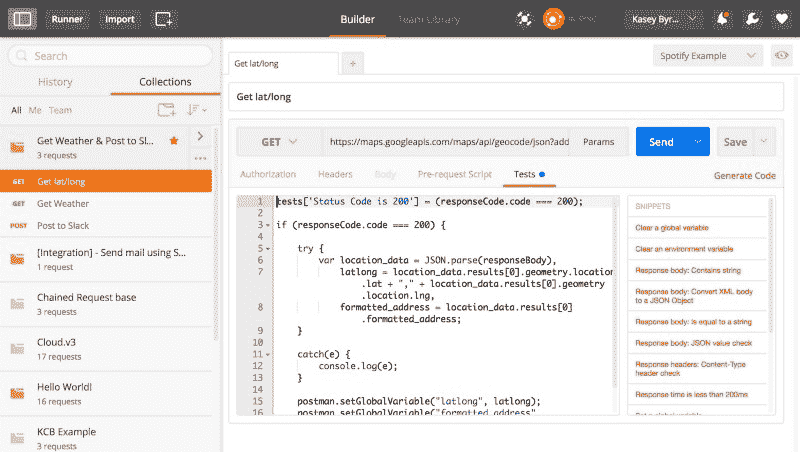

基本功能包括:

*   布局紧凑，
*   支持文件上传的 HTTP 请求，
*   JSON 和 XML 的格式化 API 响应，
*   HATEOAS 支持，
*   图像预览，
*   请求历史记录，
*   基本 Auth 和 OAuth 1.0 / 2.0 助手，
*   URL 和标题值的自动完成，
*   用于添加参数或头值的键/值编辑器。也适用于 URL 参数，
*   使用环境变量轻松切换设置。非常适合测试生产、试运行或本地设置，
*   键盘快捷键最大限度地提高您的生产力，
*   使用收藏来组织请求，
*   记录集合内的请求。你甚至可以存储整个 HTML 笔记。Postman 使用 Bootstrap，所以你也可以用它来设计你的笔记，
*   下载收藏并与您的开发团队共享。

**我真正喜欢《邮差》的是:**

*   编写请求前脚本(例如用于生成和传递时间戳)然后处理结果(编写测试或保存结果用于另一个 API 调用)的能力，
*   拥有多个环境(开发、试运行/预开发、生产等。),
*   在集合中对 API 调用进行分组，
*   在团队中同步收藏(你可以手动*通过导出收藏来实现*或者*购买*专业版在所有队友中自动同步)，
*   很棒的文档。

对我来说，免费版就足够了，但你当然可以在官方网站上阅读更多关于产品比较和定价计划的信息。

**5。 [Sequel Pro](https://www.sequelpro.com/)** **【免费】**——一款快速易用的 Mac 数据库管理应用，用于与 MySQL 数据库协同工作。你可以在 [Github](https://github.com/sequelpro/sequelpro) 上查看一下。

**我喜欢它的主要原因:**

*   快速直接访问本地和远程服务器上的 MySQL 数据库，
*   它是一个本地应用程序，
*   良好的文档，
*   开源项目。

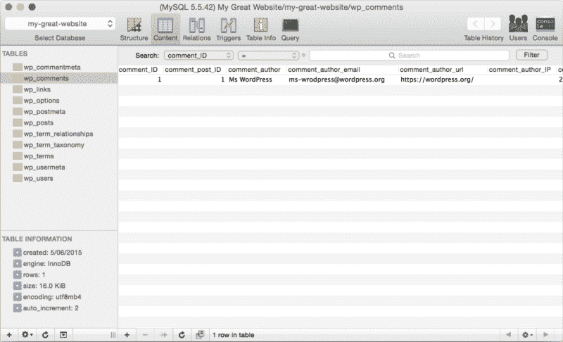

不幸的是，目前只有 OSX / MacOS 版本。尽管如此， [MySQL Workbench](https://www.mysql.com/products/workbench/) 可能被认为是**免费 Windows 的替代品**。

如果你使用 PostgreSQL，你可以使用 [**PSequel**](http://www.psequel.com/) **，**其中提供了一个干净简单的接口来执行常见的 PostgreSQL 任务，并且是免费的。

**6。 [JD-GUI](http://jd.benow.ca/)** **【免费】** —它是一个独立的图形实用程序，显示`.class`文件的 Java 源代码。您可以浏览重构的源代码，例如，访问方法和字段。我总是在反编译 Android 应用程序时使用它。

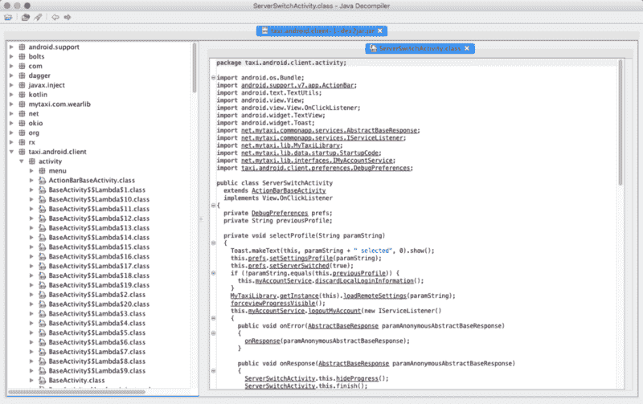

该工具是开源的，代码可以在 [Github](https://github.com/java-decompiler) 上获得。
它还有两个插件可以使用:

*   IntelliJ (最后更改日期:2014 年 3 月 28 日)，
*   [月蚀](https://github.com/java-decompiler/jd-eclipse)(最后修改时间:2015 年 4 月 23 日)。

7 .**。[安卓资产工作室](https://romannurik.github.io/AndroidAssetStudio/)** **【免费】** —谁没听说过[罗曼努里克](https://www.freecodecamp.org/news/10-tools-which-will-boost-your-android-productivity-and-hype-bea88e0bcd86/undefined)？他对机器人世界的贡献是非凡的。其中之一是 Android Asset Studio

> 一套基于网络的工具，用于生成图形和其他资产，这些资产最终将位于 Android 应用程序的 res/目录中。

该套件可在 [Github](https://github.com/romannurik/AndroidAssetStudio) 上获得，包括:

*   [启动器图标生成器](https://romannurik.github.io/AndroidAssetStudio/icons-launcher.html)
*   [App 快捷图标生成器](https://romannurik.github.io/AndroidAssetStudio/icons-app-shortcut.html)
*   [通知图标生成器](https://romannurik.github.io/AndroidAssetStudio/icons-notification.html)
*   [简单的九补丁生成器](https://romannurik.github.io/AndroidAssetStudio/nine-patches.html)
*   [通用图标生成器](https://romannurik.github.io/AndroidAssetStudio/icons-generic.html)
*   [动作栏/标签图标生成器](https://romannurik.github.io/AndroidAssetStudio/icons-actionbar.html)
*   [启动器图标动画](https://romannurik.github.io/AndroidIconAnimator/)

**8。[Mac 的材质颜色](https://github.com/romannurik/MaterialColorsApp)【免费】【Roman Nurik 的又一款炫酷工具。这是一个可从菜单栏访问的材质调色板查看器。你可以从[这里](https://github.com/romannurik/MaterialColorsApp/releases/download/v1.1.0/MaterialColors-1.1.0.zip)下载。**

唯一的缺点是 Windows 用户无法使用它。你可以在下面查看它是如何工作的:

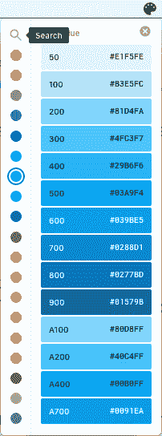

**9。[奇观](https://www.spectacleapp.com/)【免费】**——这是一个为 Mac 用户提供的工具，他们正在为缺乏 windows 的移动/调整大小/操作功能而斗争，这一点我们从微软的 Windows 中很清楚。你可以在下面看到它是如何工作的:

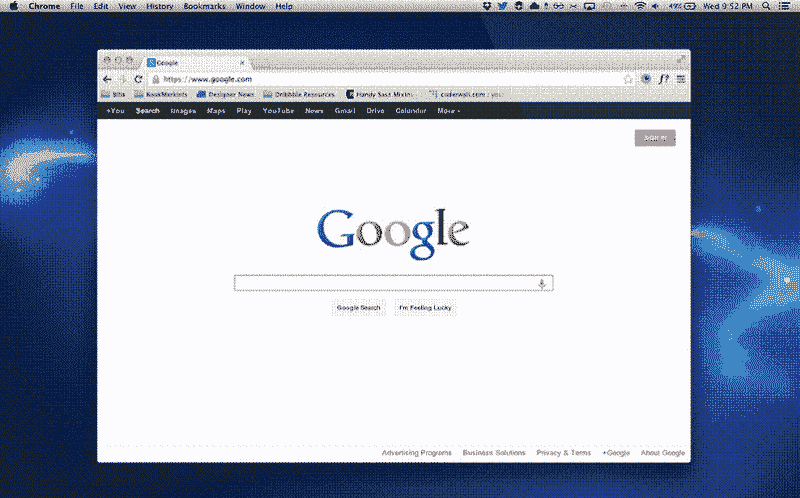

**【付费】我选择的备选**是 [Moom](https://manytricks.com/moom/) 。我经常使用它。它的价格是 10 美元，我认为这是一个更强大的解决方案。

10。 [f.lux](https://justgetflux.com/) 【免费】 —让你的电脑显示屏颜色适应一天时间的工具。晚上很暖和，白天看起来像阳光。如果你在晚上工作，这个工具将会做工作！我每天都用它。它帮助我保持清醒，即使在工作到很晚的时候。此外，我发现我醒来时更放松了。

**我最喜欢 f.lux 的什么:**

*   有用的偏好，有 4 个预设，满足您的需求(如您所见，我使用*晚工作*预设)

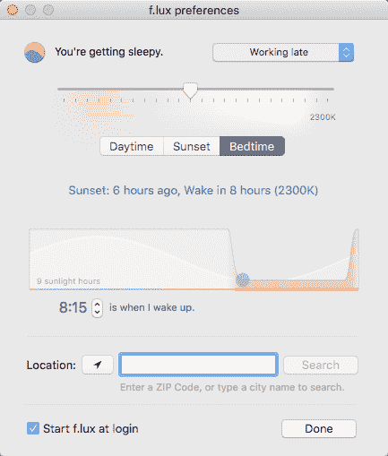

*   通知:

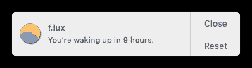

*   它让我睡得很好。

这是最后一点！我希望你喜欢这篇文章。请让我知道，如果你知道任何有用的工具，提高你的 Android 生产力！

实际上，你也可以安装 Vysor，它被打包在一个本地应用程序中。这里的链接是[这里的](https://plus.google.com/110558071969009568835/posts/Ub7QKu2Pddu)。

[*Android VM/GenyMotion 是如何工作的？*](https://www.quora.com/How-does-AndroVM-GenyMotion-work)

[*来源*](https://github.com/postmanlabs/postman-app-support/wiki)

我最初把这篇文章发布在我的博客上。

如果你喜欢我的文章，请别忘了点击？？？去推荐给别人？？？。

此外，要获得关于我的新文章和故事的通知，请在[媒体](https://medium.com/@mmbialas)和[推特](https://twitter.com/mmbialas)上关注我。你也可以在 [LinkedIn](https://www.linkedin.com/in/mmbialas) 上找到我。干杯！